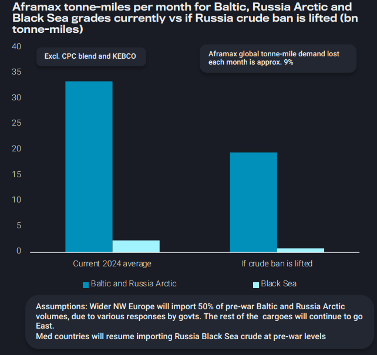
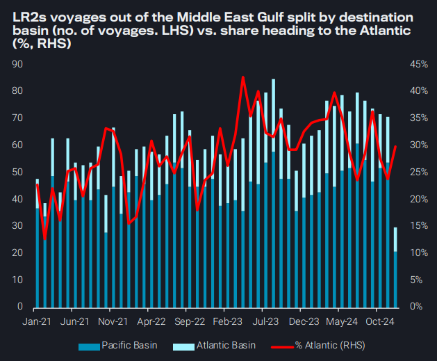
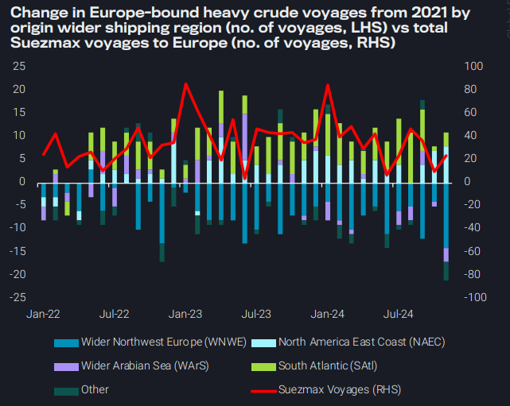
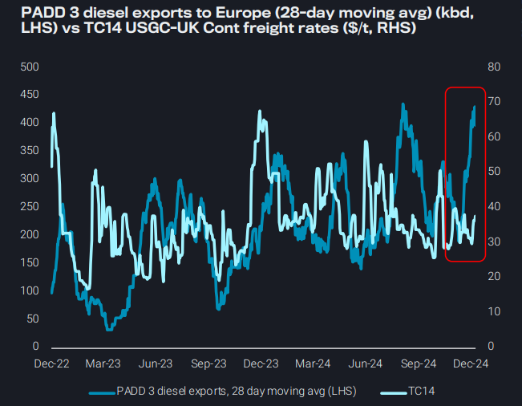

# If Russia crude ban lifts, divergence between Black Sea and Baltic freight demand likely

**Date:** December 12, 2024  
**Publisher:** Breakwave Advisors | **Category:** Market Insights  
**Original URL:** [https://www.breakwaveadvisors.com/insights/2024/12/12/u47hz5ziufeua9l9a8efie3dxnalgq](https://www.breakwaveadvisors.com/insights/2024/12/12/u47hz5ziufeua9l9a8efie3dxnalgq)  

---

### Key Takeaways From This Report:

- **Dirty – East of Suez:**If Russia crude ban lifts, divergence between Black Sea and Baltic freight demand likely
- **Clean – East of Suez:**LR2s looking towards East at the expense of West of Suez
- **Dirty – West of Suez:**As Europe opts for heavy crude from farther origins on larger vessels, TD7 Aframax demand slumps
- **Clean – West of Suez:**European refinery maintenance pulls in higher volumes of diesel from USGC, high availability muting rates

*By*[*Mary Melton*](https://www.linkedin.com/search/results/all/?fetchDeterministicClustersOnly=true&heroEntityKey=urn%3Ali%3Afsd_profile%3AACoAABXVyecBtg-pRnIrZe0BoWk0ygPiUfbvhsw&keywords=mary%20melton&origin=RICH_QUERY_SUGGESTION&position=0&searchId=40e8d7d2-c4d0-4022-81e7-176f6eba418b&sid=H_Y&spellCorrectionEnabled=false)

## Dirty – East of Suez: If Russia Crude Ban Lifts, Divergence Between Black Sea and Baltic Freight Demand Likely

Flows reshuffling resulting from the Russian invasion and crude ban boosted Aframax tonne-miles as Baltic, Russia Arctic and Black Sea grades (excl. CPC and KEBCO) pivoted East instead of to close-by European countries

➔ Aframax tonne-mile gains compared to the pre-war 2021 average range from around 25-35 billion per month

What would a lifting of the Russian crude ban mean for the Aframax segment?

➔ If the ban ends, we are likely to have varied responses from NW European countries in terms of Baltic and Russia Arctic crude imports. Assuming 50% of the pre-war volumes goes back to NW Europe and the remainder goes East, this is a loss of about 14bn tonne-miles per month

➔ Assuming Med/Black Sea European countries return to their prewar import levels for Black Sea volumes, those tonne-miles East are lost

In total with this predicted scenario, we expect to see 9% of global Aframax demand lost as some Russian crude is absorbed closer to home, though full unwinding of reshuffled flows will likely take time

> **Figure 1: Στιγμιότυπο Οθόνης 2024 12 12 130724**  
> **Interactive Data & Source:** [Vortexa](https://www.vortexa.com//oil-gas-data-traders-analysts-data-scientists?gclid=Cj0KCQjw8_qRBhCXARIsAE2AtRZKOvMnbilZ_6_91d7huSFFy71pWLrnPwGwOHVzXsmsG-1a1mZnQw8aAt89EALw_wcB&hsa_acc=1782073842&hsa_ad=548425387665&hsa_cam=14746637662&hsa_grp=125038601902&hsa_kw=&hsa_mt=&hsa_net=adwords&hsa_src=g&hsa_tgt=dsa-1431852288425&hsa_ver=3&utm_campaign=%5BCD%5D%20-%20DSA%20-%20EMEA&utm_medium=cpc&utm_medium=ppc&utm_source=google&utm_source=adwords&utm_term=) | [Local Asset](file:///C:/Users/Dell/Github/Shipping/corpus/03-breakwave/insights/2024/assets/2024-12-12_u47hz5ziufeua9l9a8efie3dxnalgq_img_cea3cf84ceb9ceb3cebcceb9cf8ccf84cf85_42c83f85bf65.png)

## Clean – East of Suez: Lr2s Looking Towards East at the Expense of West of Suez

For November 2024, the % of LR2 tankers loading in the Middle East Gulf signalling towards the Atlantic, dropped at the lowest level since October 2022

➔ This is reflective of the saturated diesel demand in the Atlantic which has brought a sharp decline of LR2 East-to-West diesel transits via COGH in November after record highs in October

➔ At the same time, naphtha voyage departures out of the MEG recorded their 2nd consecutive m-o-m increase.

➔ Going into December, muted petrochemical demand in Northeast Asia on the back of lacklustre margins might limit buying activity and result to lower vessel enquiries

On the supply-side, tight prompt LR2 supply provides a floor on rates, but a lengthening tonnage list on natural fixing windows for smaller vessel classes (such as LR1s) could exert downward pressure on rates

> **Figure 2: Στιγμιότυπο Οθόνης 2024 12 12 130937**  
> **Interactive Data & Source:** [Vortexa](https://www.vortexa.com//oil-gas-data-traders-analysts-data-scientists?gclid=Cj0KCQjw8_qRBhCXARIsAE2AtRZKOvMnbilZ_6_91d7huSFFy71pWLrnPwGwOHVzXsmsG-1a1mZnQw8aAt89EALw_wcB&hsa_acc=1782073842&hsa_ad=548425387665&hsa_cam=14746637662&hsa_grp=125038601902&hsa_kw=&hsa_mt=&hsa_net=adwords&hsa_src=g&hsa_tgt=dsa-1431852288425&hsa_ver=3&utm_campaign=%5BCD%5D%20-%20DSA%20-%20EMEA&utm_medium=cpc&utm_medium=ppc&utm_source=google&utm_source=adwords&utm_term=) | [Local Asset](file:///C:/Users/Dell/Github/Shipping/corpus/03-breakwave/insights/2024/assets/2024-12-12_u47hz5ziufeua9l9a8efie3dxnalgq_img_cea3cf84ceb9ceb3cebcceb9cf8ccf84cf85_8b6758b87a96.png)

## Dirty – West of Suez: As Europe Opts for Heavy Crude From Farther Origins on Larger Vessels, Td7 Aframax Demand Slumps

Trade reshuffling triggered by sanctions on Russian crude has driven refineries in Europe to source heavy crude from origins further afield

➔ Voyages from South Atlantic have more than doubled, and those originating from Wider NWE have had a 40% decline from 2021

The shift to longer voyages for crude imports has favoured larger vessel classes, fuelling increased Suezmax utilisation

➔ In 2024 ytd Suezmax motnhly employment on transatlantic routes to Europe has increased by approximately 52% from 2021

➔ Rates from US Gulf, Guyana, and West Africa-to-Europe have surged by approximately 35-45% since late November

Aframaxes struggle, as tonne-miles demand on the North Sea-to-UK Continent (TD7) route hover around eight-year lows for most of the year

➔ Coinciding with a growing portion of the Aframax fleet employed in Russian-origin crude trade

Looking forward, strong transatlantic demand for Suezmaxes faces uncertainty, as stagnant European refining margins and declining crude imports could curtail a seasonal rally

> **Figure 3: Στιγμιότυπο Οθόνης 2024 12 12 131227**  
> **Interactive Data & Source:** [Vortexa](https://www.vortexa.com//oil-gas-data-traders-analysts-data-scientists?gclid=Cj0KCQjw8_qRBhCXARIsAE2AtRZKOvMnbilZ_6_91d7huSFFy71pWLrnPwGwOHVzXsmsG-1a1mZnQw8aAt89EALw_wcB&hsa_acc=1782073842&hsa_ad=548425387665&hsa_cam=14746637662&hsa_grp=125038601902&hsa_kw=&hsa_mt=&hsa_net=adwords&hsa_src=g&hsa_tgt=dsa-1431852288425&hsa_ver=3&utm_campaign=%5BCD%5D%20-%20DSA%20-%20EMEA&utm_medium=cpc&utm_medium=ppc&utm_source=google&utm_source=adwords&utm_term=) | [Local Asset](file:///C:/Users/Dell/Github/Shipping/corpus/03-breakwave/insights/2024/assets/2024-12-12_u47hz5ziufeua9l9a8efie3dxnalgq_img_cea3cf84ceb9ceb3cebcceb9cf8ccf84cf85_ebd615238109.png)

## Clean – West of Suez: European Refinery Maintenance Pulls in Higher Diesel Volumes From Usgc, High Availability Muting Rates

Europe’s diesel imports from USGC fell 35% in November m-o-m, likely due to the oversupply which had arrived in Europe during October, saturating the market and inventory levels

➔ PADD 3 refinery utilisation rates have moved up to 95% at the end of November (EIA) after falling to low levels of 88.5% at the beginning of October

➔ Fairly high MR prompt availability is likely keeping a lid on rates despite the strong PADD 3 loadings

Lingering refinery maintenance combined with a closed diesel arb from East of Suez can explain Europe’s diesel pull. However, as refineries return in December, we could see a softer arbitrage as regional production ramps up

➔ Total Gonfreville (206kbd outage) expected to return Dec 29, while Shell Pernis (202kbd outage) expected to return Dec 04 (Argus Media)

➔ Softer arbitrage opportunities could put a lid on TC14 MR demand as the year closes out

> **Figure 4: Στιγμιότυπο Οθόνης 2024 12 12 131431**  
> **Interactive Data & Source:** [Vortexa](https://www.vortexa.com//oil-gas-data-traders-analysts-data-scientists?gclid=Cj0KCQjw8_qRBhCXARIsAE2AtRZKOvMnbilZ_6_91d7huSFFy71pWLrnPwGwOHVzXsmsG-1a1mZnQw8aAt89EALw_wcB&hsa_acc=1782073842&hsa_ad=548425387665&hsa_cam=14746637662&hsa_grp=125038601902&hsa_kw=&hsa_mt=&hsa_net=adwords&hsa_src=g&hsa_tgt=dsa-1431852288425&hsa_ver=3&utm_campaign=%5BCD%5D%20-%20DSA%20-%20EMEA&utm_medium=cpc&utm_medium=ppc&utm_source=google&utm_source=adwords&utm_term=) | [Local Asset](file:///C:/Users/Dell/Github/Shipping/corpus/03-breakwave/insights/2024/assets/2024-12-12_u47hz5ziufeua9l9a8efie3dxnalgq_img_cea3cf84ceb9ceb3cebcceb9cf8ccf84cf85_f92dc4d3e809.png)

Data Source:[Vortexa](https://www.vortexa.com//oil-gas-data-traders-analysts-data-scientists?gclid=Cj0KCQjw8_qRBhCXARIsAE2AtRZKOvMnbilZ_6_91d7huSFFy71pWLrnPwGwOHVzXsmsG-1a1mZnQw8aAt89EALw_wcB&hsa_acc=1782073842&hsa_ad=548425387665&hsa_cam=14746637662&hsa_grp=125038601902&hsa_kw=&hsa_mt=&hsa_net=adwords&hsa_src=g&hsa_tgt=dsa-1431852288425&hsa_ver=3&utm_campaign=%5BCD%5D%20-%20DSA%20-%20EMEA&utm_medium=cpc&utm_medium=ppc&utm_source=google&utm_source=adwords&utm_term=)

---

**Tags:** Tankers, Shipping, Markets  
