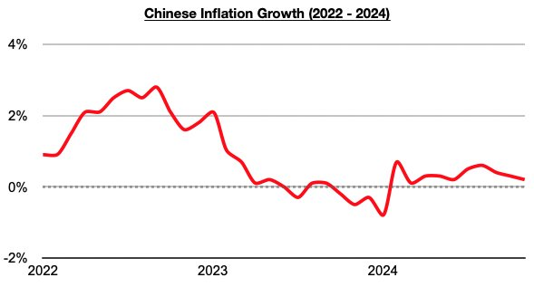
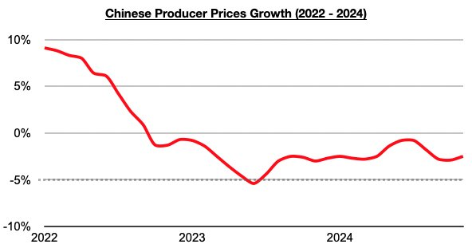

# China Continues To Be Afforded Luxury Of More Safely Being Able To Carry Out Inflationary Stimulus Measures

**Date:** December 13, 2024  
**Publisher:** Breakwave Advisors | **Category:** Market Insights  
**Original URL:** [https://www.breakwaveadvisors.com/insights/2024/12/13/china-continues-to-be-afforded-luxury-of-more-safely-being-able-to-carry-out-inflationary-stimulus-measures](https://www.breakwaveadvisors.com/insights/2024/12/13/china-continues-to-be-afforded-luxury-of-more-safely-being-able-to-carry-out-inflationary-stimulus-measures)  

---

*By*[*Jeffrey Landsberg*](https://www.linkedin.com/in/jeffrey-landsberg-70ab957/)

China’s inflation last month came in at only 0.2%, which is even lower than the 0.3% that was seen in October.

> **Figure 1: Chart 1**  
> [Local Asset](file:///C:/Users/Dell/Github/Shipping/corpus/03-breakwave/insights/2024/assets/2024-12-13_china-continues-to-be-afforded-luxury-of-more-safely-being-able-to-carry-out-inf_img_chart1_d080d3f307d1.jpg)

Overall, inflation has remained low in China and has not at all been a debilitating issue as it has been in much of the rest of the world. With inflation remaining relatively low in China, the central government is continuing to be afforded a luxury of more safely being able to carry out inflationary stimulus measures. This continues to contrast greatly with much of the rest of the world including the United States. Also of note is that producer prices (PPI) remain weakest. China’s PPI last month contracted year-on-year by 2.5%. Weakness in producer prices remains beneficial to China (and shipping markets) as China remains a net importer (especially with commodities).

> **Figure 2: Chart 2**  
> [Local Asset](file:///C:/Users/Dell/Github/Shipping/corpus/03-breakwave/insights/2024/assets/2024-12-13_china-continues-to-be-afforded-luxury-of-more-safely-being-able-to-carry-out-inf_img_chart2_07275a18c3e8.jpg)

---

**Tags:** China, Ironore, Drybulk  
