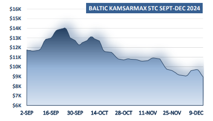
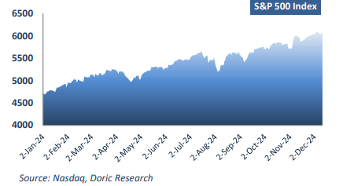
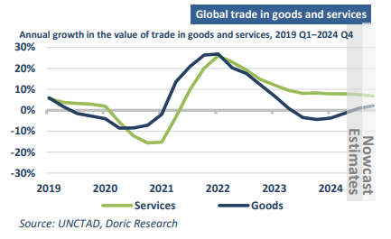

# 2024 Realities

**Date:** December 16, 2024  
**Publisher:** Breakwave Advisors | **Category:** Market Insights  
**Original URL:** [https://www.breakwaveadvisors.com/insights/2024/12/16/2024-realities](https://www.breakwaveadvisors.com/insights/2024/12/16/2024-realities)  

---

*By*[*Michalis Voutsinas*](https://www.linkedin.com/in/michalis-voutsinas-587544163/)

As we approach the final trading days of the year, the Baltic Dry Indices reflect the tempered realities of 2024, a year marked by subdued performance compared to the highs of 2023. The fourth quarter, once a period of peak activity for dry bulk trades, has been muted, with all market segments struggling to replicate last year’s remarkable surge. The Capesize segment, which led the rally in 2023, saw its characteristic volatility replaced by stagnation. Peaking at $54,584 daily last December, the segment was buoyed by dwindling iron ore stocks at Chinese ports and a tonnage shortage in the Atlantic. This year, however, it failed to surpass $30,000 on any trading day in the fourth quarter, averaging a lukewarm $19,390 daily during the same period. Record-high iron ore inventories at Chinese ports – lingering above 150 million tonnes for most of the quarter – curbed any significant gains in the spot market.

Panamax values similarly struggled. Last year, elevated export activity from East Coast South America and robust Chinese coal demand propelled the Panamax market to a peak of $22,000 daily in early December. In stark contrast, the past three months saw average earnings drop to circa $10,800 daily, as Brazilian grain shipments faltered and China’s appetite for imported grains waned. Spot rates dipped below $10,000 daily for much of the quarter, highlighting the submarket's challenges. In the geared segment, Supramaxes recorded average earnings $2,000 below their year-ago levels, while Handysizes remained relatively stable, averaging $12,800 daily for the quarter.

> **Figure 1: Στιγμιότυπο Οθόνης 2024 12 16 120820**  
> **Interactive Data & Source:** [Doric](https://www.doric.gr/) | [Local Asset](file:///C:/Users/Dell/Github/Shipping/corpus/03-breakwave/insights/2024/assets/2024-12-16_2024-realities_img_cea3cf84ceb9ceb3cebcceb9cf8ccf84cf85_fb7e05c6fd58.png)

Looking back at December 2023, Doric's weekly report painted a brighter picture of global markets. The US stock market appeared to signal a more favourable macroeconomic landscape for the upcoming year. The Federal Reserve's shift towards a more accommodative stance had set the stage for potential record highs in US stocks while driving down Treasury yields. Mirroring this upbeat tone, investor sentiment was buoyed by projections of significant interest rate cuts during 2024, leading to a sustained rally in major indices. The Dow Jones Industrial Average surpassed 37,000 for the first time, while the S&P 500 neared its all-time high, reflecting renewed confidence in the macroeconomic landscape.

Fast forward a year, and the narrative has evolved. US equities have soared to unprecedented heights, propelled by optimism surrounding President-elect Donald Trump’s economic agenda. Despite the inherent risks of protectionist policies, Wall Street has embraced the promise of deregulation, tax reform, and infrastructure investment. The S&P 500 has gained over 25 percent year-to-date, while the Nasdaq Composite surpassed the 20,000-point threshold for the first time. This year, the S&P 500 has notched more than 50 all-time closing highs, while the Dow Jones Industrial Average and Nasdaq 100 are not far behind. Investors widely anticipate that the US Federal Reserve will lower interest rates by a quarter of a percentage point at its December 17-18 meeting. However, the focus is expected to shift toward the updated economic projections released alongside the decision. These projections will offer insights into how much further policymakers might reduce rates in 2025 and possibly 2026, factoring in persistent inflation, a robust labor market, the implications of the recent US election on global trade and immigration, and ongoing geopolitical uncertainties. With a complex array of risks and variables to consider, many analysts predict the Fed's messaging will lean hawkish.

> **Figure 2: Στιγμιότυπο Οθόνης 2024 12 16 120952**  
> **Interactive Data & Source:** [Doric](https://www.doric.gr/) | [Local Asset](file:///C:/Users/Dell/Github/Shipping/corpus/03-breakwave/insights/2024/assets/2024-12-16_2024-realities_img_cea3cf84ceb9ceb3cebcceb9cf8ccf84cf85_9010a15abe8d.png)

Amid these dynamics, global trade remains on track to reach an alltime high of nearly $33 trillion in 2024, according to UNCTAD's latest Global Trade Update. This 3.3 percent year-on-year growth has been driven primarily by a 7 percent surge in trade in services, which contributed $500 billion to the expansion. Trade in goods grew more modestly at 2 percent, still falling short of its 2022 peak. Both sectors gained momentum in the third quarter, a trend likely to extend into the final months of the year.

> **Figure 3: Στιγμιότυπο Οθόνης 2024 12 16 121048**  
> **Interactive Data & Source:** [Doric](https://www.doric.gr/) | [Local Asset](file:///C:/Users/Dell/Github/Shipping/corpus/03-breakwave/insights/2024/assets/2024-12-16_2024-realities_img_cea3cf84ceb9ceb3cebcceb9cf8ccf84cf85_0716f01d00a1.png)

Looking ahead, the 2025 trade outlook is shrouded in uncertainty, with potential US policy shifts, including broader tariffs, threatening to disrupt global value chains and strain relationships with key trading partners. Such actions risk triggering retaliatory measures and creating ripple effects that could impact industries and economies across entire supply chains. Even the prospect of new tariffs introduces volatility, undermining trade, investment, and economic growth. For the dry bulk shipping sector, these challenges will require strategic navigation, but the immediate priority will be weathering the traditionally sluggish first quarter of the upcoming year

Data source:[Doric](https://www.doric.gr/)

---

**Tags:** Shipping, Drybulk, Economy  
