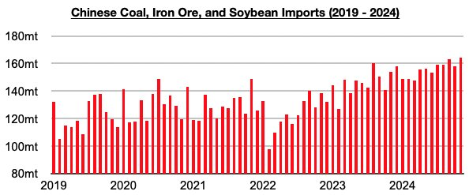
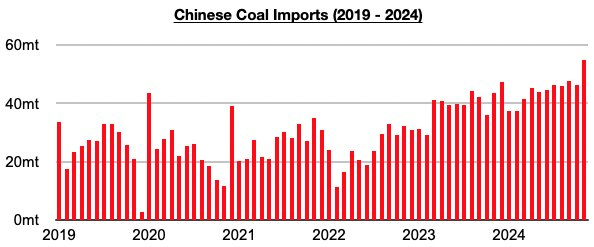
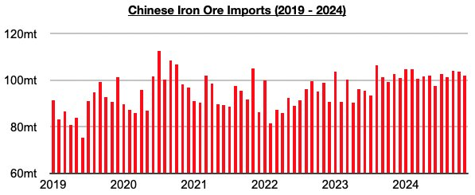
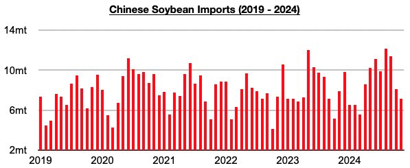

# China's Dry Bulk Imports Continue To Meet Our Very Bullish Expectations

**Date:** December 16, 2024  
**Publisher:** Breakwave Advisors | **Category:** Market Insights  
**Original URL:** [https://www.breakwaveadvisors.com/insights/2024/12/16/chinas-dry-bulk-imports-continue-to-meet-our-very-bullish-expectations](https://www.breakwaveadvisors.com/insights/2024/12/16/chinas-dry-bulk-imports-continue-to-meet-our-very-bullish-expectations)  

---

*By*[*Jeffrey Landsberg*](https://www.linkedin.com/in/jeffrey-landsberg-70ab957/)

China's import data for November was recently released and showed that coal, iron ore, and soybean imports collectively totaled a record 164 million tons. This is up month-on-month by 5.8 million tons (4%) and is up year-on-year by 9.8 million tons (6%). As we have continued to stress in Commodore Research's Weekly Dry Bulk Reports and Weekly China Reports, supply and demand of homes has not at all been dictating China's dry bulk demand (along with any other China-centric bearish narratives). Earlier this year, China's imports set a record of 163.2 million tons in September.

> **Figure 1: Chart 1 (1)**  
> [Local Asset](file:///C:/Users/Dell/Github/Shipping/corpus/03-breakwave/insights/2024/assets/2024-12-16_chinas-dry-bulk-imports-continue-to-meet-our-very-bullish-expectations_img_chart128129_d0007ae9e8ec.jpg)

Coal imports in November fared the best and totaled a record 55 million tons. This is up month-on-month by 8.7 million tons (19%) and is up year-on-year by a very impressive 11.5 million tons (26%). Earlier this year, China's coal imports set a record 47.7 million tons in September.

> **Figure 2: Chart 2 (1)**  
> [Local Asset](file:///C:/Users/Dell/Github/Shipping/corpus/03-breakwave/insights/2024/assets/2024-12-16_chinas-dry-bulk-imports-continue-to-meet-our-very-bullish-expectations_img_chart228129_10e4baf23dd5.jpg)

Iron ore imports totaled 101.9 million tons. This is down month-on-month by 1.9 million tons (-2%) and is down year-on-year by 800,000 tons (-1%).

> **Figure 3: Chart 3**  
> [Local Asset](file:///C:/Users/Dell/Github/Shipping/corpus/03-breakwave/insights/2024/assets/2024-12-16_chinas-dry-bulk-imports-continue-to-meet-our-very-bullish-expectations_img_chart3_685032dbbbdb.jpg)

Soybean imports totaled 7.2 million tons. This is down month-on-month by 900,000 tons (-11%) and is down year-on-year by 700,000 tons (-9%). We remain bullish for China's near-term dry bulk import prospects.

> **Figure 4: Chart 4**  
> [Local Asset](file:///C:/Users/Dell/Github/Shipping/corpus/03-breakwave/insights/2024/assets/2024-12-16_chinas-dry-bulk-imports-continue-to-meet-our-very-bullish-expectations_img_chart4_cdba20a1e887.jpg)

---

**Tags:** China, Drybulk, Commodities  
