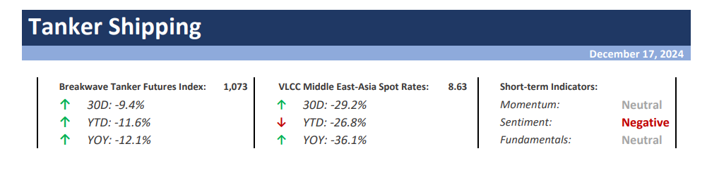
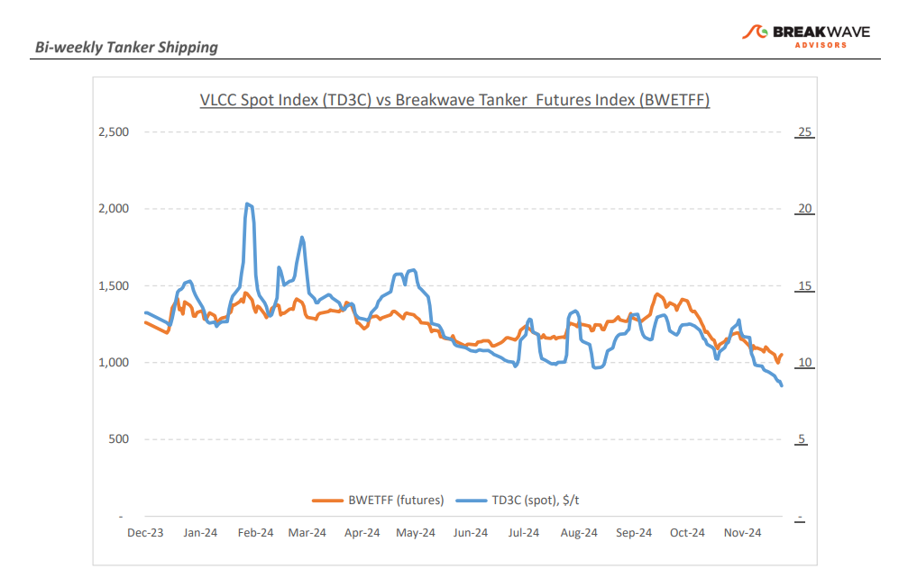
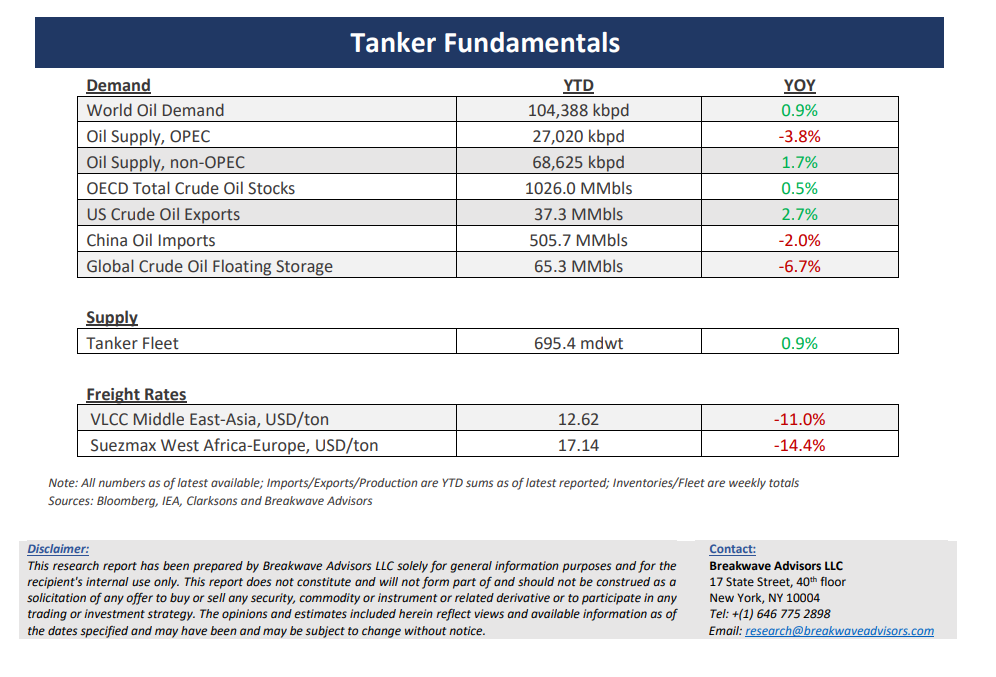

# Breakwave Bi-Weekly Tanker Report - December 17, 2024

**Date:** December 17, 2024  
**Publisher:** Breakwave Advisors | **Category:** Market Insights  
**Original URL:** [https://www.breakwaveadvisors.com/insights/20241217wet-kji289](https://www.breakwaveadvisors.com/insights/20241217wet-kji289)  

---

> **Figure 1: Cea3cf84ceb9ceb3cebcceb9cf8ccf84cf85**  
> [Local Asset](file:///C:/Users/Dell/Github/Shipping/corpus/03-breakwave/insights/2024/assets/2024-12-17_20241217wet-kji289_img_cea3cf84ceb9ceb3cebcceb9cf8ccf84cf85_a030a46a9c8e.png)

**·****Clouded Horizons: Crude Tanker Freight Market Struggles Amid Weak Demand and Geopolitical Uncertainty**– December continues to cast a shadow of pessimism over the crude tanker freight market, with VLCC (Very Large Crude Carrier) rates struggling to gain momentum during what is typically the peak winter demand season. Despite expectations of seasonal improvements, market conditions remain subdued, with rates in both the Arabian Gulf and West Africa regions underperforming. This raises critical questions regarding the “winter rally” as the New Year approaches. One key factor contributing to this sluggish performance is the apparent scarcity of spot cargoes, which has resulted in intense competition among vessels for employment opportunities. This issue is further compounded by ongoing uncertainty surrounding crude oil market dynamics, particularly with regards to OPEC’s production policies. Current supply and demand trends suggest minimal justification for increased production, something that was well communicated given the recent delay of any production increases by OPEC+, dampening optimism for a short-term market recovery. Moreover, geopolitical factors continue to cast a shadow of uncertainty over the dirty tanker market. The prospect of additional sanctions on Russian and Iranian oil exports under U.S. policy—especially those stemming from the new administration— poses significant uncertainties and should these sanctions materialize, they could further disrupt trade flows, introducing additional volatility. Looking ahead, attention will shift to the January stems, although market expectations seem to indicate that rates will likely continue on the current relatively weak trajectory.

•**OPEC Slashes Demand Forecasts, as China Oil Growth Remains Dull**– As 2024 draws to a close, the anticipated secondhalf demand recovery has failed to materialize, leading to significant downward revisions in demand forecasts by OPEC for both 2024 and 2025. Notably, China’s 2024 oil demand growth forecast has been sharply reduced. OPEC now predicts an increase of just 430,000bpd, a notable drop from the 760,000bpd forecast issued in July. This slowdown in Chinese demand growth highlights broader concerns shaping OPEC’s outlook and underscores the vulnerability of the global oil market as it enters 2024. Structural shifts in transportation fuels—such as the increasing penetration of electric vehicles (EVs), higher efficiency in air travel, and the growing use of commercial gas-fueled trucks—pose significant obstacles to a robust recovery in crude oil demand, even if the Chinese government succeeds in stimulating the economy. However, not all developments are negative for the crude tanker market. A potential shift toward greater OPEC crude oil exports, driven by sanctions on Russian oil or an effort by the cartel to regain market share, could lead to stronger demand for crude tankers. This remains our base scenario for the coming years. While the major structural changes in the oil markets support this outlook, heightened geopolitical risks continue to present the primary uncertainty surrounding these scenarios.

**· Our Long-term View –**The tanker market is recovering from a long period of staggered rates as the growth in new vessel supply shrinks while oil demand remains elevated in line with the global economy. A historically low orderbook combined with favorable shifting trade patterns should continue to support increased spot rate volatility, which combined with the ongoing geopolitical turmoil, should sustain freight rates in the medium to long term.

> **Figure 2: Cea3cf84ceb9ceb3cebcceb9cf8ccf84cf85**  
> [Local Asset](file:///C:/Users/Dell/Github/Shipping/corpus/03-breakwave/insights/2024/assets/2024-12-17_20241217wet-kji289_img_cea3cf84ceb9ceb3cebcceb9cf8ccf84cf85_2efcb059b349.png)

> **Figure 3: Cea3cf84ceb9ceb3cebcceb9cf8ccf84cf85**  
> [Local Asset](file:///C:/Users/Dell/Github/Shipping/corpus/03-breakwave/insights/2024/assets/2024-12-17_20241217wet-kji289_img_cea3cf84ceb9ceb3cebcceb9cf8ccf84cf85_c67ebb3a81a6.png)

### Subscribe:
