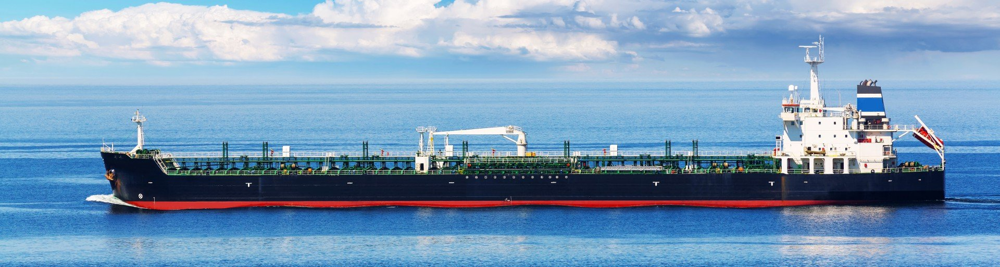
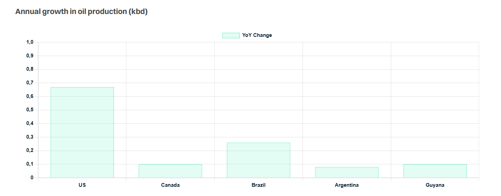

# Choppy Waters Ahead

**Date:** December 17, 2024  
**Publisher:** Breakwave Advisors | **Category:** Market Insights  
**Original URL:** [https://www.breakwaveadvisors.com/insights/2024/12/17/choppy-waters-ahead](https://www.breakwaveadvisors.com/insights/2024/12/17/choppy-waters-ahead)  

---

> **Figure 1: Crude Oil Tanker Skinny**  
> **Interactive Data & Source:** [Gibsons Co](https://www.gibsons.co.uk/market-reports) | [Local Asset](file:///C:/Users/Dell/Github/Shipping/corpus/03-breakwave/insights/2024/assets/2024-12-17_choppy-waters-ahead_img_crude-oil-tanker-skinny_e026b53e567d.jpg)

In recent years, the tanker market has faced quite a few tailwinds. Structurally, the industry has benefitted from the colossal gains in tanker tonne miles following sanctions on Russia, the exit of aging tonnage into the grey fleet and minimal new deliveries. This year, the rerouting via Cape of Good Hope has also supported the clean tanker market.

However, some of these factors are bound to change next year. The fleet will see an increasing wave of deliveries, although the picture is mixed depending on the size group. MR deliveries are scheduled to double next year, with over 70 units to start trading, the highest level since 2019. Suezmax and Aframax/LR2 deliveries are also notably up next year. Circa 55 LR2/Aframaxes are due for delivery, the highest number since 2017; whilst around 30 new Suezmaxes are also expected to start trading. Still, although deliveries in these size groups are notable, representing between 4% to 5% of the existing fleet, we have a similar, if not slightly higher number of tankers turning 15 years of age next year. In addition, VLCC, LR1/Panamax and Handy deliveries are still limited next year: just 15 tankers across all three segments.

In terms of demand, the fortunes in the clean tanker market, particularly for larger LRs will be interlinked with the relative strength of the crude tanker market, which will dictate the pace of dirty-to-clean switching. Accelerating Suezmax deliveries will probably also see at least some of the newbuild tonnage trading clean on their maiden voyage. For MRs, ramping up operations at Dangote and approaching operations at Olmeca will bring further trouble. Yet, Middle East refining runs could rise modestly year-on-year, when they reach full capacity in 2025, whilst announced capacity closures in Europe will support growing import requirements despite challenging demand. All of this offers an element of support to the clean tanker market, but perhaps not large enough to offset the negative impact of dirty-to-clean switching and the reduction in CPP imports into West Africa and Mexico.

The picture is somewhat more positive for crude tankers, as increasing crude production in the Americas will offer incremental crude tonne miles. According to the latest IEA monthly report, oil production in the US, Canada, Brazil, Guyana and Argentina are projected to increase by 1.2 mbd, which will not only offset additional Nigerian and Mexican crude being retained for domestic refining, but will also support expanding trade, primarily to Asia, where refining runs are penciled to grow by 500 kbd.

Much uncertainty, however, surrounds the OPEC+ production strategy. Although the current oil supply/demand balances show that no additional OPEC+ supplies are needed, if the block starts unwinding crude production cuts later in the year, it will certainly benefit the tanker market in the short term. A contango structure could also emerge, supporting storage economics (although land-based inventories would likely fill first). Geopolitics are expected to continue to play a major role in tanker markets, magnifying the degree of uncertainty. Trump 2.0 could bring many changes, with a profound impact on tanker markets, altering the trade dynamics once again. A major escalation of the Middle East conflict could potentially threaten oil supplies in the region. However, stricter Iranian sanctions could be positive, particularly for larger crude tanker market, shifting demand from the dark fleet to mainstream tanker markets..

> **Figure 2: Στιγμιότυπο Οθόνης 2024 12 17 122033**  
> **Interactive Data & Source:** [Gibsons Co](https://www.gibsons.co.uk/market-reports) | [Local Asset](file:///C:/Users/Dell/Github/Shipping/corpus/03-breakwave/insights/2024/assets/2024-12-17_choppy-waters-ahead_img_cea3cf84ceb9ceb3cebcceb9cf8ccf84cf85_8c2620e1b06d.png)

Data source:[Gibson Shipbrokers](https://www.gibsons.co.uk/market-reports)

---

**Tags:** Tankers, Shipping, Crude  
