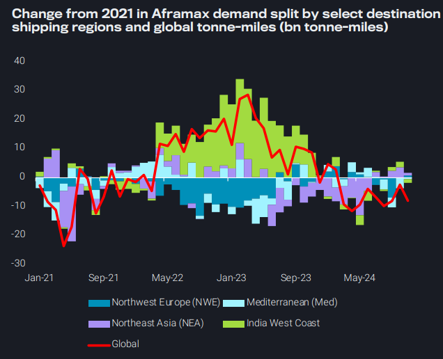
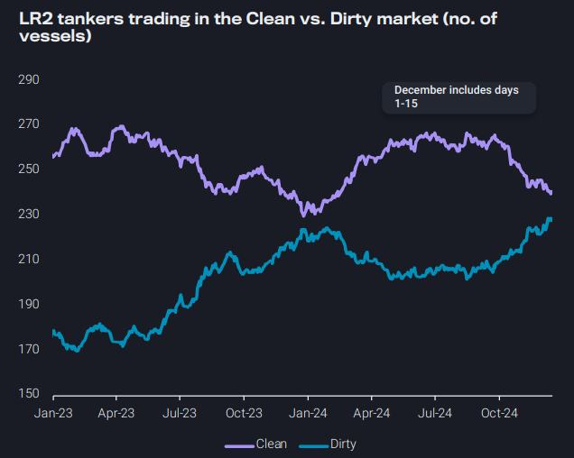
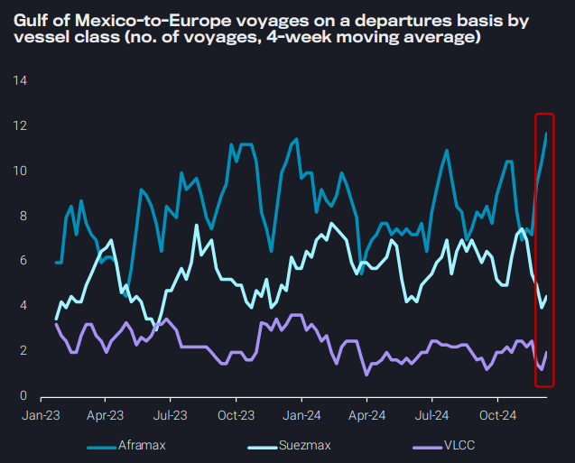
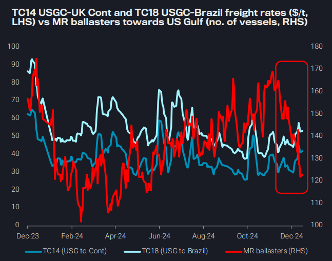

# Clean-to-dirty shift evident across vessel classes

**Date:** December 18, 2024  
**Publisher:** Breakwave Advisors | **Category:** Market Insights  
**Original URL:** [https://www.breakwaveadvisors.com/insights/2024/12/18/clean-to-dirty-shift-evident-across-vessel-classes](https://www.breakwaveadvisors.com/insights/2024/12/18/clean-to-dirty-shift-evident-across-vessel-classes)  

---

### Key Takeaways From This Report:

- **Dirty – East of Suez:**Aframax struggled this year amid surge in short-haul sanctioned trade and stagnancy in mainstream trades
- **Clean – East of Suez:**Clean-to-dirty shift evident across vessel classes, which could alleviate clean freight pressure
- **Dirty – West of Suez:**TA crude end-of-year momentum attracts VLCCs and Suezmaxes, but lion’s share goes to Aframaxes
- **Clean – West of Suez:**Tight MR availability in the US Gulf drives up freight

*By*[*Ioannis Papadimitriou*](https://www.linkedin.com/in/ipapadimitriou/)

## Dirty – East of Suez: Aframax Struggled This Year Amid Surge in Short-Haul Sanctioned Trade and Stagnancy in Mainstream Trades

Aframax utilisation on key routes, North Sea-to-UK Continent (TD7) and cross-Med (TD19), have suffered most of this year, with the expected Q4 rally failing to materialise

➔ In Europe, weak refining margins and lower crude import appetite have pushed TD7 and TD19 to YTD lows in September

Demand for Aframaxes this year has largely been propped up by sanctioned trade carrying Russian crude to India and China

➔ Rising Chinese demand for Russia Far East crude since July has driven China-destined Aframax tonne-miles to YTD highs in October, with most shipments arriving in Shandong, reflecting teapot refineries’ growing appetite for discounted barrels, and China’s increasing SPR stockpile purchases

Looking forward, recovery in Aframax utilisation hinges on mainstream demand rebounding to reclaim capacity loss to sanctioned trade

➔ Increased TMX flows from Canada West Coast to NEA have supported y-o-y Aframax tonne-miles growth to NEA, and this momentum is expected to strengthen if Trump’s tariffs on Canadian crude materialise

> **Figure 1: Στιγμιότυπο Οθόνης 2024 12 18 191918**  
> **Interactive Data & Source:** [Vortexa](https://www.vortexa.com//oil-gas-data-traders-analysts-data-scientists?gclid=Cj0KCQjw8_qRBhCXARIsAE2AtRZKOvMnbilZ_6_91d7huSFFy71pWLrnPwGwOHVzXsmsG-1a1mZnQw8aAt89EALw_wcB&hsa_acc=1782073842&hsa_ad=548425387665&hsa_cam=14746637662&hsa_grp=125038601902&hsa_kw=&hsa_mt=&hsa_net=adwords&hsa_src=g&hsa_tgt=dsa-1431852288425&hsa_ver=3&utm_campaign=%5BCD%5D%20-%20DSA%20-%20EMEA&utm_medium=cpc&utm_medium=ppc&utm_source=google&utm_source=adwords&utm_term=) | [Local Asset](file:///C:/Users/Dell/Github/Shipping/corpus/03-breakwave/insights/2024/assets/2024-12-18_clean-to-dirty-shift-evident-across-vessel-classes_img_cea3cf84ceb9ceb3cebcceb9cf8ccf84cf85_65cf1fea6958.png)

## Clean – East of Suez: Clean-to-Dirty Shift Evident Across Vessel Classes, Could Help in Alleviating Supply Pressure on Rates

Softer motor fuels demand in the second half of the year and supertankers clean-ups have brought LR2 rates, currently hovering just above 2024-lows

➔ As a result of this, LR2 tankers have switched from clean back to dirty

➔ LR2 clean-to-dirty global distribution ratio had dropped at 51%, last seen in the start of the year at the onset of Red Sea attacks

Similarly, supertanker CPP voyages are evaporating, underpinning the drastic drop in middle distillate flows from East to West of Suez

However, this coordinated move from clean-to-dirty trades could once again alleviate supply pressure of clean freight at the expense of dirty freight

➔ Looking into 2025, a resumption of the supertanker trend at the same level seems unlikely, but under wide clean-to-dirty margins, supertanker clean-ups will be certainly be employed at a greater ease than before

> **Figure 2: Στιγμιότυπο Οθόνης 2024 12 18 192657**  
> **Interactive Data & Source:** [Vortexa](https://www.vortexa.com//oil-gas-data-traders-analysts-data-scientists?gclid=Cj0KCQjw8_qRBhCXARIsAE2AtRZKOvMnbilZ_6_91d7huSFFy71pWLrnPwGwOHVzXsmsG-1a1mZnQw8aAt89EALw_wcB&hsa_acc=1782073842&hsa_ad=548425387665&hsa_cam=14746637662&hsa_grp=125038601902&hsa_kw=&hsa_mt=&hsa_net=adwords&hsa_src=g&hsa_tgt=dsa-1431852288425&hsa_ver=3&utm_campaign=%5BCD%5D%20-%20DSA%20-%20EMEA&utm_medium=cpc&utm_medium=ppc&utm_source=google&utm_source=adwords&utm_term=) | [Local Asset](file:///C:/Users/Dell/Github/Shipping/corpus/03-breakwave/insights/2024/assets/2024-12-18_clean-to-dirty-shift-evident-across-vessel-classes_img_cea3cf84ceb9ceb3cebcceb9cf8ccf84cf85_928c49196958.png)

## Dirty – West of Suez: Ta Crude End-of-Year Momentum Attracts Vlccs and Suezmaxes, But Lion’s Share Goes to Aframaxes

Gulf of Mexico-to-Europe voyage counts are on the rise, driven higher as refiners push cargoes on the water to avoid the end of year storage tax

➔ Aframaxes have primarily benefitted, as utilisation has continued to increase since the last week of November

In the week ending 15 Dec, voyage counts for the TA route on VLCCs and Suezmaxes increased substantially w-o-w

➔ This is likely due to increased fixing on larger vessel classes as Aframax rates increased, but it also points to the lack of demand for the bigger vessel classes out of the Atlantic Basin

With two weeks left in 2024, it looks like the Q4 seasonal rally usually experienced by larger crude tankers did not materialise (especially for VLCCs)

➔ Increased TA utilisation in the last week points to the lack of longer-haul flows East from PADD 3

➔ Europe’s crude demand is soft, and increased TA volumes are a push factor from PADD 3

➔ Utilisation of VLCCs on this route underscores the segment’s lack of other options, with rates currently at

> **Figure 3: Στιγμιότυπο Οθόνης 2024 12 18 192927**  
> **Interactive Data & Source:** [Vortexa](https://www.vortexa.com//oil-gas-data-traders-analysts-data-scientists?gclid=Cj0KCQjw8_qRBhCXARIsAE2AtRZKOvMnbilZ_6_91d7huSFFy71pWLrnPwGwOHVzXsmsG-1a1mZnQw8aAt89EALw_wcB&hsa_acc=1782073842&hsa_ad=548425387665&hsa_cam=14746637662&hsa_grp=125038601902&hsa_kw=&hsa_mt=&hsa_net=adwords&hsa_src=g&hsa_tgt=dsa-1431852288425&hsa_ver=3&utm_campaign=%5BCD%5D%20-%20DSA%20-%20EMEA&utm_medium=cpc&utm_medium=ppc&utm_source=google&utm_source=adwords&utm_term=) | [Local Asset](file:///C:/Users/Dell/Github/Shipping/corpus/03-breakwave/insights/2024/assets/2024-12-18_clean-to-dirty-shift-evident-across-vessel-classes_img_cea3cf84ceb9ceb3cebcceb9cf8ccf84cf85_4de6b9a59723.png)

## Clean – West of Suez: Tight MR Availability in the Us Gulf Drives Up Freight

Seasonally high motor fuel exports out of the US Gulf Coast, driven mainly by diesel has proved to be a positive for MR freight

➔ Especially TC14 (US Gulf to Continent) and TC18 (US Gulf to Brazil) rates have moved upwards since early December

➔ These levels though have remained below the increases observed during the periods of March-April and June-July of this year and well below year-ago levels

➔ Falling MR ballasters heading to Gulf of Mexico is since November has kept rates supportive

Preliminary December (days 1-15) data for US Gulf Coast Motor fuel exports indicate flows reaching record highs already at 2.5mbd

➔ Building product stocks, over 90% refinery utilization rate and slowing domestic demand has forced USGC refiners to put barrels into export markets

➔ Diesel is leading the charge driven by flows into Northwest Europe as well as recovery in flows to Brazil

The falling ballast MR availability however suggests that this time freight prices should sustain a floor going into 2025

> **Figure 4: Στιγμιότυπο Οθόνης 2024 12 18 193413**  
> **Interactive Data & Source:** [Vortexa](https://www.vortexa.com//oil-gas-data-traders-analysts-data-scientists?gclid=Cj0KCQjw8_qRBhCXARIsAE2AtRZKOvMnbilZ_6_91d7huSFFy71pWLrnPwGwOHVzXsmsG-1a1mZnQw8aAt89EALw_wcB&hsa_acc=1782073842&hsa_ad=548425387665&hsa_cam=14746637662&hsa_grp=125038601902&hsa_kw=&hsa_mt=&hsa_net=adwords&hsa_src=g&hsa_tgt=dsa-1431852288425&hsa_ver=3&utm_campaign=%5BCD%5D%20-%20DSA%20-%20EMEA&utm_medium=cpc&utm_medium=ppc&utm_source=google&utm_source=adwords&utm_term=) | [Local Asset](file:///C:/Users/Dell/Github/Shipping/corpus/03-breakwave/insights/2024/assets/2024-12-18_clean-to-dirty-shift-evident-across-vessel-classes_img_cea3cf84ceb9ceb3cebcceb9cf8ccf84cf85_72a8c110e33a.png)

Data Source:[Vortexa](https://www.vortexa.com//oil-gas-data-traders-analysts-data-scientists?gclid=Cj0KCQjw8_qRBhCXARIsAE2AtRZKOvMnbilZ_6_91d7huSFFy71pWLrnPwGwOHVzXsmsG-1a1mZnQw8aAt89EALw_wcB&hsa_acc=1782073842&hsa_ad=548425387665&hsa_cam=14746637662&hsa_grp=125038601902&hsa_kw=&hsa_mt=&hsa_net=adwords&hsa_src=g&hsa_tgt=dsa-1431852288425&hsa_ver=3&utm_campaign=%5BCD%5D%20-%20DSA%20-%20EMEA&utm_medium=cpc&utm_medium=ppc&utm_source=google&utm_source=adwords&utm_term=)

---

**Tags:** Crude, Markets, Shipping  
