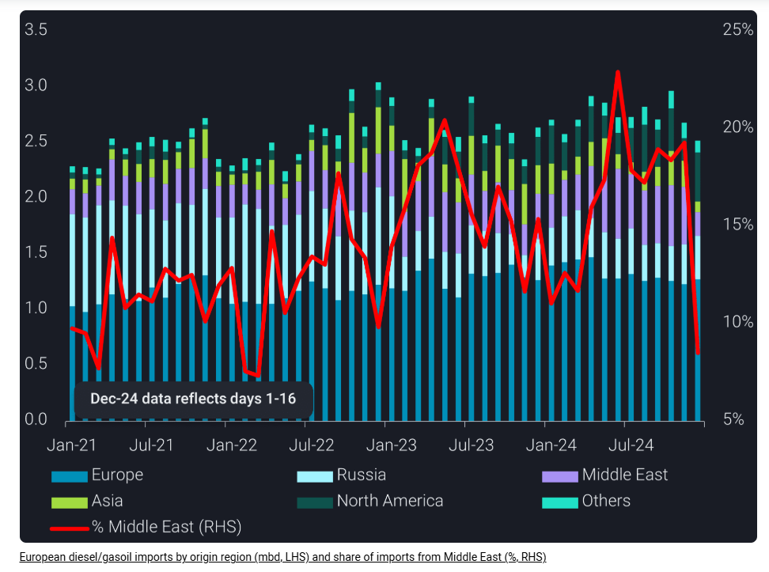
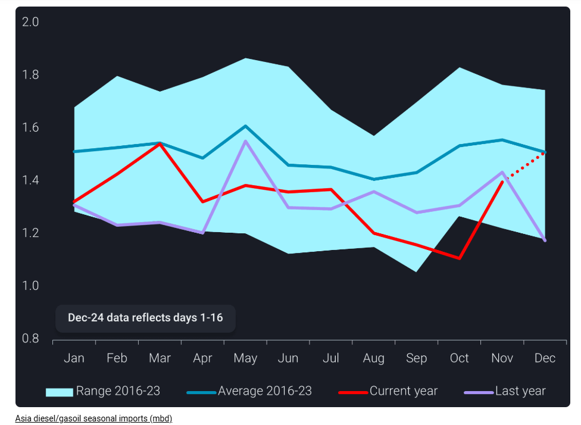
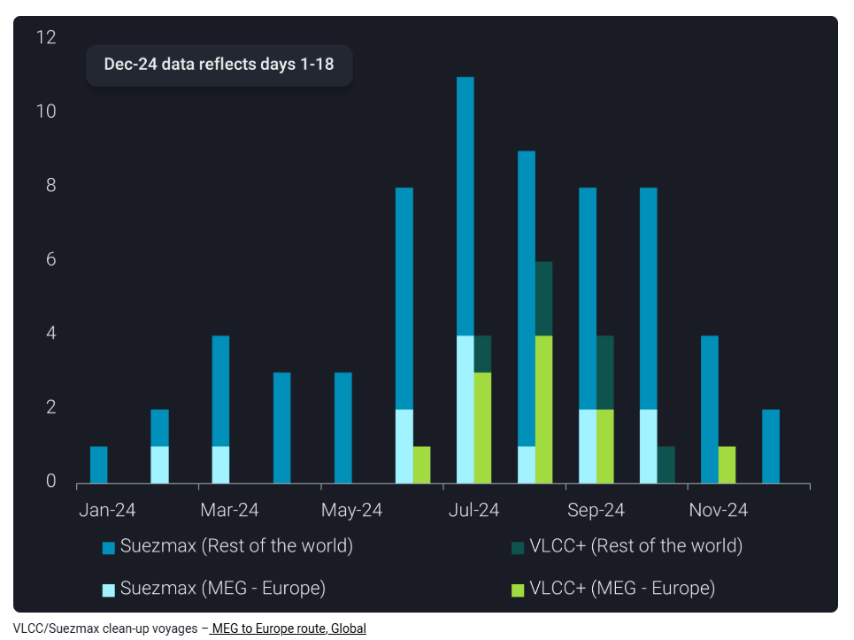

# Middle East diesel supplies shifted from West to East, hampering dirty-to-clean switches for large tankers

**Date:** December 20, 2024  
**Publisher:** Breakwave Advisors | **Category:** Market Insights  
**Original URL:** [https://www.breakwaveadvisors.com/insights/2024/12/20/middle-east-diesel-supplies-shifted-from-west-to-east-hampering-dirty-to-clean-switches-for-large-tankers](https://www.breakwaveadvisors.com/insights/2024/12/20/middle-east-diesel-supplies-shifted-from-west-to-east-hampering-dirty-to-clean-switches-for-large-tankers)  

---

Middle Eastern diesel supplies were reshuffled towards the East, reducing the need to carry diesel on supertankers. However, Middle Eastern and Indian middle distillates could target the Western markets again in the coming months.

*By*[*Xavier Tang*](https://www.linkedin.com/in/xavier-tang/)

Middle East diesel producers find placing their barrels in Europe increasingly challenging.[US Gulf Coast (USGC) diesel/gasoil exports to Europe](https://analytics.vortexa.com/Flows?dateRange=2021-01-01T00%3A00%3A00.000Z__2024-12-16T23%3A59%3A59.999Z&frequency=quarter&from=%5B%224e79eb8e84d26f5c3c0006283bc1aa52c170b58d667be9848e136afea91a57e9%22%5D&geoBreakdownDestinationGlobal=region&geoBreakdownOriginGlobal=shipping_region_v2&metric=bpd&page=Flows&products=%5B%22deda35eb9ca56b54e74f0ff370423f9a8c61cf6a3796fcb18eaeeb32a8c290bb%22%5D&tabId=c72d86b9-60fd-46f5-8936-2ea676bc191b&timeSeriesHiddenSeries=%5B%22seasonal_comparison_24%22%2C%22seasonal_comparison_12%22%5D&timeSeriesProperty=origin_region&to=%5B%22f39d455f5d38907394d6da3a91da4e391f9a34bd6a17e826d6042761067e88f4%22%5D&v=3)have picked up, averaging 310kbd in the third quarter and are on track to surpass those levels in the fourth quarter this year. USGC diesel exports have increased due to slowing domestic demand, high refinery utilisation rates and stock accumulation. (Read more from[our USGC blog](https://www.vortexa.com/insights/products/us-gulf-coast-clean-products-flood-the-export-markets/))

Europe drastically reduced its[diesel/gasoil imports from the Middle East and Asia](https://analytics.vortexa.com/Flows?dateRange=2021-01-01T00%3A00%3A00.000Z__2024-12-16T23%3A59%3A59.999Z&from=%5B%2280aa9e4f3014c3d96559c8e642157edbb2b684ea0144ed76cd20b3af75110877%22%2C%22e6955a2c59dc90833986fe0894cf6718dddaa7816bb51bc955cdd3eb4470e554%22%5D&geoBreakdownDestinationGlobal=region&geoBreakdownOriginGlobal=shipping_region_v2&metric=bpd&movementEvent=unloading_start&page=Flows&products=%5B%22deda35eb9ca56b54e74f0ff370423f9a8c61cf6a3796fcb18eaeeb32a8c290bb%22%5D&tabId=c72d86b9-60fd-46f5-8936-2ea676bc191b&timeSeriesHiddenSeries=%5B%22seasonal_comparison_24%22%2C%22seasonal_comparison_12%22%5D&timeSeriesProperty=origin_region&to=%5B%22f39d455f5d38907394d6da3a91da4e391f9a34bd6a17e826d6042761067e88f4%22%5D&v=3)in the first 16 days of December, lowering the European diesel share of imports from the Middle East and Asia from 19% to 8% and 9% to 4%, respectively. The sharp decline in imports from the East of Suez is driven by narrowing ultra-low sulphur diesel (ULSD) spreads between Northwest Europe (NWE) and the Middle East Gulf (MEG) (Argus), reducing the incentive for traders to move diesel to the West of Suez markets.

> **Figure 1: Στιγμιότυπο Οθόνης 2024 12 20 092957**  
> **Interactive Data & Source:** [Analytics Vortexa](https://analytics.vortexa.com/Flows?dateRange=2021-01-01T00%3A00%3A00.000Z__2024-12-16T23%3A59%3A59.999Z&from=%5B%2280aa9e4f3014c3d96559c8e642157edbb2b684ea0144ed76cd20b3af75110877%22%5D&geoBreakdownDestinationGlobal=region&geoBreakdownOriginGlobal=shipping_region_v2&metric=bpd&page=Flows&products=%5B%22deda35eb9ca56b54e74f0ff370423f9a8c61cf6a3796fcb18eaeeb32a8c290bb%22%5D&tabId=c72d86b9-60fd-46f5-8936-2ea676bc191b&timeSeriesHiddenSeries=%5B%22seasonal_comparison_24%22%2C%22seasonal_comparison_12%22%5D&timeSeriesProperty=destination_region&to=%5B%22e6955a2c59dc90833986fe0894cf6718dddaa7816bb51bc955cdd3eb4470e554%22%5D&v=3) | [Local Asset](file:///C:/Users/Dell/Github/Shipping/corpus/03-breakwave/insights/2024/assets/2024-12-20_middle-east-diesel-supplies-shifted-from-west-to-east-hampering-dirty-to-clean-s_img_cea3cf84ceb9ceb3cebcceb9cf8ccf84cf85_a6431afecbda.png)

## Middle East Diesel Supplies Find Their Way to Asian Markets to Cater for Higher Seasonal Demand

Middle East diesel producers have redirected their supplies towards Asia to quench increased seasonal demand.[Middle East diesel/gasoil exports to Asia](https://analytics.vortexa.com/Flows?dateRange=2021-01-01T00%3A00%3A00.000Z__2024-12-16T23%3A59%3A59.999Z&from=%5B%2280aa9e4f3014c3d96559c8e642157edbb2b684ea0144ed76cd20b3af75110877%22%5D&geoBreakdownDestinationGlobal=region&geoBreakdownOriginGlobal=shipping_region_v2&metric=bpd&page=Flows&products=%5B%22deda35eb9ca56b54e74f0ff370423f9a8c61cf6a3796fcb18eaeeb32a8c290bb%22%5D&tabId=c72d86b9-60fd-46f5-8936-2ea676bc191b&timeSeriesHiddenSeries=%5B%22seasonal_comparison_24%22%2C%22seasonal_comparison_12%22%5D&timeSeriesProperty=destination_region&to=%5B%22e6955a2c59dc90833986fe0894cf6718dddaa7816bb51bc955cdd3eb4470e554%22%5D&v=3)have risen for the fifth consecutive month, reaching a 19-month high of over 230kbd in the first 16 days of December. Concurrently,[diesel exports to Europe](https://analytics.vortexa.com/Flows?dateRange=2021-01-01T00%3A00%3A00.000Z__2024-12-16T23%3A59%3A59.999Z&from=%5B%2280aa9e4f3014c3d96559c8e642157edbb2b684ea0144ed76cd20b3af75110877%22%5D&geoBreakdownDestinationGlobal=region&geoBreakdownOriginGlobal=shipping_region_v2&metric=bpd&page=Flows&products=%5B%22deda35eb9ca56b54e74f0ff370423f9a8c61cf6a3796fcb18eaeeb32a8c290bb%22%5D&tabId=c72d86b9-60fd-46f5-8936-2ea676bc191b&timeSeriesHiddenSeries=%5B%22seasonal_comparison_24%22%2C%22seasonal_comparison_12%22%5D&timeSeriesProperty=destination_region&to=%5B%22f39d455f5d38907394d6da3a91da4e391f9a34bd6a17e826d6042761067e88f4%22%5D&v=3)fell to a 3-month low of 260kbd.

[Asia’s jet/kerosene imports](https://analytics.vortexa.com/Flows?dateRange=2021-01-01T00%3A00%3A00.000Z__2024-12-16T23%3A59%3A59.999Z&geoBreakdownDestinationGlobal=region&geoBreakdownOriginGlobal=shipping_region_v2&metric=bpd&movementEvent=unloading_start&page=Flows&products=%5B%22d72edbab2b5e2e249d8c216909945922a02eb017dd200f90876fee6fa180c743%22%5D&tabId=c72d86b9-60fd-46f5-8936-2ea676bc191b&timeSeriesHiddenSeries=%5B%22seasonal_comparison_24%22%2C%22seasonal_comparison_12%22%5D&timeSeriesProperty=destination_shipping_region_v2&to=%5B%22e6955a2c59dc90833986fe0894cf6718dddaa7816bb51bc955cdd3eb4470e554%22%5D&v=3)surged to record highs in the first 16 days of December due to increased Northeast Asia’s kerosene demand for heating and higher seasonal travel demand. The rise in jet fuel demand strengthened the Asian jet regrade (Argus), which has flipped to positive from mid-October to early December. As a result, refiners prioritised jet fuel production at the expense of diesel, tightening diesel supplies somewhat. A drop in[motor fuel exports from China](https://analytics.vortexa.com/Flows?dateRange=2016-01-01T00%3A00%3A00.000Z__2024-12-16T23%3A59%3A59.999Z&from=%5B%22934c47f36c16a58d68ef5e007e62a23f5f036ee3f3d1f5f85a48c572b90ad8b2%22%5D&geoBreakdownDestinationGlobal=region&geoBreakdownOriginGlobal=shipping_region_v2&metric=bpd&page=Flows&products=%5B%22d72edbab2b5e2e249d8c216909945922a02eb017dd200f90876fee6fa180c743%22%2C%22deda35eb9ca56b54e74f0ff370423f9a8c61cf6a3796fcb18eaeeb32a8c290bb%22%2C%229256907ba7e4ed11ff03aa297a7e62e14484ce5a85c8118c7495b9120ad0e268%22%5D&tabId=c72d86b9-60fd-46f5-8936-2ea676bc191b&timeSeriesHiddenSeries=%5B%22seasonal_comparison_24%22%2C%22seasonal_comparison_12%22%5D&timeSeriesProperty=product_group_product&v=3)due to reduced value-added tax rebates has also tightened Asian supplies. Hence, Asian diesel imports have rebounded to the 8-year average in the first 16 days of December.

> **Figure 2: Στιγμιότυπο Οθόνης 2024 12 20 093055**  
> **Interactive Data & Source:** [Analytics Vortexa](https://analytics.vortexa.com/VoyagesFlows?dateRange=2024-01-01T00%3A00%3A00.000Z__2024-12-19T23%3A59%3A59.999Z&from=%5B%229247125b0b7d8c78d68fb91a5e1ec0cd1b1c4f7276e3385dbe197004b6081229%22%5D&latestProducts=%5B%22deda35eb9ca56b54e74f0ff370423f9a8c61cf6a3796fcb18eaeeb32a8c290bb%22%5D&page=VoyagesFlows&tabId=2746b18d-eacd-40eb-b099-59b804d49ddc&timeSeriesBreakdown=vessel-class-coarse&timeSeriesHiddenSeries=%5B%22seasonal_comparison_12%22%2C%22seasonal_comparison_24%22%5D&timeSeriesMetric=tonne-miles-sum&to=%5B%221c9a4323f8d513ab37238bfbbcf02e39621791c1e941a286d2342ef7359a8f57%22%5D&vesselClasses=%5B%22oil_handysize_mr1%22%2C%22oil_handymax_mr2%22%5D&voyageDateRangeActivity=departures&voyageStatus=%5B%22laden%22%5D) | [Local Asset](file:///C:/Users/Dell/Github/Shipping/corpus/03-breakwave/insights/2024/assets/2024-12-20_middle-east-diesel-supplies-shifted-from-west-to-east-hampering-dirty-to-clean-s_img_cea3cf84ceb9ceb3cebcceb9cf8ccf84cf85_f656f7fa6eaa.png)

## Weaker MEG Flows to Europe Will Cap Dirty-to-Clean Switches on Vlccs

The widening difference between clean and dirty freight prices prompted the growth in clean petroleum product (CPP) deliveries via VLCCs. The MEG to Europe route was one of the key drivers of VLCC dirty-to-clean switches, representing 65% of the total VLCC clean-up voyages this year. As Europe sources its diesel from short-haul origins, dirty-to-clean switches on large vessels will likely be capped by lower[CPP tonne-mile demand for MRs travelling from East to West](https://analytics.vortexa.com/VoyagesFlows?dateRange=2024-01-01T00%3A00%3A00.000Z__2024-12-19T23%3A59%3A59.999Z&from=%5B%229247125b0b7d8c78d68fb91a5e1ec0cd1b1c4f7276e3385dbe197004b6081229%22%5D&latestProducts=%5B%22deda35eb9ca56b54e74f0ff370423f9a8c61cf6a3796fcb18eaeeb32a8c290bb%22%5D&page=VoyagesFlows&tabId=2746b18d-eacd-40eb-b099-59b804d49ddc&timeSeriesBreakdown=vessel-class-coarse&timeSeriesHiddenSeries=%5B%22seasonal_comparison_12%22%2C%22seasonal_comparison_24%22%5D&timeSeriesMetric=tonne-miles-sum&to=%5B%221c9a4323f8d513ab37238bfbbcf02e39621791c1e941a286d2342ef7359a8f57%22%5D&vesselClasses=%5B%22oil_handysize_mr1%22%2C%22oil_handymax_mr2%22%5D&voyageDateRangeActivity=departures&voyageStatus=%5B%22laden%22%5D).

> **Figure 3: Στιγμιότυπο Οθόνης 2024 12 20 093148**  
> **Interactive Data & Source:** [Vortexa](https://www.vortexa.com//oil-gas-data-traders-analysts-data-scientists?gclid=Cj0KCQjw8_qRBhCXARIsAE2AtRZKOvMnbilZ_6_91d7huSFFy71pWLrnPwGwOHVzXsmsG-1a1mZnQw8aAt89EALw_wcB&hsa_acc=1782073842&hsa_ad=548425387665&hsa_cam=14746637662&hsa_grp=125038601902&hsa_kw=&hsa_mt=&hsa_net=adwords&hsa_src=g&hsa_tgt=dsa-1431852288425&hsa_ver=3&utm_campaign=%5BCD%5D%20-%20DSA%20-%20EMEA&utm_medium=cpc&utm_medium=ppc&utm_source=google&utm_source=adwords&utm_term=) | [Local Asset](file:///C:/Users/Dell/Github/Shipping/corpus/03-breakwave/insights/2024/assets/2024-12-20_middle-east-diesel-supplies-shifted-from-west-to-east-hampering-dirty-to-clean-s_img_cea3cf84ceb9ceb3cebcceb9cf8ccf84cf85_b3306b03af71.png)

The current reshuffling of Wider Arabian Sea middle distillate flows from the West to the East is pretty outstanding. It highlights nicely the interconnectivity of the global oil market, but it remains to be seen whether East of Suez demand remains strong enough to digest all these volumes, while there are also question marks on the continuation of the high level of US diesel exports. Looking at historical flow patterns Middle Eastern and Indian diesel and jet barrels will probably swing again towards the European market in the coming weeks and months.

Data Source:[Vortexa](https://www.vortexa.com//oil-gas-data-traders-analysts-data-scientists?gclid=Cj0KCQjw8_qRBhCXARIsAE2AtRZKOvMnbilZ_6_91d7huSFFy71pWLrnPwGwOHVzXsmsG-1a1mZnQw8aAt89EALw_wcB&hsa_acc=1782073842&hsa_ad=548425387665&hsa_cam=14746637662&hsa_grp=125038601902&hsa_kw=&hsa_mt=&hsa_net=adwords&hsa_src=g&hsa_tgt=dsa-1431852288425&hsa_ver=3&utm_campaign=%5BCD%5D%20-%20DSA%20-%20EMEA&utm_medium=cpc&utm_medium=ppc&utm_source=google&utm_source=adwords&utm_term=)

---

**Tags:** Shipping, Markets, Crude  
