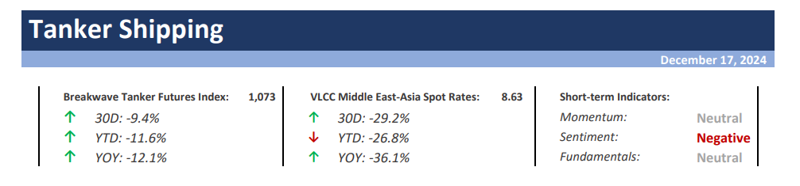
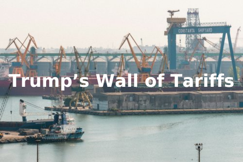
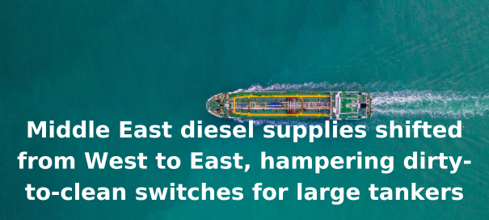

# Breakwave Weekend Read

**Date:** December 21, 2024  
**Publisher:** Breakwave Advisors | **Category:** Market Insights  
**Original URL:** [https://www.breakwaveadvisors.com/insights/2024/10/25/breakwave-weekend-read-4cn8n-wg9gj-jk5sb-4ckhh-cagw9](https://www.breakwaveadvisors.com/insights/2024/10/25/breakwave-weekend-read-4cn8n-wg9gj-jk5sb-4ckhh-cagw9)  

---

### Wishing You Happy Holidays & a Happy New Year!

## Welcome Tobreakwave Advisorsweekend Read

As we conclude the workweek and head into the weekend, take a moment to review the key articles from this week, including those you've highlighted.[2024 Realities](https://www.breakwaveadvisors.com/insights/2024/12/16/2024-realities),[Choppy Waters Ahead](https://www.breakwaveadvisors.com/insights/2024/12/17/choppy-waters-ahead),[Free Trade Area](https://www.breakwaveadvisors.com/insights/2024/12/18/free-trade-area),[Trump’s Wall of Tariffs](https://www.breakwaveadvisors.com/insights/2024/12/20/trumps-wall-of-tariffs), and more.

## Breakwave Tanker Report

**Clouded Horizons: Crude Tanker Freight Market Struggles Amid Weak Demand and Geopolitical Uncertainty**– December continues to cast a**shadow of pessimism**over the crude tanker freight market, with VLCC (Very Large Crude Carrier) rates**struggling to gain momentum**during what is typically the peak winter demand season.

[Read More](https://www.breakwaveadvisors.com/insights/20241217wet-kji289)

> **Figure 1: Στιγμιότυπο Οθόνης 2024 12 17 124511**  
> **Interactive Data & Source:** [Breakwave Advisors Market Insights](https://www.breakwaveadvisors.com/insights/2024/12/16/2024-realities) | [Local Asset](file:///C:/Users/Dell/Github/Shipping/corpus/03-breakwave/insights/2024/assets/2024-12-21_breakwave-weekend-read-4cn8n-wg9gj-jk5sb-4ckhh-cagw9_img_cea3cf84ceb9ceb3cebcceb9cf8ccf84cf85_4f4a3f4983f8.png)

## 2024 Realities

> **Figure 2: Ανώνυμο Σχέδιο (10)**  
> **Interactive Data & Source:** [Breakwave Advisors Market Insights](https://www.breakwaveadvisors.com/insights/2024/12/16/2024-realities) | [Local Asset](file:///C:/Users/Dell/Github/Shipping/corpus/03-breakwave/insights/2024/assets/2024-12-21_breakwave-weekend-read-4cn8n-wg9gj-jk5sb-4ckhh-cagw9_img_ce91cebdcf8ecebdcf85cebccebfcf83cf87_0fb4e054b931.png)

As we approach the final trading days of the year, the Baltic Dry Indices reflect the tempered realities of 2024,

[Read More](https://www.breakwaveadvisors.com/insights/2024/12/16/2024-realities)

Doric Weekly Market Insight

## China's Dry Bulk Imports Continue to Meet Our Very Bullish Expectations

> **Figure 3: Προσθέστε Επικεφαλίδα (1)**  
> **Interactive Data & Source:** [Breakwave Advisors Market Insights](https://www.breakwaveadvisors.com/insights/2024/12/16/chinas-dry-bulk-imports-continue-to-meet-our-very-bullish-expectations) | [Local Asset](file:///C:/Users/Dell/Github/Shipping/corpus/03-breakwave/insights/2024/assets/2024-12-21_breakwave-weekend-read-4cn8n-wg9gj-jk5sb-4ckhh-cagw9_img_cea0cf81cebfcf83ceb8ceadcf83cf84ceb5_77a2ad60a625.png)

China's import data for November was recently released and showed that coal, iron ore, and soybean imports collectively totaled a record 164 million tons.

[Read More](https://www.breakwaveadvisors.com/insights/2024/12/16/chinas-dry-bulk-imports-continue-to-meet-our-very-bullish-expectations)

From Commodore's Weekly Dry Bulk Reports

## Choppy Waters Ahead

> **Figure 4: Προσθέστε Επικεφαλίδα (2)**  
> **Interactive Data & Source:** [Breakwave Advisors Market Insights](https://www.breakwaveadvisors.com/insights/2024/12/17/choppy-waters-ahead) | [Local Asset](file:///C:/Users/Dell/Github/Shipping/corpus/03-breakwave/insights/2024/assets/2024-12-21_breakwave-weekend-read-4cn8n-wg9gj-jk5sb-4ckhh-cagw9_img_cea0cf81cebfcf83ceb8ceadcf83cf84ceb5_905af76d627e.png)

In recent years, the tanker market has faced quite a few tailwinds.

[Read More](https://www.breakwaveadvisors.com/insights/2024/12/17/choppy-waters-ahead)

Gibson Tanker Market Report

## Chinese Teapots Face Challenges in Securing Crude Imports Despite Fresh Quotas

> **Figure 5: Ανώνυμο Σχέδιο (11)**  
> **Interactive Data & Source:** [Breakwave Advisors Market Insights](https://www.breakwaveadvisors.com/insights/2024/12/17/chinese-teapots-face-challenges-in-securing-crude-imports-despite-fresh-quotas) | [Local Asset](file:///C:/Users/Dell/Github/Shipping/corpus/03-breakwave/insights/2024/assets/2024-12-21_breakwave-weekend-read-4cn8n-wg9gj-jk5sb-4ckhh-cagw9_img_ce91cebdcf8ecebdcf85cebccebfcf83cf87_0ccb12efb00b.png)

This report outlines the latest crude flows and VLCC outlook, the progress of the SPR stockpile, and the impact of US tanker-specific sanctions on China.

[Read More](https://www.breakwaveadvisors.com/insights/2024/12/17/chinese-teapots-face-challenges-in-securing-crude-imports-despite-fresh-quotas)

Vortexa Freight Weekly

## Free Trade Area

> **Figure 6: Ανώνυμο Σχέδιο**  
> **Interactive Data & Source:** [Breakwave Advisors Market Insights](https://www.breakwaveadvisors.com/insights/2024/12/18/free-trade-area) | [Local Asset](file:///C:/Users/Dell/Github/Shipping/corpus/03-breakwave/insights/2024/assets/2024-12-21_breakwave-weekend-read-4cn8n-wg9gj-jk5sb-4ckhh-cagw9_img_ce91cebdcf8ecebdcf85cebccebfcf83cf87_273e8874a182.png)

After over two decades of negotiations, the European Union and the Southern Common Market..

[Read More](https://www.breakwaveadvisors.com/insights/2024/12/18/free-trade-area)

Intermodal Weekly Market Report

## Clean-to-Dirty Shift Evident Across Vessel Classes

> **Figure 7: Προσθέστε Επικεφαλίδα**  
> **Interactive Data & Source:** [Breakwave Advisors Market Insights](https://www.breakwaveadvisors.com/insights/2024/12/18/clean-to-dirty-shift-evident-across-vessel-classes) | [Local Asset](file:///C:/Users/Dell/Github/Shipping/corpus/03-breakwave/insights/2024/assets/2024-12-21_breakwave-weekend-read-4cn8n-wg9gj-jk5sb-4ckhh-cagw9_img_cea0cf81cebfcf83ceb8ceadcf83cf84ceb5_37f3c84e1f45.png)

Aframax utilisation on key routes, North Sea-to-UK Continent (TD7) and cross-Med (TD19)..

Vortexa Global Freight Snapshot

## Trump’s Wall of Tariffs

> **Figure 8: Ανώνυμο Σχέδιο (1)**  
> **Interactive Data & Source:** [Breakwave Advisors Market Insights](https://www.breakwaveadvisors.com/insights/2024/12/20/trumps-wall-of-tariffs) | [Local Asset](file:///C:/Users/Dell/Github/Shipping/corpus/03-breakwave/insights/2024/assets/2024-12-21_breakwave-weekend-read-4cn8n-wg9gj-jk5sb-4ckhh-cagw9_img_ce91cebdcf8ecebdcf85cebccebfcf83cf87_76f970e4a89b.png)

It has been only one month since Donald Trump was officially confirmed as the 47th US President.

BRS Weekly Dry Bulk Newsletter

## Middle East Diesel Supplies Shifted From West to East, Hampering Dirty-to-Clean Switches for Large Tankers

> **Figure 9: Middle East Diesel Supplies Shifted From West to East, Hampering Dirty to Clean Switches for Large Tankers**  
> **Interactive Data & Source:** [Breakwave Advisors Market Insights](https://www.breakwaveadvisors.com/insights/2024/12/20/middle-east-diesel-supplies-shifted-from-west-to-east-hampering-dirty-to-clean-switches-for-large-tankers) | [Local Asset](file:///C:/Users/Dell/Github/Shipping/corpus/03-breakwave/insights/2024/assets/2024-12-21_breakwave-weekend-read-4cn8n-wg9gj-jk5sb-4ckhh-cagw9_img_middleeastdieselsuppliesshiftedfromw_45ef8481107e.png)

Middle Eastern diesel supplies were reshuffled towards the East, reducing the need to carry diesel on supertankers.

Vortexa Freight Weekly

---

**Tags:** Shipping, Tankers, Drybulk  
