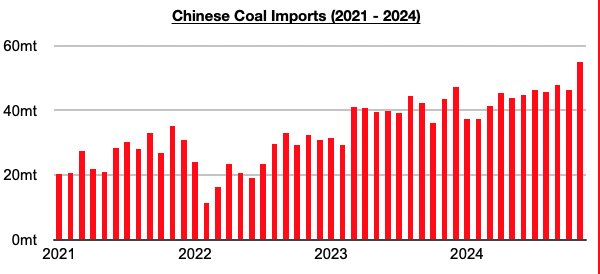

# Electric Car adoption in China Having Significant Impact on Both Tanker and Dry Bulk Shipping Markets

**Date:** December 23, 2024  
**Publisher:** Breakwave Advisors | **Category:** Market Insights  
**Original URL:** [https://www.breakwaveadvisors.com/insights/2024/12/23/electric-car-adoption-in-china-having-significant-impact-on-both-tanker-and-dry-bulk-shipping-markets](https://www.breakwaveadvisors.com/insights/2024/12/23/electric-car-adoption-in-china-having-significant-impact-on-both-tanker-and-dry-bulk-shipping-markets)  

---

*By*[*Jeffrey Landsberg*](https://www.linkedin.com/in/jeffrey-landsberg-70ab957/)

Electric car adoption in China is having a significant impact on both the tanker and dry bulk shipping markets. For the tanker shipping market, the unfortunate fact is that electric cars are cannibalizing what would have instead been purchases of gas engine cars that are fueled by oil. If electric cars did not exist, China’s oil demand would be off the charts. However, electric car adoption is leading to power grids (and not gas stations) being more utilized. Thermal coal-derived electricity generation is China’s primary source of power-grid electricity, and electricity to power electric cars, of course, comes from the power grid and not gas stations. This has become a boon for thermal coal demand. It is not at all a surprise that China’s coal imports last month jumped to a record 55 million tons and that they will set another annual record this year.

> **Figure 1: Chart**  
> [Local Asset](file:///C:/Users/Dell/Github/Shipping/corpus/03-breakwave/insights/2024/assets/2024-12-23_electric-car-adoption-in-china-having-significant-impact-on-both-tanker-and-dry_img_chart_68bdd5be3d7c.jpg)

Going forward, electric car adoption in China is poised to remain a headwind for the tanker shipping market and a tailwind for the dry bulk shipping market as coal will continue to benefit. Other sources of power-grid electricity generation including hydropower, nuclear, wind, and solar power production will continue to benefit as well.

---

**Tags:** China, Drybulk, Commodities  
