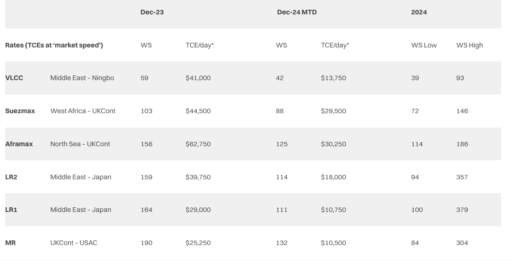
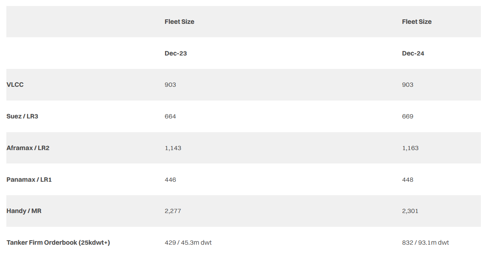
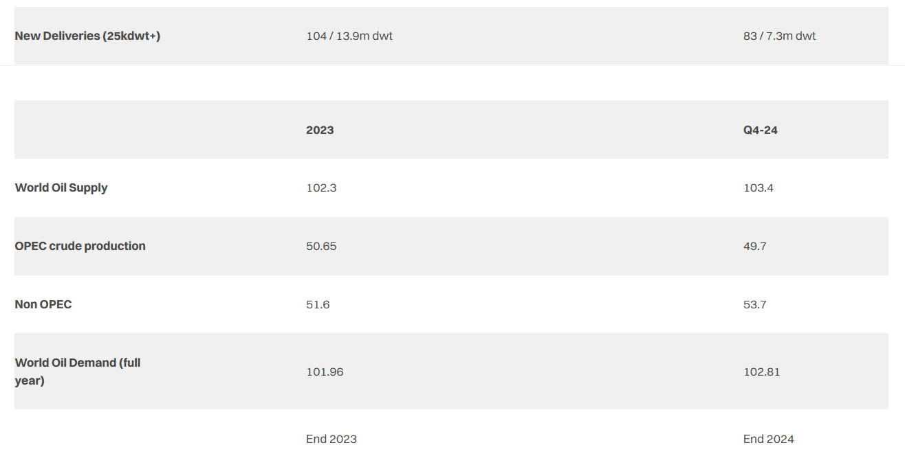
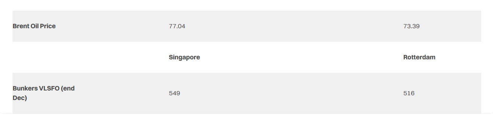

# The Year in Review

**Date:** December 23, 2024  
**Publisher:** Breakwave Advisors | **Category:** Market Insights  
**Original URL:** [https://www.breakwaveadvisors.com/insights/2024/12/23/the-year-in-review](https://www.breakwaveadvisors.com/insights/2024/12/23/the-year-in-review)  

---

> **Figure 1: Tanker Off Port**  
> **Interactive Data & Source:** [Gibsons Co](https://www.gibsons.co.uk/report/choppy-waters-ahead/) | [Local Asset](file:///C:/Users/Dell/Github/Shipping/corpus/03-breakwave/insights/2024/assets/2024-12-23_the-year-in-review_img_tanker-off-port_2b501372fef3.jpg)

2024 started with fresh OPEC+ supply cuts and the onset of the EU’s Emissions Trading Scheme, though both of these seemingly impactful stories were quickly swept away by a wave of Houthi attacks on commercial shipping passing through the Red Sea. While these attacks initially targeted only Israeli linked vessels, they quickly became more indiscriminate leading to large scale re-routing from the Suez Canal to the Cape of Good Hope with no end currently in sight, although attacks on merchant vessels have subsided somewhat.

The de facto closure of the Red Sea to commercial shipping was felt most strongly in clean markets, with LR2 rates soaring at the start of the year. Rates remained elevated yet volatile throughout the first half of the year, with tonne mile increases due to rerouting largely reserved for clean markets.

Clean freight rates came down rapidly into the second half as an unprecedented number of Suezmaxes and VLCCs switched to trading clean to profit from stronger CPP rates. All sizes across dirty and clean saw a healthy first half of the year deteriorate moving into Q3, with the traditionally strong Q4 in dirty markets failing to materialize in most sectors. Weak Chinese demand and changing import patterns weighed heavily on rates in the second half of the year, whilst large crude flows from Iran and other sanctioned suppliers competed with cargoes from conventional sources.

After more than a decade of planning, disputes and delays the much-anticipated Transmountain Expansion (TMX) project finally began commercial operations in May, adding on average 375 kbd of exports largely to the US West Coast and long haul to Asia since, a positive development for Aframaxes. Elsewhere in the Americas, the Panama Canal might have been a big story in 2023, but in 2024 water levels slowly increased and restrictions were gradually lifted throughout the first half the year, removing one of the key drivers of inefficiency (and support) for elevated freight rates in the Americas.

On the refining side, the ramp up of the Dangote refinery with a nameplate capacity of 650 kbd was a big story in Atlantic refining markets this year, and though the refinery has had many teething issues, it has started to impact clean tonne miles. The Olmeca refinery in Mexico was also commissioned this year, though product output remains limited for the time being with any impact likely to be more felt towards the latter stages of 2025.

An 240kbd increase in crude exports from Guyana benefitted VLCCs and Suezmaxes. This increase accounted for the majority of Latin America’s growth in crude exports this year with Brazil’s exports declining. Despite production in the US averaging 300kbd higher year on year, exports were flat over the same period, largely due to high refinery utilization rates and strategic stockpiling. On the other hand, whilst this was bearish for crude, it led to the US Gulf being one of the few bright spots in an otherwise lacklustre clean market in the second half of 2024.

On the supply side, a more than two-decade low of just 83 vessels have hit the water so far this year, with a few stragglers likely to slip into the new year. The orderbook, however, expanded rapidly throughout the year, with orders reaching a 9 year high. LNG proved to be the most popular alternative fuel, although most orders were for conventional tonnage.

Secondhand asset prices for the most part continued rising in the first half of the year, though with sentiment and rates shifting in the H2, secondhand transactions and prices eased. Nevertheless, prices are up across the board compared with 2023, except for 15-year-old VLCCs, which decreased by 3%. Suezmaxes staged the biggest increase in secondhand prices, increasing by between 10-20% depending on the age. Newbuild prices similarly saw only one exception to increases across the board, with LR1s flat compared with 2023. Prices for all other vessel classes rose in the first half of the year and softened in the second, though still comparing favorably to last year.

The year ends with freight rates in most markets lower than in 2023. Looking into 2025, many are wondering whether we have seen the peak of the current market cycle, with OPEC+ extending its supply cuts into next year and vessel supply accelerating. However, these bearish factors must be balanced against increasing production in the Atlantic supporting long haul trade, primarily to Asia, where refining runs are expected to grow by 500kbd despite challenged Chinese demand. Further, as laid out in last week’s[**report**](https://www.gibsons.co.uk/report/choppy-waters-ahead/), geopolitics are expected to continue to play a major role in tanker markets in the year ahead, whilst the fleet also continues to age. With conflicts in the Middle East and Ukraine, as well as Trump heading for his second presidency, continued volatility is the most likely prospect.

> **Figure 2: Στιγμιότυπο Οθόνης 2024 12 23 223803**  
> **Interactive Data & Source:** [Gibsons Co](https://www.gibsons.co.uk/market-reports) | [Local Asset](file:///C:/Users/Dell/Github/Shipping/corpus/03-breakwave/insights/2024/assets/2024-12-23_the-year-in-review_img_cea3cf84ceb9ceb3cebcceb9cf8ccf84cf85_e19a34431cd7.png)

> **Figure 3: Στιγμιότυπο Οθόνης 2024 12 23 223822**  
> **Interactive Data & Source:** [Gibsons Co](https://www.gibsons.co.uk/market-reports) | [Local Asset](file:///C:/Users/Dell/Github/Shipping/corpus/03-breakwave/insights/2024/assets/2024-12-23_the-year-in-review_img_cea3cf84ceb9ceb3cebcceb9cf8ccf84cf85_9f55791302cf.png)

> **Figure 4: Στιγμιότυπο Οθόνης 2024 12 23 223837**  
> **Interactive Data & Source:** [Gibsons Co](https://www.gibsons.co.uk/market-reports) | [Local Asset](file:///C:/Users/Dell/Github/Shipping/corpus/03-breakwave/insights/2024/assets/2024-12-23_the-year-in-review_img_cea3cf84ceb9ceb3cebcceb9cf8ccf84cf85_595c944515ff.png)

> **Figure 5: Στιγμιότυπο Οθόνης 2024 12 23 223854**  
> **Interactive Data & Source:** [Gibsons Co](https://www.gibsons.co.uk/market-reports) | [Local Asset](file:///C:/Users/Dell/Github/Shipping/corpus/03-breakwave/insights/2024/assets/2024-12-23_the-year-in-review_img_cea3cf84ceb9ceb3cebcceb9cf8ccf84cf85_e2838de41bca.png)

> **Figure 6: Στιγμιότυπο Οθόνης 2024 12 23 223905**  
> **Interactive Data & Source:** [Gibsons Co](https://www.gibsons.co.uk/market-reports) | [Local Asset](file:///C:/Users/Dell/Github/Shipping/corpus/03-breakwave/insights/2024/assets/2024-12-23_the-year-in-review_img_cea3cf84ceb9ceb3cebcceb9cf8ccf84cf85_7019de44bfb3.png)

Data source:[Gibson Shipbrokers](https://www.gibsons.co.uk/market-reports)

---

**Tags:** Tankers, Shipping, Crude  
