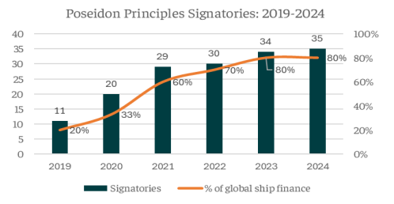
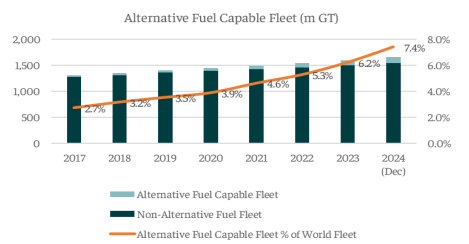
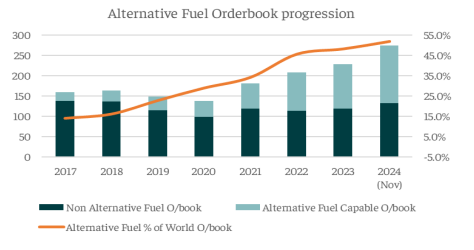

# Poseidon Principles

**Date:** December 26, 2024  
**Publisher:** Breakwave Advisors | **Category:** Market Insights  
**Original URL:** [https://www.breakwaveadvisors.com/insights/2024/12/26/poseidon-principles](https://www.breakwaveadvisors.com/insights/2024/12/26/poseidon-principles)  

---

*By*[*Nikolaos Tagoulis*](https://www.linkedin.com/in/nikolaos-tagoulis-9317252a/)

Half a decade has passed since the introduction of Poseidon Principles to the ship financing sector, a set of guidelines aimed at advancing the financing of environmentally sustainable ships and reduce carbon emissions of the Shipping Industry. Launched in 2019 with the participation of 11 banks from five countries, this initiative has seen significant growth. Today, 35 banks from 14 countries have signed on, representing nearly 80% of the global ship financing portfolio—approximately $240 billion. Signatories include leading financial institutions such as BNP Paribas, Credit Agricole, DNB, and Nordea Bank.

> **Figure 1: Στιγμιότυπο Οθόνης 2024 12 26 131721**  
> **Interactive Data & Source:** [Intermodal](https://www.intermodal.gr/) | [Local Asset](file:///C:/Users/Dell/Github/Shipping/corpus/03-breakwave/insights/2024/assets/2024-12-26_poseidon-principles_img_cea3cf84ceb9ceb3cebcceb9cf8ccf84cf85_763056e5d6e8.png)

While the financing of greener ships is progressing, several challenges persist. These include difficulties for the owners to secure debt for retrofitting existing vessels, a reluctance of some financial institutions to finance dual-fuel vessels, and concerns from shipowners regarding the higher costs and limited availability of cleaner fuels.

Despite these challenges the green transition of the shipping industry is progressing, evidenced by a rising number of eco-friendly vessels entering service. However, a counterfeiting factor to this trend is the subdued demolition activity observed in recent years. Following a robust recycling activity in 2020-2021, since then the scrapping volumes are steadily declining, falling in the last 3 years well below average figures. Consequently, the fleet’s average age has increased, suggesting the need for fleet’s modernization so that the older units to be replaced with modern, more ecofriendly vessels. Nevertheless, the implementation of stricter greenhouse gas emission regulations is expected to support an increase in recycling activity, as older units may need to be recycled earlier than their typical lifecycle.

> **Figure 2: Στιγμιότυπο Οθόνης 2024 12 26 131736**  
> **Interactive Data & Source:** [Intermodal](https://www.intermodal.gr/) | [Local Asset](file:///C:/Users/Dell/Github/Shipping/corpus/03-breakwave/insights/2024/assets/2024-12-26_poseidon-principles_img_cea3cf84ceb9ceb3cebcceb9cf8ccf84cf85_273931f1267a.png)

> **Figure 3: Στιγμιότυπο Οθόνης 2024 12 26 131753**  
> **Interactive Data & Source:** [Intermodal](https://www.intermodal.gr/) | [Local Asset](file:///C:/Users/Dell/Github/Shipping/corpus/03-breakwave/insights/2024/assets/2024-12-26_poseidon-principles_img_cea3cf84ceb9ceb3cebcceb9cf8ccf84cf85_b49a861ba2b7.png)

Focusing to the the dual-fuel fleet, it currently counts 2,119 vessels with a combined capacity of 123 million gt, representing 7.4% of the global fleet by gross tonnage. This marks a significant increase from the 3.2% recorded in 2018, prior to the introduction of the Poseidon Principles. Notably, 84% of this alternative fuel tonnage is LNG dual-fuel, consisting of 1,248 units with a total capacity of 102.93 million gt. Moreover, the share of dual fuel vessels in the global orderbook is steadily rising, climbing to 52%, from just 16% in 2018. The current dual-fuel orderbook totals 1,821 units with a combined capacity of 143 million gt; among these are 1,042 LNG dual-fuel vessels accounting for 103.74 million gt.

Concluding, the implementation of the Poseidon Principles is to the global ship financing portfolio progressing, reflecting a commitment to sustainable ship financing despite several challenges that need to be addressed. While the green transition in the shipping industry is gaining momentum, as evidenced by a growing share of environmentally friendly vessels within the fleet and orderbook, the declined recycling activity of the last years hinders fleet modernization. The pace of fleet demolition will be a critical factor to monitor in the coming year, as a potential rise in scrapping volumes could facilitate modernization and support further the green transition.

Data Source:[Intermodal](https://www.intermodal.gr/)

---

**Tags:** Hipping, Markets, Economy  
