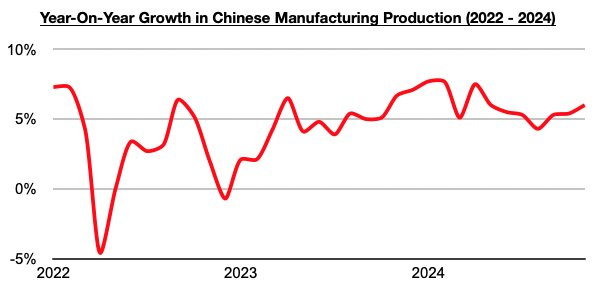

# China's Manufacturing Growth Has Climbed Further

**Date:** December 27, 2024  
**Publisher:** Breakwave Advisors | **Category:** Market Insights  
**Original URL:** [https://www.breakwaveadvisors.com/insights/2024/12/27/chinas-manufacturing-growth-has-climbed-further](https://www.breakwaveadvisors.com/insights/2024/12/27/chinas-manufacturing-growth-has-climbed-further)  

---

*By*[*Jeffrey Landsberg*](https://www.linkedin.com/in/jeffrey-landsberg-70ab957/)

Recently released data shows that China’s manufacturing production increased on a year-on-year basis in November by 6% (manufacturing is defined as the creation or production of goods with the help of equipment, labor, machines, tools, chemical or biological processing, formulation, etc). This is up from October's impressive 5.4% growth, marks a third straight month that growth has increased, and marks the strongest growth seen since May. As we have continued to stress in Commodore Research's Weekly China Reports, China’s industrial sector continues to fare better than its consumer sector. We remain of our view that the central government is intent on making sure manufacturing production growth remains above 5%.

> **Figure 1: Chart (1)**  
> [Local Asset](file:///C:/Users/Dell/Github/Shipping/corpus/03-breakwave/insights/2024/assets/2024-12-27_chinas-manufacturing-growth-has-climbed-further_img_chart28129_6c88a51ccc70.jpg)

---

**Tags:** China, Drybulk, Commodities  
