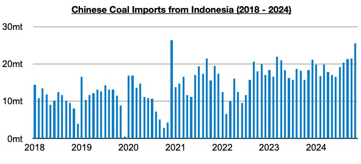
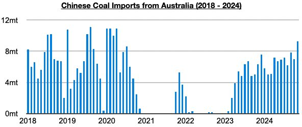
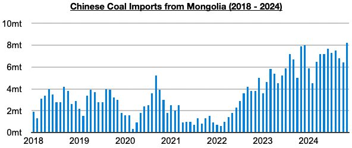
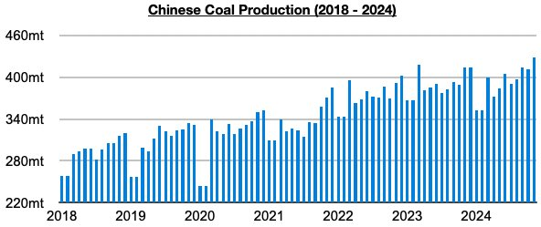

# Strength in Chinese Coal Imports

**Date:** January 02, 2025  
**Publisher:** Breakwave Advisors | **Category:** Market Insights  
**Original URL:** [https://www.breakwaveadvisors.com/insights/2025/1/2/strength-in-chinese-coal-imports](https://www.breakwaveadvisors.com/insights/2025/1/2/strength-in-chinese-coal-imports)  

---

*By*[*Jeffrey Landsberg*](https://www.linkedin.com/in/jeffrey-landsberg-70ab957/)

As we discussed for clients earlier last month, China's coal imports in November totaled a record 55 million tons. Import data by source is now available and shows that imports from Indonesia totaled 25.6 million tons. This has marked the largest volume seen since December 2020.

> **Figure 1: Chart 1**  
> [Local Asset](file:///C:/Users/Dell/Github/Shipping/corpus/03-breakwave/insights/2025/assets/2025-01-02_strength-in-chinese-coal-imports_img_chart1_6d5a6fb591f0.jpg)

Imports from Australia totaled 9.3 million tons, which has marked the largest volume seen since April 2020.

> **Figure 2: Chart 2**  
> [Local Asset](file:///C:/Users/Dell/Github/Shipping/corpus/03-breakwave/insights/2025/assets/2025-01-02_strength-in-chinese-coal-imports_img_chart2_dce8b43f6ac8.jpg)

Imports from Mongolia totaled 8.2 million tons, which has marked a new record.

> **Figure 3: Chart 3**  
> [Local Asset](file:///C:/Users/Dell/Github/Shipping/corpus/03-breakwave/insights/2025/assets/2025-01-02_strength-in-chinese-coal-imports_img_chart3_8810a726d4d2.jpg)

Also of note is that China's coal production totaled a record 428 million tons in November. China's coal production has now grown on a year-on-year basis for six straight months.

> **Figure 4: Chart 4**  
> [Local Asset](file:///C:/Users/Dell/Github/Shipping/corpus/03-breakwave/insights/2025/assets/2025-01-02_strength-in-chinese-coal-imports_img_chart4_6baa2e5693d8.jpg)

---

**Tags:** China, Drybulk, Coal  
