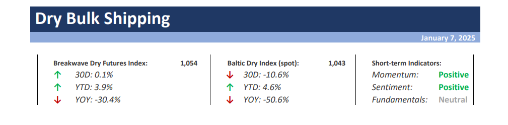
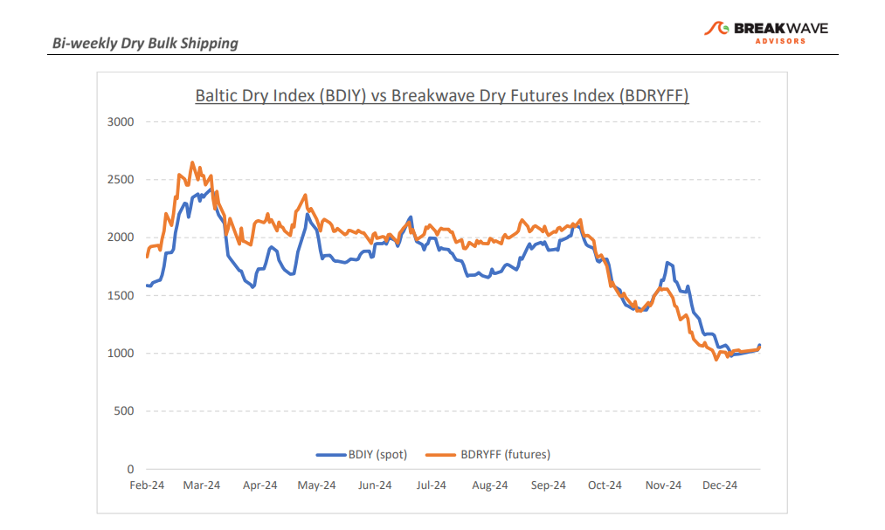
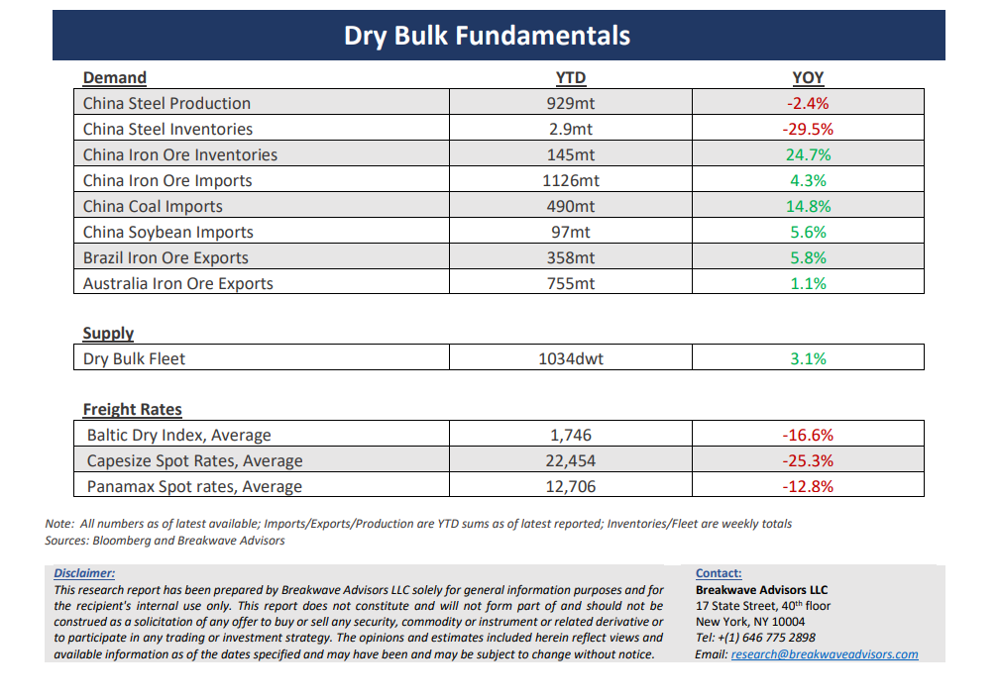

# Breakwave Bi-Weekly Dry Bulk Report - January 7, 2025

**Date:** January 07, 2025  
**Publisher:** Breakwave Advisors | **Category:** Market Insights  
**Original URL:** [https://www.breakwaveadvisors.com/insights/202517dry-87w5214](https://www.breakwaveadvisors.com/insights/202517dry-87w5214)  

---

> **Figure 1: Cea3cf84ceb9ceb3cebcceb9cf8ccf84cf85**  
> [Local Asset](file:///C:/Users/Dell/Github/Shipping/corpus/03-breakwave/insights/2025/assets/2025-01-07_202517dry-87w5214_img_cea3cf84ceb9ceb3cebcceb9cf8ccf84cf85_5a508293aa73.png)

•**New Year Brings New Challenges, but It Is Weather That Will Determine Rates Near Term**–The Christmas break provided little new insight into an otherwise challenging dry bulk market. While the sharp declines seen in the previous month appear to have moderated, the sector enters a seasonally weak period, with freight rates at their lowest levels in many months. As previously discussed, this downturn is not unexpected; the market had been overly optimistic in anticipating a repeat of 2024's performance, relying primarily on precedent rather than substantive justification. A notable drag on the market has been the weakness in Panamaxes, driven by subdued grains volumes, which inevitably affected larger bulk carriers. This, coupled with weaker iron ore exports from Brazil in December, pushed freight rates across all vessel sizes down to historical levels for this time of year, yet much lower than previously anticipated. Looking ahead, there are limited near-term catalysts likely to push rates higher, aside from potential weather-related disruptions. Given the typically low trading volumes in the first quarter, any sharp rate increases would largely depend on unpredictable weather-induced delays or disruptions. With the Chinese New Year falling earlier this year, we anticipate stronger-than-average activity in February, contrasting with the current futures market which prices February rates lower than those of January. For investors, the current environment presents the most attractive entry point in at least a year. Spot and futures rates have declined significantly, and while a recovery depends on broader macroeconomic improvements—particularly in China—the setup appears favorable for those with a longer-term perspective.

•**China’s Economic Progression Remains Subject to the Trump Administration’s Policies**– A classic game theory dynamic currently characterizes trade relations between the world’s two largest economies. While there is limited concrete information regarding trade policies under the new Trump administration, historical patterns provide significant context, reducing the surprise element that dominated in 2016. We believe China is far better equipped to navigate any potential policy shifts, with minimal anticipated impact on the dry bulk shipping sector. Moreover, China retains substantial capacity to implement stimulative policies, despite facing significant structural challenges. Notably, the likelihood of closer cooperation between the two nations is emerging as a plausible scenario—one that might surprise market participants who continue to view the previous Trump presidency as a template for the future. Such cooperation could drive a meaningful increase in economic activity in China, particularly through a revival in domestic demand. This, in turn, should provide support for shipping, to the extent that market fundamentals permit subject to the structural and permanent shifts in energy and material infrastructure demand due to environmental policies.

•**Our Long-term View**– The last few years have been characterized by increased geopolitical uncertainty. Going forward, we expect such events to continue to affect global trade and have a meaningful impact on effective vessel supply. Combined with the potential for a multi-year cyclical rebound in China’s economic activity following the recent economic turmoil, dry bulk shipping should experience higher volatility on top of a secular tightness driven by stable bulk commodity demand and a slower fleet growth owing to a relatively low orderbook.

> **Figure 2: Cea3cf84ceb9ceb3cebcceb9cf8ccf84cf85**  
> [Local Asset](file:///C:/Users/Dell/Github/Shipping/corpus/03-breakwave/insights/2025/assets/2025-01-07_202517dry-87w5214_img_cea3cf84ceb9ceb3cebcceb9cf8ccf84cf85_dd5b5ba98e26.png)

> **Figure 3: Cea3cf84ceb9ceb3cebcceb9cf8ccf84cf85**  
> [Local Asset](file:///C:/Users/Dell/Github/Shipping/corpus/03-breakwave/insights/2025/assets/2025-01-07_202517dry-87w5214_img_cea3cf84ceb9ceb3cebcceb9cf8ccf84cf85_df588265ed97.png)

### Subscribe:
