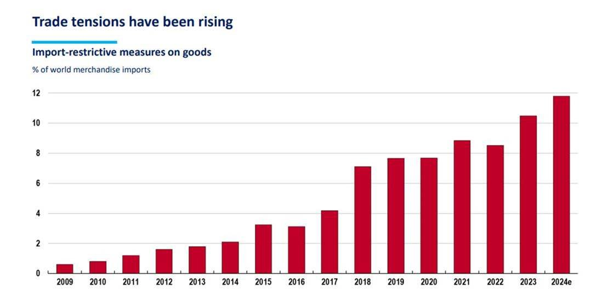
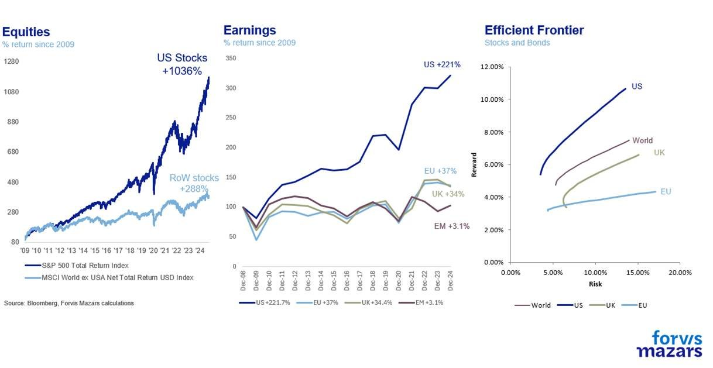
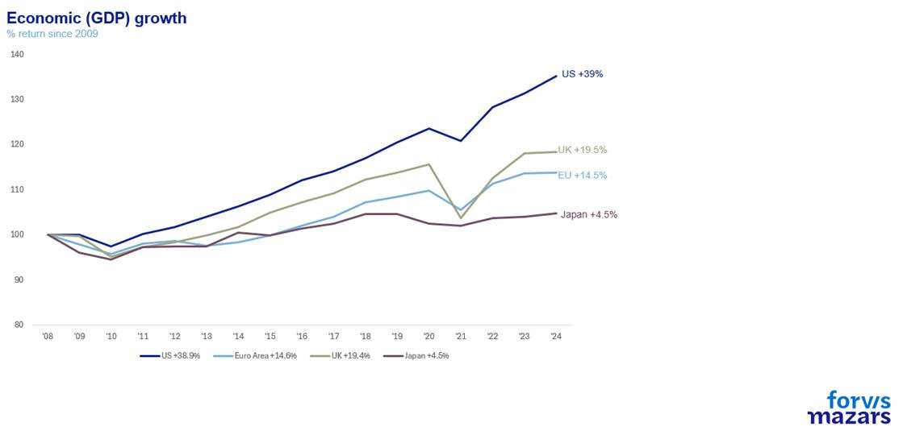
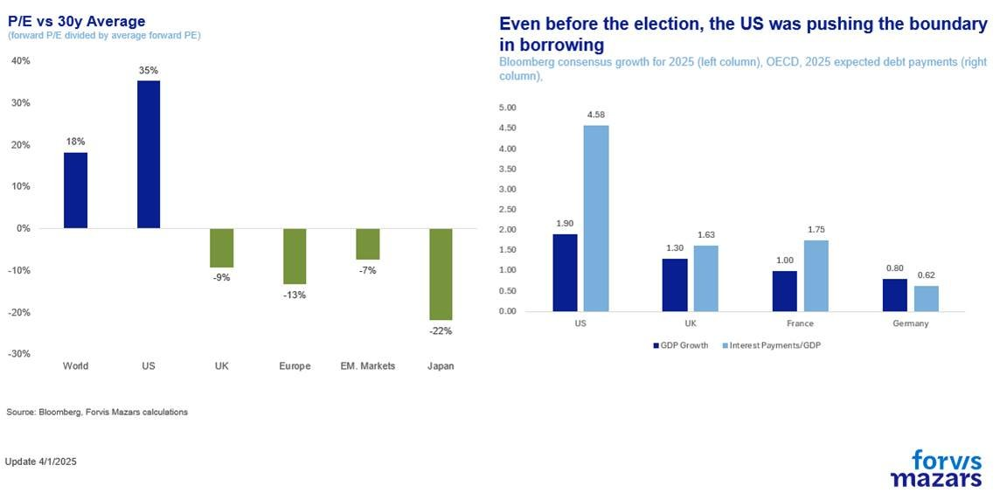
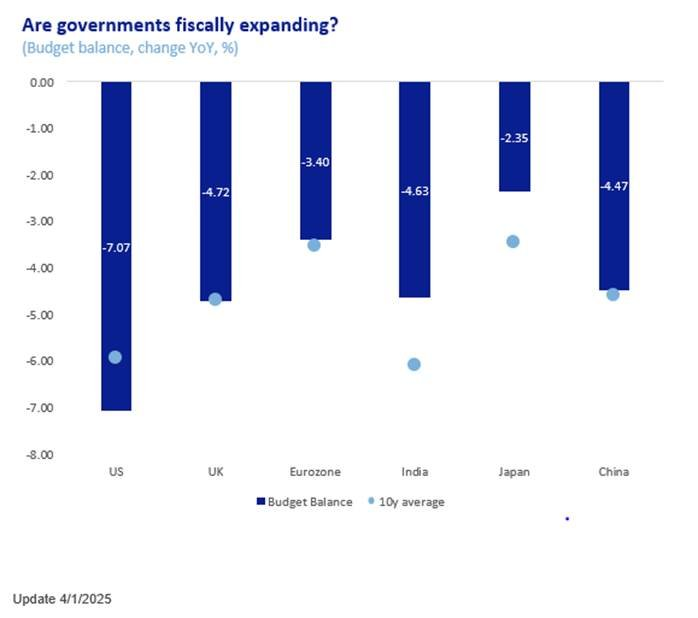
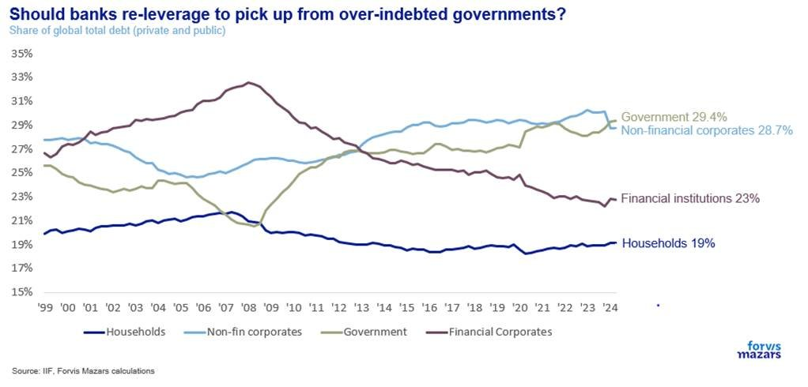
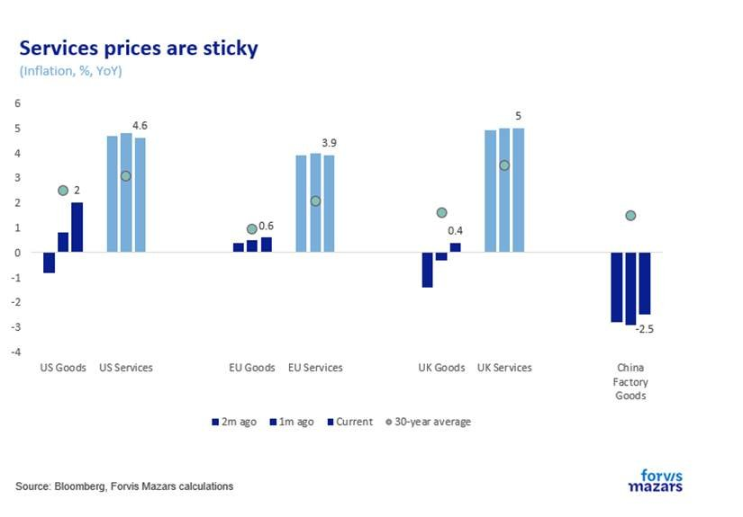
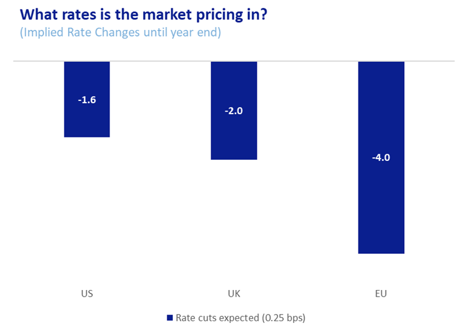

# 2025 isn’t forecastable. But we will try.

**Date:** January 08, 2025  
**Publisher:** Breakwave Advisors | **Category:** Market Insights  
**Original URL:** [https://www.breakwaveadvisors.com/insights/2025/1/8/2025-isnt-forecastable-but-we-will-try](https://www.breakwaveadvisors.com/insights/2025/1/8/2025-isnt-forecastable-but-we-will-try)  

---

The Five Questions for Investors in 2025

2. ### How Long Can Us Exceptionalism Last?
3. ### How Much More Can Nations Borrow?
4. ### How Fast Will China Rebound?
5. ### How Many Rate Cuts in 2025?

--------

### Summary

*2025 is a conundrum. It is a year of wanton and potentially significant disruption. By nature, disruption is not forecastable. At the heart of all, especially where global trade is concerned, lies the use of tariffs. Growth, inflation, economic divergence, and interest rates depend on if and how the incoming US President will use tariffs. When it comes to the US consumer, one of the key engines of global growth, the inability to forecast is compounded by the proposed changes to the way America works, by the Department Of Government Efficiency (DOGE). As a result, there’s a big number of outcomes that open up.*

*We ask 5 questions for the year:*

1. ### What Will the Nature and Intensity of Trade Wars Be?
2. ### How Long Can Us Exceptionalism Last?
3. ### How Much More Can Nations Borrow?
4. ### How Fast Will China Rebound?
5. ### How Many Rate Cuts (or Even Hikes) in 2025?

### Week Ahead

*Next week investors should focus on final Factory and Durable Goods orders from the US, even if preliminary numbers are out. Some reports have suggested front-loading of orders ahead of the change in the Presidency. If that is the case, then at any rate we could see a cyclical slowdown of manufacturing activity in the next few months. Minutes from the FOMC should also inform markets whether the Fed is considering rate pauses and whether it is worried about the impact of trade wars on inflation.*

*By*[*George Lagarias*](https://www.linkedin.com/in/george-lagarias-mba-3baa769/)

Forecasts are at the heart of investment management. Understanding the world as is, even perfectly, offers little value to investors, as that knowledge is “priced in” by financial markets. Forecasts, putting a price on future events, such as earnings, economic growth, inflation, etc, are where the true value of the industry lies.

2025 is a conundrum. It is a year of wanton and potentially significant disruption. By nature, disruption is not forecastable. As of the 20th of January, a President who epitomises disruption will sit in the Oval Office. He will be closely aided by a tech mogul who also takes pride in disrupting various industries, from payments to cars and even space. Together, their stated goal is to use the power of the Office of the President to bring profound changes in the global trading system and the way the American economy works.

At the heart of this, especially where global trade is concerned, lies the use of tariffs. Tariffs are not a foregone conclusion. They are an explicit threat. Either America’s partners will conform with its demands, on trade, defence, immigration, technology, energy and others, or they will face steep tariffs when exporting their goods and services to the US. They in turn, can choose to comply, negotiate, or respond with tariffs of their own, escalating into a new and more acute phase of the global trade wars. So a very large range of potential outcomes opens up.

To be sure, we have made our annual analysis and forecasts to be published in the next couple of weeks. But a lot of this, growth, inflation, economic divergence, and interest rates depend on if and how the incoming US President will use tariffs. When it comes to the US consumer, one of the key engines to global growth, the inability to forecast is compounded by the proposed changes to the way America works, by the Department Of Government Efficiency (DOGE), a committee run by Elon Musk. While it is easy to suggest that resistance from the status quo and the very small parliamentary majority for Republicans could limit the scope of such changes, we would not take this approach. If Havier Milej, the President of Argentina, could bring profound changes in the Argentinian economy (the ultimate success of which is still on the table), why would the all-powerful Office of the President of the United States, with majority in Congress and a Conservative Supreme Court, be more confined?

We thus start the year, not with answers, but with questions. Acknowledging the breadth of outcomes we simply can’t forecast, we focus on our four key themes, and five questions around them.

We have five questions for 2025:

1. This is the one key question that will define 2025. What are the White House’s TRUE intentions? Are tariffs a threat or an actually intended and well-thought-out negotiation policy? How far are they willing to go with it? In the 1930s, the US upped average tariffs to 15%-20%, significantly exacerbating the Great Depression. Proposed tariffs are currently at 26%.

> **Figure 1: What Will the Nature and Intensity of Trade Wars Be?**  
> [Local Asset](file:///C:/Users/Dell/Github/Shipping/corpus/03-breakwave/insights/2025/assets/2025-01-08_2025-isnt-forecastable-but-we-will-try_img_image009_6ebb2ab71065.jpg)

Last year saw US stocks plough ahead, leaving European stocks far behind. The US has the deeper financial markets, the world’s reserve currency, better growth and ultimately a higher efficient frontier than the rest of the world.

> **Figure 2: 2.how Long Can Us Exceptionalism Last?**  
> [Local Asset](file:///C:/Users/Dell/Github/Shipping/corpus/03-breakwave/insights/2025/assets/2025-01-08_2025-isnt-forecastable-but-we-will-try_img_image010_0e61a3a47420.jpg)

> **Figure 3: Market Chart 3**  
> [Local Asset](file:///C:/Users/Dell/Github/Shipping/corpus/03-breakwave/insights/2025/assets/2025-01-08_2025-isnt-forecastable-but-we-will-try_img_image011_b71d454af213.jpg)

As a result, its companies enjoy higher valuations than their global peers and its debt is allowed to balloon more.

> **Figure 4: Market Chart 4**  
> [Local Asset](file:///C:/Users/Dell/Github/Shipping/corpus/03-breakwave/insights/2025/assets/2025-01-08_2025-isnt-forecastable-but-we-will-try_img_image012_25ec75e2d13e.jpg)

In more than one sense America is already “Great”. Will trying to make it “Great Again” result in enhancing its glaring advantage, or will it result in upsetting the status quo and eroding these benefits?

In a world with stagnating demographics, where the productivity promises of the AI revolution are not quite within grasp, borrowing is the only way to support growth in developed economies. The US enjoys a natural advantage and is able to sustain high deficits due to the power of the US Dollar. However, European countries are also sustaining high deficits.

> **Figure 5: 3.how Much More Can Nations Borrow?**  
> [Local Asset](file:///C:/Users/Dell/Github/Shipping/corpus/03-breakwave/insights/2025/assets/2025-01-08_2025-isnt-forecastable-but-we-will-try_img_image013_a81d94d8500d.jpg)

France is already in trouble. Can countries continue borrowing at the current pace while sustaining growth enough without risking breaking their promises to their electorates? Or will bank deregulation be the key to shifting growth from government borrowing to credit creation?

> **Figure 6: Market Chart 6**  
> [Local Asset](file:///C:/Users/Dell/Github/Shipping/corpus/03-breakwave/insights/2025/assets/2025-01-08_2025-isnt-forecastable-but-we-will-try_img_image014_d77314858de2.jpg)

If Chinese stimulus of over $1tn helps the economy perform a v-shaped recovery, then China’s disinflationary effect on Developed Markets might dissipate quickly, forcing central banks to halt or even reverse rate cuts. If China fails to rebound or performs a shallow rebound, then this could have a negative effect on global growth. The trajectory of the world’s second-largest economy will be a defining piece of the 2025 puzzle.

> **Figure 7: 4.how Fast Will China Rebound?**  
> [Local Asset](file:///C:/Users/Dell/Github/Shipping/corpus/03-breakwave/insights/2025/assets/2025-01-08_2025-isnt-forecastable-but-we-will-try_img_image015_265cf90d2911.jpg)

This depends on the impact of trade wars and the Chinese rebound on inflation. Current market expectations suggest 1-2 rate cuts in the US and the UK and 4 in Europe, whose key economies face growth and debt challenges. But with so many unknowns, all outcomes should be on the table, even rate hikes.

> **Figure 8: 5.how Many Rate Cuts in 2025?**  
> [Local Asset](file:///C:/Users/Dell/Github/Shipping/corpus/03-breakwave/insights/2025/assets/2025-01-08_2025-isnt-forecastable-but-we-will-try_img_image016_0396dc60d82c.png)

### 6.what It All Means for Investors

The first question, trade wars, is a matter of policy decisions, which remain, at the time of writing, very unclear. The second and third questions (how long US exceptionalism can last and how much more can nations borrow) are age-old questions which don’t really have a forecastable answer. It’s a matter of timing. “Markets can stay irrational longer than you can stay solvent”, John Maynard Keynes said. And to be sure, US asset exceptionalism or large debt tolerance are not nearly as irrational as some may think. The fourth question, China, is difficult to answer, due to the known irregularity of Chinese statistics and the non-capitalist structure of the economy. The final question is really the outcome of an equation, a policy reaction to the four previous unforecastable questions. If the outcome of trade wars, asset inflation, pro-cyclical fiscal policy and the Chinese economic rebound is more inflation, then rates could even rebound. If the outcome is a repression of growth, rates could go down faster than anticipated.

Just to be clear, un-forecast-ability is not in itself a threat to portfolios. All other things being equal, taking decisions with less information means a larger chance to miss, but also larger payouts. The active portfolio manager’s job isn’t to accurately forecast the future (although it helps). It is to assess risks and potential returns, and accurately assign a price they would be willing to pay for them.

---

**Tags:** Macro, Economy, Markets  
