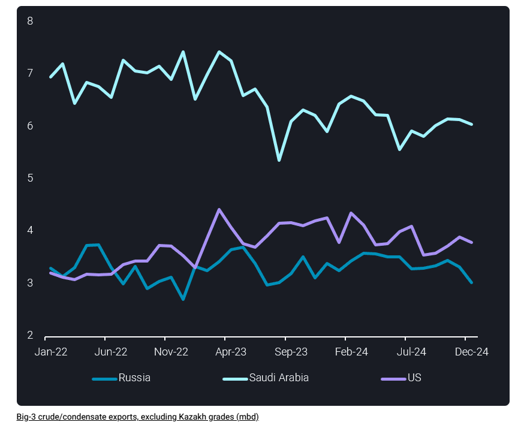

# Big-3’s crude exports dip in December, led by Russia

**Date:** January 08, 2025  
**Publisher:** Breakwave Advisors | **Category:** Market Insights  
**Original URL:** [https://www.breakwaveadvisors.com/insights/2025/1/8/big-3s-crude-exports-dip-in-december-led-by-russia](https://www.breakwaveadvisors.com/insights/2025/1/8/big-3s-crude-exports-dip-in-december-led-by-russia)  

---

In this insight we explore the most recent changes in seaborne exports of the top three global crude producers.

*By*[*Jay Maroo*](https://www.linkedin.com/in/jay-m-336a3633/)

Crude/condensate exports from the “Big-3” producers (Saudi Arabia, US and Russia) fell in December, led by a sharp drop in Russian-origin exports. A decline in December of key seaborne exports, particularly in the case of discounted Russian crude could be seen as bullish, but this is countered by lingering concerns over weak demand as we head into the new year.

Big-3 crude/condensate exports stood at just below 13mbd in December, marking an almost 500kbd m-o-m drop. Of the 500kbd decline, around 300kbd was due to[lower exports from Russia](https://analytics.vortexa.com/Flows?dateRange=2022-01-01T00%3A00%3A00.000Z__2024-12-31T23%3A59%3A59.999Z&fromExcluded=%5B%22d308ddc557e774187ad6c7da81b39db990def9a39e6c88e79cb163b6bdd6e8e5%22%2C%22a1acb291bb339d07faa0d9c7b62ea292aa0ea1a01813b26c890aeeb4e2334b09%22%5D&metric=bpd&originGlobalXFilter=%5B%22b996521be9c996db3560ca234a56286ac38f798d34be229437555fab4f12a6a5%22%5D&page=Flows&products=%5B%2254af755a090118dcf9b0724c9a4e9f14745c26165385ffa7f1445bc768f06f11%22%5D&productsBreakdown=grade&productsExcluded=%5B%22bb70cf56200f5b72ba69a90bda2c6b47ba29da23945c6f1994cfd4c2ef2fe0ff%22%2C%22578b0722570521d64e6a1527e1fb88ddb1a064cc15afe1d6023d2a0b6d66be6b%22%5D&sortDirection=asc&sortField=vessel_name&tabId=a9f01641-f96e-4584-90d5-1a8aea2bbe18&timeSeriesProperty=origin_port&v=3), with the remaining 200kbd drop split roughly equally between Saudi Arabia and the US.

> **Figure 1: Στιγμιότυπο Οθόνης 2025 01 08 132321**  
> **Interactive Data & Source:** [Analytics Vortexa](https://analytics.vortexa.com/FleetDistribution?filtersEnabled=%5B%22l%22%2C%22v%22%2C%22l_c%22%2C%22v_v_st%22%2C%22o%22%2C%22d%22%2C%22v_t%22%5D&latestProducts=%5B%2254af755a090118dcf9b0724c9a4e9f14745c26165385ffa7f1445bc768f06f11%22%2C%225de0b00094e0fd7542c10f9f8a71b4008d55750f21dc905cda9b0f7f5f76bc08%22%5D&location=%5B%22d68f59495d1871eca9bc7a3028ff565d9873a0377ec6b7a211689dc646d578f7%22%5D&page=FleetDistribution&tabId=a13bfd5f-d01a-4d6d-a8cb-e5f61e1683cd&v=3&vesselClasses=%5B%22oil_suezmax_lr3%22%2C%22oil_aframax_lr2%22%5D&voyageStatus=%5B%22ballast%22%5D) | [Local Asset](file:///C:/Users/Dell/Github/Shipping/corpus/03-breakwave/insights/2025/assets/2025-01-08_big-3s-crude-exports-dip-in-december-led-by-russia_img_cea3cf84ceb9ceb3cebcceb9cf8ccf84cf85_43471dfa07fc.png)

The decline in Russian-origin crude exports (i.e. excluding CPC Blend and KEBCO) is only partly driven by seasonality factors such as higher refinery runs and products exports, post-maintenance season. Vortexa data shows an unusually low volume of Russian crude exports from Baltic ports at 3mbd, down by almost 400kbd m-o-m. Russian Black Sea exports were also lower (100kbd m-o-m) but this was offset by higher loadings from Russia Far East of ESPO/Sokol/Sakhalin grades. Vortexa fleet distribution data shows[rising counts of ballast tankers located within Russian Baltic waters](https://analytics.vortexa.com/FleetDistribution?filtersEnabled=%5B%22l%22%2C%22v%22%2C%22l_c%22%2C%22v_v_st%22%2C%22o%22%2C%22d%22%2C%22v_t%22%5D&latestProducts=%5B%2254af755a090118dcf9b0724c9a4e9f14745c26165385ffa7f1445bc768f06f11%22%2C%225de0b00094e0fd7542c10f9f8a71b4008d55750f21dc905cda9b0f7f5f76bc08%22%5D&location=%5B%22d68f59495d1871eca9bc7a3028ff565d9873a0377ec6b7a211689dc646d578f7%22%5D&page=FleetDistribution&tabId=a13bfd5f-d01a-4d6d-a8cb-e5f61e1683cd&v=3&vesselClasses=%5B%22oil_suezmax_lr3%22%2C%22oil_aframax_lr2%22%5D&voyageStatus=%5B%22ballast%22%5D)during late December, possibly indicative of loading cancellations or rescheduling, but that phenomenon has somewhat faded in recent days.

Meanwhile, US exports fell to 3.8mbd in December, even though an anticipated rise in (tax-related) destocking activity would have supported exports towards the end of the year. Lower export volumes were likely a function of US refiners raising utilisation rates in recent weeks (EIA data).

Finally Saudi Arabia’s exports held just above 6mbd in December, reiterating its position to moderate supplies for the global market. The most noteworthy change in Saudi exports at the end of 2025 was a sharp (more than 200kbd) reduction in Yanbu crude exports – typically pointed to the European market. This fits with the latest developments in Saudi OSPs rising much higher on a monthly basis for European rather than Asian buyers.

Looking ahead to the rest of the year, Saudi Arabia along with its fellow OPEC members will need to maintain discipline in its policy of moderating supply into the market. This is even after taking into consideration lower crude exports from Russian and other OPEC+ producers due to natural production decline. Over the course of this year, non-OPEC+ supplies (e.g. Brazil, Guyana, Norway…) are likely to grow, and therefore cap opportunities of more OPEC+ supply, especially in a subdued oil demand environment.

Data Source:[Vortexa](https://www.vortexa.com//oil-gas-data-traders-analysts-data-scientists?gclid=Cj0KCQjw8_qRBhCXARIsAE2AtRZKOvMnbilZ_6_91d7huSFFy71pWLrnPwGwOHVzXsmsG-1a1mZnQw8aAt89EALw_wcB&hsa_acc=1782073842&hsa_ad=548425387665&hsa_cam=14746637662&hsa_grp=125038601902&hsa_kw=&hsa_mt=&hsa_net=adwords&hsa_src=g&hsa_tgt=dsa-1431852288425&hsa_ver=3&utm_campaign=%5BCD%5D%20-%20DSA%20-%20EMEA&utm_medium=cpc&utm_medium=ppc&utm_source=google&utm_source=adwords&utm_term=)

---

**Tags:** Shipping, Markets, Crude  
