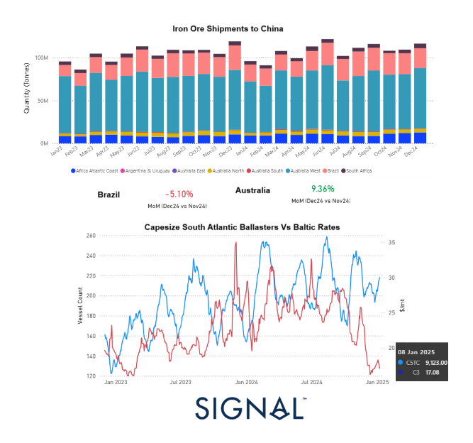
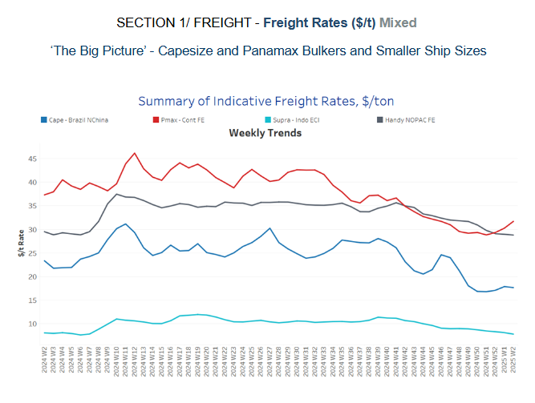
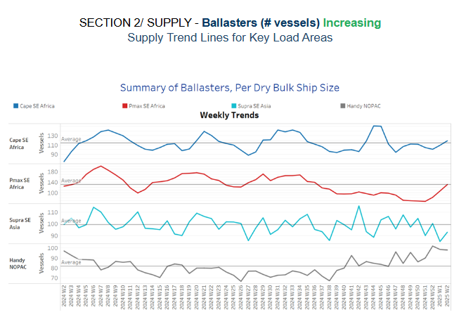
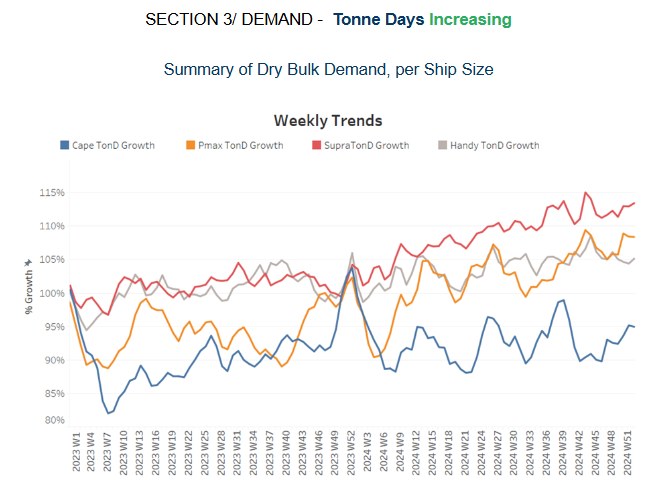
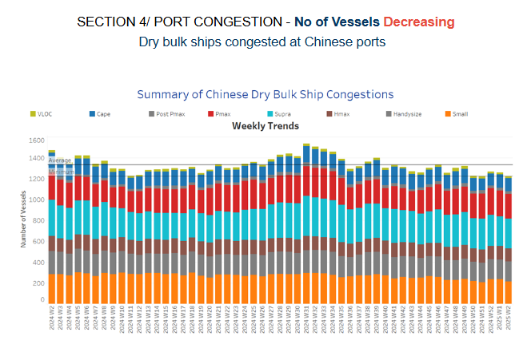

# A challenging freight market environment

**Date:** January 09, 2025  
**Publisher:** Breakwave Advisors | **Category:** Market Insights  
**Original URL:** [https://www.breakwaveadvisors.com/insights/2025/1/9/a-challenging-freight-market-environment](https://www.breakwaveadvisors.com/insights/2025/1/9/a-challenging-freight-market-environment)  

---

**Dry Weekly Market Monitor - Week 02,2025**
Snapshot of Spot Freight Rates, Supply-Demand Trends, Port Congestions
January 09, 2025

## Chart of the Week: Capesize Market (Iron Ore Shipments, Market Rates, South Atlantic Ballasters)

*This week’s highlight delves into the evolving dynamics of Capesize ballasters in the South Atlantic and the evolution of iron ore shipments to China from Australia, Brazil, Guinea and South Africa*

> **Figure 1: Στιγμιότυπο Οθόνης 2025 01 09 133626**  
> **Interactive Data & Source:** [Signal Ocean Platform](https://www.thesignalgroup.com/signal-ocean-platform) | [Local Asset](file:///C:/Users/Dell/Github/Shipping/corpus/03-breakwave/insights/2025/assets/2025-01-09_a-challenging-freight-market-environment_img_cea3cf84ceb9ceb3cebcceb9cf8ccf84cf85_b66089d4bd90.png)

The start of the year confirms a challenging freight market environment for the Capesize iron ore sector, with a notable spike in the vessel count of South Atlantic ballasters and C3 market rates plummeting to new lows ahead of the Chinese New Year. This sharp market downturn has cast a gloomy outlook for the first quarter, though it remains to be seen if conditions will improve. The Chinese economic environment is still facing substantial headwinds, as evidenced by the failure of iron ore prices to rally in December, and steel demand in China continues to soften. Iron ore prices for cargoes with 62% iron content dropped below $98 per ton in early January, marking their lowest point in over three months. This decline is largely driven by weakening steel demand in China, the world's largest consumer, where steel mills are cutting production due to shrinking profit margins and softer demand. China’s steel output is expected to continue its downward trajectory in 2025, following the trend of 2024.

Looking at the evolution of iron ore shipments, Australian exports to China saw a 9% monthly increase in volume, while Brazilian shipments experienced a 5% decrease at the end of December. Although iron ore shipments to China remained relatively high, port arrivals continued to rise as overseas miners ramped up deliveries toward the end of the year to meet annual targets. However, the overall global demand for steel remains weak, putting downward pressure on prices.

In addition, China is grappling with a series of external and internal challenges. The country’s leaders are bracing for potential shocks to the economy from higher tariffs threatened by U.S. President-elect Donald Trump, which could exacerbate trade tensions once he takes office. In response to these economic pressures, the Chinese government is implementing a range of measures to stimulate the economy, including efforts to boost consumer spending and support businesses. These steps are aimed at countering the downturn caused by the property crisis and disruptions from the pandemic, but their effectiveness remains uncertain. Additionally, China faces challenges from a slumping currency and volatile stock markets, further complicating the economic outlook for the year ahead.

In summary, the iron ore market faces a tough start to the year, with low prices and weakened demand from China continuing to pressure freight rates. While there are efforts to support the economy domestically, the broader geopolitical and economic risks pose significant challenges to the market's recovery in the short term.

> **Figure 2: Στιγμιότυπο Οθόνης 2025 01 09 133646**  
> **Interactive Data & Source:** [Signal Ocean Platform](https://www.thesignalgroup.com/signal-ocean-platform) | [Local Asset](file:///C:/Users/Dell/Github/Shipping/corpus/03-breakwave/insights/2025/assets/2025-01-09_a-challenging-freight-market-environment_img_cea3cf84ceb9ceb3cebcceb9cf8ccf84cf85_898c987d7604.png)

The dry bulk freight market displayed mixed momentum at the start of January, with a notable strengthening in Panamax rates from the Continent to the Far East.

- **Capesize**vessel freight rates for shipments from Brazil to North China have stabilized at $17 per ton since mid-December, reflecting a 36% decline compared to the same week at the start of the previous year.
- **Panamax**vessel freight rates from the Continent to the Far East remain around $32 per ton, showing a 7% weekly increase but a 19% decline compared to the same period last year.
- **Supramax**vessel freight rates on the Indo-ECI route dropped below $8 per ton, reflecting a monthly decrease of 13%.
- **Handysize**freight rates for the NOPAC Far East route have dropped $29 per ton, reflecting a 10% decline month-over-month, with a downward trend continuing into early January.

> **Figure 3: Στιγμιότυπο Οθόνης 2025 01 09 133657**  
> **Interactive Data & Source:** [Signal Ocean Platform](https://www.thesignalgroup.com/signal-ocean-platform) | [Local Asset](file:///C:/Users/Dell/Github/Shipping/corpus/03-breakwave/insights/2025/assets/2025-01-09_a-challenging-freight-market-environment_img_cea3cf84ceb9ceb3cebcceb9cf8ccf84cf85_bef548ba62b9.png)

The early days of January saw an increase in the number of ballasters, highlighting a challenging freight market environment leading up to the Chinese New Year.

- **Capesize SE Africa**: The number of vessels remained just above the annual average of 104, though levels were significantly lower than the peaks observed in week 46 of the previous year.
- **Panamax SE Africa**: Amid the declining trend seen throughout November and December, the start of the year saw an uptick, with levels approaching the annual average of 130.
- **Supramax SE Asia**: There has been significant volatility, with numbers continuing to trend below the annual average of 100.
- **Handysize NOPAC**: An upward revision above the annual average has continued into the new year, with levels now slightly below 100. The upward pressure is expected to persist throughout January, adding further strain to freight market levels.

> **Figure 4: Στιγμιότυπο Οθόνης 2025 01 09 133708**  
> **Interactive Data & Source:** [Signal Ocean Platform](https://www.thesignalgroup.com/signal-ocean-platform) | [Local Asset](file:///C:/Users/Dell/Github/Shipping/corpus/03-breakwave/insights/2025/assets/2025-01-09_a-challenging-freight-market-environment_img_cea3cf84ceb9ceb3cebcceb9cf8ccf84cf85_9caf92cfe898.png)

At the close of 2024, dry tonne-day growth showed an accelerating trend across all dry vessel size categories, with the exception of the Handysize segment.

- **Capesize**: In the final days of December, weekly percentage growth rebounded, surpassing the lows recorded in week 42. However, it remained slower than the growth rate observed at the end of week 39.
- **Panamax**: After peaking in week 42, weekly percentage growth followed a downward trend before rebounding in the final days of December. However, it remains uncertain whether the beginning of the year will sustain a similar strengthening momentum.
- **Supramax**: The growth rate attempted to surpass the pace achieved in November but fell short of reaching the mid-October peak.
- **Handysize**: The Handysize vessel segment extended the downward trend observed in November, while January may exhibit similar weakness.

> **Figure 5: Στιγμιότυπο Οθόνης 2025 01 09 133720**  
> **Interactive Data & Source:** [Signal Ocean Platform](https://www.thesignalgroup.com/signal-ocean-platform) | [Local Asset](file:///C:/Users/Dell/Github/Shipping/corpus/03-breakwave/insights/2025/assets/2025-01-09_a-challenging-freight-market-environment_img_cea3cf84ceb9ceb3cebcceb9cf8ccf84cf85_d0c7dcdf4cff.png)

Congestion at Chinese dry bulk ports has continued its downward trend at the start of the year, aligning with the slowing pace observed at the end of December 2024.

- **Capesize**: Capesize vessel congestion stood 124, 11 lower than the levels of week 49.
- **Panamax**: The number of Panamax vessels dropped below 240, marking a decline of 17 compared to year-end levels.
- **Supramax**: Congestion levels remained below 290 vessels at the start of the year, reflecting a decrease of 12 compared to the figures recorded during the final week of December.
- **Handysize**: Congestion levels hovered around the 190 mark throughout December, a trend that appears to be continuing into the first month of the new year.

Data Source:[Signal Ocean Platform](https://www.thesignalgroup.com/signal-ocean-platform)

---

**Tags:** Shipping, Drybulk, Markets  
