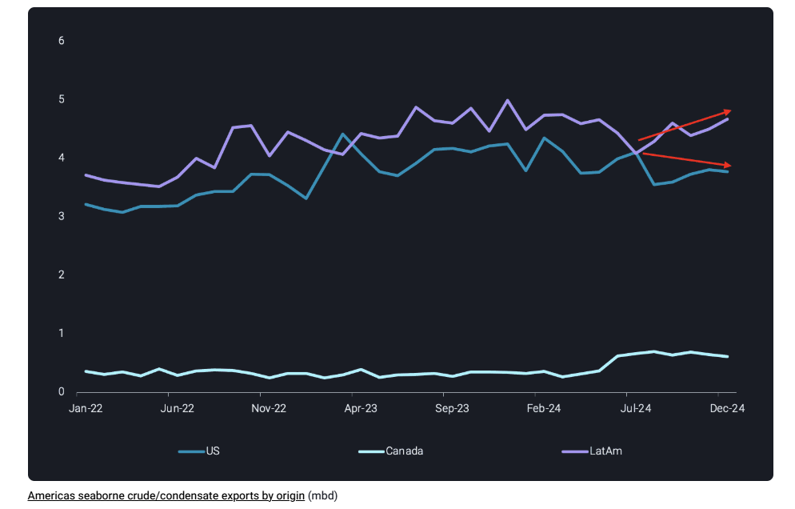
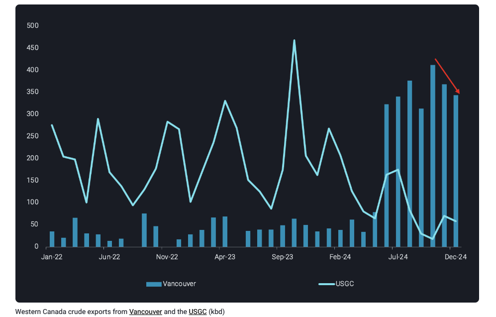
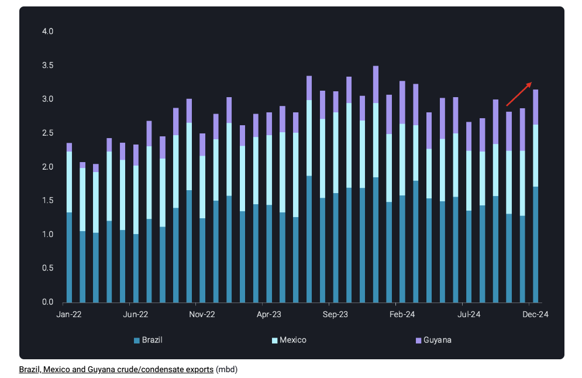

# Americas crude export growth supported by Brazil and Guyana

**Date:** January 10, 2025  
**Publisher:** Breakwave Advisors | **Category:** Market Insights  
**Original URL:** [https://www.breakwaveadvisors.com/insights/2025/1/10/americas-crude-export-growth-supported-by-brazil-and-guyana](https://www.breakwaveadvisors.com/insights/2025/1/10/americas-crude-export-growth-supported-by-brazil-and-guyana)  

---

Crude export growth out of the Americas has remained robust driven by Brazil and Guyana while US and Canadian exports have experience some slowdown

*By*[*Rohit Rathod*](https://www.linkedin.com/in/rathodrohit/)

Americas crude exports started to stagnate during the second half of 2024 with the US, the largest exporter, showing signs of slowdown. Similarly in Canada, exports out of Vancouver via the new Trans Mountain Expansion (TMX) pipeline also declined for two consecutive months from November 2024. But these declines were offset by increased exports from LatAm countries, especially Brazil and Guyana.

## Declines From the Us and Canada Offset by Latam Growth

> **Figure 1: Στιγμιότυπο Οθόνης 2025 01 10 133314**  
> **Interactive Data & Source:** [Vortexa](https://www.vortexa.com//oil-gas-data-traders-analysts-data-scientists?gclid=Cj0KCQjw8_qRBhCXARIsAE2AtRZKOvMnbilZ_6_91d7huSFFy71pWLrnPwGwOHVzXsmsG-1a1mZnQw8aAt89EALw_wcB&hsa_acc=1782073842&hsa_ad=548425387665&hsa_cam=14746637662&hsa_grp=125038601902&hsa_kw=&hsa_mt=&hsa_net=adwords&hsa_src=g&hsa_tgt=dsa-1431852288425&hsa_ver=3&utm_campaign=%5BCD%5D%20-%20DSA%20-%20EMEA&utm_medium=cpc&utm_medium=ppc&utm_source=google&utm_source=adwords&utm_term=) | [Local Asset](file:///C:/Users/Dell/Github/Shipping/corpus/03-breakwave/insights/2025/assets/2025-01-10_americas-crude-export-growth-supported-by-brazil-and-guyana_img_cea3cf84ceb9ceb3cebcceb9cf8ccf84cf85_b697902bc439.png)

US, the largest crude exporter in the Americas, saw its seaborne exports average 3.9mbd in 2024, lower in comparison to 4mbd in 2023. Seaborne exports dropped to 3.8 mbd in December 2024, despite expectations that an increase in tax-related destocking activity would boost exports toward the year’s end. The decline in export volumes can be attributed to US refiners raising their utilization rates in December, according to EIA data.

> **Figure 2: Στιγμιότυπο Οθόνης 2025 01 10 133438**  
> **Interactive Data & Source:** [Vortexa](https://www.vortexa.com//oil-gas-data-traders-analysts-data-scientists?gclid=Cj0KCQjw8_qRBhCXARIsAE2AtRZKOvMnbilZ_6_91d7huSFFy71pWLrnPwGwOHVzXsmsG-1a1mZnQw8aAt89EALw_wcB&hsa_acc=1782073842&hsa_ad=548425387665&hsa_cam=14746637662&hsa_grp=125038601902&hsa_kw=&hsa_mt=&hsa_net=adwords&hsa_src=g&hsa_tgt=dsa-1431852288425&hsa_ver=3&utm_campaign=%5BCD%5D%20-%20DSA%20-%20EMEA&utm_medium=cpc&utm_medium=ppc&utm_source=google&utm_source=adwords&utm_term=) | [Local Asset](file:///C:/Users/Dell/Github/Shipping/corpus/03-breakwave/insights/2025/assets/2025-01-10_americas-crude-export-growth-supported-by-brazil-and-guyana_img_cea3cf84ceb9ceb3cebcceb9cf8ccf84cf85_1f6dc29044c6.png)

Up north in Canada, Western Canadian crudes received a new outlet from Vancouver in the form of the TMX pipeline. As a result, exports out of Vancouver averaged 350kbd during the second half of 2024 post TMX start-up. This also led to steep decline in Canadian crude exports out of the US Gulf Coast, falling to just 60kbd in December 2024, a y-o-y decline of over 100kbd. Moving our focus back to TMX and Vancouver, exports touched record highs of 410kbd in October 2024, but volumes have since declined for two consecutive months falling to 340kbd in December. Slower Chinese buying over November and December was responsible for these declines while flows to the US West Coast remained stable.

## Brazil Posts Largest Exports Increase in December, Mexico and Guyana Declines

> **Figure 3: Στιγμιότυπο Οθόνης 2025 01 10 133533**  
> **Interactive Data & Source:** [Vortexa](https://www.vortexa.com//oil-gas-data-traders-analysts-data-scientists?gclid=Cj0KCQjw8_qRBhCXARIsAE2AtRZKOvMnbilZ_6_91d7huSFFy71pWLrnPwGwOHVzXsmsG-1a1mZnQw8aAt89EALw_wcB&hsa_acc=1782073842&hsa_ad=548425387665&hsa_cam=14746637662&hsa_grp=125038601902&hsa_kw=&hsa_mt=&hsa_net=adwords&hsa_src=g&hsa_tgt=dsa-1431852288425&hsa_ver=3&utm_campaign=%5BCD%5D%20-%20DSA%20-%20EMEA&utm_medium=cpc&utm_medium=ppc&utm_source=google&utm_source=adwords&utm_term=) | [Local Asset](file:///C:/Users/Dell/Github/Shipping/corpus/03-breakwave/insights/2025/assets/2025-01-10_americas-crude-export-growth-supported-by-brazil-and-guyana_img_cea3cf84ceb9ceb3cebcceb9cf8ccf84cf85_7c423a9d3f5f.png)

Moving over to LatAm, Brazil ended the year strong with 1.7mbd of exports in December, a m-o-m increase of over 400kbd. Guyanese exports on the other hand fell by 100kbd m-o-m in December but averaged 570kbd in 2024 as FPSO Prosperity started producing Payara Gold crude. Guyana’s exports in 2025 are heading higher, as the 250kbd Yellowtail project and associated FPSO One Guyana comes online. Mexican crude exports had a rollercoaster ride in 2024 with exports falling below 1mbd in March 2024 as PEMEX diverted barrels towards Dos Bocas Olmeca refinery start-up and increasing domestic refinery runs. Since June 2024 the Dos Bocas refinery has struggled to start-up with only nominal (~40kbd) crude processed, forcing PEMEX to make barrels available for exports. These exports averaged 940kbd in 4Q 2024 but fell to 920kbd in December 2024.

Looking ahead in 2025, Americas exports might see some reshuffling in a scenario where President Trump imposes import tariffs on Canadian and Mexican crude. As a result, exports of US origin crude might decline as US refiners process more domestic crude. Canadian and Mexican crude exports would then have to pivot towards Asian buyers. It would also incentivize US refiners to import more LatAm grades to replace Canadian and Mexican grades. Whether this scenario plays out or not is yet to be seen but growing exports from the Americas will nonetheless continue to keep a lid on oil prices in a subdued oil demand environment going into 2025.

Data Source:[Vortexa](https://www.vortexa.com//oil-gas-data-traders-analysts-data-scientists?gclid=Cj0KCQjw8_qRBhCXARIsAE2AtRZKOvMnbilZ_6_91d7huSFFy71pWLrnPwGwOHVzXsmsG-1a1mZnQw8aAt89EALw_wcB&hsa_acc=1782073842&hsa_ad=548425387665&hsa_cam=14746637662&hsa_grp=125038601902&hsa_kw=&hsa_mt=&hsa_net=adwords&hsa_src=g&hsa_tgt=dsa-1431852288425&hsa_ver=3&utm_campaign=%5BCD%5D%20-%20DSA%20-%20EMEA&utm_medium=cpc&utm_medium=ppc&utm_source=google&utm_source=adwords&utm_term=)

---

**Tags:** Crudeoil, Tankers, Markets  
