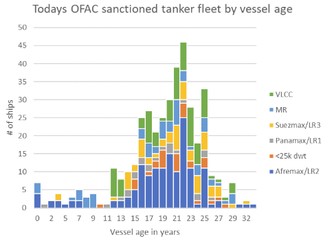
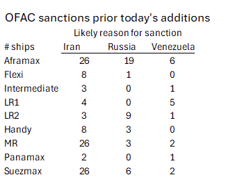

# The Big Picture: OFAC Sanctions

**Date:** January 13, 2025  
**Publisher:** Breakwave Advisors | **Category:** Market Insights  
**Original URL:** [https://www.breakwaveadvisors.com/insights/2025/1/13/the-big-picture-ofac-sanctions](https://www.breakwaveadvisors.com/insights/2025/1/13/the-big-picture-ofac-sanctions)  

---

### Will China and India Receive Sanctioned Tankers?

This question gained relevance today as the US slapped sanctions on another 82 Aframax/LR2s, 26 MRs, 23 Suezmax/LR3s, 11 Panamax/LR1s and five VLCCs. These vessels carried a little under half (45% by volume) of Russia’s crude exports in 2024 and 7% of its refined products. While other countries/agencies have already applied sanctions to around a third of these new OFAC additions, the US OFAC sanctions are the ‘gold standard’ of sanctions. A few days earlier the Chinese coastal region of Shandong, which accounts for 50% of China’s crude imports from Russia and 81% of crude imports from Iran and Venezuela, announced that it will (soon) no longer receive vessels that have been sanctioned by OFAC. It is not yet clear if other Chinese ports will remain open to them but it seems unlikely. Dalian cannot accept sanctioned tankers. Tianjing and Zhoushan ports have not banned the vessels, so in theory cargoes can be shipped to Zhoushan or Tianjing and reshipped to Shandong, but at $2/bl extra costs.

The latest additions to OFAC’s list grows the number of tankers sanctioned by OFAC to 85 VLCCs, 57 Suezmax, 115 Aframax, 30 LR2, 57 MR, 23 Panamax/LR1, and 15 Handies.

This total of 382 OFAC sanctioned tankers >25kdwt (including today’s additions) carried 12% of India’s imported crude oil last year and 17% of China’s. 66% of the crude offloaded from these (currently) sanctioned vessels into China last year went to ports covered by the upcoming Shandong ban.

The key question now for oil markets is the extent to which Russia, Iran and Venezuela can find replacement tankers to move crude oil to India and China. The key question for tanker markets is how many additional liftings, irrespective of load country, will need to move on compliant tankers.

The market’s initial reaction to today’s news has been bullish. FFAs were up sharply. TD3c Cal 2025 strip moved from WS55 to WS65 this week. USG/UKC Aframax (exclusive of EUAs) was up from WS125.25 to WS133.5 for Cal 2025 by the week’s close. Clean routes were up as well. The response from the physical market has been more muted, despite some excitement over the fixture of a replacement Aframax in the USG. The spot assessment went from WS127 to about WS165.

Of the 82 x Aframax/LR2, 26 x MRs, 23 x Suezmax/LR3, 11 x Panamax/LR1 that OFAC has added to its list - apparently with immediate effect - 45 were already subject to sanctions by the UK or EU, according to our records. This includes 28 x Aframax, 8 x Suezmax/LR3, 4 x MRs, and 2 x LR1s. We believe four of them were already sanctioned by OFAC for transporting Iranian oil. However, we also believe that OFAC sanctions are the only ones that genuinely restrict the employment of the vessel, so the vast majority of vessels on this new list can be treated as ‘fresh’ sanctions. And these sanctions will bite.

Of the new OFAC sanction list, 54 tankers are currently laden (26 x Afra/LR2, 11 x MR, 3 x Panamax, 13 x Suezmax and 1 x VLCC). All have loaded in either Russia or Malaysia. We imagine these will all need to be replaced in short-term with compliant ships at higher rates.

The new OFAC sanctions, if effective, will have a mixed impact on tonne miles. Some ESPO crude to China will presumably need to be replaced with Mid East/Atlantic basin crude if non-sanctioned tankers shy away from the trade for fear of attracting OFAC’s attention – as we expect they will. This would be a strong positive for freight. Replacement for Russia’s exports to India crude will need to come from the Mid East or Atlantic basin – which is likely to be shorter-haul.

BUT the tonne-mile story is not relevant here - as these new sanctions have the opportunity to create 100% replacement demand for the compliant fleet, whether it remains exported from shadow exporters or not. The newly-sanctioned fleet would move into floating storage, and eventually scrap (assuming someone can buy the hull now that it is subject to sanctions). 57% of the tanker fleet now sanctioned by OFAC is already over 20 years old.

> **Figure 1: Market Chart 1**  
> [Local Asset](file:///C:/Users/Dell/Github/Shipping/corpus/03-breakwave/insights/2025/assets/2025-01-13_the-big-picture-ofac-sanctions_img_image0_3df488752f90.png)

NB: this new OFAC list is on top of the 245 tankers (of sizes that interest us, that were already sanctioned by OFAC)

> **Figure 2: Market Chart 2**  
> [Local Asset](file:///C:/Users/Dell/Github/Shipping/corpus/03-breakwave/insights/2025/assets/2025-01-13_the-big-picture-ofac-sanctions_img_image1_65c81d05c5ea.png)

---

**Tags:** Tankers, Shipping, Markets  
