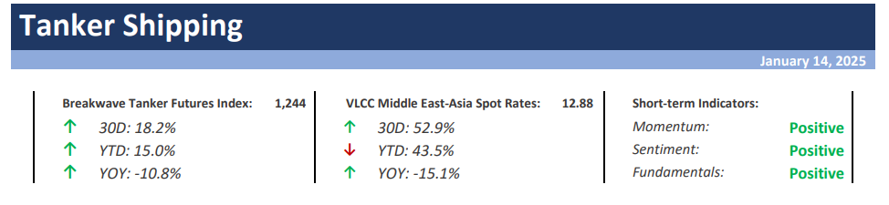
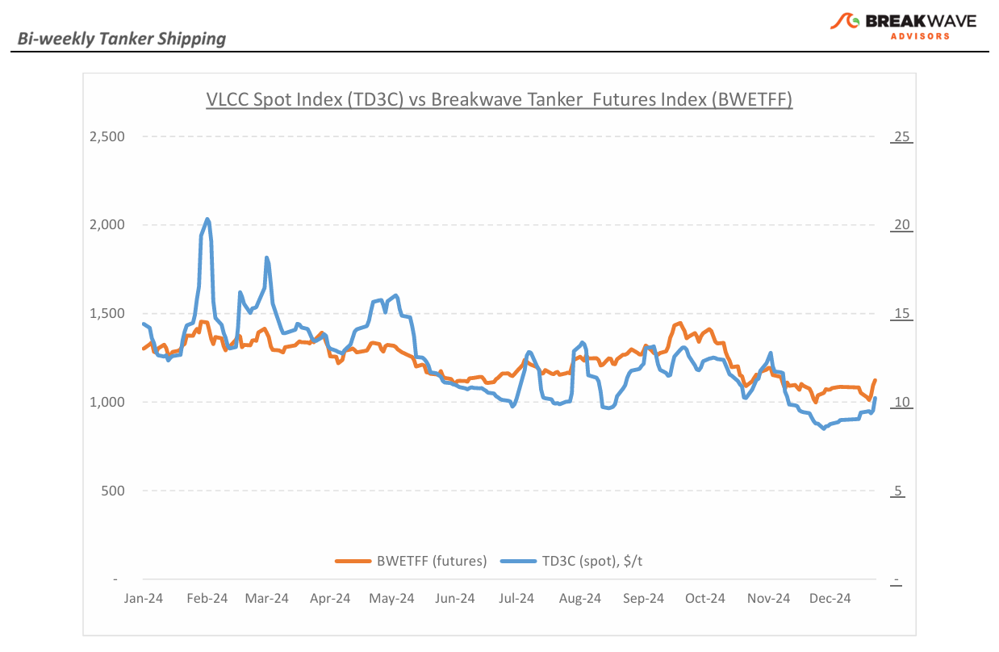
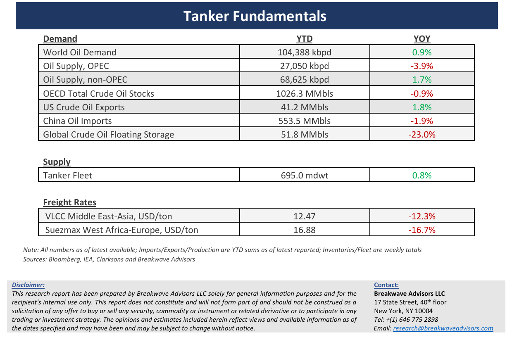

# Breakwave Bi-Weekly Tanker Report - January 14, 2025

**Date:** January 14, 2025  
**Publisher:** Breakwave Advisors | **Category:** Market Insights  
**Original URL:** [https://www.breakwaveadvisors.com/insights/2025114wet-kji2458](https://www.breakwaveadvisors.com/insights/2025114wet-kji2458)  

---

> **Figure 1: Cea3cf84ceb9ceb3cebcceb9cf8ccf84cf85**  
> [Local Asset](file:///C:/Users/Dell/Github/Shipping/corpus/03-breakwave/insights/2025/assets/2025-01-14_2025114wet-kji2458_img_cea3cf84ceb9ceb3cebcceb9cf8ccf84cf85_3f6287f78343.png)

**·****VLCC Futures Explode Higher Amid New Russian Shipping Sanctions**– The tanker market has seen a significant surge in freight futures over the past few days, driven by a notable announcement from the U.S. imposing sanctions on over 180 Russian-linked vessels. This development has led to sharp repricing in tanker futures and oil markets, reflecting potential disruptions, shifting trade patterns, and limited vessel availability. While it is still early to fully assess the impact of these new regulations, markets have reacted swiftly. Traders are actively seeking long exposure to freight, initially through financial instruments such as futures and increasingly through chartering physical assets. Spot rates are expected to rise, though the magnitude and scope of these movements remain highly uncertain. However, the recent upward trend appears to have significant momentum for now. For Very Large Crude Carriers (VLCCs), the potential reconfiguration of trade routes is critical. Any reductions in barrels from Russia as well as increasingly from Iran, must be offset by supplies from other regions, with the Atlantic basin currently being the most viable option. Additionally, with oil prices on the rise, OPEC+ may proceed with its planned production increases, further contributing to long-haul oil shipments. Approximately 10% of the global VLCC fleet is now under sanctions, significantly tightening the supply of compliant vessels. This constraint, combined with increasing ton-mile demand, is driving freight rates sharply higher. For now, the trajectory of this market largely depends on developments in the geopolitical landscape, thus news headlines are now the major risk on the current upcycle.

**·****Oil Prices Hit Five-Month Highs On Expanded U.S. Sanctions On Russian Crude**– Oil traders have rapidly shifted their focus from the relatively bearish global demand outlook to the potential for significant supply disruptions driven by newly announced Russian sanctions and the possibility of tighter sanctions on Iran-related oil. Geopolitics has taken center stage once again, relegating demand concerns to the background. The risk premium in oil prices is expanding, though it remains difficult to quantify precisely, but we believe that much of the upside is already priced into current market levels. OPEC+, with its considerable spare capacity, remains well-positioned to offset any significant supply disruptions. While production levels officially remain curtailed, the current price environment is expected to incentivize OPEC+ to proceed with planned increases in exports. In the short term, the scramble to secure barrels is exerting upward pressure on time spreads, flat prices, and tanker rates as traders rush to acquire and deliver physical barrels. With oil prices now at the upper end of their 12-month range, we anticipate a potential pause. Looking ahead, while expectations of an oversupplied market in 2025 may not fully account for the impact of sanctions, global oil demand growth remains tepid. At the same time, ample spare capacity globally should mitigate the risk of significant shortages, keeping the market relatively balanced.

**· Our Long-term View –**The tanker market is recovering from a long period of staggered rates as the growth in new vessel supply shrinks while oil demand remains elevated in line with the global economy. A historically low orderbook combined with favorable shifting trade patterns should continue to support increased spot rate volatility, which combined with the ongoing geopolitical turmoil, should sustain freight rates in the medium to long term.

> **Figure 2: Screenshot2025 01 14112819**  
> [Local Asset](file:///C:/Users/Dell/Github/Shipping/corpus/03-breakwave/insights/2025/assets/2025-01-14_2025114wet-kji2458_img_screenshot2025-01-14112819_ba7c40e852d7.png)

> **Figure 3: Screenshot2025 01 14112846**  
> [Local Asset](file:///C:/Users/Dell/Github/Shipping/corpus/03-breakwave/insights/2025/assets/2025-01-14_2025114wet-kji2458_img_screenshot2025-01-14112846_23bcc75d313f.png)

### Subscribe:
