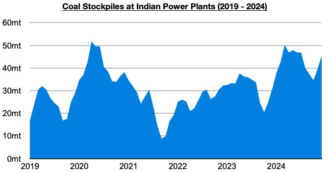
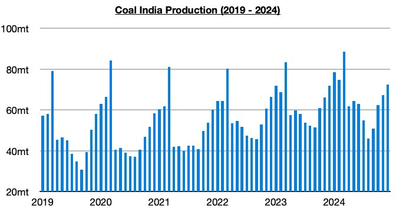
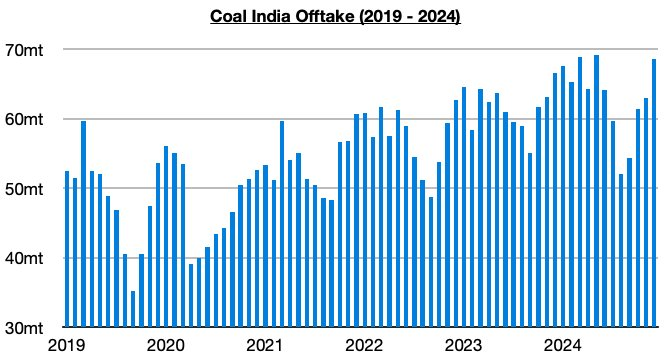

# India's Power Plant Stockpiles and Coal India's Stockpiles Have Each Climbed Further

**Date:** January 14, 2025  
**Publisher:** Breakwave Advisors | **Category:** Market Insights  
**Original URL:** [https://www.breakwaveadvisors.com/insights/2025/1/14/indias-power-plant-stockpiles-and-coal-indias-stockpiles-have-each-climbed-further](https://www.breakwaveadvisors.com/insights/2025/1/14/indias-power-plant-stockpiles-and-coal-indias-stockpiles-have-each-climbed-further)  

---

*By*[*Jeffrey Landsberg*](https://www.linkedin.com/in/jeffrey-landsberg-70ab957/)

As we discussed for Commodore's subscribers earlier this month, Coal stockpiles at India's power plants have recently risen to approximately 45.4 million tons. This is up week-on-week by 1.3 million tons (3%) and up year-on-year by 10.8 million tons (31%). India’s stockpiles have increased for eleven straight weeks after previously declining for thirteen straight weeks. They are at the highest level seen since August.

> **Figure 1: Chart 1**  
> [Local Asset](file:///C:/Users/Dell/Github/Shipping/corpus/03-breakwave/insights/2025/assets/2025-01-14_indias-power-plant-stockpiles-and-coal-indias-stockpiles-have-each-climbed-furth_img_chart1_70b4d4cb4fe5.jpg)

Also of note is that Coal India produced approximately 72.4 million tons of coal last month, which marks a month-on-month increase of 5.2 million tons (8%) and a year-on-year increase of 500,000 tons (1%). Production has now increased on a year-on-year basis for three straight months.

> **Figure 2: Chart 2**  
> [Local Asset](file:///C:/Users/Dell/Github/Shipping/corpus/03-breakwave/insights/2025/assets/2025-01-14_indias-power-plant-stockpiles-and-coal-indias-stockpiles-have-each-climbed-furth_img_chart2_de381f00b51c.jpg)

Offtake (the amount sent to customers) totaled approximately 68.6 million tons. This marks a month-on-month increase of 5.6 million tons (9%) and a year-on-year increase of 2 million tons (3%). Previously, offtake had fallen on a year-on-year basis for four straight months. Overall, it is significant that offtake has again come in less than production. This has now occurred for three straight months, which is causing Coal India's stockpiles to continue to rise. Coal India’s stockpiles now stand at approximately 77 million tons, which marks the highest level seen since July.

> **Figure 3: Chart 3**  
> [Local Asset](file:///C:/Users/Dell/Github/Shipping/corpus/03-breakwave/insights/2025/assets/2025-01-14_indias-power-plant-stockpiles-and-coal-indias-stockpiles-have-each-climbed-furth_img_chart3_0be3dbba1210.jpg)

---

**Tags:** China, Drybulk, Coal  
