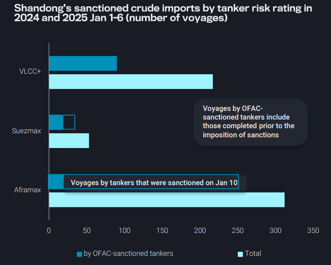
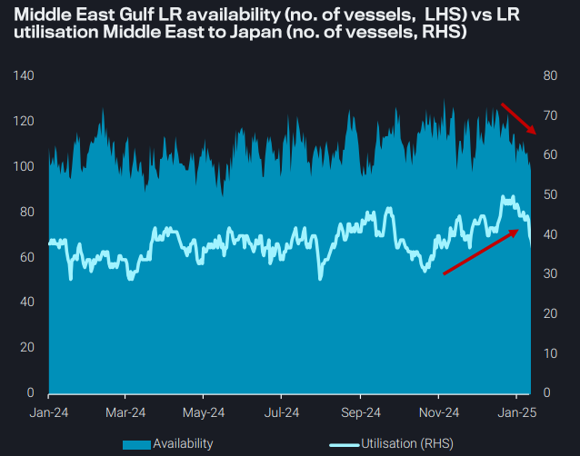
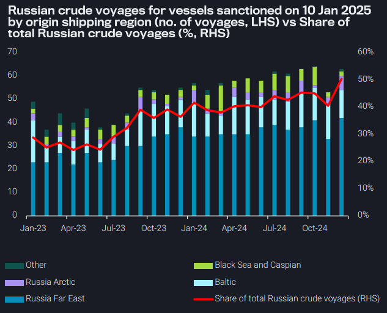
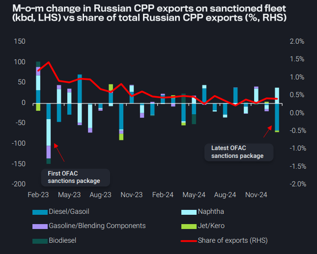

# Impact of OFAC sanctions on Russia trade depends on China's response

**Date:** January 16, 2025  
**Publisher:** Breakwave Advisors | **Category:** Market Insights  
**Original URL:** [https://www.breakwaveadvisors.com/insights/2025/1/16/impact-of-ofac-sanctions-on-russia-trade-depends-on-chinas-response](https://www.breakwaveadvisors.com/insights/2025/1/16/impact-of-ofac-sanctions-on-russia-trade-depends-on-chinas-response)  

---

### Key Takeaways From This Report:

- **Dirty – East of Suez:**Shandong’s ban on OFAC-sanctioned tankers expected to primarily impact Russia-China crude flows
- **Clean – East of Suez:**LR rates surging on the back of increasing naphtha demand and tightening vessel supply
- **Dirty – West of Suez:**Over 50% of the Russian-trading crude fleet now under sanctions, but impact depends on China’s response
- **Clean – West of Suez:**139 clean tankers sanctioned since 2023, but minimally disruptive to Russia CPP trade

*By*[*Mary Melton*](https://www.linkedin.com/in/maryemelton/)

## Dirty – East of Suez: Shandong’s Ban on Ofac-Sanctioned Tankers Expected to Primarily Impact Russia-China Crude Flows

China's Shandong Port Group has privately instructed its ports to ban vessels sanctioned by the US Office of Foreign Assets Control (OFAC) as of Jan 6. This followed a record number of sanctioned crude tankers visiting several major terminals in the preceding weeks

In December, eight OFAC-sanctioned VLCCs discharged 16mb of sanctioned oil at Shandong, through the ports of Qingdao, Dongjiakou, Rizhao and Yantai. This accounted for over 30% of Shandong’s sanctioned oil imports

➔ Three tankers were sanctioned only before calling at Shandong during the month, yet they were still granted priority unloading

While the implementation of this notice remains uncertain, the shipping ban is expected to primarily affect Russian crude imports, following the imposition of the toughest sanctions yet on Russia

➔ In 2024, over 85% of Russian crude voyages into Shandong were conducted by tankers that are recently sanctioned by OFAC

➔ Teapot refiners expect traders to absorb the additional costs of transferring oil to non-sanctioned tankers, as DES-Shandong cargos are already priced within their acceptable upper limit

> **Figure 1: Στιγμιότυπο Οθόνης 2025 01 16 121849**  
> **Interactive Data & Source:** [Vortexa](https://www.vortexa.com//oil-gas-data-traders-analysts-data-scientists?gclid=Cj0KCQjw8_qRBhCXARIsAE2AtRZKOvMnbilZ_6_91d7huSFFy71pWLrnPwGwOHVzXsmsG-1a1mZnQw8aAt89EALw_wcB&hsa_acc=1782073842&hsa_ad=548425387665&hsa_cam=14746637662&hsa_grp=125038601902&hsa_kw=&hsa_mt=&hsa_net=adwords&hsa_src=g&hsa_tgt=dsa-1431852288425&hsa_ver=3&utm_campaign=%5BCD%5D%20-%20DSA%20-%20EMEA&utm_medium=cpc&utm_medium=ppc&utm_source=google&utm_source=adwords&utm_term=) | [Local Asset](file:///C:/Users/Dell/Github/Shipping/corpus/03-breakwave/insights/2025/assets/2025-01-16_impact-of-ofac-sanctions-on-russia-trade-depends-on-chinas-response_img_cea3cf84ceb9ceb3cebcceb9cf8ccf84cf85_e8d46aef282c.png)

## Clean – East of Suez: Lr Rates Surging on the Back of Increasing Naphtha Demand and Tightening Vessel Supply

Since the beginning of the year, TC1 and TC5 (Middle East-to-NE Asia) freight rates have experienced a notable increase

➔ The number of available vessels has declined, tightening supply in the market

➔ Vessel utilisation Middle East-to-NE Asia has surged, further intensifying demand. This imbalance between supply and demand is contributing to the upward pressure on rates

Naphtha imports from Middle East Gulf-to-NE Asia have increased almost 25% m-o-m (Jan days 1-13). Increased import demand has driven the need for more clean tankers

The narrowing price differential between LPG and naphtha (Argus) has made naphtha a more attractive and competitive option for various industrial applications

➔ Asian cracker manufacturers are increasingly selecting naphtha as their primary feedstock due to its economic advantages and optimal suitability for producing essential petrochemicals

➔ This should keep utilisation on TC1 and TC5 supported

> **Figure 2: Στιγμιότυπο Οθόνης 2025 01 16 122538**  
> **Interactive Data & Source:** [Vortexa](https://www.vortexa.com//oil-gas-data-traders-analysts-data-scientists?gclid=Cj0KCQjw8_qRBhCXARIsAE2AtRZKOvMnbilZ_6_91d7huSFFy71pWLrnPwGwOHVzXsmsG-1a1mZnQw8aAt89EALw_wcB&hsa_acc=1782073842&hsa_ad=548425387665&hsa_cam=14746637662&hsa_grp=125038601902&hsa_kw=&hsa_mt=&hsa_net=adwords&hsa_src=g&hsa_tgt=dsa-1431852288425&hsa_ver=3&utm_campaign=%5BCD%5D%20-%20DSA%20-%20EMEA&utm_medium=cpc&utm_medium=ppc&utm_source=google&utm_source=adwords&utm_term=) | [Local Asset](file:///C:/Users/Dell/Github/Shipping/corpus/03-breakwave/insights/2025/assets/2025-01-16_impact-of-ofac-sanctions-on-russia-trade-depends-on-chinas-response_img_cea3cf84ceb9ceb3cebcceb9cf8ccf84cf85_dc423dcb0d39.png)

## Dirty – West of Suez: Over 50% of the Russian-Trading Crude Fleet Now Under Sanctions, But Impact Depends on China’s Response

The sanctions by the US on Friday mark the largest round of individual vessel-designations related to the Russian trade

➔ Individual vessel sanctions by the US have been very effective in limiting further employment in Russian trade

➔ We expect fleet capacity to tighten significantly

Russian crude exports will most likely face serious logistical difficulty due to the lack of available tonnage, which will force the price of Russian crude below the price cap. At that point, Western operators would be able to get involved to lift Russian crude.

Alternatively, we might see Russia sourcing some older vessels to lift cargoes. While we may see some older vessels leave the mainstream trade, there is a limited pool of candidates for this move. New vessels would likely come from non-EU operators due to restrictions on S&P for EU-linked entities.

Most of the tankers sanctioned on Friday predominantly handle Russia Far East shipments to China. While Shandong has banned these sanctioned vessels, it remains to be seen how non-Shandong ports will respond to their presence.

> **Figure 3: Στιγμιότυπο Οθόνης 2025 01 16 122758**  
> **Interactive Data & Source:** [Vortexa](https://www.vortexa.com//oil-gas-data-traders-analysts-data-scientists?gclid=Cj0KCQjw8_qRBhCXARIsAE2AtRZKOvMnbilZ_6_91d7huSFFy71pWLrnPwGwOHVzXsmsG-1a1mZnQw8aAt89EALw_wcB&hsa_acc=1782073842&hsa_ad=548425387665&hsa_cam=14746637662&hsa_grp=125038601902&hsa_kw=&hsa_mt=&hsa_net=adwords&hsa_src=g&hsa_tgt=dsa-1431852288425&hsa_ver=3&utm_campaign=%5BCD%5D%20-%20DSA%20-%20EMEA&utm_medium=cpc&utm_medium=ppc&utm_source=google&utm_source=adwords&utm_term=) | [Local Asset](file:///C:/Users/Dell/Github/Shipping/corpus/03-breakwave/insights/2025/assets/2025-01-16_impact-of-ofac-sanctions-on-russia-trade-depends-on-chinas-response_img_cea3cf84ceb9ceb3cebcceb9cf8ccf84cf85_5a734501bd9f.png)

## Clean – West of Suez: 139 Clean Tankers Sanctioned Since 2023, But Minimally Disruptive to Russia Cpp Trade

Since February 2023, 139 clean tankers involved in the Russian trade have been sanctioned by the EU/UK/US. The latest US sanctions package targeted 31 tankers involved in Russian CPP exports

In the Russian CPP market, EU and UK sanctions have proven more disruptive to trade than OFAC sanctions, which have largely only targeted crude tankers

➔ Sanctions by any entity (EU/UK/US) on clean tankers have been effective at largely halting further employment

Despite a shrinking fleet trading Russian CPP, there has been limited disruption to total exports as Russian CPP prices have largely traded under the price cap

➔ At its peak in March 2023, sanctioned tankers were responsible for trading 374 kbd of Russian CPP exports, comprising a marginal 1.4% of total exports

Ultimately, the size and growth trajectory of the fleet trading Russian CPP are driven more by market dynamics rather than fear of sanctions enforcement, which entices Western operators to participate when high tanker demand for Russian CPP exports is present

> **Figure 4: Στιγμιότυπο Οθόνης 2025 01 16 123024**  
> **Interactive Data & Source:** [Vortexa](https://www.vortexa.com//oil-gas-data-traders-analysts-data-scientists?gclid=Cj0KCQjw8_qRBhCXARIsAE2AtRZKOvMnbilZ_6_91d7huSFFy71pWLrnPwGwOHVzXsmsG-1a1mZnQw8aAt89EALw_wcB&hsa_acc=1782073842&hsa_ad=548425387665&hsa_cam=14746637662&hsa_grp=125038601902&hsa_kw=&hsa_mt=&hsa_net=adwords&hsa_src=g&hsa_tgt=dsa-1431852288425&hsa_ver=3&utm_campaign=%5BCD%5D%20-%20DSA%20-%20EMEA&utm_medium=cpc&utm_medium=ppc&utm_source=google&utm_source=adwords&utm_term=) | [Local Asset](file:///C:/Users/Dell/Github/Shipping/corpus/03-breakwave/insights/2025/assets/2025-01-16_impact-of-ofac-sanctions-on-russia-trade-depends-on-chinas-response_img_cea3cf84ceb9ceb3cebcceb9cf8ccf84cf85_4721d7cd7b76.png)

Data Source:[Vortexa](https://www.vortexa.com//oil-gas-data-traders-analysts-data-scientists?gclid=Cj0KCQjw8_qRBhCXARIsAE2AtRZKOvMnbilZ_6_91d7huSFFy71pWLrnPwGwOHVzXsmsG-1a1mZnQw8aAt89EALw_wcB&hsa_acc=1782073842&hsa_ad=548425387665&hsa_cam=14746637662&hsa_grp=125038601902&hsa_kw=&hsa_mt=&hsa_net=adwords&hsa_src=g&hsa_tgt=dsa-1431852288425&hsa_ver=3&utm_campaign=%5BCD%5D%20-%20DSA%20-%20EMEA&utm_medium=cpc&utm_medium=ppc&utm_source=google&utm_source=adwords&utm_term=)

---

**Tags:** Crude, Markets, Shipping  
