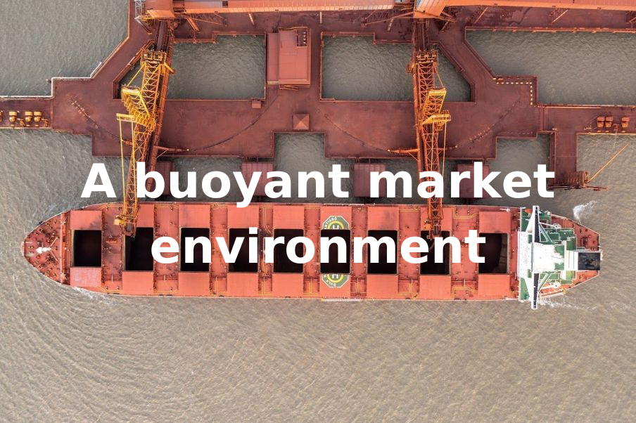
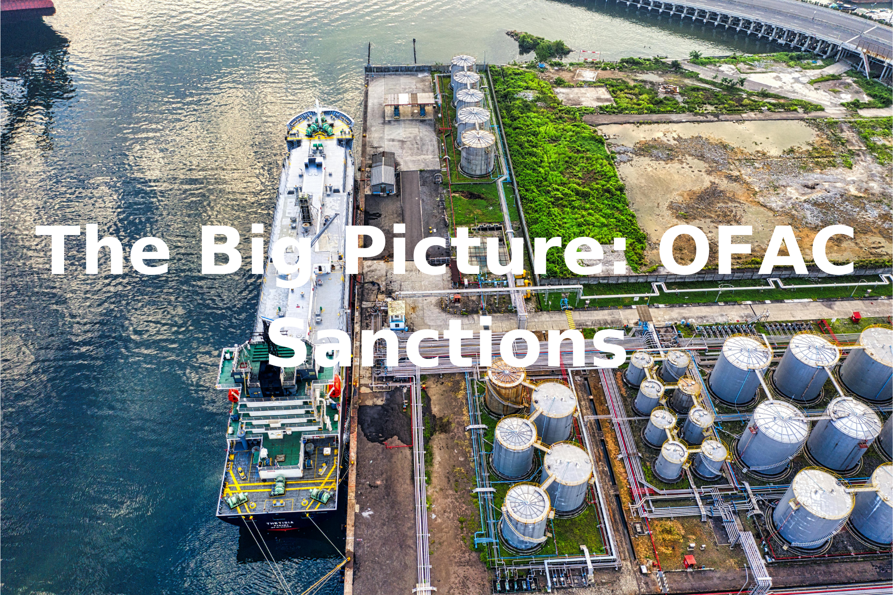
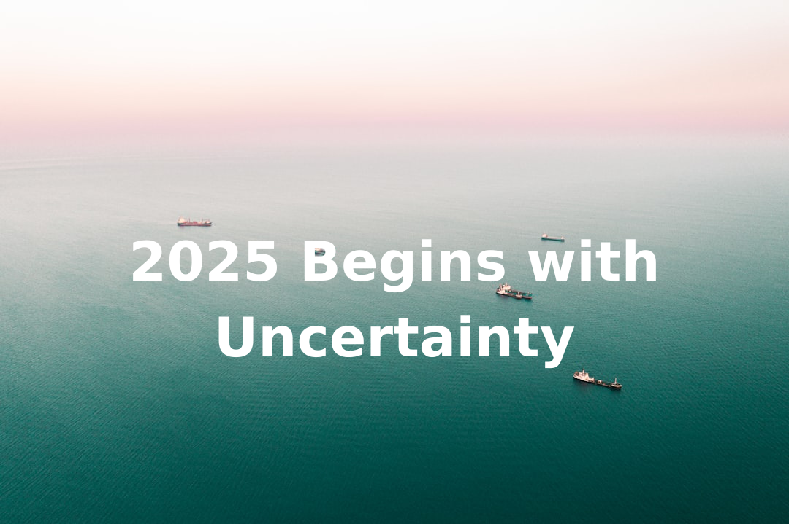
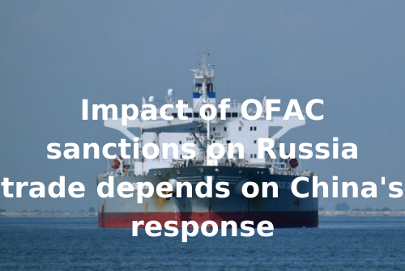
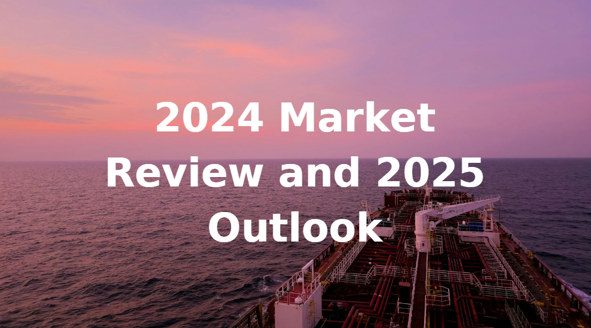
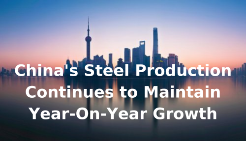
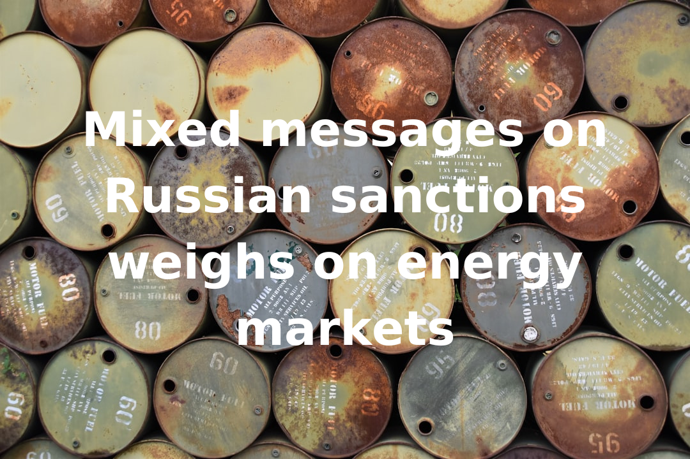

# Breakwave Weekend Read

**Date:** January 17, 2025  
**Publisher:** Breakwave Advisors | **Category:** Market Insights  
**Original URL:** [https://www.breakwaveadvisors.com/insights/2024/10/25/breakwave-weekend-read-4cn8n-wg9gj-jk5sb-4ckhh-cagw9-r4yzg](https://www.breakwaveadvisors.com/insights/2024/10/25/breakwave-weekend-read-4cn8n-wg9gj-jk5sb-4ckhh-cagw9-r4yzg)  

---

## Welcome Tobreakwave Advisorsweekend Read

As we conclude the workweek and head into the weekend, take a moment to review the key articles from this week, including those you've highlighted.[2024 Realities](https://www.breakwaveadvisors.com/insights/2024/12/16/2024-realities),[Choppy Waters Ahead](https://www.breakwaveadvisors.com/insights/2024/12/17/choppy-waters-ahead),[Free Trade Area](https://www.breakwaveadvisors.com/insights/2024/12/18/free-trade-area),[Trump’s Wall of Tariffs](https://www.breakwaveadvisors.com/insights/2024/12/20/trumps-wall-of-tariffs), and more.

## Breakwave Tanker Report

**VLCC Futures Explode Higher Amid New Russian Shipping Sanctions**– The tanker market has seen a significant surge in freight futures over the past few days, driven by a notable announcement from the U.S. imposing sanctions on over 180 Russian-linked vessels.

[Read More](https://www.breakwaveadvisors.com/insights/2025114wet-kji2458)

> **Figure 1: Στιγμιότυπο+οθόνης+2025 01 14+100140**  
> **Interactive Data & Source:** [Breakwave Advisors Market Insights](https://www.breakwaveadvisors.com/insights/2025/1/13/dirty-tonne-days-vlcc) | [Local Asset](file:///C:/Users/Dell/Github/Shipping/corpus/03-breakwave/insights/2025/assets/2025-01-17_breakwave-weekend-read-4cn8n-wg9gj-jk5sb-4ckhh-cagw9-r4yzg_img_cea3cf84ceb9ceb3cebcceb9cf8ccf84cf85_3f6287f78343.png)

## Dirty Tonne Days VLCC

> **Figure 2: Ανώνυμο Σχέδιο (8)**  
> **Interactive Data & Source:** [Breakwave Advisors Market Insights](https://www.breakwaveadvisors.com/insights/2025/1/13/dirty-tonne-days-vlcc) | [Local Asset](file:///C:/Users/Dell/Github/Shipping/corpus/03-breakwave/insights/2025/assets/2025-01-17_breakwave-weekend-read-4cn8n-wg9gj-jk5sb-4ckhh-cagw9-r4yzg_img_ce91cebdcf8ecebdcf85cebccebfcf83cf87_376586b19acc.png)

This week’s focus highlights a downward trend in the AG supply of VLCC tankers..

[Read More](https://www.breakwaveadvisors.com/insights/2025/1/13/dirty-tonne-days-vlcc)

Signal Ocean Tanker Weekly Market Monitor

## A Buoyant Market Environment

> **Figure 3: Ανώνυμο Σχέδιο (10)**  
> **Interactive Data & Source:** [Breakwave Advisors Market Insights](https://www.breakwaveadvisors.com/insights/2025/1/13/a-buoyant-market-environment) | [Local Asset](file:///C:/Users/Dell/Github/Shipping/corpus/03-breakwave/insights/2025/assets/2025-01-17_breakwave-weekend-read-4cn8n-wg9gj-jk5sb-4ckhh-cagw9-r4yzg_img_ce91cebdcf8ecebdcf85cebccebfcf83cf87_87b078d58bec.png)

As is typical in the volatile dry bulk market, sharp reversals and unexpected developments are to be expected,

[Read More](https://www.breakwaveadvisors.com/insights/2025/1/13/a-buoyant-market-environment)

Doric Weekly Market Insights

## The Big Picture: Ofac Sanctions

> **Figure 4: Ανώνυμο Σχέδιο (11)**  
> **Interactive Data & Source:** [Breakwave Advisors Market Insights](https://www.breakwaveadvisors.com/insights/2025/1/13/the-big-picture-ofac-sanctions) | [Local Asset](file:///C:/Users/Dell/Github/Shipping/corpus/03-breakwave/insights/2025/assets/2025-01-17_breakwave-weekend-read-4cn8n-wg9gj-jk5sb-4ckhh-cagw9-r4yzg_img_ce91cebdcf8ecebdcf85cebccebfcf83cf87_d8805e8430de.png)

Will China and India receive sanctioned tankers?

[Read More](https://www.breakwaveadvisors.com/insights/2025/1/13/the-big-picture-ofac-sanctions)

Braemar Tanker Big Picture

## India's Power Plant Stockpiles and Coal India's Stockpiles Have Each Climbed Further

> **Figure 5: Ανώνυμο Σχέδιο**  
> **Interactive Data & Source:** [Breakwave Advisors Market Insights](https://www.breakwaveadvisors.com/insights/2025/1/14/indias-power-plant-stockpiles-and-coal-indias-stockpiles-have-each-climbed-further) | [Local Asset](file:///C:/Users/Dell/Github/Shipping/corpus/03-breakwave/insights/2025/assets/2025-01-17_breakwave-weekend-read-4cn8n-wg9gj-jk5sb-4ckhh-cagw9-r4yzg_img_ce91cebdcf8ecebdcf85cebccebfcf83cf87_03c6d06c6a12.png)

Coal stockpiles at India's power plants have recently risen to approximately 45.4 million tons.

[Read More](https://www.breakwaveadvisors.com/insights/2025/1/14/indias-power-plant-stockpiles-and-coal-indias-stockpiles-have-each-climbed-further)

From Commodore's Weekly Dry Bulk Reports

## Why Are We Starting the Year with a Bond Rout?

> **Figure 6: Προσθέστε Επικεφαλίδα**  
> **Interactive Data & Source:** [Breakwave Advisors Market Insights](https://www.breakwaveadvisors.com/insights/2025/1/14/why-are-we-starting-the-year-with-a-bond-rout) | [Local Asset](file:///C:/Users/Dell/Github/Shipping/corpus/03-breakwave/insights/2025/assets/2025-01-17_breakwave-weekend-read-4cn8n-wg9gj-jk5sb-4ckhh-cagw9-r4yzg_img_cea0cf81cebfcf83ceb8ceadcf83cf84ceb5_b596888a148a.png)

The three things investors should know this week..

[Read More](https://www.breakwaveadvisors.com/insights/2025/1/14/why-are-we-starting-the-year-with-a-bond-rout)

Forvis Mazars Weekly Note

## 2025 Begins with Uncertainty

> **Figure 7: Ανώνυμο Σχέδιο (1)**  
> **Interactive Data & Source:** [Breakwave Advisors Market Insights](https://www.breakwaveadvisors.com/insights/2025/1/14/2025-begins-with-uncertainty) | [Local Asset](file:///C:/Users/Dell/Github/Shipping/corpus/03-breakwave/insights/2025/assets/2025-01-17_breakwave-weekend-read-4cn8n-wg9gj-jk5sb-4ckhh-cagw9-r4yzg_img_ce91cebdcf8ecebdcf85cebccebfcf83cf87_9a595d47c9ee.png)

The year 2025 commenced with uncertainty surrounding both the dry bulk and tanker sectors.

Intermodal Weekly Market Report

## Impact of Ofac Sanctions on Russia Trade Depends on China's Response

> **Figure 8: Ανώνυμο Σχέδιο (2)**  
> **Interactive Data & Source:** [Breakwave Advisors Market Insights](https://www.breakwaveadvisors.com/insights/2025/1/16/impact-of-ofac-sanctions-on-russia-trade-depends-on-chinas-response) | [Local Asset](file:///C:/Users/Dell/Github/Shipping/corpus/03-breakwave/insights/2025/assets/2025-01-17_breakwave-weekend-read-4cn8n-wg9gj-jk5sb-4ckhh-cagw9-r4yzg_img_ce91cebdcf8ecebdcf85cebccebfcf83cf87_fd1c9813eb02.png)

China's Shandong Port Group has privately instructed its ports to ban vessels sanctioned by the US Office of Foreign Assets Control..

Vortexa Global Freight Snapshot

## 2024 Market Review and 2025 Outlook

> **Figure 9: Στιγμιότυπο Οθόνης 2025 01 16 165441**  
> **Interactive Data & Source:** [Breakwave Advisors Market Insights](https://www.breakwaveadvisors.com/insights/2025/1/16/2024-market-review-and-2025-outlook) | [Local Asset](file:///C:/Users/Dell/Github/Shipping/corpus/03-breakwave/insights/2025/assets/2025-01-17_breakwave-weekend-read-4cn8n-wg9gj-jk5sb-4ckhh-cagw9-r4yzg_img_cea3cf84ceb9ceb3cebcceb9cf8ccf84cf85_b33488b11a54.png)

At the start of 2024, the global shipping industry saw encouraging signs and was optimistic about the year ahead.

Tankers International Market Review

## The Cape Trifecta: Part Ii (Chinese Coal Appetite)

> **Figure 10: Ανώνυμο Σχέδιο (3)**  
> **Interactive Data & Source:** [Breakwave Advisors Market Insights](https://www.breakwaveadvisors.com/insights/2025/1/16/the-cape-trifecta-part-ii-chinese-coal-appetite) | [Local Asset](file:///C:/Users/Dell/Github/Shipping/corpus/03-breakwave/insights/2025/assets/2025-01-17_breakwave-weekend-read-4cn8n-wg9gj-jk5sb-4ckhh-cagw9-r4yzg_img_ce91cebdcf8ecebdcf85cebccebfcf83cf87_aea877277a82.png)

Last year, China’s coal imports (both seaborne and inland) surged, continuing 2023’s momentum.

BRS Weekly Dry Bulk Newsletter

## China's Steel Production Continues to Maintain Year-on-Year Growth

> **Figure 11: China's Steel Production Continues to Maintain Year on Year Growth**  
> **Interactive Data & Source:** [Breakwave Advisors Market Insights](https://www.breakwaveadvisors.com/insights/2025/1/17/chinas-steel-production-continues-to-maintain-year-on-year-growth) | [Local Asset](file:///C:/Users/Dell/Github/Shipping/corpus/03-breakwave/insights/2025/assets/2025-01-17_breakwave-weekend-read-4cn8n-wg9gj-jk5sb-4ckhh-cagw9-r4yzg_img_china27ssteelproductioncontinuestoma_dcc33b1af463.png)

Stockpiles of flat and construction steel products at warehouses in major cities in China ended last week at approximately 8.7 million tons.

From Commodore's Weekly Dry Bulk Reports

## Mixed Messages on Russian Sanctions Weighs on Energy Markets

> **Figure 12: Προσθέστε Επικεφαλίδα (1)**  
> **Interactive Data & Source:** [Breakwave Advisors Market Insights](https://www.breakwaveadvisors.com/insights/2025/1/17/mixed-messages-on-russian-sanctions-weighs-on-energy-markets) | [Local Asset](file:///C:/Users/Dell/Github/Shipping/corpus/03-breakwave/insights/2025/assets/2025-01-17_breakwave-weekend-read-4cn8n-wg9gj-jk5sb-4ckhh-cagw9-r4yzg_img_cea0cf81cebfcf83ceb8ceadcf83cf84ceb5_0491127bca6f.png)

Energy markets fluctuated due to geopolitical tensions, while metals found support on signs of stronger demand.

Commodities Wrap

---

**Tags:** Shipping, Tankers, Drybulk  
