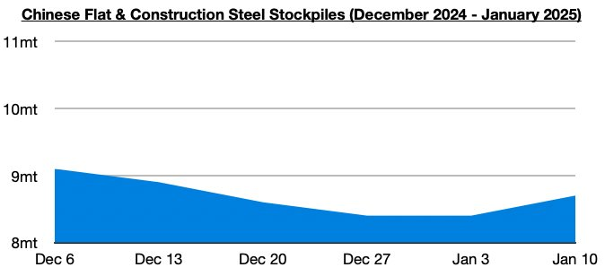
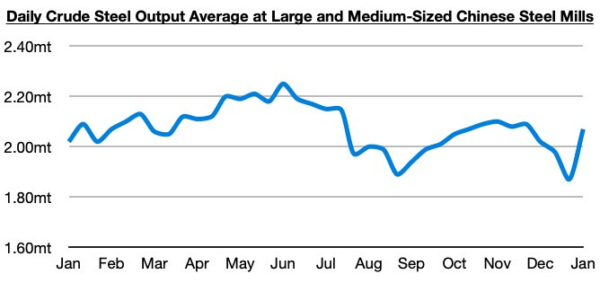

# China's Steel Production Continues to Maintain Year-On-Year Growth

**Date:** January 17, 2025  
**Publisher:** Breakwave Advisors | **Category:** Market Insights  
**Original URL:** [https://www.breakwaveadvisors.com/insights/2025/1/17/chinas-steel-production-continues-to-maintain-year-on-year-growth](https://www.breakwaveadvisors.com/insights/2025/1/17/chinas-steel-production-continues-to-maintain-year-on-year-growth)  

---

*By*[*Jeffrey Landsberg*](https://www.linkedin.com/in/jeffrey-landsberg-70ab957/)

Stockpiles of flat and construction steel products at warehouses in major cities in China ended last week at approximately 8.7 million tons. This is 300,000 tons (4%) more than a week ago but down year-on-year by 1.4 million tons (-14%). Despite the rise, stockpiles are still very close to their lowest level seen since this decade.

> **Figure 1: Chart 1**  
> [Local Asset](file:///C:/Users/Dell/Github/Shipping/corpus/03-breakwave/insights/2025/assets/2025-01-17_chinas-steel-production-continues-to-maintain-year-on-year-growth_img_chart1_3d4a3c2f042d.jpg)

Also of note is that the most recently released data shows that daily crude steel production at large and medium-sized mills in China averaged 2.07 million tons during January 1 - January 10. This is up by 11% from late-December and is up year-on-year by 2%. It is normal for production to drop at the end of every year and increase in early January.

> **Figure 2: Chart 2**  
> [Local Asset](file:///C:/Users/Dell/Github/Shipping/corpus/03-breakwave/insights/2025/assets/2025-01-17_chinas-steel-production-continues-to-maintain-year-on-year-growth_img_chart2_de30e9915c82.jpg)

Overall, it remains encouraging to us that China's steel production has stayed up on a year-on-year basis. As we have been stressing in Commodore Research's Weekly Executive Reports and Weekly China Reports, year-on-year growth in China's steel production returned last year in the middle of October. Prior to the middle of October, China's steel production last year had remained stuck in a year-on-year contraction throughout almost all of late February through early October.

---

**Tags:** China, Drybulk, Ironore  
