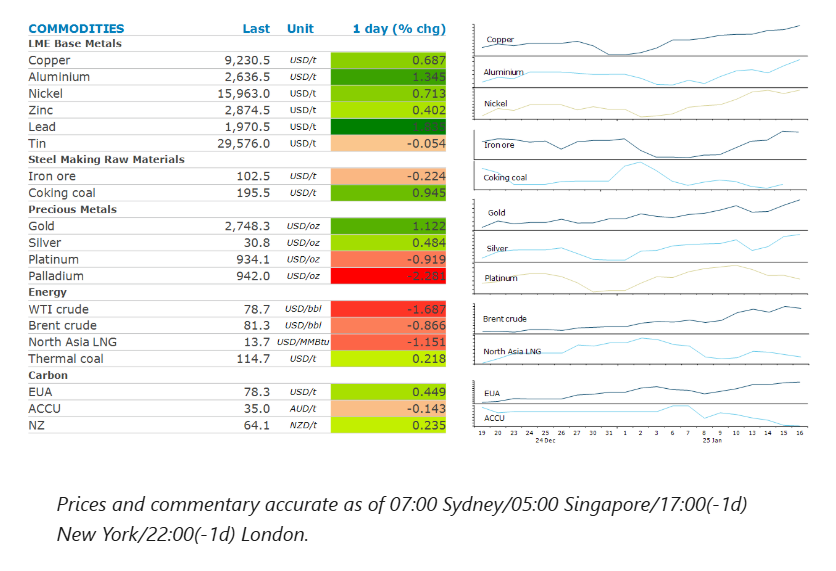
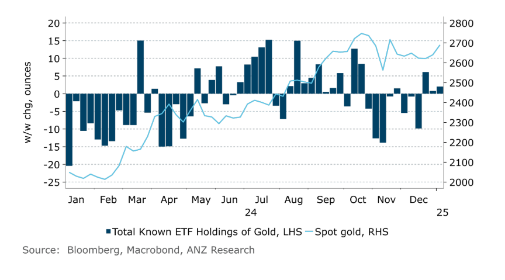

# Mixed messages on Russian sanctions weighs on energy markets

**Date:** January 17, 2025  
**Publisher:** Breakwave Advisors | **Category:** Market Insights  
**Original URL:** [https://www.breakwaveadvisors.com/insights/2025/1/17/mixed-messages-on-russian-sanctions-weighs-on-energy-markets](https://www.breakwaveadvisors.com/insights/2025/1/17/mixed-messages-on-russian-sanctions-weighs-on-energy-markets)  

---

Energy markets fluctuated due to geopolitical tensions, while metals found support on signs of stronger demand.

*By*[*Daniel Hynes*](https://www.linkedin.com/in/dahynes/)

> **Figure 1: Στιγμιότυπο Οθόνης 2025 01 17 084357**  
> **Interactive Data & Source:** [Linkedin](https://www.linkedin.com/newsletters/commodities-wrap-6692196755876012032/?fbclid=IwAR3kiXJqZdxmp9ZcRwBNI7FsBySI-XSC0pfPur1qzjt7OZp7PTE59Tsl1QI) | [Local Asset](file:///C:/Users/Dell/Github/Shipping/corpus/03-breakwave/insights/2025/assets/2025-01-17_mixed-messages-on-russian-sanctions-weighs-on-energy-markets_img_cea3cf84ceb9ceb3cebcceb9cf8ccf84cf85_fcdeac623d0b.png)

### Market Commentary

**Crude oil**retreated amid reports that Trump’s advisors were crafting a strategy that could see sanctions on Russia’s oil industry lifted. The Biden administration announced new sanctions last week which could impact exports of nearly 1mb/d of oil from Russia. However, Trump has promised he will work to end the Russia-Ukraine war quickly. If a resolution is in sight, some good faith measures such as sanction relief could be part of the policy recommendations. This took the heat out of the physical market, which had been beset with enquires from desperate buyers looking to fill any potential supply gaps. However, prices recovered late in the session after Trump’s nominee for Treasury Secretary, Scott Bessent, said that he would support sanctioning Russian oil majors. Aside from the geopolitical drivers, crude oil prices have also been supported this week by positive fundamentals. US inventories fell for the eighth straight week to their lowest since April 2022.

**Global gas**prices were also under pressure amid the easing geopolitical supply risks. Aside from risks around sanctions on its oil & gas supply, Russia claimed it damaged ground infrastructure of one of the largest natural gas storage sites in Ukraine. The market was also watching for developments in the Gaza ceasefire. Israel’s Prime Minister accused Hamas of reneging on part of the agreement that had looked set to pause fighting in Gaza.**European gas**benchmark prices were further weighed down by reports of milder weather in Europe, with some models pointing to higher temperatures across northwest Europe at the end of January.**North Asia LNG**prices were also lower amid concerns of weaker demand. South Korea’s energy ministry said its electricity supply and demand have remained stable this winter due to relatively warm temperatures and full operation of nuclear power plants.

**Aluminium**led the base metal sector higher amid signs of improving demand. China’s holding of the lightweight metal fell to 440kt, the lowest in almost a year, according to Shanghai Metals Market data. This comes after reports earlier this week that the metal could be included in the new measures to punish Russia for its invasion of Ukraine. The potential restrictions could be gradual, and the scope is yet to be determined, according to a Bloomberg report.**Copper**also found some support after the State Grid Corp of China pledged record spending this year. The country’s largest network operator is likely to spend around CNY650bn to help connect new wind and solar farms to the nations grid. Requests for copper stored in warehouses tracked by the LME rose by the most since April, adding to signs of stronger demand.

**Gold**climbed to a five-month high as lower inflation in the US raised the prospect of further Fed rate cuts. The precious metal pushed above USD2,700/oz as investors increased bets on rate cuts by July. Support has also been found in the gold-backed ETF market, with holdings increasing seven out of the last nine sessions. Total gold held by ETFs is now up 0.5% this year to 83.2moz.

### Chart of the Day

Gold has started the year on a positive note, with gains supported by strong inflows into gold-backed ETFs. This has helped offset headwinds from a stronger USD and higher Treasury yields.

> **Figure 2: Στιγμιότυπο Οθόνης 2025 01 17 084457**  
> **Interactive Data & Source:** [Linkedin](https://www.linkedin.com/newsletters/commodities-wrap-6692196755876012032/?fbclid=IwAR3kiXJqZdxmp9ZcRwBNI7FsBySI-XSC0pfPur1qzjt7OZp7PTE59Tsl1QI) | [Local Asset](file:///C:/Users/Dell/Github/Shipping/corpus/03-breakwave/insights/2025/assets/2025-01-17_mixed-messages-on-russian-sanctions-weighs-on-energy-markets_img_cea3cf84ceb9ceb3cebcceb9cf8ccf84cf85_dcc953638faf.png)

Data source:[Commodities Wrap](https://www.linkedin.com/newsletters/commodities-wrap-6692196755876012032/?fbclid=IwAR3kiXJqZdxmp9ZcRwBNI7FsBySI-XSC0pfPur1qzjt7OZp7PTE59Tsl1QI)

---

**Tags:** Shipping, Markets, Commodities  
