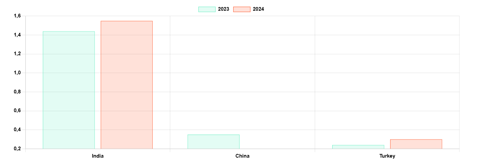

# A Lot Can Happen in a Week

**Date:** January 20, 2025  
**Publisher:** Breakwave Advisors | **Category:** Market Insights  
**Original URL:** [https://www.breakwaveadvisors.com/insights/2025/1/20/a-lot-can-happen-in-a-week](https://www.breakwaveadvisors.com/insights/2025/1/20/a-lot-can-happen-in-a-week)  

---

> **Figure 1: 13 Tanker Istock 172474083**  
> **Interactive Data & Source:** [Gibsons Co](https://www.gibsons.co.uk/market-reports) | [Local Asset](file:///C:/Users/Dell/Github/Shipping/corpus/03-breakwave/insights/2025/assets/2025-01-20_a-lot-can-happen-in-a-week_img_13-tanker-istock-172474083_89aeefa1b484.jpg)

On Friday 10th January, the United States sanctioned Gazprom Neft and Surgutneftegaz, two key Russian insurers and 183 ships, including 156 tankers, sending shock waves through the oil and tanker markets. Crude prices have rallied on concerns of potential oil supply disruptions, greater volatility has also been witnessed in a number of crude and product arbs. Spot crude and product freight across all markets firmed, with exception of most Aframax trades.

Unquestionably, the latest OFAC sanctions target a significant share of Russian export capacity. For Suezmaxes and Aframaxes/LR2s, we are talking about 1.4 mbd of export capacity, assuming an Ust Luga/West Coast India run. To put this into perspective, Russia’s seaborne crude exports averaged 3.35mbd last year and product exports reached 2.44mbd. The bigger picture is that now around half of the existing VLCC, Suezmax and Aframax/LR2 dark fleet (that trades only Russian and/or sanctioned Iranian/Venezuelan) is now sanctioned by either the US, EU or UK authorities. Percentages are smaller for LR1/Panamaxes and Handy/MRs – here in total just under 30% of the dark fleet is sanctioned.

The implications of the latest sanctions could be far reaching, if Russia’s exports fall, with crude demand shifting to non-sanctioned producers, supporting incremental demand for the mainstream non-sanctioned fleet. There is already evidence that some traditional buyers of Russian crude are buying additional cargoes elsewhere. Undoubtedly, VLCCs and Suezmax demand will benefit if Russian crude is replaced from the Atlantic Basin. For Middle East producers, whilst shipments into India are extremely short haul, this needs to be considered against sanctioned tonnage potentially becoming untradeable. The clean tanker fleet is somewhat less impacted by the latest sanctions; yet, the US, the Middle East/India and the European exporters stand to benefit if Russia’s ability to export products to Africa and Latin America is hit. A stronger crude tanker market will also disincentivise Suezmaxes and VLCCs from cleaning up to engage in clean trade on East/West moves.

Yet, much remains uncertain at this stage. Whilst short-term disruptions appear inevitable, can the latest sanctions be circumvented over time? What will major traders of Russian barrels do in the long run? Will Russia be willing to increase the usage of international tonnage under price cap rules? The FFA market rallied on this uncertainty, with the Baltic exchange reporting a significant jump in tanker trading volumes. Forward curves firmed, particularly through to Q2, with the biggest moves seen on VLCCs, Suezmaxes, LRs and some MR trades. Although since Monday, some forward prices have eased, suggesting some expectation that Russia supply chains will adapt to the new sanctions.

Sanctions aside, news about the Israel/Hamas ceasefire, which potentially could see the end of the regional war, have also taken the market by surprise. Whilst the Houthis have long said that the attacks will stop if the conflict ends, how soon the traffic through the Red Sea resumes remains unclear. The Houthis have already vowed to continue its current practices if the ceasefire is breached or if there are further attacks from the Israeli side.

One would hope that next week will bring more clarity in terms sanctions, the ceasefire and the Houthi position. Yet, with Trump returning to White House on Monday, we should expect more surprises!

### Russia’s Key Crude Export Flows in the West (Kbd)

> **Figure 2: Στιγμιότυπο Οθόνης 2025 01 20 145720**  
> **Interactive Data & Source:** [Gibsons Co](https://www.gibsons.co.uk/market-reports) | [Local Asset](file:///C:/Users/Dell/Github/Shipping/corpus/03-breakwave/insights/2025/assets/2025-01-20_a-lot-can-happen-in-a-week_img_cea3cf84ceb9ceb3cebcceb9cf8ccf84cf85_b634fb99a088.png)

Data source:[Gibson Shipbrokers](https://www.gibsons.co.uk/market-reports)

---

**Tags:** Tankers, Shipping, Crude  
