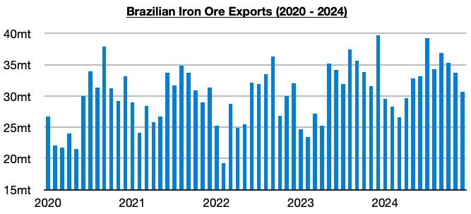

# Brazilian Iron Ore Exports Grew Again Last Year

**Date:** January 20, 2025  
**Publisher:** Breakwave Advisors | **Category:** Market Insights  
**Original URL:** [https://www.breakwaveadvisors.com/insights/2025/1/20/brazilian-iron-ore-exports-grew-again-last-year](https://www.breakwaveadvisors.com/insights/2025/1/20/brazilian-iron-ore-exports-grew-again-last-year)  

---

*By*[*Jeffrey Landsberg*](https://www.linkedin.com/in/jeffrey-landsberg-70ab957/)

As we discussed for clients in an earlier Weekly Executive Report, Brazilian iron ore exports most recently totaled 30.7 million tons in December. This marked a month-on-month drop of 3 million tons (-9%), was down year-on-year by 9 million tons (-23%), and marked the lowest monthly volume seen since April. This weakness contributed significantly to the large decline in capesize rates that began in the middle of November last year.

> **Figure 1: Chart 1 (1)**  
> [Local Asset](file:///C:/Users/Dell/Github/Shipping/corpus/03-breakwave/insights/2025/assets/2025-01-20_brazilian-iron-ore-exports-grew-again-last-year_img_chart128129_3a3bf947175f.jpg)

2024 as a whole, though, saw Brazilian iron ore exports total 390.3 million tons. This marked a year-on-year increase of 10.3 million tons (3%).

Overall, 2024 ended up marking a very important continuation from the shift that was seen in 2023. As we stressed in our Weekly Executive Reports last year, capesize rates were able to find significant strength in early stretches in 2024 due in part from Brazil’s iron ore exports continuing to enjoy a shift to a return back to growth. While 2022 saw Brazilian iron ore exports fall year-on-year by 12.9 million tons (-4%), 2023 saw a shift back to growth — with exports jumping by 33.7 million tons (10%). 2024 saw growth continue, with exports last year rising year-on-year by another 10.3 million tons (3%). Going forward, we continue to expect that this year will again see growth, but we also continue to expect that the growth rate will decline further. There is, of course, a chance that exports could contract. What is all but guaranteed to occur, however, is that the capesize fleet — and the entire dry bulk fleet — will continue to grow this year.

---

**Tags:** Shipping, Drybulk, Ironore  
