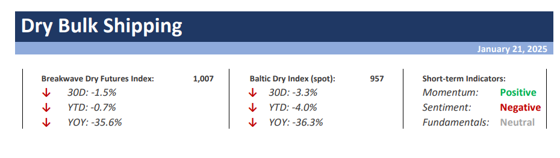
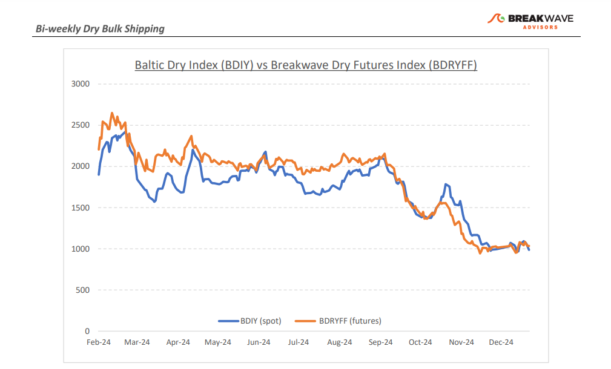
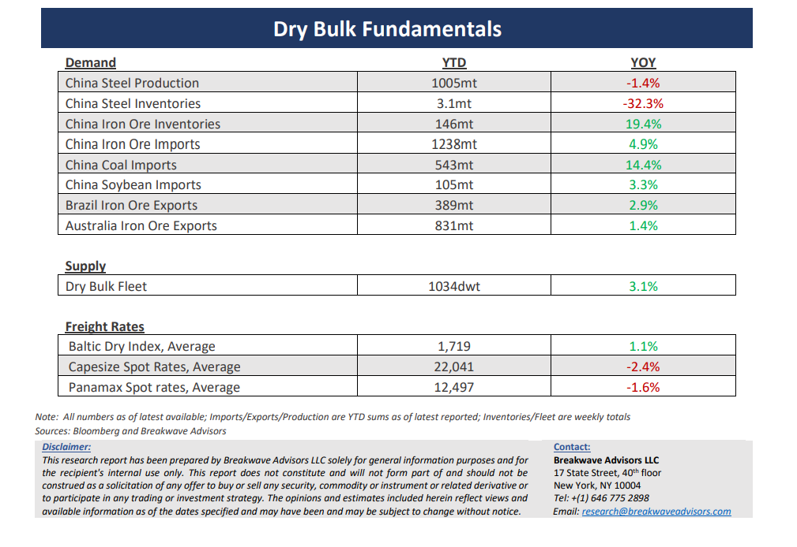

# Breakwave Bi-Weekly Dry Bulk Report - January 21, 2025

**Date:** January 21, 2025  
**Publisher:** Breakwave Advisors | **Category:** Market Insights  
**Original URL:** [https://www.breakwaveadvisors.com/insights/2025121dry-87w52k8](https://www.breakwaveadvisors.com/insights/2025121dry-87w52k8)  

---

> **Figure 1: Cea3cf84ceb9ceb3cebcceb9cf8ccf84cf85**  
> [Local Asset](file:///C:/Users/Dell/Github/Shipping/corpus/03-breakwave/insights/2025/assets/2025-01-21_2025121dry-87w52k8_img_cea3cf84ceb9ceb3cebcceb9cf8ccf84cf85_c678135f7a76.png)

•**Weather Takes Center Stage as Seasonality Bites**– As the Capesize market realigns with historical seasonal trends, spot rates are beginning to reflect the limited cargo volumes typically observed at the start of the calendar year. Australia has already felt the effects of the cyclone season, with the busy West Australian ports shutting down for several days last week. Similarly, heavy rainfall in Brazil has disrupted iron ore exports from the region. In contrast, West African activity has been robust, highlighting the growing demand center's capacity to partially offset some of the weakness in the Atlantic. While this has not been sufficient to significantly strengthen rates, the increasingly vital bauxite market offers a degree of resilience against winter-season downturns. However, without the contributions of major players like Australia and Brazil, the dry bulk market is likely to continue operating at relatively subdued levels until the stronger spring season emerges. The Capesize segment remains well-positioned to benefit from increased cargo flows later in the year, as vessel supply growth is limited—a factor that should help support market balance. Conversely, the subCapesize segments face greater challenges, requiring a notable uptick in demand to counterbalance a relatively abundant orderbook. Overall, we are in what is historically the weakest period of the year. Spot rates are expected to remain rangebound until improved weather conditions facilitate stronger export volumes. This, in turn, should gradually lift spot rates, setting the stage for a more favorable and profitable freight market in the months ahead.

•**Aggressive Tarriff Enactment on Hold as the New Trump Administration Begins**– As previously discussed, we believe the market should assign a higher probability to increased cooperation between the United States and China, which could lead to improved trade policies and reduced tariff risks as the new Trump administration takes office. Early indications suggest that, and for now, the U.S. is adopting a more cautious and less aggressive approach to trade. While this stance may evolve, there is currently limited evidence to suggest imminent disruptions to the existing trade flow landscape. For the dry bulk sector, any potential tariff implementations are unlikely to have a significant impact due to the sector's minimal exposure to China-U.S. trade routes. Nonetheless, the prospect of a more balanced trade relationship is encouraging and may contribute to a broader normalization of global trade dynamics. Improved trade relations could also support a swifter recovery in China’s economy, which remains critical for revitalizing the country’s real estate sector—a key driver of steel demand. While we anticipate relatively flat steel demand and iron ore imports into China this year, the commodity flow pattern might be uneven, creating periods of stronger demand for transportation. These shifts may, in turn, create opportunities for a robust recovery in freight as the year progresses.

•**Our Long-term View**– The last few years have been characterized by increased geopolitical uncertainty. Going forward, we expect such events to continue to affect global trade and have a meaningful impact on effective vessel supply. Combined with the potential for a multi-year cyclical rebound in China’s economic activity following the recent economic turmoil, dry bulk shipping should experience higher volatility on top of a secular tightness driven by stable bulk commodity demand and a slower fleet growth owing to a relatively low orderbook.

> **Figure 2: Cea3cf84ceb9ceb3cebcceb9cf8ccf84cf85**  
> [Local Asset](file:///C:/Users/Dell/Github/Shipping/corpus/03-breakwave/insights/2025/assets/2025-01-21_2025121dry-87w52k8_img_cea3cf84ceb9ceb3cebcceb9cf8ccf84cf85_799019f9da6f.png)

> **Figure 3: Cea3cf84ceb9ceb3cebcceb9cf8ccf84cf85**  
> [Local Asset](file:///C:/Users/Dell/Github/Shipping/corpus/03-breakwave/insights/2025/assets/2025-01-21_2025121dry-87w52k8_img_cea3cf84ceb9ceb3cebcceb9cf8ccf84cf85_b4657c26fe21.png)

### Subscribe:
