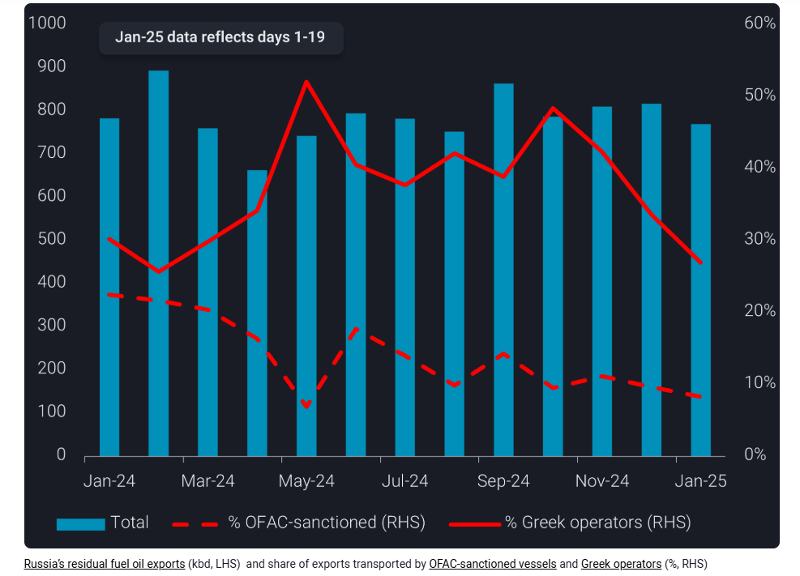
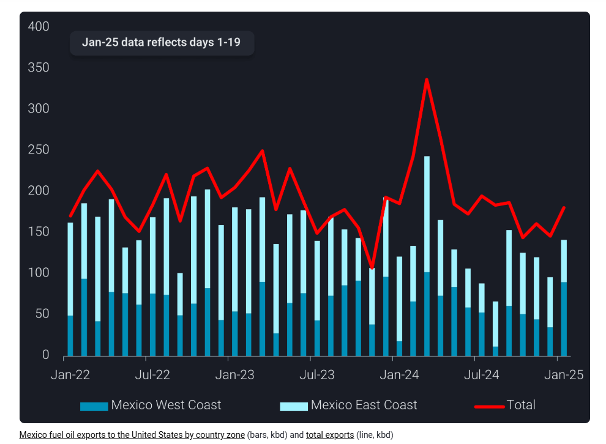

# Russia’s residual fuel oil exports resilient despite sanctions but Mexican exports could reshuffle under Trump

**Date:** January 22, 2025  
**Publisher:** Breakwave Advisors | **Category:** Market Insights  
**Original URL:** [https://www.breakwaveadvisors.com/insights/2025/1/22/russias-residual-fuel-oil-exports-resilient-despite-sanctions-but-mexican-exports-could-reshuffle-under-trump](https://www.breakwaveadvisors.com/insights/2025/1/22/russias-residual-fuel-oil-exports-resilient-despite-sanctions-but-mexican-exports-could-reshuffle-under-trump)  

---

Russia’s residual fuel oil exports could be increasingly serviced by Greek tanker operators if freight rates are attractive, while Mexico’s exports to the US could be redirected to other destinations under potential Trump-led trade tariffs

*By*[*Xavier Tang*](https://www.linkedin.com/in/xavier-tang/)

Russian residual fuel oil volumes lifted by the newly sanctioned fleet accounted for 15% of all Russian residual fuel oil exports in 2024. It is unlikely that Russia will continue to lift residual fuel oil on sanctioned vessels, as shown in the past 10 days whereby[Russian product exports on these sanctioned tankers stopped completely from January 11-20](https://analytics.vortexa.com/Flows?dateRange=2025-01-01T00%3A00%3A00.000Z__2025-01-20T23%3A59%3A59.999Z&filtersEnabled=%5B%22p%22%2C%22o%22%2C%22d%22%2C%22d_r%22%2C%22v%22%2C%22intra_d%22%2C%22sts_o%22%2C%22c_o%22%2C%22w%22%2C%22v_o%22%2C%22c%22%5D&frequency=day&from=%5B%22b996521be9c996db3560ca234a56286ac38f798d34be229437555fab4f12a6a5%22%5D&metric=bpd&page=Flows&products=%5B%225de0b00094e0fd7542c10f9f8a71b4008d55750f21dc905cda9b0f7f5f76bc08%22%2C%22b68cbb746f8b9098c50e2ba36bcad83001a53bd362e9031fb49085d02c36659c%22%5D&tabId=5972108e-1fc0-4755-aff3-dce64a683cc1&timeSeriesHiddenSeries=%5B%22seasonal_comparison_24%22%2C%22seasonal_comparison_12%22%5D&timeSeriesProperty=product_group_product&v=3&vessels=%5B%22pv-0b573d03-f7a2-4e16-b266-2a957491a7e2%22%5D). Despite the recent sanctions on Russia’s dirty fleet,[Russian residual fuel oil exports](https://analytics.vortexa.com/Flows?dateRange=2024-01-01T00%3A00%3A00.000Z__2025-01-19T23%3A59%3A59.999Z&from=%5B%22b996521be9c996db3560ca234a56286ac38f798d34be229437555fab4f12a6a5%22%5D&metric=bpd&page=Flows&products=%5B%221c107b4317bc2c85fb6c13cd7b28e8e0a02ec7fecc68afc2b68ca0545c835e1c%22%2C%229d4d72cfc5620b4067c22b93e959733d3af66b059767f911efead258e0f7b376%22%5D&tabId=78782031-494f-4b97-aaa0-8b3b2a68f2b2&timeSeriesHiddenSeries=%5B%22seasonal_comparison_12%22%2C%22seasonal_comparison_24%22%5D&timeSeriesProperty=product_group_product&v=3)remain resilient, with a 7% m-o-m decline in the first 19 days of January.

The latest round of US Office of Foreign Assets (OFAC) sanctions imposed on 155 tankers active in the Russia crude trade, effective January 10, targeted mainly the larger vessel classes, with 68% of the newly sanctioned vessels belonging to Aframax-size tankers and above. Meanwhile, smaller vessel classes face a relatively muted impact. The sanctions could tighten the potential fleet available to carry Russia’s crude (excluding CPC blend and KEBCO) and product exports, as Russian-origin oil accounted for[94% of the cargo carried during 2024 by this recently sanctioned fleet](https://analytics.vortexa.com/Flows?dateRange=2024-01-01T00%3A00%3A00.000Z__2025-01-20T23%3A59%3A59.999Z&filtersEnabled=%5B%22p%22%2C%22o%22%2C%22d%22%2C%22d_r%22%2C%22v%22%2C%22intra_d%22%2C%22sts_o%22%2C%22c_o%22%2C%22w%22%2C%22v_o%22%5D&frequency=year&geoBreakdownOriginGlobal=region&metric=bpd&page=Flows&products=%5B%22b68cbb746f8b9098c50e2ba36bcad83001a53bd362e9031fb49085d02c36659c%22%2C%2254af755a090118dcf9b0724c9a4e9f14745c26165385ffa7f1445bc768f06f11%22%2C%225de0b00094e0fd7542c10f9f8a71b4008d55750f21dc905cda9b0f7f5f76bc08%22%5D&tabId=de3919b7-c235-4722-8283-727f0076d40c&timeSeriesHiddenSeries=%5B%22seasonal_comparison_12%22%2C%22seasonal_comparison_24%22%2C%226f11b0724c9a4e85ffa7f1445bc768f054af755a090118dcf99f14745c261653%22%5D&timeSeriesProperty=origin_country&v=3&vessels=%5B%22pv-6cac0b2f-3533-40b3-94f4-5640eb0a332d%22%5D), averaging 1.64mbd in 2024.

Past OFAC sanctions have proven effective in reducing the employment of these vessels as compared to the United Kingdom and European Union sanctions. Hence, the speed at which Russia can replace the lost tonnage will largely depend on how swiftly non-OFAC-sanctioned tankers can facilitate these flows.

## Greek Operators Can Alleviate the Tightening of Russia’s Dirty Product Fleet

As with past sanctions, a boost in freight rates could attract global tanker operators to use their older tankers to service Russian residual fuel oil exports. In 2024, Greek operators loaded an average of 300kbd of Russian residual fuel oil, representing 38% of total residual fuel oil exports from Russia. Greek operators may increasingly enter/re-enter the Russian dirty product trade if freight rates rise high enough – though this likely has to coincide with steeper discounts to product prices. However, there might be a shortage in tonnage supply, as Greek operators could facilitate lifting Russian crude traded below the price cap. Russia could potentially offer discounts on its crude exports to ensure that there is enough tonnage to retain its exports. (Read more in our[US sanctions insights](https://www.vortexa.com/insights/freight/us-sanctions-expected-to-tighten-fleet-availability-and-force-greater-adherence-to-the-russian-price-cap/))

> **Figure 1: Στιγμιότυπο Οθόνης 2025 01 22 144018**  
> **Interactive Data & Source:** [Analytics Vortexa](https://analytics.vortexa.com/Flows?dateRange=2022-01-01T00%3A00%3A00.000Z__2025-01-19T23%3A59%3A59.999Z&filtersEnabled=%5B%22p%22%2C%22o%22%2C%22d%22%2C%22d_r%22%2C%22v%22%2C%22intra_d%22%2C%22sts_o%22%2C%22c_o%22%2C%22w%22%2C%22v_o%22%5D&frequency=year&from=%5B%22ef3eaba74dcc1c3e6536e12d4a95d94fe3d32b29f1d217ce6b377049efe60511%22%5D&geoBreakdownOriginGlobal=region&metric=bpd&page=Flows&products=%5B%221c107b4317bc2c85fb6c13cd7b28e8e0a02ec7fecc68afc2b68ca0545c835e1c%22%5D&tabId=de3919b7-c235-4722-8283-727f0076d40c&timeSeriesHiddenSeries=%5B%22seasonal_comparison_12%22%2C%22seasonal_comparison_24%22%2C%226f11b0724c9a4e85ffa7f1445bc768f054af755a090118dcf99f14745c261653%22%5D&to=%5B%222d92cc08f22524dba59f6a7e340f132a9da0ce9573cca968eb8e3752ef17a963%22%5D&v=3) | [Local Asset](file:///C:/Users/Dell/Github/Shipping/corpus/03-breakwave/insights/2025/assets/2025-01-22_russias-residual-fuel-oil-exports-resilient-despite-sanctions-but-mexican-export_img_cea3cf84ceb9ceb3cebcceb9cf8ccf84cf85_b33107e20b4f.png)

## Us Tariffs on Mexico and Canada Could Reshuffle Fuel Oil Flows

In addition to OFAC sanctions, US President Trump announced that his administration may impose 25% tariffs on Canadian and Mexican goods on February 1. If the tariffs were implemented, US refiners would likely stop importing fuel oil from Canada and Mexico, given the drastic additional costs for US refineries compared to importing from neighbouring countries.

While[Canadian fuel oil exports to the states](https://analytics.vortexa.com/Flows?dateRange=2022-01-01T00%3A00%3A00.000Z__2025-01-19T23%3A59%3A59.999Z&filtersEnabled=%5B%22p%22%2C%22o%22%2C%22d%22%2C%22d_r%22%2C%22v%22%2C%22intra_d%22%2C%22sts_o%22%2C%22c_o%22%2C%22w%22%2C%22v_o%22%5D&frequency=year&from=%5B%22ef3eaba74dcc1c3e6536e12d4a95d94fe3d32b29f1d217ce6b377049efe60511%22%5D&geoBreakdownOriginGlobal=region&metric=bpd&page=Flows&products=%5B%221c107b4317bc2c85fb6c13cd7b28e8e0a02ec7fecc68afc2b68ca0545c835e1c%22%5D&tabId=de3919b7-c235-4722-8283-727f0076d40c&timeSeriesHiddenSeries=%5B%22seasonal_comparison_12%22%2C%22seasonal_comparison_24%22%2C%226f11b0724c9a4e85ffa7f1445bc768f054af755a090118dcf99f14745c261653%22%5D&to=%5B%222d92cc08f22524dba59f6a7e340f132a9da0ce9573cca968eb8e3752ef17a963%22%5D&v=3)are relatively low, the tariffs pose a far greater threat to Mexican fuel oil exports.[Mexico’s fuel oil exports to the US](https://analytics.vortexa.com/Flows?dateRange=2022-01-01T00%3A00%3A00.000Z__2025-01-19T23%3A59%3A59.999Z&filtersEnabled=%5B%22p%22%2C%22o%22%2C%22d%22%2C%22d_r%22%2C%22v%22%2C%22intra_d%22%2C%22sts_o%22%2C%22c_o%22%2C%22w%22%2C%22v_o%22%5D&frequency=year&from=%5B%2229b72132c16974cc52c0c7d3f643261a74a62e9e2bdfb52b5129f6f14c5e3e25%22%5D&geoBreakdownOriginGlobal=region&metric=bpd&page=Flows&products=%5B%221c107b4317bc2c85fb6c13cd7b28e8e0a02ec7fecc68afc2b68ca0545c835e1c%22%5D&tabId=de3919b7-c235-4722-8283-727f0076d40c&timeSeriesHiddenSeries=%5B%22seasonal_comparison_12%22%2C%22seasonal_comparison_24%22%2C%226f11b0724c9a4e85ffa7f1445bc768f054af755a090118dcf99f14745c261653%22%5D&timeSeriesProperty=origin_country_zone&to=%5B%222d92cc08f22524dba59f6a7e340f132a9da0ce9573cca968eb8e3752ef17a963%22%5D&v=3)from its West and East Coast have fallen by 20% y-o-y to 130k, with most of the supplies going to the US Gulf Coast and Atlantic Coast refiners. Losing such a highly valuable feedstock from Mexico could dent US refiners’ margins as the fuel oil from Mexico is typically further processed into products with higher margins.

Mexico will likely redirect its West Coast fuel oil exports to Asia, Panama, and the Caribbean, while its East Coast fuel oil exports could end up in Northwest Europe and the Caribbean. Volumes that end up in the Caribbean could be stored and then re-exported to other countries.

> **Figure 2: Στιγμιότυπο Οθόνης 2025 01 22 144112**  
> **Interactive Data & Source:** [Vortexa](https://www.vortexa.com//oil-gas-data-traders-analysts-data-scientists?gclid=Cj0KCQjw8_qRBhCXARIsAE2AtRZKOvMnbilZ_6_91d7huSFFy71pWLrnPwGwOHVzXsmsG-1a1mZnQw8aAt89EALw_wcB&hsa_acc=1782073842&hsa_ad=548425387665&hsa_cam=14746637662&hsa_grp=125038601902&hsa_kw=&hsa_mt=&hsa_net=adwords&hsa_src=g&hsa_tgt=dsa-1431852288425&hsa_ver=3&utm_campaign=%5BCD%5D%20-%20DSA%20-%20EMEA&utm_medium=cpc&utm_medium=ppc&utm_source=google&utm_source=adwords&utm_term=) | [Local Asset](file:///C:/Users/Dell/Github/Shipping/corpus/03-breakwave/insights/2025/assets/2025-01-22_russias-residual-fuel-oil-exports-resilient-despite-sanctions-but-mexican-export_img_cea3cf84ceb9ceb3cebcceb9cf8ccf84cf85_60d87f1d8962.png)

Data Source:[Vortexa](https://www.vortexa.com//oil-gas-data-traders-analysts-data-scientists?gclid=Cj0KCQjw8_qRBhCXARIsAE2AtRZKOvMnbilZ_6_91d7huSFFy71pWLrnPwGwOHVzXsmsG-1a1mZnQw8aAt89EALw_wcB&hsa_acc=1782073842&hsa_ad=548425387665&hsa_cam=14746637662&hsa_grp=125038601902&hsa_kw=&hsa_mt=&hsa_net=adwords&hsa_src=g&hsa_tgt=dsa-1431852288425&hsa_ver=3&utm_campaign=%5BCD%5D%20-%20DSA%20-%20EMEA&utm_medium=cpc&utm_medium=ppc&utm_source=google&utm_source=adwords&utm_term=)

---

**Tags:** Shipping, Markets, Crude  
