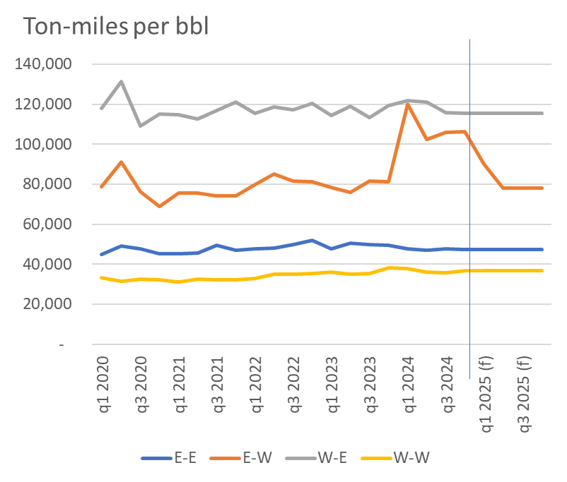
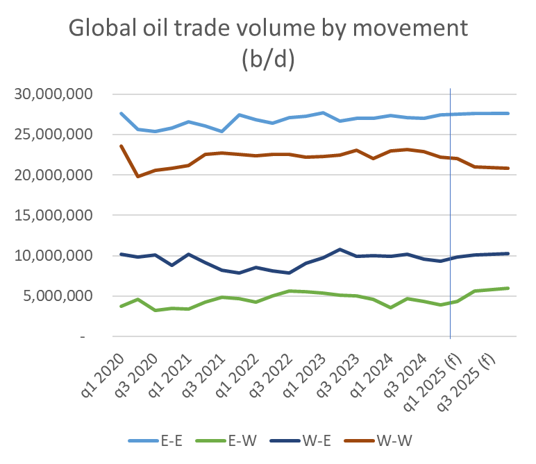
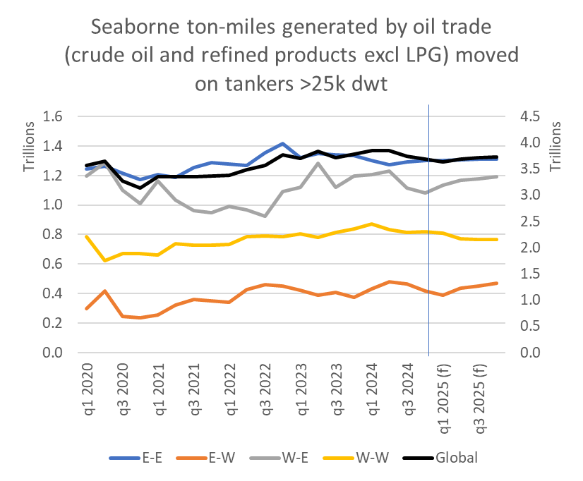
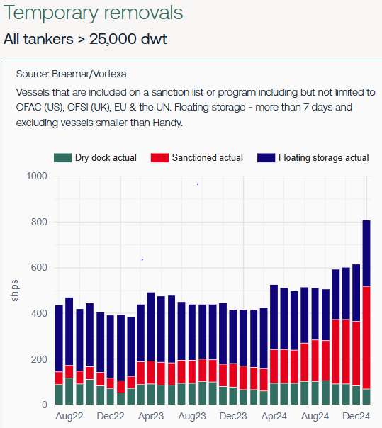

# The Big Picture: Houthi ceasefire

**Date:** January 23, 2025  
**Publisher:** Breakwave Advisors | **Category:** Market Insights  
**Original URL:** [https://www.breakwaveadvisors.com/insights/2025/1/23/the-big-picture-houthi-ceasefire](https://www.breakwaveadvisors.com/insights/2025/1/23/the-big-picture-houthi-ceasefire)  

---

*By*[*Henry Curra*](https://www.linkedin.com/in/henry-curra-77253b/)

### Bovvered?

A full return to the Suez canal routing will negatively impact ton-mile demand for tankers. But tighter US sanctions and overall trade growth mean that freight markets should remain well supported in 2025.

Yemen’s Houthi rebels insist that Israel’s ceasefire in Gaza removes their incentive to bomb ships in the Red Sea. Assuming the ceasefire holds we can expect to see a loss of ton-mile intensity of oil trade between the Atlantic and markets East of Suez.

Our base case scenario assumes that the average voyage length of oil trade between markets East of Suez and (principally) Europe returns to pre-Houthi attack levels by April. This would affect the East to West trade most aggressively, where ton-mile intensity falls 26% by April. West to East flows - mostly Russian crude to India – have somehow managed (i.e. paid) to keep moving through the Suez Canal despite the Houthi aggression. Little change in this direction is thus expected in the absence of Houthi attacks.

> **Figure 1: Market Chart 1**  
> [Local Asset](file:///C:/Users/Dell/Github/Shipping/corpus/03-breakwave/insights/2025/assets/2025-01-23_the-big-picture-houthi-ceasefire_img_image0_fb77699ee1f1.png)

Forecasting volumetric changes in oil trade between basins is tricky. This is because oil flows are constantly shifting independently of freight costs. Today’s sanctions, for instance, will cut Iranian exports, we expect. These exports will be – indeed already appear to be - replaced from the Middle East (East to East) or the Atlantic basin (West to East).

We think the volume of crude moving from ‘East to East’ will grow by just under 1% this year as the loss of some Iranian exports is more than compensated by the partial reversal of voluntary production cuts elsewhere in the region.

West to East trade will grow by 10% as Russian export volumes are likely to continue pushing towards Asia (despite new US sanctions on ships and Russian exporters), and a growing surplus of Atlantic basin crude production moves to consumers in the East. OPEC’s price controls are likely to tolerate more Atlantic crude moving to non-OECD Asia at the expense of shorter-haul flows from the Middle East. This will add support principally to VLCCs.

East to West flows will jump by 53% during the year. This would return E-W volumes to pre-Houthi attack levels. More Mid East crude will head to Europe, and more Mid East or Indian diesel/jet will move to Europe on LR2s, possibly at the expense of some US exports to Europe on MRs.

We are not expecting to see more than about 400k b/d of growth in seaborne oil tanker trade this year. The trade growth we expect to see east of Suez and between basins will have to be partially offset by a loss on intra-Atlantic basin trade, in our view. West to West flows fall by 6% over the course of this year as new ‘trade-neutralising’ Atlantic basin refineries (Dangote/Dos Bocas) combine with declining European oil demand and heightened imports from East of Suez.

Of course that 400k b/d oil trade growth estimate is at risk given the growing threat of Trump inspired trade tariffs that could slow oil demand growth.

> **Figure 2: Market Chart 2**  
> [Local Asset](file:///C:/Users/Dell/Github/Shipping/corpus/03-breakwave/insights/2025/assets/2025-01-23_the-big-picture-houthi-ceasefire_img_image1_aa20976cff44.png)

Combining our view on future changes to oil flows and the ton-mile intensity of these flows, we estimate that ton-mile demand for tankers dips slightly (about 1%) this quarter relative to q4 2024 – assuming a full return to Suez / Red Sea transits by the end of q1 2025. But between q1 and q4 2025 ton-mile demand grows by just over 2% as trade growth favours more ton-mile intensive routes.

> **Figure 3: Market Chart 3**  
> [Local Asset](file:///C:/Users/Dell/Github/Shipping/corpus/03-breakwave/insights/2025/assets/2025-01-23_the-big-picture-houthi-ceasefire_img_image2_751ac1a88958.png)

### How Will Fleet Growth Respond to This ‘Decline F/b Growth’ in Tm Demand?

Our ‘ships in’ vs. ‘ships out’ model (technically: NB deliveries vs. dwt capacity removed by age restrictions) dictates that supply growth will hit around 1.3% this year (Jan to Dec). At the start of the year this level of fleet growth would have simply eaten into an oversupply problem that had built up since the loss of Chinese demand last summer. However, now that US sanctions have cut the useful capacity of tankers in Russian and Iranian oil trades, ships are being pulled out of compliant trades. Iran and Russia will drop FOB prices to keep exports flowing, but demand for compliant exports could be boosted if Trump renews his campaign of ‘maximum pressure’ on Iran. All things (?) considered, and in spite of a looming efficiency boost to world oil trade, our base case remains modestly bullish for the year – notably for VLCCs and LR2s.

> **Figure 4: Market Chart 4**  
> [Local Asset](file:///C:/Users/Dell/Github/Shipping/corpus/03-breakwave/insights/2025/assets/2025-01-23_the-big-picture-houthi-ceasefire_img_image3_564e607cd15c.png)

---

**Tags:** Markets, Shipping, Tankers  
