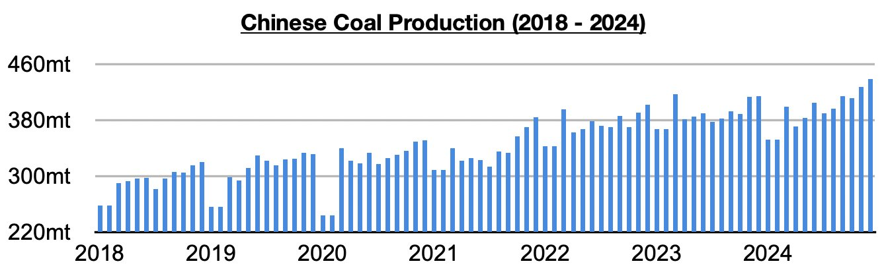
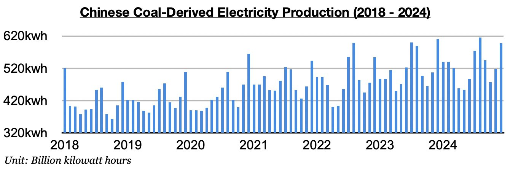

# Divergence in China's Coal Output and Coal-Derived Electricity Generation

**Date:** January 24, 2025  
**Publisher:** Breakwave Advisors | **Category:** Market Insights  
**Original URL:** [https://www.breakwaveadvisors.com/insights/2025/1/24/divergence-in-chinas-coal-output-and-coal-derived-electricity-generation](https://www.breakwaveadvisors.com/insights/2025/1/24/divergence-in-chinas-coal-output-and-coal-derived-electricity-generation)  

---

*By*[*Jeffrey Landsberg*](https://www.linkedin.com/in/jeffrey-landsberg-70ab957/)

As we discussed in Commodore Research's most recent Weekly Executive Report, China's coal production last month totaled a record 438.9 million tons. This is up month-on-month by 10.9 million tons (3%), is up year-on-year by 24.6 million tons (6%), and has marked a seventh straight month where China's coal production has grown on a year-on-year basis. Significant is that while China's National Energy Administration last month announced that it expects coal production will grow this year by only 0.8%, for now there is no sign of such a slowdown occuring.

> **Figure 1: Chart 1**  
> [Local Asset](file:///C:/Users/Dell/Github/Shipping/corpus/03-breakwave/insights/2025/assets/2025-01-24_divergence-in-chinas-coal-output-and-coal-derived-electricity-generation_img_chart1_f8a903f1070d.jpg)

Coal-derived electricity generation, which makes up the bulk of China's electricity generation, totaled 597.5 billion kilowatt hours. This is up month-on-month by 80 billion kilowatt hours (16%) but is down year-on-year by 13.4 billion kilowatt hours (-2%). Overall, it has not helped Chinese coal import demand prospects that coal-derived electricity generation growth has fared worse than domestic coal production growth for three straight months.

> **Figure 2: Chart 2**  
> [Local Asset](file:///C:/Users/Dell/Github/Shipping/corpus/03-breakwave/insights/2025/assets/2025-01-24_divergence-in-chinas-coal-output-and-coal-derived-electricity-generation_img_chart2_afe6330ad749.jpg)

---

**Tags:** Shipping, Coal, Drybulk  
