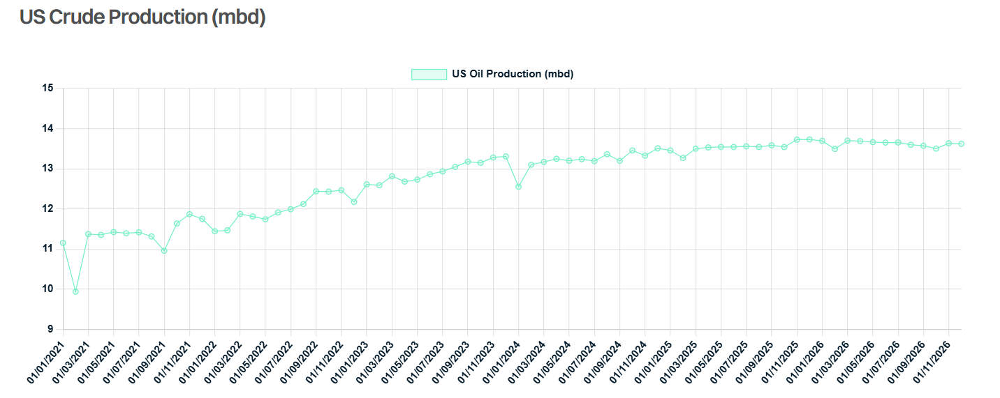

# First Five Days

**Date:** January 27, 2025  
**Publisher:** Breakwave Advisors | **Category:** Market Insights  
**Original URL:** [https://www.breakwaveadvisors.com/insights/2025/1/26/first-five-days](https://www.breakwaveadvisors.com/insights/2025/1/26/first-five-days)  

---

> **Figure 1: Istock 485480338**  
> **Interactive Data & Source:** [Gibsons Co](https://www.gibsons.co.uk/market-reports) | [Local Asset](file:///C:/Users/Dell/Github/Shipping/corpus/03-breakwave/insights/2025/assets/2025-01-27_first-five-days_img_istock-485480338_e8cd5e92a0e9.jpg)

Following a very impactful end to the Biden era, the oil and tanker markets expected Trump’s second stint in the White House to start where Biden left off. Yet, for all the jaw dropping executive orders issued on other unrelated topics, the shipping and energy markets so far seem to have missed out on any immediate impact. However, even if the details are lacking, some clues are starting to emerge as to how the new President will tackle a number of key energy related issues.

Out of all the geopolitical events witnessed so far this decade, the war in Ukraine has arguably been the most impactful for the tanker markets. Trump famously said he would end the war “in a day” but for now (and perhaps surprisingly) this does not appear to be a priority. In recent days, however, the President has threatened further sanctions and possible tariffs against Russia if a deal is not found to end the conflict. Whilst that may seem fairly light touch, it does tell us two things; firstly, the sanctions Biden introduced and oil price cap are unlikely to be removed in the short term; and secondly, the process to end the conflict is unlikely to be swift. Buyers of Russian crude, most notably in India, remain none the wiser as to what the future looks like.

Likewise, very little mention has been made concerning policy to Iran. Most participants in the oil markets, including Chinese buyers of Iranian crude, began reacting to increased sanctions threats before Trump’s second term. Yet, aside from Biden’s actions two weeks ago, there has been very little said about how to reign in Iran. The question remains, will tougher sanctions be introduced?

Venezuela has received some airtime from the new President, who stated that the US might not continue to buy Venezuelan oil, whilst further sanctions could be implemented following the outcome of diplomatic meetings. The country exported 235kbd to the US last year, whilst another 125kbd went to Europe and India under license.

The potential for more sanctions on Russia, Iran and Venezuela of course all signal higher oil prices, yet Trump can claim that oil prices fell during his first week in office. However, to keep prices in check under a stricter sanctions regime he may need some help. On Friday, Trump reiterated to OPEC that they need to bring the price of oil down, which of course suggests higher production. He also claimed that lower oil prices would help end the war in Ukraine, although the complication here is that Russia remains a key member of OPEC+. Another conflict here is that higher OPEC production could threaten US output.

Another announcement, which so far lacks clarity, is his plan to refill the SPR “right to the top”, which implies adding about 300 million barrels back in. The key question here is when and how. If we were to assume a 1 year long process using domestic grades only, the fill rate would exceed 800kbd – enough to drive up oil prices and lower exports. However, if the process drags out over his presidency, then the impact will be considerably more muted, at circa 200kbd. It also remains to be seen what funding will be available for such purchases which would cost around $22.25 billion at today’s prices.

Trump has, as expected, come out swinging in favour of domestic oil and gas production and has already pledged to remove any barrier to drilling for “liquid gold” including the removal of and offshore drilling ban and also opening up the Alaskan wilderness for exploration. However, it is unclear whether oil companies will respond at scale to supportive oil and gas policy. The scaling back of EV mandates and a moratorium on offshore wind also tip the balance back towards hydrocarbons, although it remains unclear to what extent this will impact oil demand.

Tariffs have remained high on the policy list but are yet to be confirmed. The markets are still none the wiser as to whether the proposed 25% tariff on Mexican and Canadian imports will be implemented, although Trump did confirm that a federal investigation would be conducted first. From an oil perspective the impact would be seismic, with 600kbd of Mexican crude and DPP exports impacted and likely redirected. For Canada, the interdependency between the countries’ energy sectors is even greater, with Canadian exporters lacking alternative markets unless re-exports via the US Gulf are exempt, whilst many US refiners depend on discounted Canadian barrels for their profitability. The EU has also been threatened with tariffs if they do not buy more oil and gas; yet the irony here is that the EU is buying more US energy than ever before.

For the wider shipping markets, factors like the Panama Canal, possible tariffs against China, and policy towards Chinese built ships are all points of concerns. Yet again here, key details are lacking. More time and clarity are needed to ascertain the real impact of Trump’s presidency, but for now it looks like threat of sanctions and tariffs as well as support for oil and gas will have to endure.

> **Figure 2: Στιγμιότυπο Οθόνης 2025 01 26 220813**  
> **Interactive Data & Source:** [Gibsons Co](https://www.gibsons.co.uk/market-reports) | [Local Asset](file:///C:/Users/Dell/Github/Shipping/corpus/03-breakwave/insights/2025/assets/2025-01-27_first-five-days_img_cea3cf84ceb9ceb3cebcceb9cf8ccf84cf85_e98675c89149.png)

Data source:[Gibson Shipbrokers](https://www.gibsons.co.uk/market-reports)

---

**Tags:** Tankers, Shipping, Crude  
