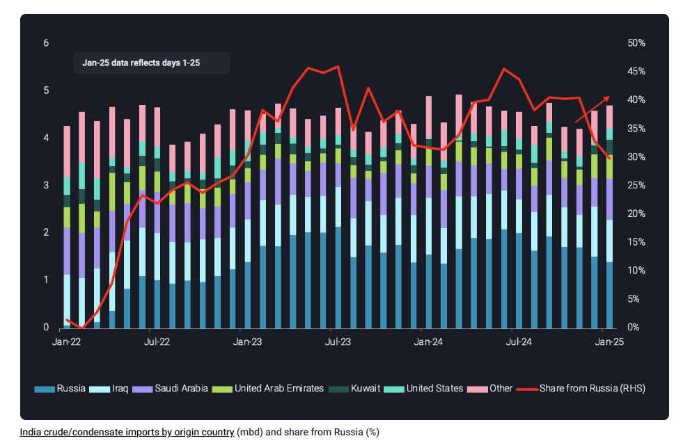
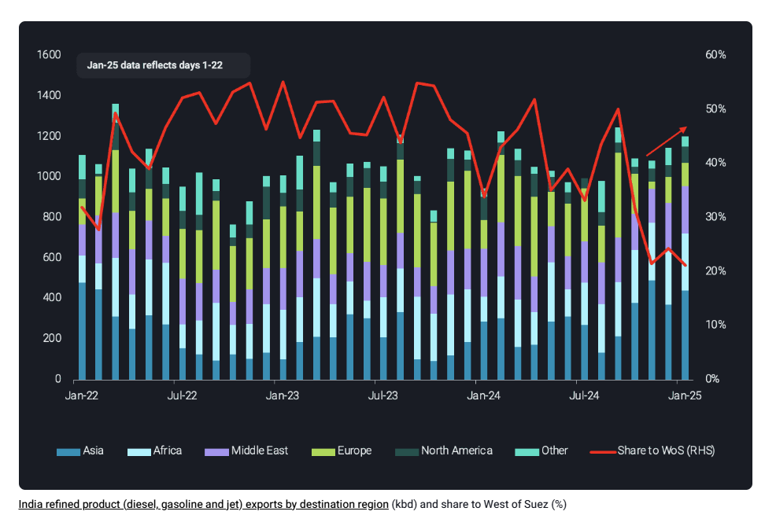

# India’s crude intake changes towards Middle East barrels while refined product exports pivot to East of Suez

**Date:** January 27, 2025  
**Publisher:** Breakwave Advisors | **Category:** Market Insights  
**Original URL:** [https://www.breakwaveadvisors.com/insights/2025/1/27/indias-crude-intake-changes-towards-middle-east-barrels-while-refined-product-exports-pivot-to-east-of-suez](https://www.breakwaveadvisors.com/insights/2025/1/27/indias-crude-intake-changes-towards-middle-east-barrels-while-refined-product-exports-pivot-to-east-of-suez)  

---

As India’s crude imports from Russia see a temporary slowdown and refined product exports remain East of Suez, we look at the underlying reasons

*By*[*Rohit Rathod*](https://www.linkedin.com/in/rathodrohit/)

India’s crude imports and subsequent refined product exports remained strong as 2024 ended and that momentum has continued going into January 2025. When further dissecting the underlying data, we were able to identify quite some shuffling of flows – for both crude and refined products which we shall discuss in detail in this insight blog.

## Temporary Slowdown in Crude Imports From Russia

> **Figure 1: Στιγμιότυπο Οθόνης 2025 01 27 151223**  
> **Interactive Data & Source:** [Vortexa](https://www.vortexa.com/insights/freight/us-sanctions-expected-to-tighten-fleet-availability-and-force-greater-adherence-to-the-russian-price-cap/) | [Local Asset](file:///C:/Users/Dell/Github/Shipping/corpus/03-breakwave/insights/2025/assets/2025-01-27_indias-crude-intake-changes-towards-middle-east-barrels-while-refined-product-ex_img_cea3cf84ceb9ceb3cebcceb9cf8ccf84cf85_43fb3cf79bc7.png)

The most important development with regards to Indian crude imports was a slowdown in imports from Russia in December. Russian crude accounted for 38% of India’s crude imports in 2024, which fell to 33% in December-24 and 30% in January-25 (days 1-25). One factor contributing to this decline was increased competition from Chinese buyers especially for Sokol and ESPO Blend. As a result, no cargoes of these grades made their way to India in November and December 2024.

Recent OFAC sanctions ([read more here](https://www.vortexa.com/insights/freight/us-sanctions-expected-to-tighten-fleet-availability-and-force-greater-adherence-to-the-russian-price-cap/)) could further contribute to this slow down in India’s spot crude imports from Russia, albeit temporarily. Indian refiners will likely replace spot barrels from the Middle East given the proximity and medium-heavy sour crude from the region, similar to Russia’s Urals crude (which is the main grade from Russia that India imports). Crudes from other regions, such as West Africa and North America, could also be alternatives depending on the economics between sweet and sour crude.

Spot imports of Russian crude are likely to recover in the medium term via the increased use of non-sanctioned vessels. In doing so, Russia’s crude will have to be priced at larger discounts to compensate for the higher freight costs. We expect Russia to continue exporting crude – albeit at bigger discounts – so as to maintain this source of revenue for the nation. The recent Reliance-Rosneft deal should also lead to steady volumes of Russian crude arriving in Jamnagar Jan-25 onwards.

## Product Exports to West of Suez Destinations Fall Sharply

> **Figure 2: Στιγμιότυπο Οθόνης 2025 01 27 151322**  
> **Interactive Data & Source:** [Vortexa](https://www.vortexa.com//oil-gas-data-traders-analysts-data-scientists?gclid=Cj0KCQjw8_qRBhCXARIsAE2AtRZKOvMnbilZ_6_91d7huSFFy71pWLrnPwGwOHVzXsmsG-1a1mZnQw8aAt89EALw_wcB&hsa_acc=1782073842&hsa_ad=548425387665&hsa_cam=14746637662&hsa_grp=125038601902&hsa_kw=&hsa_mt=&hsa_net=adwords&hsa_src=g&hsa_tgt=dsa-1431852288425&hsa_ver=3&utm_campaign=%5BCD%5D%20-%20DSA%20-%20EMEA&utm_medium=cpc&utm_medium=ppc&utm_source=google&utm_source=adwords&utm_term=) | [Local Asset](file:///C:/Users/Dell/Github/Shipping/corpus/03-breakwave/insights/2025/assets/2025-01-27_indias-crude-intake-changes-towards-middle-east-barrels-while-refined-product-ex_img_cea3cf84ceb9ceb3cebcceb9cf8ccf84cf85_17fc1dbf17c6.png)

On the refined products side, India’s exports of diesel/gasoil, gasoline/blending components and jet/kero have pivoted from West of Suez (WoS) destinations, especially Northwest Europe and towards East of Suez (EoS) destinations in Asia, East Africa and the Middle East. The share of exports towards WoS fell from 50% in September-24 to 21% in January-25 (days 1-22).

India’s product exports, driven by diesel towards Europe, fell by over 200kbd in October-24 m-o-m and to 35kbd in November-24, the lowest since mid-2020. This decline can be attributed to more intra-European supply, as well as European buyers taking more surplus US Gulf Coast diesel. As a result, Indian refined products pivoted towards EoS destinations to keep exports at current levels. Limited Chinese product export quotas further benefited Indian refiners in pushing their barrels into South East Asia and Oceania markets.

Going forward, we expect this slowdown in Russian imports to be temporary and volumes to recover. In 2025, India’s overall crude imports should see stronger growth from the start up of refinery projects. The 180kbd grassroots Barmer refinery in Rajasthan is expected to commission in 2H2025, while IOCL’s Barauni refinery expansion is slated around the end of this year. Barring any delays, higher crude runs from the ramp-up of these projects will lead to increased crude imports by India towards the latter half of this year and early 2026. On the refined products side, these new projects should cater to the inland markets, while freeing up volumes from the coastal refineries for export.

Data Source:[Vortexa](https://www.vortexa.com//oil-gas-data-traders-analysts-data-scientists?gclid=Cj0KCQjw8_qRBhCXARIsAE2AtRZKOvMnbilZ_6_91d7huSFFy71pWLrnPwGwOHVzXsmsG-1a1mZnQw8aAt89EALw_wcB&hsa_acc=1782073842&hsa_ad=548425387665&hsa_cam=14746637662&hsa_grp=125038601902&hsa_kw=&hsa_mt=&hsa_net=adwords&hsa_src=g&hsa_tgt=dsa-1431852288425&hsa_ver=3&utm_campaign=%5BCD%5D%20-%20DSA%20-%20EMEA&utm_medium=cpc&utm_medium=ppc&utm_source=google&utm_source=adwords&utm_term=)

---

**Tags:** Crudeoil, Tankers, Markets  
