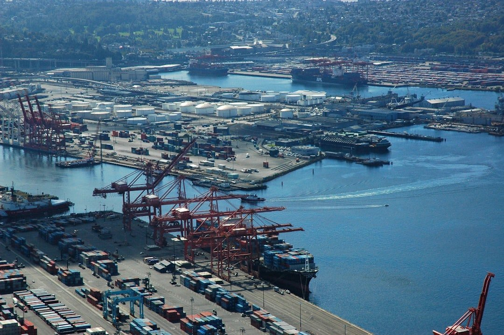

# The 2025 outlook for Dry Bulk and Tanker markets

**Date:** January 27, 2025  
**Publisher:** Breakwave Advisors | **Category:** Market Insights  
**Original URL:** [https://www.breakwaveadvisors.com/insights/2025/1/27/the-2025-outlook-for-dry-bulk-and-tanker-markets](https://www.breakwaveadvisors.com/insights/2025/1/27/the-2025-outlook-for-dry-bulk-and-tanker-markets)  

---

*By Panagiota*

The 2025 outlook for Dry Bulk and Tanker markets paints a picture of opportunity, volatility and emerging new trends in trade. Insights from participants in the Breakwave Day 2024 event, Breakwave’s annual live-stream gathering of industry experts, underscored the influence of fleet dynamics, commodity demand and geopolitical factors that will impact the two sectors in the year ahead.

The overall consensus was that the**dry bulk market**is gearing up for a year of contrasts in 2025, with analysts forecasting a mix of optimism for Capesizes and headwinds for Panamaxes and the smaller segments.

*Serena Piazza, Senior Research Analyst at Ifchor Galbraiths,*pointed out, “we expect the lowest fleet growth of the entire dry bulk sector, together with expanding demand for iron ore, coal and bauxite, to drive Capesize rates higher.” She emphasized the importance of key projects such as Guinea’s Simandou mine and Australia’s Onslow initiative, which are set to boost long-haul trade and ton-mile demand.

*Liz Gao, Iron Ore Analyst**at CRU*, noted, “we expect next year to be relatively flat compared to 2024 as the Simandou project will take years to be fully ramped up.”

*Burak Cetinok, Arrow’s Analyst*, noted “I’m slightly more positive about Capes and think they would average slightly higher, and my expectation is roughly about $19,000 - $21,000 range and think we could be surprised to the upside.”

On the other hand,*Jeff Landsberg*,*President at Commodore Research & Consultancy,*pointed “Panamax rates will suffer next year, and they will pull down or keep a lead on Capesize rates.”

Analysts agree that while opportunities abound for large vessels like Capesizes, risks from oversupply and geopolitical disruptions remain, making 2025 a critical year for the industry.

Regarding the**tanker market**, 2024 was a challenging year – or – In comparison, the tanker market faced a challenging 2024. The sector struggled to meet expectations despite global geopolitical tensions and supply disruptions. Breakwave Day participants agreed that weak demand, structural changes in major markets like China and rising influence of the shadow fleet were central to the year’s underperformance.

More specific,*Nadia Martin Wiggen, Director at Svelland Capital*, for the underperformance of the tanker market, mentioned the weak Chinese demand as well as the shadow fleet’s dominance in moving Russia crude. “Refinery outages in Russia resulted in additional crude exports, but they primarily benefited the shadow fleet,” she said. This combined with negative Chinese demand growth, limited opportunities for mainstream tankers.

Similar concerns were expressed by*Richard Matthews, Consultant and Research Director at Gibsons Shipbrokers:*“This year’s problem wasn’t supply. It was demand. Chinese crude oil imports have fallen, while structural changes like LNG trucking and EV adoption constrained oil demand”, he said.

*Richard Matthews*emphasized that ton-mile demand suffered as China increased its intake of Middle Eastern crude at the expense of longer Atlantic routes.

Looking ahead, analysts agreed that 2025 holds opportunities for recovery, particularly in production growth and Asian demand.*Jonathan Staubo, Oil Tankers Advisor at Fearnleys*said, “production growth historically drives tanker demand, and we expect stronger contributions from Brazil and the Americas next year.”

*Anastasia Zania, Tanker Analyst at Energy Aspects,*focused on Asia’s refining capacity, forecasting net crude demand growth. “Asia will lead global demand next year, driven by 0.6 million barrels per day of new refining capacity” she said. Combined with increased flows from the US and Brazil, this should provide a boost to VLCC demand.

However, risks remain.*Richard Matthews,*pointed to China as the key challenge, warning, “Chinese demand will remain constrained due to structural changes, and there’s a risk we’re overestimating total demand growth.”

On freight rates, analysts agreed that 2025 is set for stronger levels.*Jonathan Staubo*projected VLCC rates between $50,000 and $60,000 per day, driven by limited fleet growth and higher production. “It’s very easy to see why rates will exceed current forward market expectations,” he said.*Anastasia Zania*concurred, suggesting that “markets are currently underpriced, and we expect significant volatility.”

*Nadia Martin Wiggen*highlighted the steep rate decline seen in late 2024 but maintained a constructive outlook, saying “$45.000 to $50.000 per day is a healthy level, considering supply and demand fundamentals.”*Richard Matthews,*added, “Forward curves are undervalued due to bearish sentiment, but the fundamentals – zero fleet growth, high oil supply, and geopolitical risks -point to upside potential.”

**In summary**, analysts see opportunities, challenges, and evolving dynamics for 2025. For the dry bulk sector, minimal fleet growth and increasing demand for key commodities like iron ore, coal and bauxite are expected to drive positive momentum, particularly for Capesize vessels. Projects such as Simandou mine and Australia’s Onslow initiative are expected to boost long-haul trade. Meanwhile, geopolitical disruptions and oversupply risks remain, causing uncertainties for the market. The tanker market, coming off a difficult 2024 marked by weak Chinese demand and the rising influence of the shadow fleet, holds promise for recovery. Analysts anticipate stronger freight rates and a rebound in market conditions. Overall, both markets are set for a year of volatility and transformation, with shifts in supply and demand patterns playing a central role in shaping outcomes.

**So far, the year 2025**began amidst significant geopolitical disruptions, including the Trump re-election, the U.S. sanctions on Russia, and the Houthi ceasefire. These developments have heavily impacted the tanker market, with Russian sanctions on ships and Iranian oil restrictions pushing tanker rates higher. Additionally, ongoing tariff discussions around Canadian oil have create a lookup environment for alternative crude supplies. These factors underscore the volatile and opportunistic landscape that is emerging in the global energy and shipping markets at the beginning of the year.

> **Figure 1: Unsplash Image Bqpb1vdg3zw**  
> [Local Asset](file:///C:/Users/Dell/Github/Shipping/corpus/03-breakwave/insights/2025/assets/2025-01-27_the-2025-outlook-for-dry-bulk-and-tanker-markets_img_unsplash-image-bqpb1vdg3zw_863b6f3398b7.jpg)

---

**Tags:** Shipping, Markets, Commodities  
