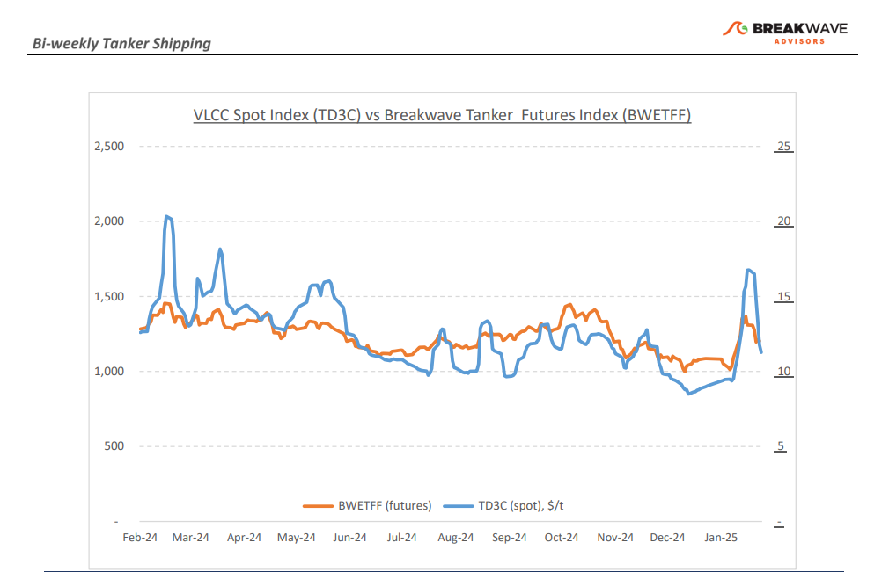
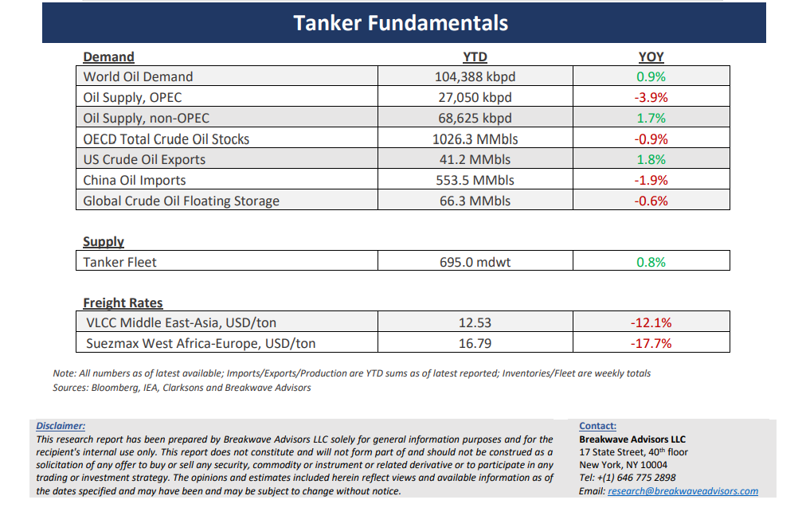

# Breakwave Bi-Weekly Tanker Report - January 28, 2025

**Date:** January 28, 2025  
**Publisher:** Breakwave Advisors | **Category:** Market Insights  
**Original URL:** [https://www.breakwaveadvisors.com/insights/2025128wet-kji2577](https://www.breakwaveadvisors.com/insights/2025128wet-kji2577)  

---

> **Figure 1: Cea3cf84ceb9ceb3cebcceb9cf8ccf84cf85**  
> [Local Asset](file:///C:/Users/Dell/Github/Shipping/corpus/03-breakwave/insights/2025/assets/2025-01-28_2025128wet-kji2577_img_cea3cf84ceb9ceb3cebcceb9cf8ccf84cf85_d9955af9ff18.png)

**·****VLCC Market Cools Amid Sanctions, Holiday Slowdown, and Increased Uncertainty**– The VLCC (Very Large Crude Carrier) freight market, which experienced a significant surge earlier this month following the implementation of new Russian shipping sanctions, has rapidly cooled as January nears its end. The market outlook remains uncertain due to the unpredictable effects of these sanctions. Speculation suggests that Russia may still be utilizing or expanding its "shadow fleet"—vessels operating outside the scope of sanctions—to circumvent restrictions and sustain crude oil exports. This strategy introduces additional complexities, raising concerns about the durability of such loopholes and their impact on the supply of crude tanker vessels. Compounding these challenges, the Chinese New Year holidays have dampened expectations for a swift recovery, as the world’s largest oil importer sees a temporary slowdown in activity. Consequently, tanker demand has softened, with fewer cargo inquiries leading to reduced market activity. Following last week’s surge— when VLCC rates reached their highest levels in over seven months—the market has shown a weaker performance across both Eastern and Western hemispheres. A surplus in vessel availability continues to pressure the market, as the tonnage list outpaces demand for cargo shipments. However, the underlying factors that drove the earlier spike in freight rates remain in place. Given these dynamics, it is difficult to discount the likelihood of renewed volatility in both spot and futures markets as the year unfolds.

**· Oil Prices Pull Back from Multi-Month Highs, as Uncertainty over OPEC Production Returns**– The most politically sensitive of all commodity markets experienced a significant shift last week as former President Trump directed attention toward oil prices and the potential for future declines. While reconciling lower oil prices with increased U.S. drilling activity and substantial Saudi investments in the United States remains challenging, the headlines were sufficient to push prices lower, albeit from an already elevated level. It would be highly unusual for OPEC+ to agree to any production increases without a robust recovery in Chinese demand—something that has yet to materialize. Meanwhile, U.S. oil production remains at record highs. Although low inventories continue to lend support to prices, the current supply-demand dynamics appear balanced at prevailing levels. Oil prices will continue to be influenced by political rhetoric; however, the reality is that Chinese demand remains elusive. Any growth is likely to be concentrated in gas-related products rather than crude oil. For the tanker market, lower prices could stimulate demand, making the absolute price level and the shape of the futures curve critical factors in sustaining strength within the crude sector. However, such a scenario (low prices, contango curve) appears plausible over the next year or so.

**· Our Long-term View –**The tanker market is recovering from a long period of staggered rates as the growth in new vessel supply shrinks while oil demand remains elevated in line with the global economy. A historically low orderbook combined with favorable shifting trade patterns should continue to support increased spot rate volatility, which combined with the ongoing geopolitical turmoil, should sustain freight rates in the medium to long term.

> **Figure 2: Cea3cf84ceb9ceb3cebcceb9cf8ccf84cf85**  
> [Local Asset](file:///C:/Users/Dell/Github/Shipping/corpus/03-breakwave/insights/2025/assets/2025-01-28_2025128wet-kji2577_img_cea3cf84ceb9ceb3cebcceb9cf8ccf84cf85_e95ac72a79cb.png)

> **Figure 3: Cea3cf84ceb9ceb3cebcceb9cf8ccf84cf85**  
> [Local Asset](file:///C:/Users/Dell/Github/Shipping/corpus/03-breakwave/insights/2025/assets/2025-01-28_2025128wet-kji2577_img_cea3cf84ceb9ceb3cebcceb9cf8ccf84cf85_676687f5fdf8.png)

### Subscribe:
