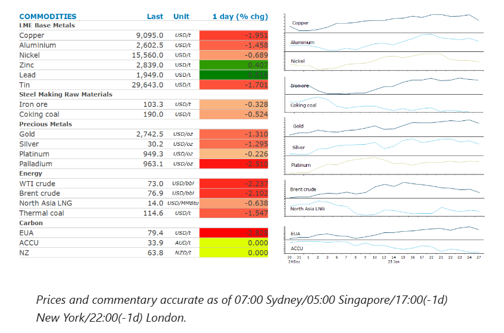
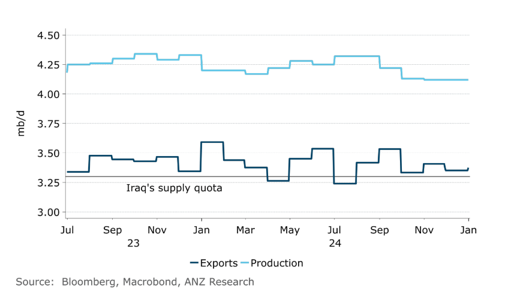

# Commodities struggle amid risk-off tone across markets

**Date:** January 28, 2025  
**Publisher:** Breakwave Advisors | **Category:** Market Insights  
**Original URL:** [https://www.breakwaveadvisors.com/insights/2025/1/28/commodities-struggle-amid-risk-off-tone-across-markets](https://www.breakwaveadvisors.com/insights/2025/1/28/commodities-struggle-amid-risk-off-tone-across-markets)  

---

A risk-off tone across wider markets weighed on sentiment in energy and metal sectors.

*By*[*Daniel Hynes*](https://www.linkedin.com/in/dahynes/)

> **Figure 1: Στιγμιότυπο Οθόνης 2025 01 28 120015**  
> [Local Asset](file:///C:/Users/Dell/Github/Shipping/corpus/03-breakwave/insights/2025/assets/2025-01-28_commodities-struggle-amid-risk-off-tone-across-markets_img_cea3cf84ceb9ceb3cebcceb9cf8ccf84cf85_ef452b7e184c.png)

### Market Commentary

**Base****metals**slumped amid a broader risk off tone across markets triggered by a selloff centred on the technology sector. This wasn’t helped by economic data from China that fuelled concerns of overgrowth. Factory activity unexpectedly slowed ahead of the Lunar New Year holiday. The official manufacturing purchasing managers index fell to 49.1, the lowest since August. While this is not unusual leading into the week-long shutdown, it was more severe than usual. Industrial firms also saw their profits drop in 2024 for the third consecutive year. Copper smelters are suffering widening losses after spot processing fees plunged to a record low last week amid tightness in the copper concentrate market. Sentiment was already shaken by President Trump’s threat of tariffs on Colombia for impeding US efforts to return undocumented migrants.

**Gold**fell as investors sold the precious metal to cover losses in equity markets. This comes after it hit a fresh all time high last week after Trump signalled a less aggressive approach to China, which ultimately pushed the USD lower. Data released last week also showed that investor demand for the precious metal in China remains strong. Domestic gold ETF holdings at the end of 2024 rose to about 115 tons, up 87% from the end of 2023, according to the China Gold Association. It also released data that showed, domestically produced gold reached 377t in 2024, up 0.56% y/y, Overall, physical consumption of gold came in at 985 tons, down 9.58% y/y.

**Crude oil**also came under pressure amid the risk off sentiment across global markets. Markets are also unsettled by the use of tariffs by the US. Nevertheless, supply side issues continue to dominate the physical market. Oil production at Iraq’s Rumaila field remains down 25%, or 300kb/d after last week’s fire. The supply disruption could bring the country further in line with the OPEC output quota. Indonesia also said it will reduce its crude exports to boost domestic fuel production. It is said to be targeting as much as 13mb/d of additional supply to local refineries this year. This comes after Trump pressured OPEC to help bring down the cost of oil, reviving a tactic to talk down oil prices that he frequently used during his first term in office. OPEC and its allies have been restricting supplies to the global oil market in recent years to help support higher prices.

**European gas**benchmark prices fell after reports that the EU will postpone the planned publication date of a roadmap to phase out fuels from Russia, including LNG. That puts a question mark over the resolve of member states to enact further sanctions on Russia. While a group of 10 EU nations has been pushing hard to toughen measures, that must be agreed by all 27 members of the bloc. Such geopolitical issues are likely to[**dominate global gas markets this year**](../pdfs/2025-01-28_commodities-struggle-amid-risk-off-tone-across-markets_commodity-call-gas-market-on-tenterh_e2104ecbc49a.pdf). New US sanctions on Russia’s energy industry are likely to have a significant impact. North Asia LNG prices also headed lower, dragged down by the losses in Europe. This was exacerbated by reports that the Freeport LNG export terminal has recommenced operations. Exports were disrupted last week amid wintry storm conditions which cut power to the facility.

### Chart of the Day

Iraq has struggled to bring down exports of crude oil to levels stipulated under the OPEC+ agreement. They latest incident at the Rumaila field may just be the fillip. However, its over production will be a point of discussion at the next OPEC meeting.

> **Figure 2: Στιγμιότυπο Οθόνης 2025 01 28 120025**  
> **Interactive Data & Source:** [Linkedin](https://www.linkedin.com/newsletters/commodities-wrap-6692196755876012032/?fbclid=IwAR3kiXJqZdxmp9ZcRwBNI7FsBySI-XSC0pfPur1qzjt7OZp7PTE59Tsl1QI) | [Local Asset](file:///C:/Users/Dell/Github/Shipping/corpus/03-breakwave/insights/2025/assets/2025-01-28_commodities-struggle-amid-risk-off-tone-across-markets_img_cea3cf84ceb9ceb3cebcceb9cf8ccf84cf85_9c3a77836938.png)

Data source:[Commodities Wrap](https://www.linkedin.com/newsletters/commodities-wrap-6692196755876012032/?fbclid=IwAR3kiXJqZdxmp9ZcRwBNI7FsBySI-XSC0pfPur1qzjt7OZp7PTE59Tsl1QI)

---

**Tags:** Shipping, Markets, Commodities  
