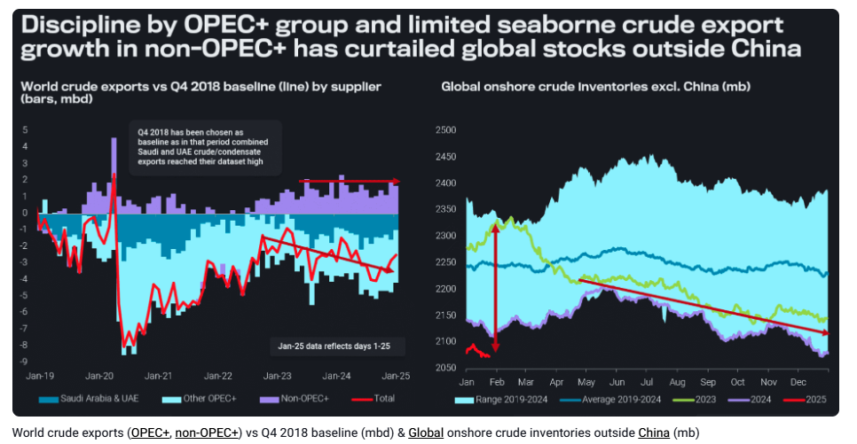
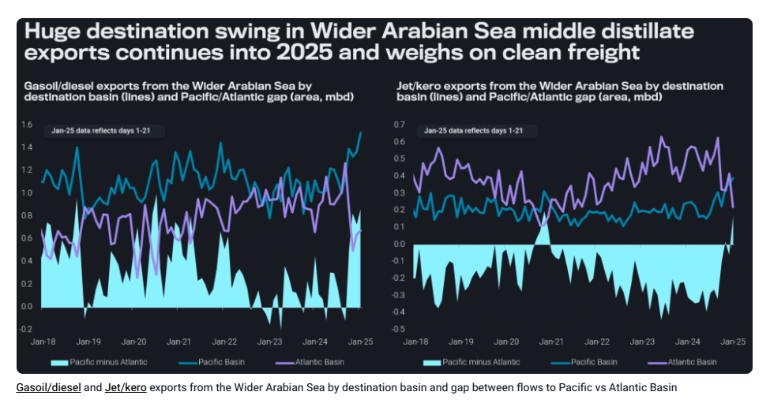

# Uncertainty vs volatility – and the difference between flows and freight

**Date:** January 29, 2025  
**Publisher:** Breakwave Advisors | **Category:** Market Insights  
**Original URL:** [https://www.breakwaveadvisors.com/insights/2025/1/29/uncertainty-vs-volatility-and-the-difference-between-flows-and-freight](https://www.breakwaveadvisors.com/insights/2025/1/29/uncertainty-vs-volatility-and-the-difference-between-flows-and-freight)  

---

In this big picture take, we try to dissect uncertainty from volatility, looking at the diverging fields of supply/demand and with that overall trade levels, as opposed to tonne-mileage in the freight market.

*By*[*David Wech*](https://www.linkedin.com/in/david-wech-83a163165/)

The 2020s have been fraught with turbulences, including amid others the Covid-related demand shock, the steep recovery afterwards coinciding with the start of the Russia-Ukraine war, and the subsequent massive changes in global trade flows due to sanctions.

Up to late 2022, these turbulences were also reflected in wide fluctuations of oil prices, stretching over a price band of more than $100/b, expanding a highly volatile period from 2004 onwards. However, since early 2023, oil barely traded outside a narrow $15/b range. Will this change now, with all the uncertainty around US policies amidst the second Trump administration?

## Spare Capacity and Limited Demand Cushion Oil Market

Before answering that question, let us look at the key factors behind stable prices: a mix of limited demand growth and supply-side flexibility. As for the latter, OPEC+ has been very successful in restraining supplies over the last two years. In February 2023, global onshore inventories outside China (right-hand chart below) were still at a seasonal high, reflecting a too quick resumption of production post Covid. But since then, production curtailments, largely shouldered by Saudi Arabia and the UAE, have led stocks to Vortexa dataset lows.

> **Figure 1: Στιγμιότυπο Οθόνης 2025 01 29 131238**  
> [Local Asset](file:///C:/Users/Dell/Github/Shipping/corpus/03-breakwave/insights/2025/assets/2025-01-29_uncertainty-vs-volatility-and-the-difference-between-flows-and-freight_img_cea3cf84ceb9ceb3cebcceb9cf8ccf84cf85_36c52b8c8970.png)

Many forecasters suggest 2025 oil prices to be (marginally) lower than in 2024 ([John Kemp survey](../pdfs/2025-01-29_uncertainty-vs-volatility-and-the-difference-between-flows-and-freight_oil-outlook-survey-2025-2029_ff7b6df890c1.pdf)), with most projections located in a narrow range, suggesting even lower volatility in times of high uncertainty. The pressure on prices stems from strong non-OPEC supply growth expectations and less-than-stellar demand projections. However, the left-hand chart above shows that crude export growth outside the OPEC+ group has been very limited ever since Q4 2018. The author of these lines wouldn’t be surprised at all if 2025 followed a similar path, making it relatively easy for OPEC+ to manage the market.

Meanwhile, the lack of oil demand growth, especially in key road transportation fuels, has left the global refining industry with ample spare capacity, taking also the heat out of global refined product markets, thereby contributing further to range-bound oil prices over the last year.

## The Real Volatility Is in Freight Markets

We have established above that overall supply/demand levels as observed in imports and exports have been pretty stable over the last two years. But the story is very different for the freight market, that is when it comes to the question of from where to where oil is being shipped as well as which route is being used. As for the latter, the avoidance of the Bab-el-Mandeb passage, especially for East-West middle distillate flows has been a key factor over the last year, lengthening voyage times and eating into available vessel capacity. Panama Canal water level issues had a similar effect in H1 2024.

But we have also seen substantial changes in origin/destination pairs, largely driven by the rerouting of Russian barrels away from the historical core market in the European Union, adding a lot of tonne-miles.

More recently we have seen a huge reshuffling of middle distillate flows out of the Wider Arabian Sea (including in particular the Middle East Gulf, the Red Sea and the west coast of India). Flows to the Pacific Basin (including the regional Arabian Sea market) of both diesel and jet/kero have been surging over recent months, while those to the Atlantic Basin have been axed by more than 50% from a September high (see chart below).

> **Figure 2: Στιγμιότυπο Οθόνης 2025 01 29 131333**  
> **Interactive Data & Source:** [Vortexa](https://www.vortexa.com/product-freight-analytics/) | [Local Asset](file:///C:/Users/Dell/Github/Shipping/corpus/03-breakwave/insights/2025/assets/2025-01-29_uncertainty-vs-volatility-and-the-difference-between-flows-and-freight_img_cea3cf84ceb9ceb3cebcceb9cf8ccf84cf85_1b94bdc5d44c.png)

The swing in volumes is unprecedented. Between September and November the change in the gap been Pacific and Atlantic Basin amounted to 1.3mbd and in the four months to January even to 1.5mbd. For jet/kero the last three months mark the only time outside the core Covid period that more volumes are directed eastwards than westwards.

This reshuffling in Wider Arabian Sea flows has a huge knock-on effect on clean freight markets, as voyages to the East are typically (much) shorter than to the West, especially in times of avoidance of the Bab-el-Mandeb.

Amid these steep shifts in freight market fundamentals – that are not necessarily visible in aggregate global and regional import and export figures – it comes as no surprise that our clients (including in particular the financial players) are expressing more and more interest in our[freight analytics toolset](https://www.vortexa.com/product-freight-analytics/).

## Potential Tariffs Are Again Primarily a Freight and Not an S/d Factor…

Looking forward, the No1 uncertainty factor in 2025 oil markets is the imposition of trade tariffs by the Trump administration (and possible retaliation). For instance, if the US were to tax Canadian and Mexican energy imports, all TMX crude would be rerouted to Asia, all Mexican crude to Asia or Europe, the US would have to take LatAm and Middle Eastern crude in exchange, Mexican fuel oil exports would go to Asia and Europe instead of the US, and the US Atlantic Coast would receive products (in particular gasoline) from Europe rather than Canada.

The above would also have some repercussions on supply/demand levels, but it would first and foremost lead to a surge in tonne-miles, primarily for dirty freight. Freight rates would rise markedly and generally the cost of all goods is set to be higher in this scenario, weighing on GDP and demand. However, European and Asian refiners should benefit at the margin, at the cost of US West Coast, US land-locked and Canadian East Coast refiners.

## … But the Threat on Russian and Iranian Barrels Has Supply-Shock Potential

For now, the biggest challenge to the oil market, however, is coming from late actions of the Biden administration. The sanctions on 155 oil tankers by OFAC on January 10 have not yet reduced the exports of Russian crude oil, but clear question marks arise on whether all barrels – especially from the European side – can be discharged to final consumers, supposedly in India or China. For now it looks like the Trump administration may well follow up on strict implementation, with additional measures on Iran deemed plausible.

Our base case remains that ultimately – after a build-up of barrels at sea – ways will be found, especially in China, to take in (strongly) discounted sanctioned barrels from both Russia and Iran. But the chances of real supply losses are growing it seems. And then we could see a comeback of oil price volatility, on top of the recently prevalent freight price volatility. To assess spare capacity, we would primarily look at how much Saudi and UAE crude exports are below their historical highs, which is “only” 1.5mbd over the last six months. This compares to seaborne exports of Russian and Iran crude of more than 5mbd – far too high of a stake to be lost.

Data Source:[Vortexa](https://www.vortexa.com//oil-gas-data-traders-analysts-data-scientists?gclid=Cj0KCQjw8_qRBhCXARIsAE2AtRZKOvMnbilZ_6_91d7huSFFy71pWLrnPwGwOHVzXsmsG-1a1mZnQw8aAt89EALw_wcB&hsa_acc=1782073842&hsa_ad=548425387665&hsa_cam=14746637662&hsa_grp=125038601902&hsa_kw=&hsa_mt=&hsa_net=adwords&hsa_src=g&hsa_tgt=dsa-1431852288425&hsa_ver=3&utm_campaign=%5BCD%5D%20-%20DSA%20-%20EMEA&utm_medium=cpc&utm_medium=ppc&utm_source=google&utm_source=adwords&utm_term=)

---

**Tags:** Crudeoil, Markets, Shipping  
