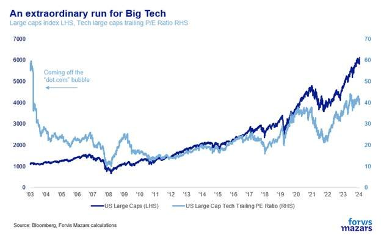
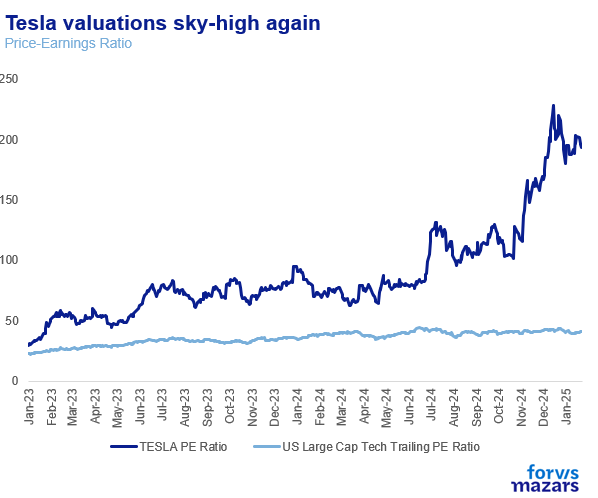
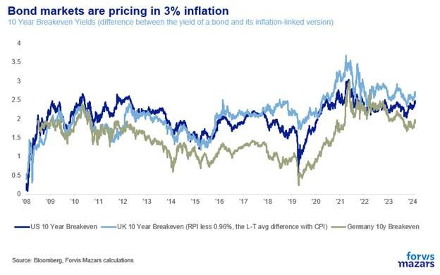

# Week 1: Shock and Awe

**Date:** January 29, 2025  
**Publisher:** Breakwave Advisors | **Category:** Market Insights  
**Original URL:** [https://www.breakwaveadvisors.com/insights/2025/1/27/week-1-shock-and-awe](https://www.breakwaveadvisors.com/insights/2025/1/27/week-1-shock-and-awe)  

---

### The Three Things Investors Should Know This Week:

1. **With a deluge of executive orders and actions in his first few days, Mr Trump already changed the world. It will take time to figure out just how. Rival power centres have thus far been silent, but we must not mistake initial numbness for acceptance. We are merely at the beginning of the game.**
2. **The new government’s first big test of its power will likely come this week if the Fed decides to keep rates unchanged, as expected. Will Mr Trump Challenge the Fed?**
3. **Meanwhile, DeepSeek, a Chinese Large Language Model, as efficient as its counterparts but much cheaper, is ready to challenge Silicon Valley valuations.**

--------------------------------------------

### Summary

The new President pulled many strings at once and holds the record for most executive orders signed on the first day. Some of these orders will likely be challenged in court. Some might be inapplicable. Challenging Congress will also prove difficult. For many of those executive orders to have teeth, funding will be required. Already, the US runs over 6% deficits. Markets took some comfort that the President didn’t immediately announce tariffs like he said he would. However, this view might be a bit short-sighted. The White House seems like it’s playing the slightly longer game, towards tariffs which are not just imposed by executive decree (and thus easily reversed), but are more deeply rooted and backed with legislative action.

So far, equity and bond markets are positive about the prospects of American exceptionalism and thus higher valuations seem more justified. However, we have just entered an era of higher volatility where tech valuations might additionally be challenged by technological developments in the East, like Deepseek. High equity valuations and breakevens haven’t really positioned for a trade war, or a change in the tech-driven narrative. As investors, we need to be analytical and responsive post actual events, simply because the range of possible outcomes is too broad to be tradeable.

### What to Look for This Week

Deepseek, tech earnings and the Fed. Let’s start with the US central bank. If the Fed maintains rates stable, as expected, the finance world will immediately look for a comment from Mr Trump, searching for comments that may jeopardise its independence. At the same time, it will be very interesting to gauge market reactions to tech earnings in light of Deepseek’s debut. Will the AI narrative that launched two-year equity rally and massive investments be disrupted?

---------------------------

*By*[*George Lagarias*](https://www.linkedin.com/in/george-lagarias-mba-3baa769/)

### What Are the Two Things Most History Students Agree On?

**One: Every action invites a reaction, whether immediate or belayed. That’s how the wheels of history turn. And turn they do.**

**Second: The full extent of consequences of actions may take years to play out, and even more to comprehend. No student of history, no matter how astute, can accurately predict the future based on knowledge of the past.**

After Mr Trump’s first week in power, the world certainly changed. We just don’t know how yet. The new President pulled many strings at once and holds the record for most executive orders signed on the first day. Immediately, experts are trying to discern what world we just stepped into, and how things will play out.

Certainly, after such a deluge of change, there’s a modicum of shock and inaction. However, we must not mistake initial numbness for full acceptance. We are merely at the beginning of the game. Some of these orders will likely be challenged in court. Some, like repealing the ban on TikTok until it’s bought by an American investor and the US government, might be inapplicable. Some, like stopping $300bn worth of Green Energy infrastructure (a lot of which goes to Red States) or dismissing inspectors general directly challenge Congress’s budget and oversight prerogatives. Some, like the “Stargate project”, a $500bn AI investment project are set to be funded privately and thus a lot may change depending on the moods of markets. While the goodwill is there, the funds may not be, especially in a world that’s inflationary with higher rates. As for Europe? Mr Trump expressed his frustration with the EU and warned non-US companies to make their product in the US, or face tariffs. Will companies comply? Colombia, which was threatened with 25% tariffs over the weekend after denying land flights with deported immigrants from the US (and capitulated to White House demands), served as a litmus test of how fast things will develop going forward.

Now Mr Trump has expressed some opinions on rates, which he thinks must come down (he didn’t in September). Challenging Congress will also prove difficult. For many of those executive orders to have teeth, funding will be required. Already, the US runs over 6% deficits. Currently, Republicans have an extremely thin majority in Congress and some have little tolerance for extra debt. Already, two Senators (Collins and Murkowski) have downvoted Mr Trump’s pick for the Pentagon. Nearly two score Republican Representatives are “deficit hawks”, so they would want to keep an even keel in terms of spending. And the Democrats, looking at the bigger picture, will likely prefer to let the new administration bear the burden of their choices, as Mr Jeffries’s (House Minority Leader) negative[reaction](https://www.politico.com/live-updates/2025/01/23/congress/dems-fire-aid-debt-limit-00200221)to trade a higher debt ceiling for relief in California suggests.

Markets took some comfort that the President didn’t immediately announce tariffs like he said he would. However, this view might be a bit short-sighted. The White House[issued](https://www.crowell.com/en/insights/client-alerts/Trump-Sets-Stage-for-Future-Tariffs-and-Trade-Actions)a Memorandum which requires various agencies, like the Department of Commerce, the Department of the Treasury, and the Office of the U.S. Trade Representative to deliver over of twenty investigative reports by April 1, 2025, which will describe potentially unfair trade practices of US trade partners. This is a necessary first step towards tariffs which are not just imposed by executive decree (and thus easily reversed), but are more deeply rooted and backed with legislative action.

So far, equity and bond markets are positive about the prospects of American exceptionalism and thus higher valuations seem more justified.

> **Figure 1: Market Chart 1**  
> [Local Asset](file:///C:/Users/Dell/Github/Shipping/corpus/03-breakwave/insights/2025/assets/2025-01-29_week-1-shock-and-awe_img_image004_11a0a13dcb74.jpg)

**However, we have just entered an era of higher volatility, and we are only seeing but the first lines of the first act.**What if Mr Musk falls out with the President? Will Tesla, which has doubled its price since the election continue to justify a 200x trailing PE? How will markets react if the President, who has an Energy not a Tech focus, does not advance the interests of the Magnificent 7, beyond warnings to countries to refrain from fining (“unfairly treating”) American Big Tech?

> **Figure 2: Market Chart 2**  
> [Local Asset](file:///C:/Users/Dell/Github/Shipping/corpus/03-breakwave/insights/2025/assets/2025-01-29_week-1-shock-and-awe_img_image002_cad69200a40d.png)

And even if he did, would that be enough? Last weeks were abuzz with Deepseek, an AI model out of China, which apparently has similar capabilities with Western Large Language Models, like Chat GPT. Unlike them, however, it runs on lower-quality chips and only took a reported $5.5m to train, bringing the whole Silicon Valley AI Model into question. It will be a hot topic ahead of tech earnings this week.

Are bond and equity markets ready for a more inflationary and possibly higher-rate world?

> **Figure 3: Market Chart 3**  
> [Local Asset](file:///C:/Users/Dell/Github/Shipping/corpus/03-breakwave/insights/2025/assets/2025-01-29_week-1-shock-and-awe_img_image005_7fad137c054a.jpg)

Back to our main thought: by testing the absolute limits of the Oval Office, the new US government took on, essentially…. the world. But this is an opening salvo for the West Wing. The world (and by that we mean many and very diverse power centres) will likely not settle for the limits the White House says they should settle for but try to find other ways to continue doing business. Washington power brokers not dependent on the President will likely do the same. The world changed fast. But the speed of the previous turn may well precipitate the velocity and trajectory of the next.**As investors, we need to be analytical and responsive post actual events, simply because the range of possible outcomes is too broad to be tradeable.**

One of the first tests to the limits of Presidential authority will likely come this week, when the Fed is expected to keep rates stable, in opposition to Presidential aspirations that these should come down. The finance world will immediately look for a comment from Mr Trump, searching for comments that may jeopardise the Fed’s independence. In many places, after all, not excluding Europe, central banks are often asked (or coerced) to help with wider growth and stability goals that go far beyond and on occasions against their primary inflation mandates. Mr Draghi’s famous 2012 speech might have saved the Euro, but it left the door open for the central bank to be conscripted to the political goal of keeping the union together.

The Fed is one of the most powerful independent institutions, to be sure, but it still has an open line with the Treasury. Can trade wars even be waged with independent central banks? This particular match was long in the making. And it will likely be one of the first and biggest tests for an Oval Office that seeks to assert its power.

---

**Tags:** Macro, Economy, Markets  
