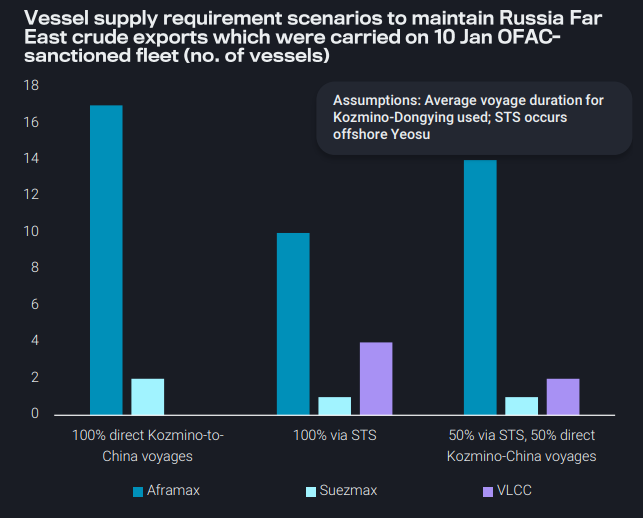
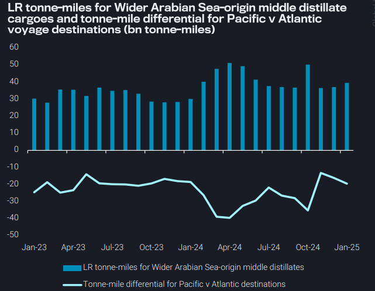
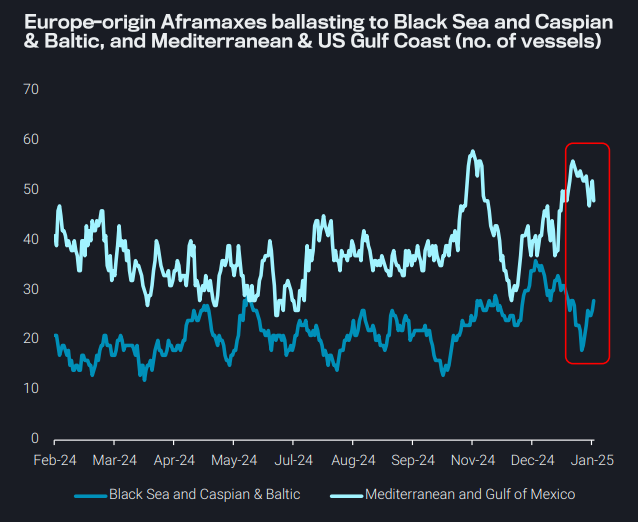
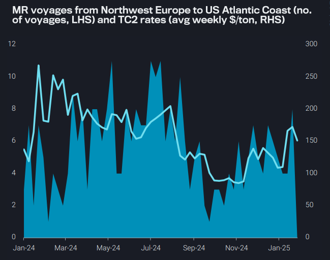

# Reorientation of Wider Arabian Sea middle distillate trade weighs on LRs

**Date:** January 30, 2025  
**Publisher:** Breakwave Advisors | **Category:** Market Insights  
**Original URL:** [https://www.breakwaveadvisors.com/insights/2025/1/30/reorientation-of-wider-arabian-sea-middle-distillate-trade-weighs-on-lrs](https://www.breakwaveadvisors.com/insights/2025/1/30/reorientation-of-wider-arabian-sea-middle-distillate-trade-weighs-on-lrs)  

---

### Key Takeaways From This Report:

- **Dirty – East of Suez:**Short voyage distance means only a small replacement fleet is needed to maintain Kozmino-China flows
- **Clean – East of Suez:**Reorientation of Wider Arabian Sea middle distillate trade weighs on LR tonne-miles
- **Dirty – West of Suez:**European Aframaxes ballast towards the Black Sea and Baltic as other Atlantic destinations decline
- **Clean – West of Suez:**Counter-seasonal gasoline buying from PADD 1 buoys TC2

*By*[*Mary Melton*](https://www.linkedin.com/in/maryemelton/)

## Dirty – East of Suez: Short Voyage Distance Means Only a Small Replacement Fleet Is Needed to Maintain Kozmino-China Flows

If we assume OFAC-sanctioned tankers will not discharge in Chinese ports, what is needed to maintain the same level of Russia Far East crude exports to China carried on the 10 Jan sanctioned fleet?

There are three scenarios that could unfold:

➔ All volumes traded on direct Kozmino-to-China voyages on nonsanctioned Aframax and Suezmaxes

➔ At average voyage duration, 19 vessels are needed, much less than the 75 Russia Far East vessels just sanctioned

➔ 100% of volumes from Kozmino discharge via STS offshore Yeosu, then discharge in Chinese ports

➔ This assumes the use of VLCCs for STS at Yeosu, which increases the logistical efficiency due to the large volume that can discharge on one VLCC parcel

➔ 50:50 split of STS voyages versus direct Kozmino-to-China

Above average delays in discharging will increase the vessel supply requirement, but the relatively small supply requirement illustrates how maintaining exports is feasible (especially as a larger pool of vessels exists for over-price cap trade than is required here)

> **Figure 1: Στιγμιότυπο Οθόνης 2025 01 30 154523**  
> **Interactive Data & Source:** [Vortexa](https://www.vortexa.com//oil-gas-data-traders-analysts-data-scientists?gclid=Cj0KCQjw8_qRBhCXARIsAE2AtRZKOvMnbilZ_6_91d7huSFFy71pWLrnPwGwOHVzXsmsG-1a1mZnQw8aAt89EALw_wcB&hsa_acc=1782073842&hsa_ad=548425387665&hsa_cam=14746637662&hsa_grp=125038601902&hsa_kw=&hsa_mt=&hsa_net=adwords&hsa_src=g&hsa_tgt=dsa-1431852288425&hsa_ver=3&utm_campaign=%5BCD%5D%20-%20DSA%20-%20EMEA&utm_medium=cpc&utm_medium=ppc&utm_source=google&utm_source=adwords&utm_term=) | [Local Asset](file:///C:/Users/Dell/Github/Shipping/corpus/03-breakwave/insights/2025/assets/2025-01-30_reorientation-of-wider-arabian-sea-middle-distillate-trade-weighs-on-lrs_img_cea3cf84ceb9ceb3cebcceb9cf8ccf84cf85_56808ddedc25.png)

## Clean – East of Suez: Reorientation of Wider Arabian Sea Middle Distillate Trade Weighs on Lr Tonne-Miles

Since September, weakening middle distillate demand in Europe, high stocks and ample TA diesel barrels (TC14) have initiated a structural reshuffling of Wider Arabian Sea (Middle East Gulf, India West Coast) middle distillates from the Atlantic to the Pacific

This is clearly weighing on the freight market due to the shorter voyage distances and less overall tonne-miles for LRs facilitating these volumes (blue bars on RHS chart)

The narrowing differential between tonne-miles for these Wider Arabian Sea volumes going to the Pacific vs Atlantic (blue line on RHS chart) reflects high voyage counts to the Pacific

➔ On average, voyage distance to Pacific Basin destinations is 70% less than to the Atlantic due to the Cape of Good Hope diversion

Unless European middle distillate demand picks up again and increasing volumes head to the Atlantic, global LR tonne-miles will likely remain under pressure

➔ This will be further pressured by a reopening of transits via the Bab-el-Mandeb, but evidence of this is yet to be seen

> **Figure 2: Στιγμιότυπο Οθόνης 2025 01 30 154739**  
> **Interactive Data & Source:** [Vortexa](https://www.vortexa.com//oil-gas-data-traders-analysts-data-scientists?gclid=Cj0KCQjw8_qRBhCXARIsAE2AtRZKOvMnbilZ_6_91d7huSFFy71pWLrnPwGwOHVzXsmsG-1a1mZnQw8aAt89EALw_wcB&hsa_acc=1782073842&hsa_ad=548425387665&hsa_cam=14746637662&hsa_grp=125038601902&hsa_kw=&hsa_mt=&hsa_net=adwords&hsa_src=g&hsa_tgt=dsa-1431852288425&hsa_ver=3&utm_campaign=%5BCD%5D%20-%20DSA%20-%20EMEA&utm_medium=cpc&utm_medium=ppc&utm_source=google&utm_source=adwords&utm_term=) | [Local Asset](file:///C:/Users/Dell/Github/Shipping/corpus/03-breakwave/insights/2025/assets/2025-01-30_reorientation-of-wider-arabian-sea-middle-distillate-trade-weighs-on-lrs_img_cea3cf84ceb9ceb3cebcceb9cf8ccf84cf85_c1069c352a8b.png)

## Dirty – West of Suez: European Aframaxes Ballast Towards the Black Sea and Baltic As Other Atlantic Destinations Decline

After a European discharge, fewer vessels are ballasting towards the Med and Gulf of Mexico, as Cross-Med (TD19) and transatlantic (TD25) rates slow as European refinery turnaround season begins

Instead, ballast Aframaxes are heading to the Black Sea and Baltic in higher numbers

➔ Most of the vessels ballasting towards the Black Sea have a history of loading CPC Blend, so there is no indication these will facilitate Russian crudes subject to the price cap

➔ The vessels heading to the Russia Baltic have loaded Russian crude before

➔ This could point to an absence of below-price cap discounts in Russian Urals, because no new Westernoperated vessels are yet being enticed to lift Russian exports

> **Figure 3: Στιγμιότυπο Οθόνης 2025 01 30 154936**  
> **Interactive Data & Source:** [Vortexa](https://www.vortexa.com//oil-gas-data-traders-analysts-data-scientists?gclid=Cj0KCQjw8_qRBhCXARIsAE2AtRZKOvMnbilZ_6_91d7huSFFy71pWLrnPwGwOHVzXsmsG-1a1mZnQw8aAt89EALw_wcB&hsa_acc=1782073842&hsa_ad=548425387665&hsa_cam=14746637662&hsa_grp=125038601902&hsa_kw=&hsa_mt=&hsa_net=adwords&hsa_src=g&hsa_tgt=dsa-1431852288425&hsa_ver=3&utm_campaign=%5BCD%5D%20-%20DSA%20-%20EMEA&utm_medium=cpc&utm_medium=ppc&utm_source=google&utm_source=adwords&utm_term=) | [Local Asset](file:///C:/Users/Dell/Github/Shipping/corpus/03-breakwave/insights/2025/assets/2025-01-30_reorientation-of-wider-arabian-sea-middle-distillate-trade-weighs-on-lrs_img_cea3cf84ceb9ceb3cebcceb9cf8ccf84cf85_561a6e961ec2.png)

## Clean – West of Suez: Counter-Seasonal Gasoline Buying From Padd 1 Buoys Tc2

MR gasoline voyages from Northwest Europe-to-US Atlantic Coast (TC2) rise toward the end of January, even though there are currently historical lows for gasoline exports out of the ARA region

➔ Gasoline loadings in Northwest Europe pointed toward US Atlantic Coast nearly double week-on-week despite gasoline stocks in PADD 1 (EIA) looking healthy for this time of year

➔ Independently-held ARA gasoline stocks reach their highest level since at least 2011, as blending activity for summer spec gasoline drives activity (Argus)

➔ PADD 1 refinery utilisation rates drop to 81% for week ending January 17, 2025 (EIA)

These counter-seasonal high loadings are likely be a push factor due to building stocks in ARA due to lack of gasoline outlets combined with the possibility of buying before any tariffs are placed on Canadian gasoline imports into the US

Looking forward, rising prompt vessel availability in NW Europe appear to be keeping a lid on TC2 rates

> **Figure 4: Στιγμιότυπο Οθόνης 2025 01 30 155151**  
> **Interactive Data & Source:** [Vortexa](https://www.vortexa.com//oil-gas-data-traders-analysts-data-scientists?gclid=Cj0KCQjw8_qRBhCXARIsAE2AtRZKOvMnbilZ_6_91d7huSFFy71pWLrnPwGwOHVzXsmsG-1a1mZnQw8aAt89EALw_wcB&hsa_acc=1782073842&hsa_ad=548425387665&hsa_cam=14746637662&hsa_grp=125038601902&hsa_kw=&hsa_mt=&hsa_net=adwords&hsa_src=g&hsa_tgt=dsa-1431852288425&hsa_ver=3&utm_campaign=%5BCD%5D%20-%20DSA%20-%20EMEA&utm_medium=cpc&utm_medium=ppc&utm_source=google&utm_source=adwords&utm_term=) | [Local Asset](file:///C:/Users/Dell/Github/Shipping/corpus/03-breakwave/insights/2025/assets/2025-01-30_reorientation-of-wider-arabian-sea-middle-distillate-trade-weighs-on-lrs_img_cea3cf84ceb9ceb3cebcceb9cf8ccf84cf85_b9e0eebb96a9.png)

Data Source:[Vortexa](https://www.vortexa.com//oil-gas-data-traders-analysts-data-scientists?gclid=Cj0KCQjw8_qRBhCXARIsAE2AtRZKOvMnbilZ_6_91d7huSFFy71pWLrnPwGwOHVzXsmsG-1a1mZnQw8aAt89EALw_wcB&hsa_acc=1782073842&hsa_ad=548425387665&hsa_cam=14746637662&hsa_grp=125038601902&hsa_kw=&hsa_mt=&hsa_net=adwords&hsa_src=g&hsa_tgt=dsa-1431852288425&hsa_ver=3&utm_campaign=%5BCD%5D%20-%20DSA%20-%20EMEA&utm_medium=cpc&utm_medium=ppc&utm_source=google&utm_source=adwords&utm_term=)

---

**Tags:** Crude, Markets, Shipping  
