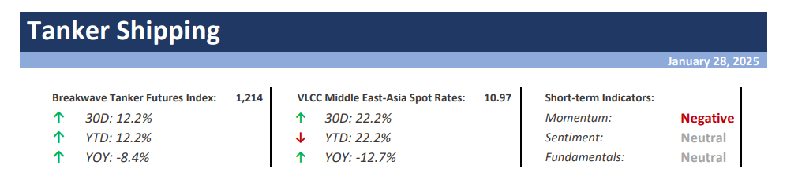
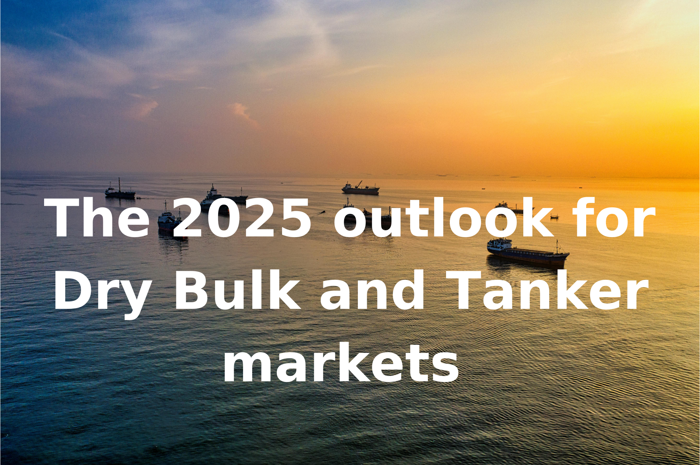

# Breakwave Weekend Read

**Date:** January 31, 2025  
**Publisher:** Breakwave Advisors | **Category:** Market Insights  
**Original URL:** [https://www.breakwaveadvisors.com/insights/2024/10/25/breakwave-weekend-read-4cn8n-wg9gj-jk5sb-4ckhh-cagw9-r4yzg-j3ggn](https://www.breakwaveadvisors.com/insights/2024/10/25/breakwave-weekend-read-4cn8n-wg9gj-jk5sb-4ckhh-cagw9-r4yzg-j3ggn)  

---

## Welcome Tobreakwave Advisorsweekend Read

As the week comes to a close, take a moment to review the key insights from the past few days. Missed something? We've gathered all the top insights for you to catch up at your convenience.

## Breakwave Shipping Report

**VLCC Market Cools Amid Sanctions, Holiday Slowdown, and Increased Uncertainty**– The VLCC (Very Large Crude Carrier) freight market, which experienced a significant surge earlier this month following the implementation of new Russian shipping sanctions, has rapidly cooled as January nears its end.

[Read More](https://www.breakwaveadvisors.com/insights/2025128wet-kji2577)

> **Figure 1: Στιγμιότυπο Οθόνης 2025 01 28 123016**  
> **Interactive Data & Source:** [Breakwave Advisors Market Insights](https://www.breakwaveadvisors.com/insights/2025/1/26/first-five-days) | [Local Asset](file:///C:/Users/Dell/Github/Shipping/corpus/03-breakwave/insights/2025/assets/2025-01-31_breakwave-weekend-read-4cn8n-wg9gj-jk5sb-4ckhh-cagw9-r4yzg-j3ggn_img_cea3cf84ceb9ceb3cebcceb9cf8ccf84cf85_d9955af9ff18.png)

## First Five Days

> **Figure 2: Ανώνυμο Σχέδιο (8)**  
> **Interactive Data & Source:** [Breakwave Advisors Market Insights](https://www.breakwaveadvisors.com/insights/2025/1/26/first-five-days) | [Local Asset](file:///C:/Users/Dell/Github/Shipping/corpus/03-breakwave/insights/2025/assets/2025-01-31_breakwave-weekend-read-4cn8n-wg9gj-jk5sb-4ckhh-cagw9-r4yzg-j3ggn_img_ce91cebdcf8ecebdcf85cebccebfcf83cf87_3d662e508aee.png)

Following a very impactful end to the Biden era, the oil and tanker markets expected Trump’s second stint in the White House to start where Biden left off.

[Read More](https://www.breakwaveadvisors.com/insights/2025/1/26/first-five-days)

Gibson Tanker Market Report

## World Economic Outlook

> **Figure 3: Ανώνυμο Σχέδιο (9)**  
> **Interactive Data & Source:** [Breakwave Advisors Market Insights](https://www.breakwaveadvisors.com/insights/2025/1/26/world-economic-outlook) | [Local Asset](file:///C:/Users/Dell/Github/Shipping/corpus/03-breakwave/insights/2025/assets/2025-01-31_breakwave-weekend-read-4cn8n-wg9gj-jk5sb-4ckhh-cagw9-r4yzg-j3ggn_img_ce91cebdcf8ecebdcf85cebccebfcf83cf87_12f9e0c825d6.png)

Weak freight rates across all segments, compounded by heightened uncertainty and seasonal factors, have further weighed on market sentiment and daily earnings.

[Read More](https://www.breakwaveadvisors.com/insights/2025/1/26/world-economic-outlook)

Doric Weekly Market Insights

## The 2025 Outlook for Dry Bulk and Tanker Markets

> **Figure 4: The 2025 Outlook for Dry Bulk and Tanker Markets**  
> **Interactive Data & Source:** [Breakwave Advisors Market Insights](https://www.breakwaveadvisors.com/insights/2025/1/27/the-2025-outlook-for-dry-bulk-and-tanker-markets) | [Local Asset](file:///C:/Users/Dell/Github/Shipping/corpus/03-breakwave/insights/2025/assets/2025-01-31_breakwave-weekend-read-4cn8n-wg9gj-jk5sb-4ckhh-cagw9-r4yzg-j3ggn_img_the2025outlookfordrybulkandtankermar_2c028018ae14.png)

The 2025 outlook for Dry Bulk and Tanker markets paints a picture of opportunity, volatility and emerging new trends in trade.

[Read More](https://www.breakwaveadvisors.com/insights/2025/1/27/the-2025-outlook-for-dry-bulk-and-tanker-markets)

The 2025 Outlook

## India’s Crude Intake Changes Towards Middle East Barrels While Refined Product Exports Pivot to East of Suez

> **Figure 5: India’s Crude Intake Changes Towards Middle East Barrels While Refined Product Exports Pivot to East of Suez**  
> **Interactive Data & Source:** [Breakwave Advisors Market Insights](https://www.breakwaveadvisors.com/insights/2025/1/27/indias-crude-intake-changes-towards-middle-east-barrels-while-refined-product-exports-pivot-to-east-of-suez) | [Local Asset](file:///C:/Users/Dell/Github/Shipping/corpus/03-breakwave/insights/2025/assets/2025-01-31_breakwave-weekend-read-4cn8n-wg9gj-jk5sb-4ckhh-cagw9-r4yzg-j3ggn_img_indiae28099scrudeintakechangestoward_11b5678d4e98.png)

Easing trade tension helped push commodity markets higher. This was aided by the lingering pact of strong economic data from China.

[Read More](https://www.breakwaveadvisors.com/insights/2025/1/27/indias-crude-intake-changes-towards-middle-east-barrels-while-refined-product-exports-pivot-to-east-of-suez)

Vortexa Freight Weekly

## A Tech Correction

> **Figure 6: Ανώνυμο Σχέδιο (10)**  
> **Interactive Data & Source:** [Breakwave Advisors Market Insights](https://www.breakwaveadvisors.com/insights/2025/1/28/a-tech-correction) | [Local Asset](file:///C:/Users/Dell/Github/Shipping/corpus/03-breakwave/insights/2025/assets/2025-01-31_breakwave-weekend-read-4cn8n-wg9gj-jk5sb-4ckhh-cagw9-r4yzg-j3ggn_img_ce91cebdcf8ecebdcf85cebccebfcf83cf87_dc0c8c78593b.png)

In the past few days, a Chinese Large Language Model (LLM (what most people call AI) called Deepseek made its debut, upsetting global financial markets.

[Read More](https://www.breakwaveadvisors.com/insights/2025/1/28/a-tech-correction)

Forvis Mazars Note

## Commodities Struggle Amid Risk-Off Tone Across Markets

> **Figure 7: Commodities Struggle Amid Risk Off Tone Across Markets**  
> **Interactive Data & Source:** [Breakwave Advisors Market Insights](https://www.breakwaveadvisors.com/insights/2025/1/28/commodities-struggle-amid-risk-off-tone-across-markets) | [Local Asset](file:///C:/Users/Dell/Github/Shipping/corpus/03-breakwave/insights/2025/assets/2025-01-31_breakwave-weekend-read-4cn8n-wg9gj-jk5sb-4ckhh-cagw9-r4yzg-j3ggn_img_commoditiesstruggleamidrisk-offtonea_69d742c52152.png)

A risk-off tone across wider markets weighed on sentiment in energy and metal sectors.

Commodities Wrap

## Week 1: Shock and Awe

> **Figure 8: Week 1 Shock and Awe (1)**  
> **Interactive Data & Source:** [Breakwave Advisors Market Insights](https://www.breakwaveadvisors.com/insights/2025/1/27/week-1-shock-and-awe) | [Local Asset](file:///C:/Users/Dell/Github/Shipping/corpus/03-breakwave/insights/2025/assets/2025-01-31_breakwave-weekend-read-4cn8n-wg9gj-jk5sb-4ckhh-cagw9-r4yzg-j3ggn_img_week1shockandawe28129_f057dc054112.png)

The new President pulled many strings at once and holds the record for most executive orders signed on the first day.

[Read More](https://www.breakwaveadvisors.com/insights/2025/1/27/week-1-shock-and-awe)

Forvis Mazars Weekly Note

## Demolition Activity

> **Figure 9: Προσθέστε Επικεφαλίδα (3)**  
> **Interactive Data & Source:** [Breakwave Advisors Market Insights](https://www.breakwaveadvisors.com/insights/2025/1/29/demolition-activity) | [Local Asset](file:///C:/Users/Dell/Github/Shipping/corpus/03-breakwave/insights/2025/assets/2025-01-31_breakwave-weekend-read-4cn8n-wg9gj-jk5sb-4ckhh-cagw9-r4yzg-j3ggn_img_cea0cf81cebfcf83ceb8ceadcf83cf84ceb5_61fafc7ad904.png)

Building on our previous report, in which we analyzed the projected bulk carrier deliveries for 2025,

[Read More](https://www.breakwaveadvisors.com/insights/2025/1/29/demolition-activity)

Intermodal Weekly Market Report

## Uncertainty vs Volatility – And the Difference Between Flows and Freight

> **Figure 10: Ανώνυμο Σχέδιο (11)**  
> **Interactive Data & Source:** [Breakwave Advisors Market Insights](https://www.breakwaveadvisors.com/insights/2025/1/29/uncertainty-vs-volatility-and-the-difference-between-flows-and-freight) | [Local Asset](file:///C:/Users/Dell/Github/Shipping/corpus/03-breakwave/insights/2025/assets/2025-01-31_breakwave-weekend-read-4cn8n-wg9gj-jk5sb-4ckhh-cagw9-r4yzg-j3ggn_img_ce91cebdcf8ecebdcf85cebccebfcf83cf87_4cc972dfa9a5.png)

In this big picture take, we try to dissect uncertainty from volatility, looking at the diverging fields of supply/demand and with that overall trade levels, as opposed to tonne-mileage in the freight market.

Vortexa Freight Weekly

## Capesize Market Insights

> **Figure 11: Ανώνυμο Σχέδιο (12)**  
> **Interactive Data & Source:** [Breakwave Advisors Market Insights](https://www.breakwaveadvisors.com/insights/2025/1/30/capesize-market-insights) | [Local Asset](file:///C:/Users/Dell/Github/Shipping/corpus/03-breakwave/insights/2025/assets/2025-01-31_breakwave-weekend-read-4cn8n-wg9gj-jk5sb-4ckhh-cagw9-r4yzg-j3ggn_img_ce91cebdcf8ecebdcf85cebccebfcf83cf87_d7c54de43ec8.png)

The momentum in the freight market has weakened as we approached the end of January and the onset of the Chinese New Year.

[Read More](https://www.breakwaveadvisors.com/insights/2025/1/30/capesize-market-insights)

Signal Ocean Dry Weekly Market Monitor

## Reorientation of Wider Arabian Sea Middle Distillate Trade Weighs on Lrs

> **Figure 12: Reorientation of Wider Arabian Sea Middle Distillate Trade Weighs on Lrs**  
> **Interactive Data & Source:** [Breakwave Advisors Market Insights](https://www.breakwaveadvisors.com/insights/2025/1/30/reorientation-of-wider-arabian-sea-middle-distillate-trade-weighs-on-lrs) | [Local Asset](file:///C:/Users/Dell/Github/Shipping/corpus/03-breakwave/insights/2025/assets/2025-01-31_breakwave-weekend-read-4cn8n-wg9gj-jk5sb-4ckhh-cagw9-r4yzg-j3ggn_img_reorientationofwiderarabianseamiddle_66479cab9968.png)

Dirty – East of Suez: Short voyage distance means only a small replacement fleet is needed to maintain Kozmino-China flows

Vortexa Global Freight Snapshot

## Where India Stands with Coal

> **Figure 13: Ανώνυμο Σχέδιο (13)**  
> **Interactive Data & Source:** [Breakwave Advisors Market Insights](https://www.breakwaveadvisors.com/insights/2025/1/31/where-india-stands-with-coal) | [Local Asset](file:///C:/Users/Dell/Github/Shipping/corpus/03-breakwave/insights/2025/assets/2025-01-31_breakwave-weekend-read-4cn8n-wg9gj-jk5sb-4ckhh-cagw9-r4yzg-j3ggn_img_ce91cebdcf8ecebdcf85cebccebfcf83cf87_00a2363173d0.png)

This week, we aim to broaden the discussion by looking at India's fossil fuel demand and the associated trends in the coal market.

[Read More](https://www.breakwaveadvisors.com/insights/2025/1/31/where-india-stands-with-coal)

BRS Weekly Dry Bulk Newsletter

---

**Tags:** Shipping, Tankers, Drybulk  
