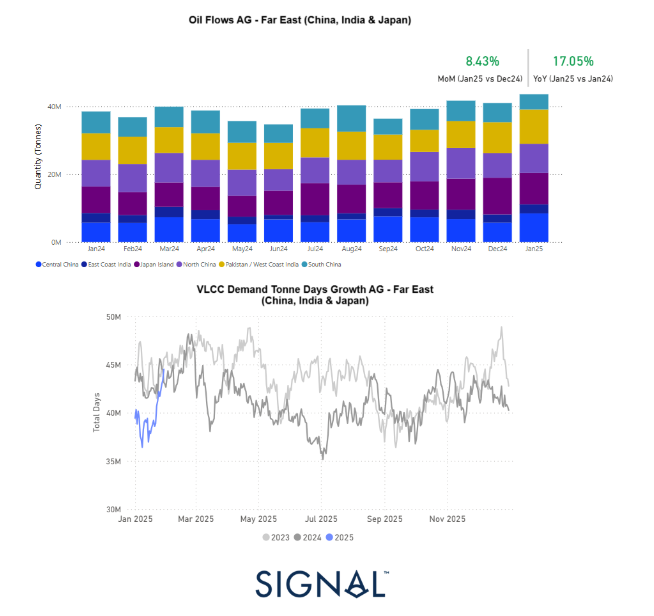
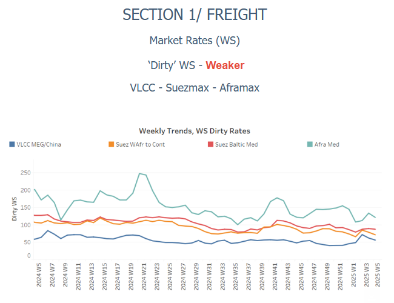
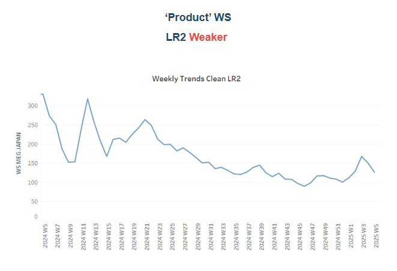
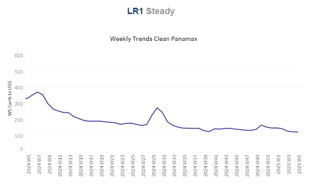
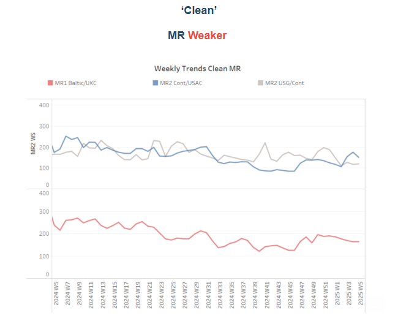
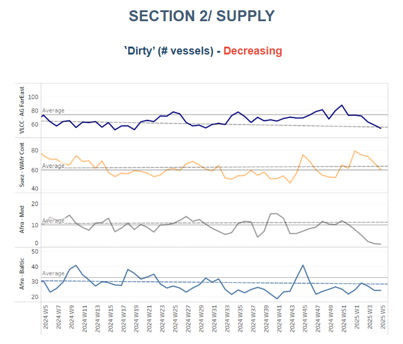
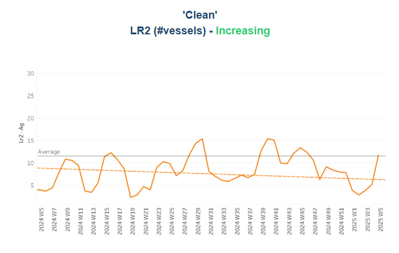
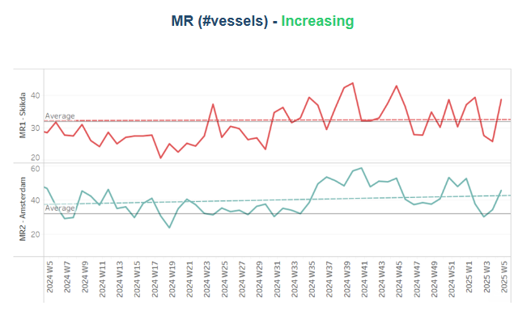
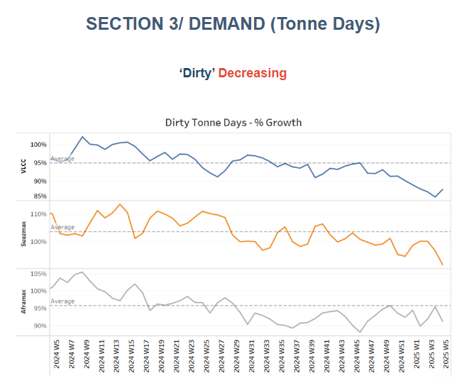
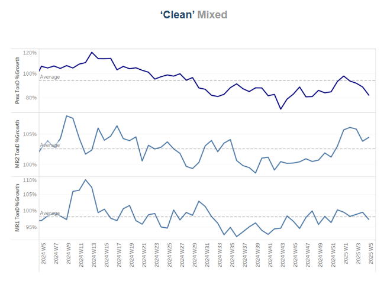

# Dirty Oil Flows

**Date:** January 31, 2025  
**Publisher:** Breakwave Advisors | **Category:** Market Insights  
**Original URL:** [https://www.breakwaveadvisors.com/insights/2025/1/31/dirty-oil-flows](https://www.breakwaveadvisors.com/insights/2025/1/31/dirty-oil-flows)  

---

### Tanker - Weekly Market Monitor

Snapshot of Crude and Product Freight Rates, Supply-Demand

Week 05, January 30, 2025

## Chart of the Week: Dirty Oil Flows and Tonne Days (Arabian Gulf - Far East)

*This week's focus centres on comparing the evolution of dirty oil from the Arabian Gulf (AG) to the Far East and the growth of tonne days.*

> **Figure 1: Στιγμιότυπο Οθόνης 2025 01 31 101255**  
> **Interactive Data & Source:** [Signal Ocean Platform](https://www.thesignalgroup.com/signal-ocean-platform) | [Local Asset](file:///C:/Users/Dell/Github/Shipping/corpus/03-breakwave/insights/2025/assets/2025-01-31_dirty-oil-flows_img_cea3cf84ceb9ceb3cebcceb9cf8ccf84cf85_2cdd6bedf4f1.png)

January closed with weakening momentum in the dirty freight market, as the growth rate of demand tonne-days has yet to support a notable recovery. However, there are encouraging signs on the supply side, with vessel availability in the Arabian Gulf (AG) trending downward. Additionally, January saw an improvement in AG dirty oil shipments to Far Eastern destinations, with an 8% increase in December 2024 volumes compared to November and a significant 17% rise compared to January 2024.

Examining the VLCC demand tonne-days growth from the AG to the Far East, January marked a strong rebound from the record lows at the start of the year. The growth pace now appears to be aligning with levels seen during the same period in 2024, signalling a potential stabilisation.

These recent trends paint a more optimistic outlook for Far Eastern demand, with China and India playing key roles in driving sentiment toward a firmer freight market in the first quarter. If this momentum continues, it could support a more sustained recovery in the coming months.

> **Figure 2: Στιγμιότυπο Οθόνης 2025 01 31 101428**  
> **Interactive Data & Source:** [Signal Ocean Platform](https://www.thesignalgroup.com/signal-ocean-platform) | [Local Asset](file:///C:/Users/Dell/Github/Shipping/corpus/03-breakwave/insights/2025/assets/2025-01-31_dirty-oil-flows_img_cea3cf84ceb9ceb3cebcceb9cf8ccf84cf85_3575e90d83a0.png)

Sentiment in the dirty freight market has weakened, with the recent spikes in the Aframax Mediterranean now showing signs of a downward revision from the peak observed two weeks ago.

- VLCC**MEG-China**freight rates maintained the same weakening sentiment as the previous week, hovering around 53 WS. This marks a 5% decline compared to the annual average, while monthly improvement stands at 29%.**Suezmax rates**for shipments from**West Africa**to**continental Europe**have dropped to 73 WS, representing a 30% decrease compared to the same week last year. Meanwhile, Suezmax rates on the**Baltic-Mediterranean**route have remained below 90 WS for the past two weeks, also down 30% year-on-year.
- Aframax**Mediterranean**freight rates have been revised downward to WS 120, reflecting a 14% decline over the past week and a 40% drop compared to the same period last year.

> **Figure 3: Στιγμιότυπο Οθόνης 2025 01 31 101511**  
> **Interactive Data & Source:** [Signal Ocean Platform](https://www.thesignalgroup.com/signal-ocean-platform) | [Local Asset](file:///C:/Users/Dell/Github/Shipping/corpus/03-breakwave/insights/2025/assets/2025-01-31_dirty-oil-flows_img_cea3cf84ceb9ceb3cebcceb9cf8ccf84cf85_64ad98278422.png)

- **LR2**AG freight rates dropped significantly to WS 120, marking a 11% decrease month-on-month, while they remain 60% lower compared to the same period last year.

> **Figure 4: Στιγμιότυπο Οθόνης 2025 01 31 101606**  
> **Interactive Data & Source:** [Signal Ocean Platform](https://www.thesignalgroup.com/signal-ocean-platform) | [Local Asset](file:///C:/Users/Dell/Github/Shipping/corpus/03-breakwave/insights/2025/assets/2025-01-31_dirty-oil-flows_img_cea3cf84ceb9ceb3cebcceb9cf8ccf84cf85_ea1409f01e72.png)

- **Panamax**Carib-to-USG rates confirmed a stable throughout January hovering around WS 125. Recent levels reflect a 60% decrease compared to the same period last year.

> **Figure 5: Στιγμιότυπο Οθόνης 2025 01 31 101732**  
> **Interactive Data & Source:** [Signal Ocean Platform](https://www.thesignalgroup.com/signal-ocean-platform) | [Local Asset](file:///C:/Users/Dell/Github/Shipping/corpus/03-breakwave/insights/2025/assets/2025-01-31_dirty-oil-flows_img_cea3cf84ceb9ceb3cebcceb9cf8ccf84cf85_ce3505a00ad6.png)

- **MR1**rates for shipments from the Baltic to the Continent have been revised downward to 160 WS, marking a 50% decline compared to the same week last year.

- Meanwhile,**MR2**rates for shipments from the Continent to the US Atlantic Coast (USAC) dropped to WS 140, reflecting a 20% decline month-over-month. In contrast, MR2 rates on the US Gulf-to-Continent route remained at the weakened levels of the previous week, holding at WS 120, which represents a 30% decrease compared to the same period last year.

> **Figure 6: Στιγμιότυπο Οθόνης 2025 01 31 102847**  
> **Interactive Data & Source:** [Signal Ocean Platform](https://www.thesignalgroup.com/signal-ocean-platform) | [Local Asset](file:///C:/Users/Dell/Github/Shipping/corpus/03-breakwave/insights/2025/assets/2025-01-31_dirty-oil-flows_img_cea3cf84ceb9ceb3cebcceb9cf8ccf84cf85_8f44380828a4.png)

​​​​​​The supply of crude tankers continued its downward trend from the previous week, remaining below the annual average on key routes such as the VLCC AG-Far East, Aframax Mediterranean, and Baltic. However, whether this trend will persist into February remains uncertain. A tightening of vessel availability could bolster freight market sentiment following the Chinese New Year celebrations.

- **VLCC Ras Tanura**: The ship count has decreased to 60, marking a reduction of 13 from the annual average and nearly 24 fewer than the figures recorded before the end of December.
- **Suezmax Wafr**: The current ship count is 60, following a 12-ship increase over the annual average in the previous week. However, it remains uncertain whether this trend will continue or dip below the annual average in early February.
- **Aframax Med**: Vessel availability remains limited, indicating that these notably low levels are likely to continue throughout February, with the vessel count consistently staying below the annual average since the start of January.
- **Aframax Baltic**: The number of ships has remained consistent with the previous three weeks, staying below the annual average of 30, at approximately 24.

> **Figure 7: Στιγμιότυπο Οθόνης 2025 01 31 102937**  
> **Interactive Data & Source:** [Signal Ocean Platform](https://www.thesignalgroup.com/signal-ocean-platform) | [Local Asset](file:///C:/Users/Dell/Github/Shipping/corpus/03-breakwave/insights/2025/assets/2025-01-31_dirty-oil-flows_img_cea3cf84ceb9ceb3cebcceb9cf8ccf84cf85_6942d9bc067d.png)

> **Figure 8: Στιγμιότυπο Οθόνης 2025 01 31 102947**  
> **Interactive Data & Source:** [Signal Ocean Platform](https://www.thesignalgroup.com/signal-ocean-platform) | [Local Asset](file:///C:/Users/Dell/Github/Shipping/corpus/03-breakwave/insights/2025/assets/2025-01-31_dirty-oil-flows_img_cea3cf84ceb9ceb3cebcceb9cf8ccf84cf85_cf215d69ab05.png)

- **Clean LR2 AG Jubail**: The end-of-month trend confirmed an upward trajectory, with levels now approaching and poised to surpass the annual average of 11.

- **Clean MR**: At Algeria's Skikda port, the number of vessels has risen to 39, exceeding the annual average by nearly 7. Meanwhile, MR2 activity in Amsterdam continues to rise, consistently staying above the annual average of 30—up by 16 compared to two weeks ago.

> **Figure 9: Στιγμιότυπο Οθόνης 2025 01 31 103053**  
> **Interactive Data & Source:** [Signal Ocean Platform](https://www.thesignalgroup.com/signal-ocean-platform) | [Local Asset](file:///C:/Users/Dell/Github/Shipping/corpus/03-breakwave/insights/2025/assets/2025-01-31_dirty-oil-flows_img_cea3cf84ceb9ceb3cebcceb9cf8ccf84cf85_f33de5ea2885.png)

- **Dirty**tonne days: The VLCC segment, after a notable decline in dirty tonne-day growth throughout January, appears to have reached its lowest point by the end of last week. However, a soft upward correction seems to be emerging, though it remains to be confirmed in early February. In contrast, the Suezmax and Aframax segments have experienced a downward correction, following expectations for growth rates above the annual average just two weeks ago.

> **Figure 10: Στιγμιότυπο Οθόνης 2025 01 31 103148**  
> **Interactive Data & Source:** [Signal Ocean Platform](https://www.thesignalgroup.com/signal-ocean-platform) | [Local Asset](file:///C:/Users/Dell/Github/Shipping/corpus/03-breakwave/insights/2025/assets/2025-01-31_dirty-oil-flows_img_cea3cf84ceb9ceb3cebcceb9cf8ccf84cf85_92e3ea4d691d.png)

- **Panamax**tonne days: The growth rate, which showed signs of a relatively steady trend in the first half of January, has since dropped significantly. It is now notably lower than the annual average following the peak observed at the end of last year.

- **MR**tonne-days: The growth rate for the MR2 vessel size segment has consistently outpaced that of the MR1 segment, maintaining a firmer pace throughout the recent period. Meanwhile, demand for the MR1 segment has shown signs of growth, though it remains slightly below the annual trend. This suggests a more cautious recovery for MR1 vessels compared to the MR2 segment.

Data Source:[Signal Ocean Platform](https://www.thesignalgroup.com/signal-ocean-platform)

---

**Tags:** Tankers, Shipping, Markets  
