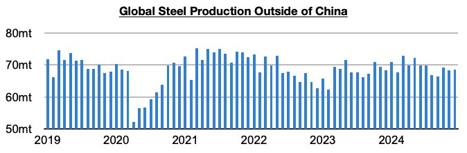
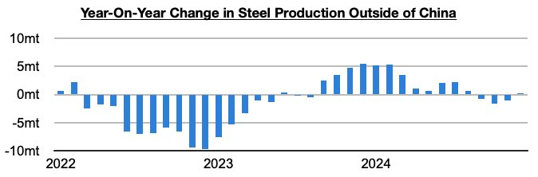
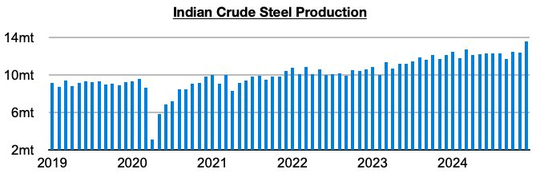

# Indian Steel Production Sets Another Record

**Date:** February 03, 2025  
**Publisher:** Breakwave Advisors | **Category:** Market Insights  
**Original URL:** [https://www.breakwaveadvisors.com/insights/2025/2/3/indian-steel-production-sets-another-record](https://www.breakwaveadvisors.com/insights/2025/2/3/indian-steel-production-sets-another-record)  

---

*By*[*Jeffrey Landsberg*](https://www.linkedin.com/in/jeffrey-landsberg-70ab957/)

As we discussed in Commodore Research's most recent Weekly Executive Report, global steel production totaled approximately 144.5 million tons in December. This is down month-on-month by 2.3 million tons (-2%) but is 8.8 million tons (7%) more than was reported last year for December 2023’s production. Steel production outside of China totaled approximately 68.5 million tons. This is up month-on-month by 100,000 tons and is 200,000 tons more than was reported last year for December’s production.

> **Figure 1: Chart 1**  
> [Local Asset](file:///C:/Users/Dell/Github/Shipping/corpus/03-breakwave/insights/2025/assets/2025-02-03_indian-steel-production-sets-another-record_img_chart1_11d44b43054c.jpg)

While steel production outside of China has found year-on-year growth again (it previously contracted on a year-on-year basis for three straight months), the growth has largely come from India. Contractions remain ongoing in many nations including Russia, Japan, and South Korea.

> **Figure 2: Chart 2**  
> [Local Asset](file:///C:/Users/Dell/Github/Shipping/corpus/03-breakwave/insights/2025/assets/2025-02-03_indian-steel-production-sets-another-record_img_chart2_2f4ba7103e52.jpg)

Indian steel production totaled 13.6 million tons in December. This is up month-on-month by 1.2 million tons (10%) and is 1.5 million tons (12%) more than was reported last year for December’s 2023’s production. Production has now grownfor twenty-two straight months. December's 12% year-on-year growth has marked the largest growth seen since April.

> **Figure 3: Chart 3**  
> [Local Asset](file:///C:/Users/Dell/Github/Shipping/corpus/03-breakwave/insights/2025/assets/2025-02-03_indian-steel-production-sets-another-record_img_chart3_81da6365c8d6.jpg)

---

**Tags:** Shipping, Drybulk, Ironore  
