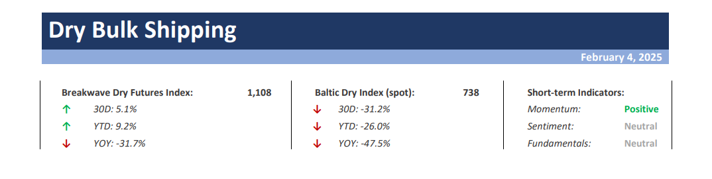
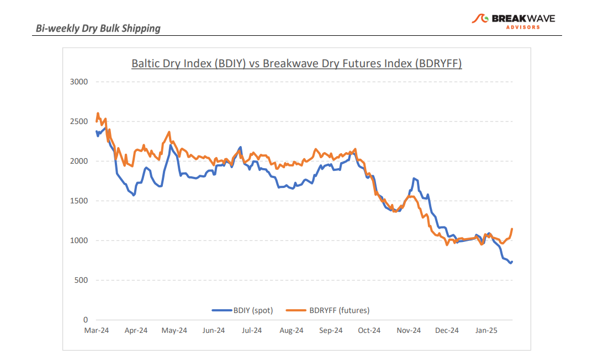
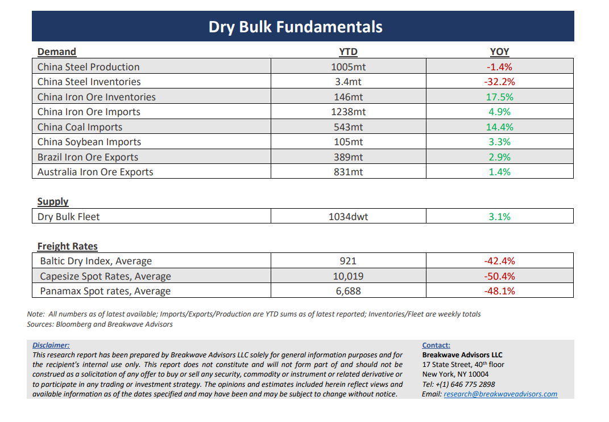

# Breakwave Bi-Weekly Dry Bulk Report - February 4, 2025

**Date:** February 04, 2025  
**Publisher:** Breakwave Advisors | **Category:** Market Insights  
**Original URL:** [https://www.breakwaveadvisors.com/insights/202524dry-87w52k8-bjj68](https://www.breakwaveadvisors.com/insights/202524dry-87w52k8-bjj68)  

---

> **Figure 1: Cea3cf84ceb9ceb3cebcceb9cf8ccf84cf85**  
> [Local Asset](file:///C:/Users/Dell/Github/Shipping/corpus/03-breakwave/insights/2025/assets/2025-02-04_202524dry-87w52k8-bjj68_img_cea3cf84ceb9ceb3cebcceb9cf8ccf84cf85_be1c865f33a6.png)

•**Optimism Drives Futures Higher As Spot Remains Dormant**– The**recent uptick****in optimism**regarding a sharp recovery in spot rates has led to a**rise in the futures curve**over the past week. This shift is driven by**expectations**that the dry bulk market will move past the typically slow Chinese New Year holidays and experience a surge in activity. However, there is**limited evidence thus far to suggest an imminent recovery**. Although the percentage spread between spot rates and futures is notable, the**absolute levels remain modest,**leaving room for the**possibility**that**spot**indices could increase by**several thousand points**in a matter of days, aligning with the steep contango observed in the futures market. We**expect a****recovery in spot rates throughout the month,**which would be atypical, as February is historically one of the weakest months of the year. However, with the Chinese New Year behind us, we foresee a**potential increase in stockbuilding activity**by steel mills in China, leading to heightened demand for spot cargoes. Iron ore prices remain supported, holding steady above $100 per ton, and**bauxite exports**from West Africa continue at a**record pace.**While sentiment in the industry has not deteriorated as much as the spot market would suggest, should the market fail to recover soon, we anticipate market participants may adjust their expectations for a substantial rally in spot rates. For now, we**remain optimistic****that seasonality**will once again**drive the spot market**out of its current lull and into a more profitable position as the first quarter progresses. We anticipate that the second quarter may exceed the relatively optimistic projections built into the futures curve, setting the stage for more substantial rate levels later in the year.

•**Trade Wars Begin Although So Far There Is Limited Real Impact on Trade**– Once again, the**global economy**is facing**uncertainty**regarding trade flows, as the new U.S. administration follows through on its promises to implement**aggressive trade policies**. To date, the**impact on dry bulk shipping has been limited**, as the U.S. remains a relatively minor player in bulk commodities. Grains are by far the most significant U.S. export in this sector and given China's recent shift to sourcing from South America, we do not foresee any meaningful changes to existing trade routes or flows for dry bulk shipping. However, a**recent debate**surrounding the**Panama Canal**has emerged. While the risk of disruption to shipping through the Canal remains low, it has introduced a scenario that, although unlikely, is no longer entirely improbable. The**Panama Canal is a critical conduit for dry bulk trade,**and as highlighted by last year’s significant disruptions caused by a meaningful draught and low water levels, any potential conflict or operational challenge in this region could have a profound impact on global dry bulk shipping.

•**Our Long-term View**– The last few years have been characterized by increased geopolitical uncertainty. Going forward, we expect such events to continue to affect global trade and have a meaningful impact on effective vessel supply. Combined with the potential for a multi-year cyclical rebound in China’s economic activity following the recent economic turmoil, dry bulk shipping should experience higher volatility on top of a secular tightness driven by stable bulk commodity demand and a slower fleet growth owing to a relatively low orderbook.

> **Figure 2: Cea3cf84ceb9ceb3cebcceb9cf8ccf84cf85**  
> [Local Asset](file:///C:/Users/Dell/Github/Shipping/corpus/03-breakwave/insights/2025/assets/2025-02-04_202524dry-87w52k8-bjj68_img_cea3cf84ceb9ceb3cebcceb9cf8ccf84cf85_328ad2732286.png)

> **Figure 3: Cea3cf84ceb9ceb3cebcceb9cf8ccf84cf85**  
> [Local Asset](file:///C:/Users/Dell/Github/Shipping/corpus/03-breakwave/insights/2025/assets/2025-02-04_202524dry-87w52k8-bjj68_img_cea3cf84ceb9ceb3cebcceb9cf8ccf84cf85_e8ae9076b6ed.png)

### Subscribe:
