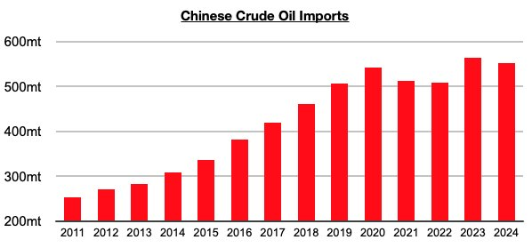

# Chinese Oil Imports Continue to Suffer

**Date:** February 05, 2025  
**Publisher:** Breakwave Advisors | **Category:** Market Insights  
**Original URL:** [https://www.breakwaveadvisors.com/insights/2025/2/5/chinese-oil-imports-continue-to-suffer](https://www.breakwaveadvisors.com/insights/2025/2/5/chinese-oil-imports-continue-to-suffer)  

---

*By*[*Jeffrey Landsberg*](https://www.linkedin.com/in/jeffrey-landsberg-70ab957/)

With China’s crude oil imports again declining on both a month-on-month and year-on-year basis in December, 2024 ended with imports falling year-on-year by a total of 10.9 million tons (-2%). Other than in the past when imports fell due to coronavirus restrictions, this has marked an unprecedented event in recent decades.

> **Figure 1: Chart 1**  
> [Local Asset](file:///C:/Users/Dell/Github/Shipping/corpus/03-breakwave/insights/2025/assets/2025-02-05_chinese-oil-imports-continue-to-suffer_img_chart1_548fe8652b3f.jpg)

As we have been stressing in Commodore Research's Weekly China Reports, consumers in China have been embracing electric vehicles, and this has been a significant headwind to oil consumption. Remaining significant to us is that starting in July last year, electric cars shifted to making up the majority of passenger cars sold in China. This has now occurred during five of the last six months — during which time electric car sales have accounted for 51% of all car sales in China.

---

**Tags:** China, Shipping, Crude  
