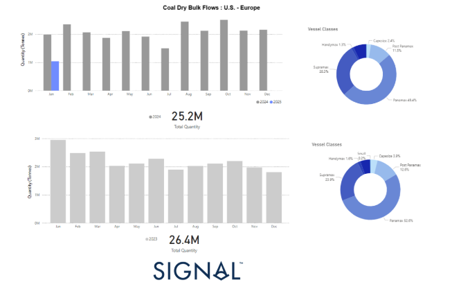
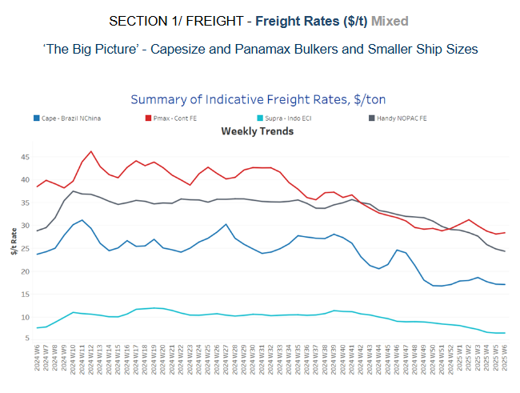
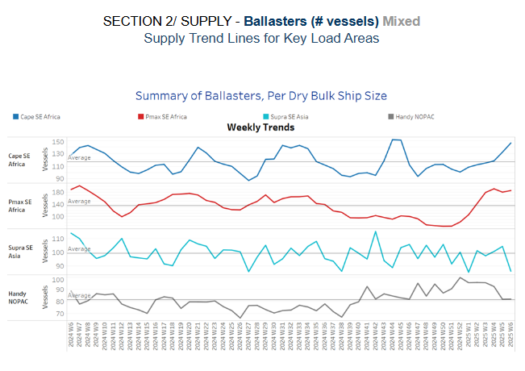
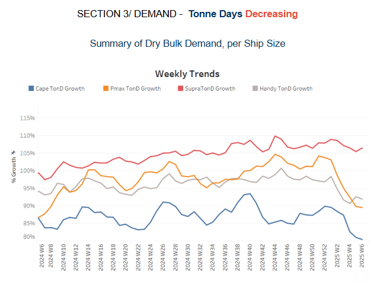
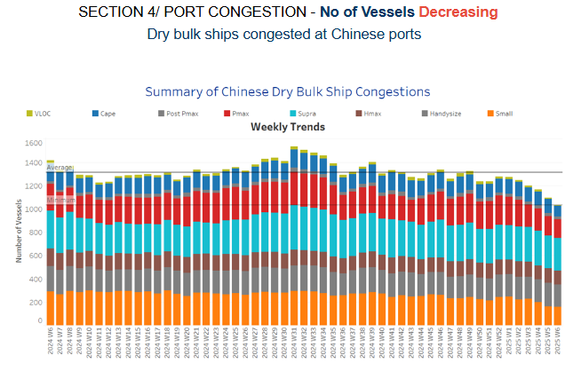

# Coal Dry Bulk Flows | U.S. - Europe Market Analysis

**Date:** February 05, 2025  
**Publisher:** Breakwave Advisors | **Category:** Market Insights  
**Original URL:** [https://www.breakwaveadvisors.com/insights/2025/2/5/coal-dry-bulk-flows-us-europe-market-analysis](https://www.breakwaveadvisors.com/insights/2025/2/5/coal-dry-bulk-flows-us-europe-market-analysis)  

---

**Dry Weekly Market Monitor - Week 06, 2025**
Snapshot of Spot Freight Rates, Supply-Demand Trends, Port Congestions
February 05, 2025

## Chart of the Week: Coal Dry Bulk Flows | U.s. - Europe Market Analysis

*This week's highlight explores the evolving dynamics of U.S. coal exports to European destinations from 2023 to 2024, along with the emerging trend for 2025.*

> **Figure 1: Στιγμιότυπο Οθόνης 2025 02 05 122945**  
> **Interactive Data & Source:** [Signal Ocean Platform](https://www.thesignalgroup.com/signal-ocean-platform) | [Local Asset](file:///C:/Users/Dell/Github/Shipping/corpus/03-breakwave/insights/2025/assets/2025-02-05_coal-dry-bulk-flows-us-europe-market-analysis_img_cea3cf84ceb9ceb3cebcceb9cf8ccf84cf85_10d05c9191c4.png)

The total coal shipment volume from the U.S. to Europe in 2024 is estimated at 25.2 million tonnes, reflecting a decline from 2023, which recorded 26.4 million tonnes. This marks a 4.5% year-over-year drop in total coal exports, suggesting a potential weakening of European demand for U.S. coal, possibly due to factors such as regulatory changes, energy transition policies, or economic slowdowns. In 2023, the highest shipment volume occurred in January, surpassing 3 million tonnes, with relatively stable flows throughout the rest of the year. Data for January 2025 reveals a significantly lower shipment volume than previous years, reinforcing the expectation of a weaker coal export outlook. Seasonal trends show that coal shipments typically peak from August to October, indicating a higher demand for coal during late summer and early fall.

In terms of vessel class distribution, Panamax vessels dominated coal transport in 2024, accounting for 49.4% of the total, followed by Supramax vessels at 28.3%, indicating a substantial reliance on mid-sized bulk carriers. Other vessel categories, including Post-Panamax (11.5%) and Capesize (2.4%), contributed minimally. Compared to 2023, Panamax vessels held a slightly higher share of 52.6%, while the Supramax share increased from 23.9% to 28.3%, reflecting a greater reliance on these mid-sized vessels for coal shipments.

Looking ahead, the Signal Ocean Coal Dry Bulk Flows report suggests a weak start to 2025, with January shipments already showing a significant decline compared to previous years. The Q1 2025 forecast anticipates continued downward pressure, with shipments expected to stay below 3 million tonnes per month in both February and March, driven by demand reductions and regulatory constraints. As a result, Q1 2025 is expected to fall below the levels of Q1 2024, potentially resulting in a total quarterly volume under 8 million tonnes, a considerable drop compared to the higher shipment volumes recorded in 2023 and 2022.

> **Figure 2: Στιγμιότυπο Οθόνης 2025 02 05 123118**  
> **Interactive Data & Source:** [Signal Ocean Platform](https://www.thesignalgroup.com/signal-ocean-platform) | [Local Asset](file:///C:/Users/Dell/Github/Shipping/corpus/03-breakwave/insights/2025/assets/2025-02-05_coal-dry-bulk-flows-us-europe-market-analysis_img_cea3cf84ceb9ceb3cebcceb9cf8ccf84cf85_c67f4024a519.png)

The overall trend remains bearish for the Capesize Brazil - North China rates, with recent weeks seeing a slight recovery after a prolonged decline.

- **Capesize**vessel freight rates for shipments from Brazil to North China have stabilized around $17 per ton, reflecting a 8% decline from the previous month and a 23% drop compared to the same period last year.
- **Panamax**vessel freight rates from the Continent to the Far East held below $29 per ton, showing a 25% decline compared to the same period last year.
- **Supramax**vessel freight rates on the Indo-ECI route remained below $7 per ton, marking a 18% decrease from the previous month.
- **Handysize**freight rates for the NOPAC Far East route have fallen to $25 per ton, representing a 15% month-on-month decline.

> **Figure 3: Στιγμιότυπο Οθόνης 2025 02 05 123224**  
> **Interactive Data & Source:** [Signal Ocean Platform](https://www.thesignalgroup.com/signal-ocean-platform) | [Local Asset](file:///C:/Users/Dell/Github/Shipping/corpus/03-breakwave/insights/2025/assets/2025-02-05_coal-dry-bulk-flows-us-europe-market-analysis_img_cea3cf84ceb9ceb3cebcceb9cf8ccf84cf85_35bee41188da.png)

The recent increase in**Cape SE Africa**and**Pmax SE Africa**ballasters may indicate softer demand in loading regions, causing more vessels to remain in ballast.

- **Capesize SE Africa**: The number of vessels exceeded 140, 24 above the annual average, signaling a continued spike with the onset of the Chinese New Year season.
- **Panamax SE Africa**: The number of vessels has remained more stable compared to Cape SE Africa.There was a downward trend in the earlier weeks, but the past few weeks have shown an increase with levels reaching 186, 50 above the annual average.
- **Supramax SE Asia**: This segment has experienced consistent fluctuations, with no clear long-term trend. However, the beginning of February signals a downward trend with figures dropping to 86, almost 10 below the annual trend.
- **Handysize NOPAC**: The Handy NOPAC segment has the lowest number of ballasters compared to the other vessel sizes. While some minor fluctuations have been observed, the overall trend remains relatively stable. Current figures have aligned with the annual average of 80, with the last notable spike occurring at the end of the previous year.

> **Figure 4: Στιγμιότυπο Οθόνης 2025 02 05 124032**  
> **Interactive Data & Source:** [Signal Ocean Platform](https://www.thesignalgroup.com/signal-ocean-platform) | [Local Asset](file:///C:/Users/Dell/Github/Shipping/corpus/03-breakwave/insights/2025/assets/2025-02-05_coal-dry-bulk-flows-us-europe-market-analysis_img_cea3cf84ceb9ceb3cebcceb9cf8ccf84cf85_095cb356464e.png)

The first week of February held the downward trend in dry tonne-day growth across all dry vessel size categories.

- **Capesize**: A significant decline has brought the current growth rate to record lows from the end of January, compared to the peak at the beginning of the year.
- **Panamax**: The tonne-day growth continues to follow the weakening trend observed in previous weeks, with market estimates suggesting a further downward revision.
- **Supramax**: The growth rate remains stronger than in other vessel size categories, with a soft upward trend in early February.
- **Handysize**: The Handysize vessel segment has maintained its downward trend from previous weeks, though its latest growth rate has slightly surpassed that of the Panamax segment.

> **Figure 5: Στιγμιότυπο Οθόνης 2025 02 05 124805**  
> **Interactive Data & Source:** [Signal Ocean Platform](https://www.thesignalgroup.com/signal-ocean-platform) | [Local Asset](file:///C:/Users/Dell/Github/Shipping/corpus/03-breakwave/insights/2025/assets/2025-02-05_coal-dry-bulk-flows-us-europe-market-analysis_img_cea3cf84ceb9ceb3cebcceb9cf8ccf84cf85_d9d68632557c.png)

Congestion at Chinese dry bulk ports continued a significant reduction from the end of January, with a sharp declining trend observed in the Capesize vessel size segment.

- **Capesize**: Capesize vessel congestion dropped below 100, 34 lower than the end of the previous month.
- **Panamax**: The number of Panamax vessels hovered below 170, reflecting a surprising decrease of 30 compared to the figures recorded during the fourth week of January.
- **Supramax**: Congestion levels sustained levels around 270 vessels, almost 30 lower compared to the figures recorded in the previous week of January.
- **Handysize**: Congestion levels stood around 190, remaining below the 200 mark since week 43 of the previous year.

Data Source:[Signal Ocean Platform](https://www.thesignalgroup.com/signal-ocean-platform)

---

**Tags:** Shipping, Drybulk, Markets  
