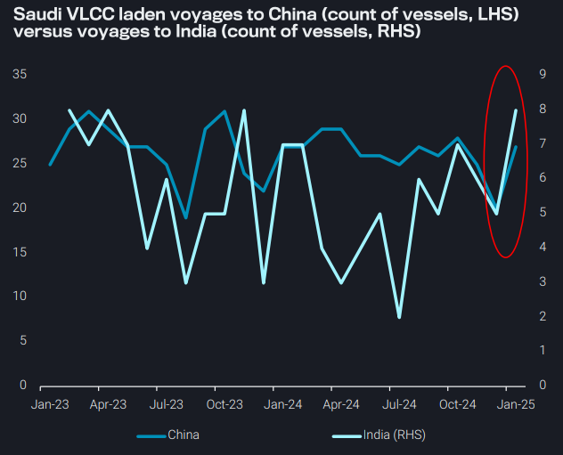
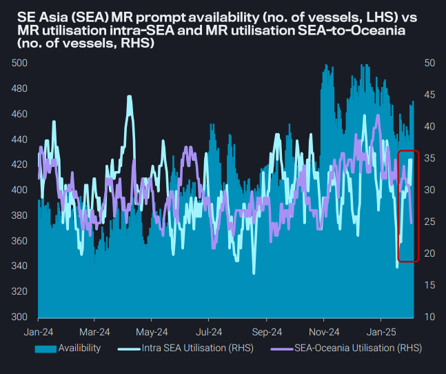
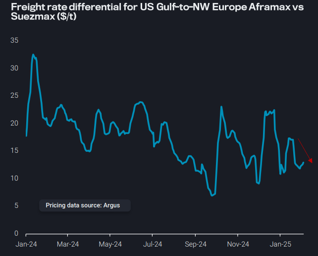
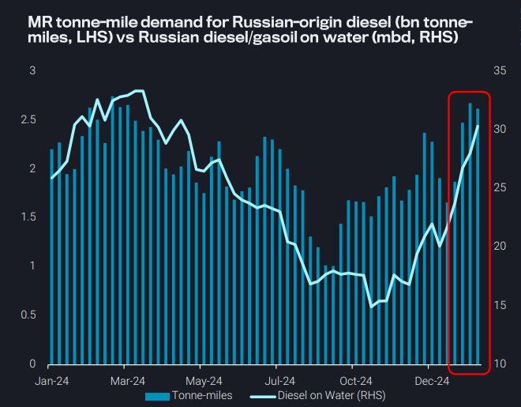

# Uptick in Saudi VLCC voyages to India and China could continue

**Date:** February 06, 2025  
**Publisher:** Breakwave Advisors | **Category:** Market Insights  
**Original URL:** [https://www.breakwaveadvisors.com/insights/2025/2/6/uptick-in-saudi-vlcc-voyages-to-india-and-china-could-continue](https://www.breakwaveadvisors.com/insights/2025/2/6/uptick-in-saudi-vlcc-voyages-to-india-and-china-could-continue)  

---

### Key Takeaways From This Report:

- **Dirty – East of Suez:**Uptick in Saudi VLCC voyages to India and China in January could extend through February
- **Clean – East of Suez:**Strong intra-SE Asia demand for MRs is limited by supply-side pressure and lack of longer-haul demand
- **Dirty – West of Suez:**Narrowing rate differential favours TA Aframaxes over Suezmaxes, but Europe’s crude demand limited
- **Clean – West of Suez:**Russian diesel on water surges, suggesting difficulty in finding buyers

*By*[*Mary Melton*](https://www.linkedin.com/in/maryemelton/)

## Dirty – East of Suez: Uptick in Saudi VLCC Voyages to India and China in January Could Extend Through February

Saudi VLCC voyages to India and China picked up noticeably in January (m-o-m), after an unusually low December tally,

An equal number of VLCCs departed Saudi Arabia for India or China in the first 10 days of the month (prior to OFAC sanctions) as the remainder of the month

But activity along these routes could rise further in February as January data is unlikely reflecting any Chinese/Indian spot purchasing, in response to the latest tranche of US OFAC sanctions on Russiaaffiliated tankers

➔ Rising voyage counts, particularly along the MEG-China route, would fit with elevated TD3C rates since the second half of January

Looking ahead, market expectations of higher Saudi OSPs for March loading cargoes could temper any increases in voyages to India and China seen in February, and therefore cap further rises in TD3C rates

> **Figure 1: Στιγμιότυπο Οθόνης 2025 02 06 124504**  
> **Interactive Data & Source:** [Vortexa](https://www.vortexa.com//oil-gas-data-traders-analysts-data-scientists?gclid=Cj0KCQjw8_qRBhCXARIsAE2AtRZKOvMnbilZ_6_91d7huSFFy71pWLrnPwGwOHVzXsmsG-1a1mZnQw8aAt89EALw_wcB&hsa_acc=1782073842&hsa_ad=548425387665&hsa_cam=14746637662&hsa_grp=125038601902&hsa_kw=&hsa_mt=&hsa_net=adwords&hsa_src=g&hsa_tgt=dsa-1431852288425&hsa_ver=3&utm_campaign=%5BCD%5D%20-%20DSA%20-%20EMEA&utm_medium=cpc&utm_medium=ppc&utm_source=google&utm_source=adwords&utm_term=) | [Local Asset](file:///C:/Users/Dell/Github/Shipping/corpus/03-breakwave/insights/2025/assets/2025-02-06_uptick-in-saudi-vlcc-voyages-to-india-and-china-could-continue_img_cea3cf84ceb9ceb3cebcceb9cf8ccf84cf85_e2c15e8efaae.png)

## Clean – East of Suez: Strong Intra-Se Asia Demand for Mrs Is Limited by Supply-Side Pressure and Lack of Longer-Haul Demand

MR supply in SE Asia has increased

➔ Reduced utilisation on the Southeast Asia-to-Oceania route (TC7) has contributed to the buildup of available tonnage

➔ At the same time, more vessels are being deployed for shorter intra-Southeast Asia voyages, increasing the prompt availability

Strong intra-Southeast Asia CPP flows are reducing the volume of cargo available for export to the Oceania region

Upcoming Ramadan-related demand in Southeast Asia is expected to drive higher gasoline consumption, which could limit supply availability for TC7 while simultaneously increasing MR tanker demand for intraregional trade within East Asia

Additionally, regional refinery maintenance could constrain overall gasoline supply, potentially tightening availability across Asia and moderate the extent to which increased intra-Asia demand translates into higher MR tanker utilisation

> **Figure 2: Στιγμιότυπο Οθόνης 2025 02 06 124722**  
> **Interactive Data & Source:** [Vortexa](https://www.vortexa.com//oil-gas-data-traders-analysts-data-scientists?gclid=Cj0KCQjw8_qRBhCXARIsAE2AtRZKOvMnbilZ_6_91d7huSFFy71pWLrnPwGwOHVzXsmsG-1a1mZnQw8aAt89EALw_wcB&hsa_acc=1782073842&hsa_ad=548425387665&hsa_cam=14746637662&hsa_grp=125038601902&hsa_kw=&hsa_mt=&hsa_net=adwords&hsa_src=g&hsa_tgt=dsa-1431852288425&hsa_ver=3&utm_campaign=%5BCD%5D%20-%20DSA%20-%20EMEA&utm_medium=cpc&utm_medium=ppc&utm_source=google&utm_source=adwords&utm_term=) | [Local Asset](file:///C:/Users/Dell/Github/Shipping/corpus/03-breakwave/insights/2025/assets/2025-02-06_uptick-in-saudi-vlcc-voyages-to-india-and-china-could-continue_img_cea3cf84ceb9ceb3cebcceb9cf8ccf84cf85_1e36f946ced0.png)

## Dirty – West of Suez: Narrowing Rate Differential Favours Ta Aframaxes Over Suezmaxes, But Europe’s Crude Demand Limited

Aframax voyage counts on the US Gulf-to-NW Europe route (TD25) are currently around the seasonal average, but lower y-o-y and m-o-m as European crude demand remains limited, especially during refinery maintenance season

Relatively high prompt vessel availability in the US Gulf combined with the lack of demand is keeping TD25 rates low and could incentivise more fixing on Aframax over Suezmaxes as the freight rate differential has narrowed (Argus)

Suezmax rates recently enjoyed a boost in the aftermath of the recent US sanctions on Russia vessels, as a combination of sentiment and actual replacement buying from China and India drove VLCC, and to a lesser extent, Suezmax freight rates higher

Over the longer-term, Suezmaxes have taken market share from Aframaxes on the TA route, but if Red Sea transits resume it's likely that some Suezmaxes which have established themselves in the Atlantic Basin will resume service on the Middle East Gulf-to-Europe route

➔ This could over time increase Aframax freight rates on TD25, as Atlantic Aframaxes will be in higher demand

> **Figure 3: Στιγμιότυπο Οθόνης 2025 02 06 125030**  
> **Interactive Data & Source:** [Vortexa](https://www.vortexa.com//oil-gas-data-traders-analysts-data-scientists?gclid=Cj0KCQjw8_qRBhCXARIsAE2AtRZKOvMnbilZ_6_91d7huSFFy71pWLrnPwGwOHVzXsmsG-1a1mZnQw8aAt89EALw_wcB&hsa_acc=1782073842&hsa_ad=548425387665&hsa_cam=14746637662&hsa_grp=125038601902&hsa_kw=&hsa_mt=&hsa_net=adwords&hsa_src=g&hsa_tgt=dsa-1431852288425&hsa_ver=3&utm_campaign=%5BCD%5D%20-%20DSA%20-%20EMEA&utm_medium=cpc&utm_medium=ppc&utm_source=google&utm_source=adwords&utm_term=) | [Local Asset](file:///C:/Users/Dell/Github/Shipping/corpus/03-breakwave/insights/2025/assets/2025-02-06_uptick-in-saudi-vlcc-voyages-to-india-and-china-could-continue_img_cea3cf84ceb9ceb3cebcceb9cf8ccf84cf85_19496b181ba1.png)

## Clean – West of Suez: Russian Diesel on Water Surges, Suggesting Difficulty in Finding Buyers

Undelivered diesel volumes on MRs departing Russia have risen sharply, with several tankers exhibiting rerouting behaviour and floating fullyladen in the Med

➔ This underscores the market’s limited appetite to absorb Russian supply, as middle distillate demand weakens in the Atlantic Basin

Exports of Russian diesel hit a multi-month high in January, which supported MR tonne-miles

The market’s inability to absorb this supply has left cargoes stranded at sea,and points to difficulties Russia may be having in finding buyers, underscoring the weakness in the European middle distillate market

➔ Faced with weak demand, some MR operators appear to be slowing down to await potential buyers, increasing oil on water (see blue line RHS chart)

> **Figure 4: Στιγμιότυπο Οθόνης 2025 02 06 125240**  
> **Interactive Data & Source:** [Vortexa](https://www.vortexa.com//oil-gas-data-traders-analysts-data-scientists?gclid=Cj0KCQjw8_qRBhCXARIsAE2AtRZKOvMnbilZ_6_91d7huSFFy71pWLrnPwGwOHVzXsmsG-1a1mZnQw8aAt89EALw_wcB&hsa_acc=1782073842&hsa_ad=548425387665&hsa_cam=14746637662&hsa_grp=125038601902&hsa_kw=&hsa_mt=&hsa_net=adwords&hsa_src=g&hsa_tgt=dsa-1431852288425&hsa_ver=3&utm_campaign=%5BCD%5D%20-%20DSA%20-%20EMEA&utm_medium=cpc&utm_medium=ppc&utm_source=google&utm_source=adwords&utm_term=) | [Local Asset](file:///C:/Users/Dell/Github/Shipping/corpus/03-breakwave/insights/2025/assets/2025-02-06_uptick-in-saudi-vlcc-voyages-to-india-and-china-could-continue_img_cea3cf84ceb9ceb3cebcceb9cf8ccf84cf85_758612ca72d8.png)

Data Source:[Vortexa](https://www.vortexa.com//oil-gas-data-traders-analysts-data-scientists?gclid=Cj0KCQjw8_qRBhCXARIsAE2AtRZKOvMnbilZ_6_91d7huSFFy71pWLrnPwGwOHVzXsmsG-1a1mZnQw8aAt89EALw_wcB&hsa_acc=1782073842&hsa_ad=548425387665&hsa_cam=14746637662&hsa_grp=125038601902&hsa_kw=&hsa_mt=&hsa_net=adwords&hsa_src=g&hsa_tgt=dsa-1431852288425&hsa_ver=3&utm_campaign=%5BCD%5D%20-%20DSA%20-%20EMEA&utm_medium=cpc&utm_medium=ppc&utm_source=google&utm_source=adwords&utm_term=)

---

**Tags:** Crude, Markets, Shipping  
