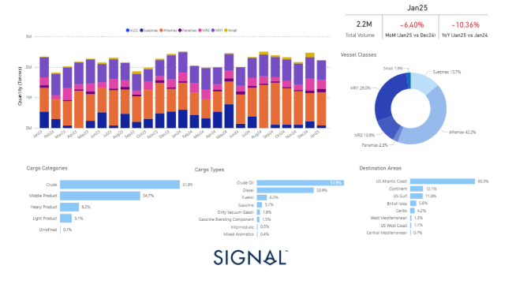
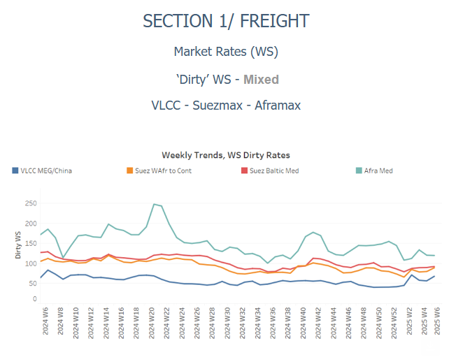
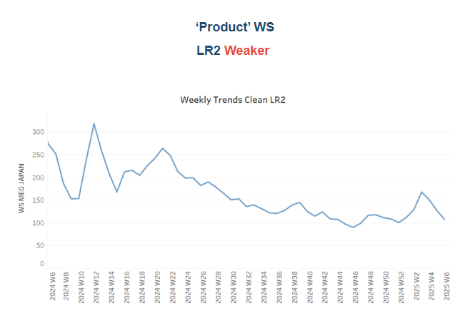
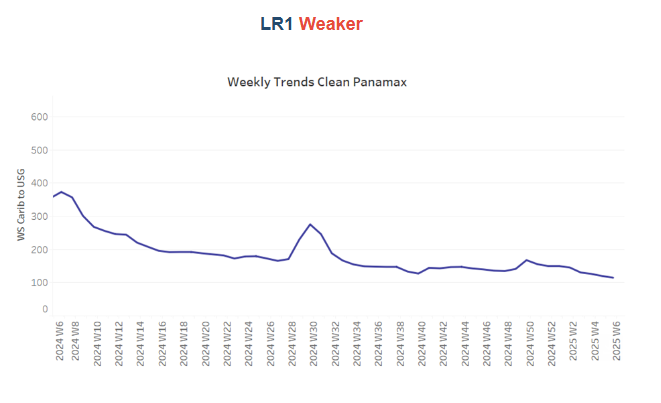
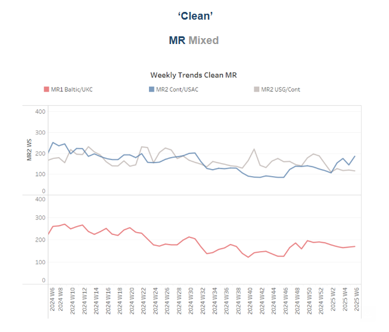
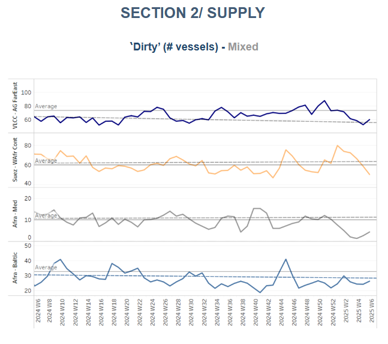
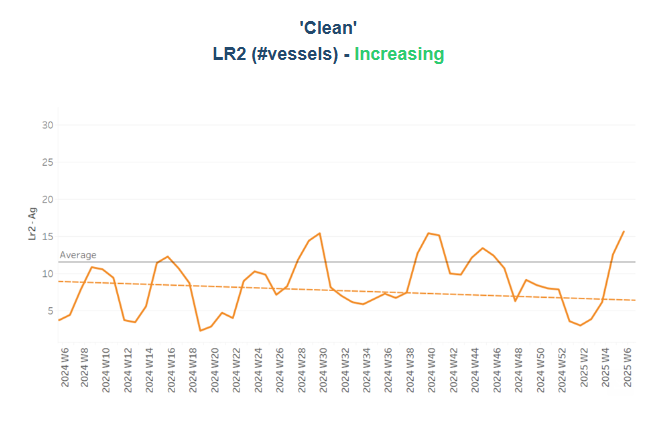
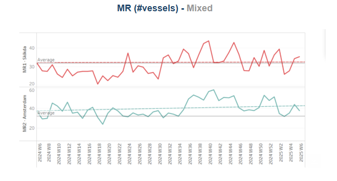
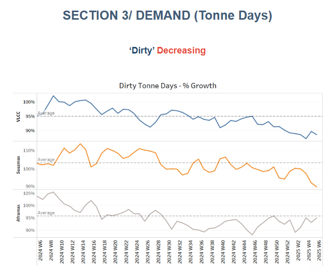
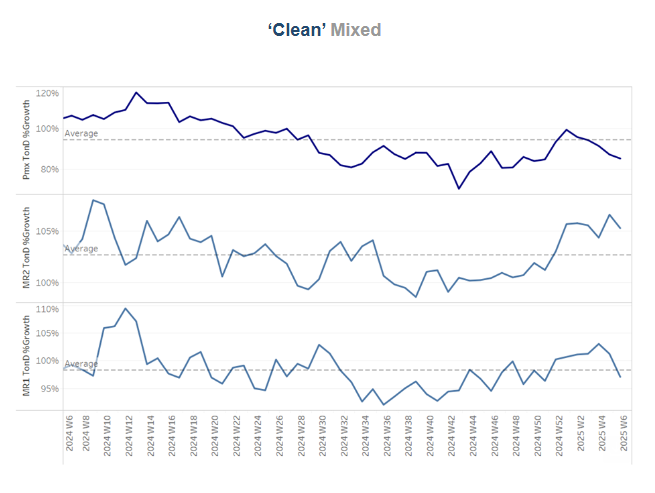

# Oil Flows Canada

**Date:** February 07, 2025  
**Publisher:** Breakwave Advisors | **Category:** Market Insights  
**Original URL:** [https://www.breakwaveadvisors.com/insights/2025/2/7/oil-flows-canada](https://www.breakwaveadvisors.com/insights/2025/2/7/oil-flows-canada)  

---

### Tanker - Weekly Market Monitor

Snapshot of Crude and Product Freight Rates, Supply-Demand

Week 06, February 07, 2025

## Chart of the Week: Oil Flows Canada

*This week's focus centers on the evolution of Canadian oil flows to all destinations*

> **Figure 1: Στιγμιότυπο Οθόνης 2025 02 07 113648**  
> **Interactive Data & Source:** [Signal Ocean Platform](https://www.thesignalgroup.com/signal-ocean-platform) | [Local Asset](file:///C:/Users/Dell/Github/Shipping/corpus/03-breakwave/insights/2025/assets/2025-02-07_oil-flows-canada_img_cea3cf84ceb9ceb3cebcceb9cf8ccf84cf85_4c19e380475d.png)

The crude oil freight market remains highly volatile, with recent spikes in VLCC rates on the MEG-China route. While tonne-day demand growth has yet to show signs of recovery, market sentiment appears to be firming, driven by uncertainty surrounding oil price fluctuations and China's crude oil demand. Additionally, the impending implementation of U.S. tariffs on the energy sector adds to the instability.

Recent reports confirm that the U.S. has decided to pause the planned tariffs on Canadian and Mexican oil, which were initially set to take effect in early 2025. This decision temporarily alleviates concerns about the potential disruption to Canadian oil exports, particularly to the U.S. Atlantic Coast, which holds a significant 60.3% share of Canadian oil flows. As a result, in the short term, oil shipments to key U.S. destinations are expected to remain stable, providing some relief for exporters.

However, despite this temporary suspension, policy uncertainty persists, particularly regarding the possibility of tariffs being reintroduced in Q2 2025. Should this occur, Canadian oil exports to the U.S. would likely decline, pushing suppliers to seek alternative markets in Europe, Asia, or the U.S. Gulf. In January 2025, Canada exported 2.2 million tonnes of oil, with approximately 1.33 million tonnes (60.3%) directed to the U.S. Atlantic Coast. Looking ahead, if the tariff suspension holds, February 2025 oil flows to the U.S. Atlantic Coast are expected to remain steady at around 1.3 to 1.35 million tonnes as buyers capitalize on the tariff-free window.

By March 2025, if no tariffs are imposed, volumes should remain stable. However, should the U.S. reinstate tariffs, a 5-10% decline in shipments is anticipated, reducing volumes to around 1.2 to 1.25 million tonnes as buyers adjust their purchasing strategies. For the entirety of Q1 2025, assuming the tariff suspension remains in place, oil flows to the U.S. Atlantic Coast are projected to reach between 3.9 million and 4.1 million tonnes. If tariffs are reintroduced by March, the Q1 total may dip to 3.8 million tonnes or lower, with further declines expected in Q2.

As for vessel utilization, Aframax tankers play a dominant role in Canadian oil exports, accounting for 42.2% of the total. In the absence of immediate tariff enforcement, Aframax utilization is expected to remain strong in Q1 2025, particularly for short-haul routes to the U.S. Atlantic Coast. However, if tariffs are reintroduced in Q2 2025, demand for Aframax tankers on U.S. routes may decrease, potentially leading to a shift in cargoes to Suezmax tankers for longer-haul shipments to Europe. This could result in a softening of Aframax freight rates due to reduced demand, prompting a reallocation of vessels to new routes.

> **Figure 2: Στιγμιότυπο Οθόνης 2025 02 07 113748**  
> **Interactive Data & Source:** [Signal Ocean Platform](https://www.thesignalgroup.com/signal-ocean-platform) | [Local Asset](file:///C:/Users/Dell/Github/Shipping/corpus/03-breakwave/insights/2025/assets/2025-02-07_oil-flows-canada_img_cea3cf84ceb9ceb3cebcceb9cf8ccf84cf85_ca640d00ef5d.png)

​​​​​Sentiment in the dirty freight market has shown signs of volatility, with spikes emerging on the VLCC MEG-China and Suezmax West Africa-to-Continent routes, while the Aframax Mediterranean market remains steady.

- VLCC freight rates for**MEG-China**routes surged to WS70, marking a 30% weekly increase and a 63% rise compared to the same week last month. Suezmax rates for**West Africa to continental Europe**reached WS90, reflecting a 30% monthly gain. Meanwhile, Suezmax rates on the Baltic-Mediterranean route have remained slightly above WS90 for the past three weeks, up 12% month-over-month.
- Aframax freight rates in the**Mediterranean**have maintained last week's momentum at WS120, though they remain 30% lower year-over-year.

> **Figure 3: Στιγμιότυπο Οθόνης 2025 02 07 113846**  
> **Interactive Data & Source:** [Signal Ocean Platform](https://www.thesignalgroup.com/signal-ocean-platform) | [Local Asset](file:///C:/Users/Dell/Github/Shipping/corpus/03-breakwave/insights/2025/assets/2025-02-07_oil-flows-canada_img_cea3cf84ceb9ceb3cebcceb9cf8ccf84cf85_adf7fa378c7e.png)

- **LR2**AG freight rates continued to decrease over the last weeks and dropped to WS 100, marking a 60% decrease compared to the same period last year.

> **Figure 4: Στιγμιότυπο Οθόνης 2025 02 07 114119**  
> **Interactive Data & Source:** [Signal Ocean Platform](https://www.thesignalgroup.com/signal-ocean-platform) | [Local Asset](file:///C:/Users/Dell/Github/Shipping/corpus/03-breakwave/insights/2025/assets/2025-02-07_oil-flows-canada_img_cea3cf84ceb9ceb3cebcceb9cf8ccf84cf85_7f170905968f.png)

- **Panamax**Carib-to-USG rates have remained weak for another week since the start of the year, now falling below WS120. This marks a decline of over 60% compared to the same period last year.

> **Figure 5: Στιγμιότυπο Οθόνης 2025 02 07 114220**  
> **Interactive Data & Source:** [Signal Ocean Platform](https://www.thesignalgroup.com/signal-ocean-platform) | [Local Asset](file:///C:/Users/Dell/Github/Shipping/corpus/03-breakwave/insights/2025/assets/2025-02-07_oil-flows-canada_img_cea3cf84ceb9ceb3cebcceb9cf8ccf84cf85_1d6c4925b71d.png)

- **MR1**freight rates for Baltic-to-Continent shipments remained under downward pressure, hovering around WS160—a 50% decline from the same week last year.

- Meanwhile,**MR2**rates for shipments from the Continent to the US Atlantic Coast (USAC) surged past WS 200, marking a 47% month-over-month increase. In contrast,**MR2**rates on the US Gulf-to-Continent route remained weak, holding at the low levels seen in previous weeks of January and falling below WS 120—a 28% decline compared to the same period last year.

> **Figure 6: Στιγμιότυπο Οθόνης 2025 02 07 114317**  
> **Interactive Data & Source:** [Signal Ocean Platform](https://www.thesignalgroup.com/signal-ocean-platform) | [Local Asset](file:///C:/Users/Dell/Github/Shipping/corpus/03-breakwave/insights/2025/assets/2025-02-07_oil-flows-canada_img_cea3cf84ceb9ceb3cebcceb9cf8ccf84cf85_f46ccae890f3.png)

​​​​​​The supply of crude tankers continued its downward trend since late January, remaining below the annual average on key routes, particularly for VLCCs on the AG-Far East route and Suezmax vessels in West Africa. However, signs of a mild upward correction are emerging in the Aframax segment, notably in the Mediterranean and Baltic regions.

- **VLCC Ras Tanura**: The ship count remains low at 60, reflecting a decline of 13 compared to the annual average and nearly 24 fewer than the levels recorded before the end of December.
- **Suezmax Wafr**: The current ship count stands at 50, which is 10 below the annual trend, signaling a continued downward correction in early February.
- **Aframax Med**: The vessel count has consistently remained below the annual average since early January. However, recent activity indicates a current count of four vessels, with an upward trend expected in the coming days.
- Aframax Baltic: The number of ships has remained steady over the past four weeks, staying below the annual average of 30 at approximately 26—nearly two higher than the previous week. However, it remains to be seen whether vessel activity will strengthen by mid-February.

> **Figure 7: Στιγμιότυπο Οθόνης 2025 02 07 114429**  
> **Interactive Data & Source:** [Signal Ocean Platform](https://www.thesignalgroup.com/signal-ocean-platform) | [Local Asset](file:///C:/Users/Dell/Github/Shipping/corpus/03-breakwave/insights/2025/assets/2025-02-07_oil-flows-canada_img_cea3cf84ceb9ceb3cebcceb9cf8ccf84cf85_1feb5b1661e6.png)

> **Figure 8: Στιγμιότυπο Οθόνης 2025 02 07 114440**  
> **Interactive Data & Source:** [Signal Ocean Platform](https://www.thesignalgroup.com/signal-ocean-platform) | [Local Asset](file:///C:/Users/Dell/Github/Shipping/corpus/03-breakwave/insights/2025/assets/2025-02-07_oil-flows-canada_img_cea3cf84ceb9ceb3cebcceb9cf8ccf84cf85_555872a54d1c.png)

- **Clean LR2 AG Jubai**l: The February trend has confirmed the upward trajectory of the previous month, with levels now exceeding the annual average of 11 by six, signaling a further increase in the coming days.

- **Clean MR**: At Algeria's Skikda port, the number of vessels has increased to 35, surpassing the annual average by nearly four. Meanwhile, MR2 activity in Amsterdam showed a downward revision despite signs of a potential rebound, remaining above the annual average of 30 but six lower than the previous week.

> **Figure 9: Στιγμιότυπο Οθόνης 2025 02 07 114548**  
> **Interactive Data & Source:** [Signal Ocean Platform](https://www.thesignalgroup.com/signal-ocean-platform) | [Local Asset](file:///C:/Users/Dell/Github/Shipping/corpus/03-breakwave/insights/2025/assets/2025-02-07_oil-flows-canada_img_cea3cf84ceb9ceb3cebcceb9cf8ccf84cf85_04703e8ac909.png)

- **Dirty**tonne days: The growth rate of dirty tonne-days remains well below the annual trend for the VLCC and Suezmax markets, reflecting subdued freight sentiment. However, Aframax tonne-days show signs of a mild recovery, now approaching their highest level since the lows at the start of the year.

> **Figure 10: Στιγμιότυπο Οθόνης 2025 02 07 114644**  
> **Interactive Data & Source:** [Signal Ocean Platform](https://www.thesignalgroup.com/signal-ocean-platform) | [Local Asset](file:///C:/Users/Dell/Github/Shipping/corpus/03-breakwave/insights/2025/assets/2025-02-07_oil-flows-canada_img_cea3cf84ceb9ceb3cebcceb9cf8ccf84cf85_f4876aea510b.png)

- **Panamax**tonne days: The growth rate remained significantly below the annual average of previous weeks, with no clear signs of recovery yet.

- **MR**tonne-days: The growth rate for the MR2 segment remains solid, though it has softened slightly following last week’s peak. Meanwhile, MR1 demand continues to decline, with rates falling below the annual trend for the second consecutive week.

Data Source:[Signal Ocean Platform](https://www.thesignalgroup.com/signal-ocean-platform)

---

**Tags:** Tankers, Shipping, Markets  
