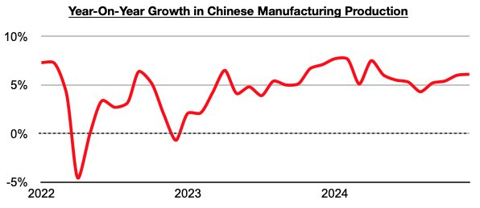
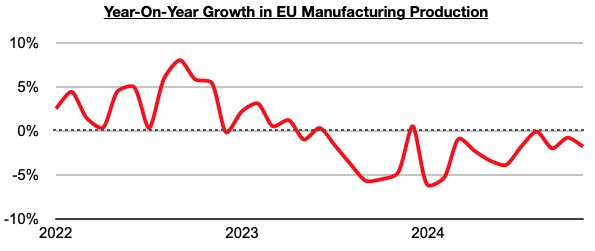
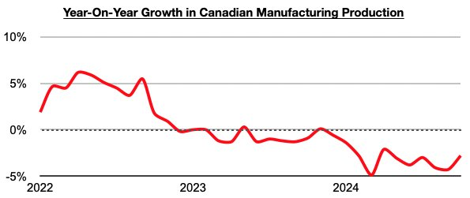
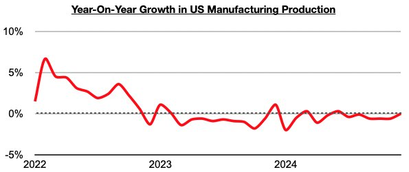
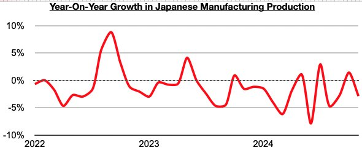
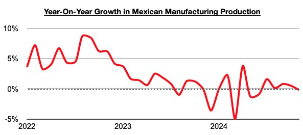

# Ongoing Strength in China's Manufacturing Production

**Date:** February 07, 2025  
**Publisher:** Breakwave Advisors | **Category:** Market Insights  
**Original URL:** [https://www.breakwaveadvisors.com/insights/2025/2/7/ongoing-strength-in-chinas-manufacturing-production](https://www.breakwaveadvisors.com/insights/2025/2/7/ongoing-strength-in-chinas-manufacturing-production)  

---

*By*[*Jeffrey Landsberg*](https://www.linkedin.com/in/jeffrey-landsberg-70ab957/)

As we discussed in Commodore Research's most recent Weekly China Report, China’s manufacturing production grew last year by 5.9% (and in December, growth jumped to 6.1%), while manufacturing production in economies including the European Union and Canada experienced contraction throughout the year, and others including Japan and the United States experienced contraction during the majority of the year.

> **Figure 1: Chart 1**  
> [Local Asset](file:///C:/Users/Dell/Github/Shipping/corpus/03-breakwave/insights/2025/assets/2025-02-07_ongoing-strength-in-chinas-manufacturing-production_img_chart1_d683701f67d7.jpg)

In the European Union, manufacturing has contracted on a year-on-year basis during sixteen of the last seventeen months. It most recently contracted year-on-year by 1.8%.

> **Figure 2: Chart 2**  
> [Local Asset](file:///C:/Users/Dell/Github/Shipping/corpus/03-breakwave/insights/2025/assets/2025-02-07_ongoing-strength-in-chinas-manufacturing-production_img_chart2_8318308c961c.jpg)

In Canada, manufacturing has also contracted on a year-on-year basis during sixteen of the last seventeen months. It most recently contracted year-on-year by 2.8%.

> **Figure 3: Chart 3**  
> [Local Asset](file:///C:/Users/Dell/Github/Shipping/corpus/03-breakwave/insights/2025/assets/2025-02-07_ongoing-strength-in-chinas-manufacturing-production_img_chart3_70a08e6a850b.jpg)

In the United States, manufacturing has contracted on a year-on-year basis during eighteen of the last twenty-one months. Improvement has recently been seen, however, with December (the most recent data available) showing that US manufacturing was flat on a year-on-year basis.

> **Figure 4: Chart 4**  
> [Local Asset](file:///C:/Users/Dell/Github/Shipping/corpus/03-breakwave/insights/2025/assets/2025-02-07_ongoing-strength-in-chinas-manufacturing-production_img_chart4_f2045a5d6b03.jpg)

In Japan, manufacturing has now contracted on a year-on-year basis in twenty of the last twenty-five months. It most recently contracted year-on-year by 2.9%.

> **Figure 5: Chart 5**  
> [Local Asset](file:///C:/Users/Dell/Github/Shipping/corpus/03-breakwave/insights/2025/assets/2025-02-07_ongoing-strength-in-chinas-manufacturing-production_img_chart5_9c973c84d9fc.jpg)

In Mexico, manufacturing has now contracted on a year-on-year basis in three of the last seven months. It most recently contracted year-on-year by 0.2%.

> **Figure 6: Chart 6**  
> [Local Asset](file:///C:/Users/Dell/Github/Shipping/corpus/03-breakwave/insights/2025/assets/2025-02-07_ongoing-strength-in-chinas-manufacturing-production_img_chart6_addcc0778cf7.jpg)

---

**Tags:** Economy, Markets, China  
