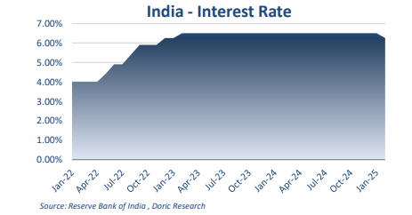
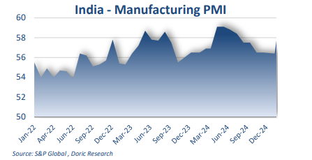

# India’s growing role in international trade

**Date:** February 10, 2025  
**Publisher:** Breakwave Advisors | **Category:** Market Insights  
**Original URL:** [https://www.breakwaveadvisors.com/insights/2025/2/10/indias-growing-role-in-international-trade](https://www.breakwaveadvisors.com/insights/2025/2/10/indias-growing-role-in-international-trade)  

---

India’s growing role in international trade, combined with the resurgence of its manufacturing sector and steady export growth, could provide much-needed support for bulk trade volumes, particularly after a subdued start to the year

*By*[*Michalis Voutsinas*](https://www.linkedin.com/in/michalis-voutsinas-587544163/)

With the Capesize segment being the sole exception, all other dry bulk segments trended upwards during the sixth trading week. The Capesize market has yet to regain momentum following the Chinese New Year holidays, with the Baltic index closing at a subdued $6,964 per day. In contrast, the Panamax segment, driven primarily by a strong ECSA sub-market, recorded robust weekly gains of $2,119, settling at $9,318 per day by week’s end. The geared segment also reflected this positive sentiment, with Supramax and Handysize earnings closing at $8,553 and $7,164 per day, respectively. More significantly, market sentiment, which had been under strain in recent weeks, appears to be improving, with offers in most cases now exceeding last-done levels.

On the macroeconomic front, the Reserve Bank of India (RBI) made headlines this week after a prolonged period of policy inertia. The central bank unanimously lowered its key repo rate by 25 basis points to 6.25 percent during its February meeting, marking the first reduction since May 2020 and aligning with market expectations. This move, aimed at bolstering economic growth amid rising global trade uncertainty, brought borrowing costs to their lowest level since January 2023. The decision was announced during Governor Sanjay Malhotra’s inaugural monetary policy review, where he underscored the challenges posed by "divergent trajectories of monetary policy across advanced economies, lingering geopolitical tensions, and elevated trade and policy uncertainties." The RBI projects GDP growth at 6.7 percent for FY2025-26 while maintaining its inflation forecast at 4.2 percent, with quarterly projections of 4.5 percent for Q1, 4.0 percent for Q2, and 3.8 percent for Q3. For the current fiscal year, real GDP is expected to grow at 6.4 percent, following an 8.2 percent expansion last year.

> **Figure 1: Στιγμιότυπο Οθόνης 2025 02 10 101512**  
> **Interactive Data & Source:** [Doric](https://www.doric.gr/) | [Local Asset](file:///C:/Users/Dell/Github/Shipping/corpus/03-breakwave/insights/2025/assets/2025-02-10_indias-growing-role-in-international-trade_img_cea3cf84ceb9ceb3cebcceb9cf8ccf84cf85_91d607d989f6.png)

Since assuming office, Governor Malhotra has initiated a liquidity infusion into India’s banking sector, including an $18 billion package announced last month. This was widely perceived as an early signal of a shift towards looser monetary policy. Meanwhile, Prime Minister Modi’s government is implementing measures to bolster domestic consumption, such as tax relief for middle-class households. While India remains the fastest-growing major economy, its pace of expansion has slowed in recent months due to rising food prices, currency depreciation, stagnant wages, and weakened consumption – factors that particularly impacted growth in late 2024.

Conversely, India’s manufacturing sector saw a strong start to 2025, rebounding from moderated growth in December. The HSBC India Manufacturing Purchasing Managers’ Index (PMI), compiled by S&P Global, rose to 57.7 in January, up from 56.4 in December and marking a six-month high. "Following a moderation in growth during December, Indian goods producers kicked off 2025 on a robust note. With new orders rising at the quickest pace since last July, fuelled by the steepest upturn in exports in nearly 14 years, there was a stronger expansion in output," the survey said. Manufacturers reported stronger domestic demand and growing international sales, with export orders rising significantly across various global markets.

> **Figure 2: Στιγμιότυπο Οθόνης 2025 02 10 101629**  
> **Interactive Data & Source:** [Doric](https://www.doric.gr/) | [Local Asset](file:///C:/Users/Dell/Github/Shipping/corpus/03-breakwave/insights/2025/assets/2025-02-10_indias-growing-role-in-international-trade_img_cea3cf84ceb9ceb3cebcceb9cf8ccf84cf85_46ba0574de4d.png)

On the trade front, India’s cumulative exports (merchandise and services) reached an estimated $602.64 billion during AprilDecember 2024, reflecting a 6.03 percent year-on-year increase. Merchandise exports during this period stood at $321.71 billion, up 1.6 percent from the previous year, with key growth drivers including electronic goods, engineering products, rice, textiles, and cotton. Imports in December 2024 rose 4.8 percent year-on-year to $59.95 billion, bringing total merchandise imports for April-December 2024 to $532.48 billion, up from $506.39 billion in the corresponding period of 2023. As a result, the merchandise trade deficit widened to $210.77 billion from $189.74 billion a year earlier.

Adding to global trade uncertainty, on February 1, US President Donald Trump announced a new tariff policy targeting major trading partners. The plan includes a 25 percent tariff on imports from Mexico and Canada and a 10 percent tariff on goods from China. In response, after days of diplomatic warnings and calls for negotiations, Beijing declared retaliatory measures, including a 15 percent tariff on US coal and liquefied natural gas, alongside a 10 percent tariff on crude oil, agricultural machinery, and large-engine vehicles, effective February 10.

In this juncture, with the world’s two largest economies engaged in an escalating trade dispute, India finds itself in a position to further expand its international trade footprint. The tariff standoff between the United States and China could redirect trade flows, creating new opportunities for Indian exporters, particularly in sectors such as manufacturing, agriculture, and energy. Additionally, with India's economy still growing at a strong pace – albeit with some headwinds from domestic inflation and weaker consumption – the country remains a vital player in global trade. For dry bulk shipping, these dynamics are of particular importance. India’s growing role in international trade, combined with the resurgence of its manufacturing sector and steady export growth, could provide muchneeded support for bulk trade volumes, particularly after a subdued start to the year.

Data source:[Doric](https://www.doric.gr/)

---

**Tags:** Drybulk, Capesize, Markets  
